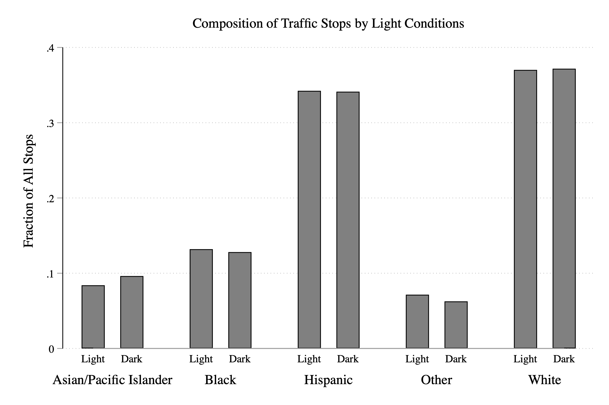

# Discrimination in Police Stops

## SOPP Intro

```{r setup, include=FALSE}
library(Statamarkdown)
```

<html>
<head>
<style>
code {
  background-color: #f1f1f1;
}
</style>
</head>
<body>


The most common way civilians interact with police is through traffic stops (there are about 50,000 a day). Given the frequency of encounters, detecting and eliminating racial discrimination in police behavior is an important policy goal. However, it can be difficult to detect without data. In this chapter, we will work with data from the Stanford Open Policing Project (SOPP). The SOPP is aggregating data on police stops across states and cities so that researchers, journalists and policymakers can improve interactions between police and the public. The data so far has information on about 200 million stops.

This is some big data. Figure \@ref(fig:soppsnap) shows a subset of all the cities for which data has been collected. 

```{r, soppsnap, echo=FALSE, out.width="90%", fig.cap="The Stanford Open Policing Project Data",fig.align='center'}
knitr::include_graphics("images/03_data.png")
```

The data and research is starting to get noticed by many news outlets, including CNN, the Economist, the Huffington Post, NBC News and the Daily Show (see Figure \@ref(fig:dailyshow))


```{r, dailyshow, echo=FALSE, out.width="70%", fig.cap="Trevor Noah Discussing Results from The Stanford Open Policing Project Data",fig.align='center'}
knitr::include_graphics("images/03_daily_show.png")
```

There are many different "decisions" that officers make that could be driven by discrimination:

  - 1. The decision to stop a vehicle or not
  
  - 2. Conditional on stop, whether to issue a citation or not
  
  - 3. Conditional on stop, whether to search the car or not
  
  - 4. Conditional on stop, whether to arrest the individual or not
  
This data allows researchers to study all these potential margins for discrimination. Given the huge amount of data and the many margins that we could study, it will be helpful to narrow our focus. We will be studying **disparities in traffic stop rates** by the **race** of the motorists. Other possibilities would be to explore disparities in later stages of the traffic stops (citation/search/arrest) or other characteristics of the motorist (gender/age). Because the data is massive, we will focus on San Diego. 

## SOPP Data

Now that we have narrowed our focus, let's start exploring the data for San Diego, as always we will need to set our working directory to where the data is located and then use the ``use`` command to load the data.

```{stata,collectcode=TRUE}
cd "/Users/davidarnold/Dropbox/Teaching/EP5/online/03_week/data"
use san_diego_stops.dta, replace 
```

To begin, let's use ``describe`` to figure out what variables we have in this dataset 

```{stata, eval=FALSE}
describe
```

```{r, sandiegostops, echo=FALSE, out.width="90%", fig.cap="San Diego Stops Data from Stanford Open Policing Project Data",fig.align='center'}

```

Each observation in the dataset is a stop made by an officer somewhere in San Diego. ``stop_time`` contains the time of the stop. Remember this variable, we will return to it later. Our goal is to understand if there is discrimination in who is stopped. Therefore, we will be frequently using the ``subject_race`` variable in our dataset.

Subject race is a **categorical variable**. Whenever you have a categorical variable as your variable of interest, it is helpful to understand the frequency of each category. For example, what fraction of stops are for Black drivers, White Drivers, Hispanic Drivers, etc. To do this in Stata, we will use the ``tab`` command.

```{stata,echo=T,eval=F}
tab subject_race
```

```{stata,echo=F,eval=T}
tab subject_race
```
This gives us the fraction of stops by race in San Diego. To begin to understand whether there is a disparity in traffic stops by race, we can compare the composition of traffic stops to the overall population to see if certain groups are over/underrepresented \medskip

```{r, population, echo=FALSE, out.width="80%", fig.cap="Racial Composition of Traffic Stops and Population",fig.align='center'}

```

As can be seen in Figure \@ref(fig:population), Black drivers are over-represented in police stops. 11.2 percent of all stops are Black drivers while 6.7 percent of the population is Black. Asian/Pacific Islanders are underrepresented in traffic stops (8.5 percent of stops vs. 15.9 percent of the population). Hispanic drivers are slightly overrepresented in traffic stops (30.7 percent of stops vs. 28.8 percent of the population) while White drivers are slightly underrepresented (42.5 percent of stops vs. 45.1 percent of the population). One important caveat is that demographic information is from the 2010 Census, while traffic stop data is from 2014-2017. Therefore, these numbers may not be directly comparable if demographics are changing over time in San Diego. 

However, this analysis does present some striking disparities in traffic stops. These disparities will be the focus of our analysis in this section. In particular, we will learn one test that can be used to understand whether these disparities are driven by racial discrimination on the part of police officers. 

## Veil of Darkness (VOD)

Racial disparities refer to any differences between groups of different races. Many factors can cause racial disparities, but a common focus is to try to understand if the disparity is driven by racial discrimination. In our example, we are interested in exploring racial discrimination on the part of police officers making traffic stops. Many methods have been proposed to prove racial discrimination. Today we focus on one: **the veil of darkness test**, a test developed by Grogger and Ridgeway (2006)[@grogger2006testing].

The basic idea behind the veil of darkness test is that it easier to observe the race of an individual driver during the day when there is sunlight relative to the night when it is dark. Therefore, if police officers are targeting minority drivers, then it will be more difficult to perform this targeting at night. We can therefore compare the racial composition of traffic stops during daylight vs. nighttime to try to infer racial discrimination on the part of police officers.

In Figure \@ref(fig:veil1) the basic assumptions behind the veil of darkness test are presented. Before sunset, it is light out, and officers can observe the race of drivers. After sunset (but before dusk), it is unclear whether race is observed or not. After dusk, however, we assume officers can no longer observe race before deciding to stop a given driver. 

```{r, veil1, echo=FALSE, out.width="75%", fig.cap="Assumptions Behind Veil of Darkness Test",fig.align='center'}
knitr::include_graphics("images/03_veil1.png")
```

In the data, imagine we see stops for a given type of drive fall dramatically after dusk. This might suggest that officers were targeting these individuals before dusk. But before we make any firm conclusions, we need to think carefully about comparing across different times in the day. 

For example, at 12 noon it is light out. At 12 midnight it is dark out. However, there are many differences between 12 noon and 12 midnight. The drivers on the road are probably completely different. Therefore, if the racial composition of stops is different at these times, maybe it is not due to the officers, but due to the drivers on the road.

To get around this issue, Grogger and Ridgeway (2006) focus on the intertwilight period, which are times in which it is sometimes light out and sometimes dark.

For example, at 6:30 PM it is sometimes light out in San Diego (in the summer). However, at different times of year (in the winter) it is dark out at 6:30 PM. Therefore, maybe we can compare the composition of traffic stops around 6:30 PM in the summer and the winter to understand whether police officers are more likely to stop minority drivers when it is light out.

For example, imagine 40 percent of drivers stopped are Black when it is light out (at 6:30 PM), but 35 percent of drivers stopped are Black when it is dark out (still 6:30 PM, but a different part of the year). In this hypothetical example, the decrease in stops for Black drivers must be due to officers' inability to racially profile when it is dark.

If you recall, in our data we have information on the time a given traffic stop occurred, as well as the race of the driver. However, we also need to have information on whether it was light or dark at the time of that given stop. To add this to our dataset we will need to **merge** in external data on sunset times. This will introduce us to **data wrangling** in Stata

## Data Wrangling 
When you start an empirical research project in the social sciences, you must ask the question: what data can I use to answer this question? Once you have identified the data, it rarely comes in a format that is ready for data analysis. Generally, there are a number of steps that must be taken to prepare the data. These steps are often referred to as **data wrangling**

For example, the Census has confidential income data that is available only to researchers who go through an application process. The data, however, is stored separately for every state. To create a master dataset, you would need to combine all these individual datasets. This is a form of data wrangling. In Stata, this is accomplished with the **append** command

Next, imagine you are interested in the relationship between economic conditions and the opioid crisis in the United States. The Bureau of Labor Statistics provides county-level information on unemployment. The Centers for Disease Control and Prevention (CDC) provides county-level opioid prescription data. To study this question, we would need to combine these two datasets together at the county level. This is another example of data wrangling, and in Stata, this is accomplished with the **merge** command.

Lastly, imagine you have individual-level data on voting rates, but you are interested in comparing voting rates across counties. In other words, it would be more convenient for your analysis to have a dataset at the county level, rather than at the individual level. This is another example of data wrangling, and in Stata, this can be accomplished with the **collapse** command. 

In this section, we will learn about all three of these commands: append, merge, and collapse, with a particular focus on (1) when each is appropriate and (2) how we implement them in Stata. 

## Append 

The ``append`` command is used when you want to **add rows** to a dataset. This is common in many situations. For example, it is common that datasets are stored separately for each year, but you want to analyze data across years. It is also common for datasets that are stored separately for each region but you want to analyze data for the entire country. 

To understand how to use the append command we will consider a simple hypothetical example depicted in Figure \@ref(fig:appendhyp).


```{r, appendhyp, echo=FALSE, out.width="60%", fig.cap="Hypothetical Data We Want to Append Together",fig.align='center'}
knitr::include_graphics("images/03_append.png")
```
  
In this example, we have two classes: A and B, each with two students. In each dataset, we have the same variables. Our goal with ``append`` is to create a new dataset with 4 observations, 2 for each school. 

How do we accomplish this in Stata? If class A data is stored in ``classA.dta`` and class B data is stored in ``classB.dta`` we can combine them by typing:

```{stata, eval=FALSE}
use classA.dta, clear 
append using classB.dta 
```

What we have done is first load in the class A data by typing ``use classA.dta, clear``. Then we have appended the class B data by typing ``append using classB.dta``. For this code to work, both ``classA.dta`` and ``classB.dta`` need to be in the working directory. Additionally, the variable names in both classA and classB need to be the same. For example, if one of the datasets had the student id variable named ``sid``, then you would need to make the names consistent across datasets before merging. You can rename a variable with the ``rename`` command. For example, to rename a variable ``sid`` to ``student`` you would type ``rename sid student``.

In this example, we had two datasets to combine. Imagine we had more, for example, class C, class D and so on.You can continue to ``append`` more datasets by typing, for example, ``append using classC.dta`` followed by ``append using classD.dta`` and so on.

## Merge Basics 

The ``merge`` command is used when you want to **add columns** to a dataset. For example, we are often interested in relationships between different variables. But if the variables are not in the same dataset, we need a way to combine datasets. A lot of cutting-edge research in social sciences stems from merging together previously unlinked datasets to observe new relationships.
  
Whenever you merge two datasets in Stata, you need to identify two things. First, what variable can the data merged on? For example, if you have two individual-level datasets, you need a unique identifier to merge individuals. If you were trying to merge two datasets on students, then a unique student identifier would be a good option. Before merging, you need to identify this variable to merge on and verify it is stored in the same format in both datasets. In many cases, there are many ways to hold the same information. For example, if you are matching two datasets at the state level, the information could be stored as abbreviations (e.g. CA), full state name (e.g. California), or a numeric state code (e.g. the value 6 is equal to California for the Federal Information Processing System: FIPS). To merge datasets the information in both datasets must be stored in the same way.

The second task is to identify the type of merge. There are three types of merges in Stata: one-to-one, many-to-one and one-to-many. To understand the differences between these types of merges we will go through a few simple examples. Let's first go through a one-to-one merge, which is depicted in Figure \@ref(fig:merge1to1).

```{r, merge1to1, echo=FALSE, out.width="60%", fig.cap="Example of a one-to-one Merge",fig.align='center'}
knitr::include_graphics("images/03_merge_one.png")
```

In each dataset, there is a unique value for ``student`` for every observation. This is referred to as a one-to-one merge because we are matching each student in the school dataset to a single student in the gpa dataset. 

A many-to-one merge or one-to-many merge is when the variable that is being merged on has multiple observations for some values in one of the two datasets. For example, in Figure \@ref(fig:mergemto1), we are merging the two datasets based on the variable ``school.`` But in the student-level dataset, there are multiple observations per school. In particular, students 1 and 2 attend school A, while students 3 and 4 attend school B. In the school-level dataset, there is a single observation per school. 

```{r, mergemto1, echo=FALSE, out.width="60%", fig.cap="Example of a many-to-one Merge",fig.align='center'}
knitr::include_graphics("images/03_merge_many.png")
```

Whether a merge is many-to-one or one-to-many depends on the order you load the datasets. But at a conceptual level, these two types of merges are the same. To understand this more clearly, we are now going to learn how to merge datasets in Stata. We will begin with a simple one-to-one merge, before proceeding to the many-to-one or one-to-many merge.

To merge two datasets in Stata, the process takes a few steps. First, you must load one of the two datasets into memory. Whichever dataset you load first is referred to as the **master dataset**. Next, you use the ``merge`` command to combine the master dataset with the second of the two datasets. The dataset you are merging to is called the **using dataset**.

Let's try this out on a few simple datasets. Imagine we have the two datasets below (``school.dta`` and ``gpa.dta``) and we want to combine them.

```{r, merge1to1stata, echo=FALSE, out.width="60%", fig.cap="Merging Student-Level Datasets",fig.align='center'}

```

The first step is to load one of the two datasets. 

```{stata, eval=FALSE}
use school.dta, clear 
```

Because we loaded ``school.dta`` first, ``school.dta`` is the master dataset. We will now merge it to ``gpa.dta``.

```{stata, eval=FALSE}
merge 1:1 student using gpa.dta
```

When using the ``merge`` command we always need to make sure of a few components. First, we have specified ``student`` is the variable we will merge on. Therefore, each student in ``school.dta`` will be matched to the corresponding student in ``gpa.dta``. Second, we have specified ``1:1`` because each student is a unique observation in both datasets. Lastly, we have specified that we are merging to ``gpa.dta`` by specifying ``using gpa.dta``.

Now let's try a many-to-one merge. Imagine we have the two datasets below (``school.dta`` and ``pop.dta``) and we want to combine them.
```{r, mergemto1stata, echo=FALSE, out.width="60%", fig.cap="Merging Student-Level Dataset to School-level Dataset",fig.align='center'}

```

There are two main differences here. First, we will now be merging on the variable ``school``, as that is the variable that is common between both the datasets. Second, in the ``school.dta``dataset, there are multiple observations for each school. In the ``pop.dta``, there is a single observation per school. Therefore this will be a many-to-one merge instead of a one-to-one merge. Therefore, the code to merge the two datasets is now:

```{stata, eval=FALSE}
use school.dta, clear
merge m:1 school using pop.dta
```

We specify ``m:1`` because there is are multiple observations per school in the master dataset, and a single in the using. A one-to-many merge (``1:m``) is conceptually similar. If we had loaded ``pop.dta`` first, then ``pop.dta`` would be the master dataset. In this case, the code to merge the two datasets is given by

```{stata, eval=FALSE}
use pop.dta, clear
merge 1:m school using school.dta
```

The reason we switched to ``1:m`` is because there is a single observation per school in the master dataset and multiple in the using dataset now that ``pop.dta`` is the master dataset and ``school.dta`` is the using dataset. Therefore, a one-to-many merge vs. a many-to-one merge is entirely dependent on which dataset you load first.

::: {.rmdcaution}

There is also an option to perform a many-to-many merge ``m:m``, however, **you should not use this option**. Your data will be transformed in ways that you probably did not intend. The usual solution to this problem is to transform your data in a way so that you can perform a one-to-many or many-to-one merge instead

:::

## Merge Advanced

Sometimes, two datasets won't merge completely. For example, consider the two datasets in Figure \@ref(fig:impmerge).

```{r, impmerge, echo=FALSE, out.width="60%", fig.cap="Example of Merge with Unmatched Observations",fig.align='center'}

```

In this example, student 1 has a test score, but no homework score, while student 6 has a homework score but no test score. Let's see what happens if we merge these two datasets in Stata.

```{stata,collectcode=TRUE,}
/* change working directory */
cd /Users/davidarnold/Dropbox/Teaching/EP5/online/03_week/data
```

```{stata, collectcode=TRUE}
/*load test score data*/
use test_score.dta, clear 

/*merge to the hw data*/
merge 1:1 student using hw_score.dta
```

Two observations were not matched. One from the master dataset (``test_score.dta``) and the other from the using dataset (``hw_score.dta``). A new variable (named ``_merge``) has been added to the dataset to keep track of matched vs. unmatched observations. It is equal to 1 for observations only in the master dataset, 2 for observations only in the using, and 3 for observations in both the master and the using dataset.

Whether you keep unmatched observations in your dataset depends a bit on your analysis. If you really need both homework score and test score for all of your analysis, you can probably safely keep only matched observations. To do this in Stata after a ``merge`` command, we can type

```{stata}
keep if _merge==3
```

You can also specify to only keep matched observations directly in the merge command. If you are only keeping observations that match between the two datasets, you don't need to generate the ``_merge`` variable, as it will be equal to 3 for all matched observations. Instead, you can specify the option ``keep(3)`` which only keeps matched observations. Then, to prevent Stata from adding an uniformative variable ``_merge``, you can also specify ``nogen`` so that the variable is not generated. The example below uses both these options in the context of our hypothetical example.
  
```{stata}
use test_score.dta, clear 
merge 1:1 student using hw_score.dta, keep(3) nogen
```

As you can see, the generated table has only 4 observations now, all of which are in both datasets. This is because we have specified to only keep observations that are in both datasets by specifying ``keep(3)``.

Now that we understand how to use the ``merge`` command, let's go through a few common mistakes. The first has to deal with the matching variable. The matching variables need to be named in the exact same way.

In the example below (Figure \@ref(fig:samename)), the two datasets are the same as the previous example, but the student variable is named ``student_id`` in one and ``student`` in the other

```{r, samename, echo=FALSE, out.width="60%", fig.cap="Example of Merge with Different Names for Matching Variables",fig.align='center'}

```

Let's see what happens if we try to merge these two together:

```{stata}
use test_score2.dta, clear 
merge 1:1 student_id using hw_score.dta
```

The variable ``student_id`` was not found because the variable ``student_id`` does not exist in the using dataset. To merge these two datasets together properly, we need to make sure the names of the variables are the same. If they are not, you can use the ``rename`` command to ensure the names are the same. 

Similarly, matching variables must be the same type of variable. For example, in Figure \@ref(fig:sametype), the student variable is stored as a string in the first dataset (which is why it is highlighted in red), while it is stored as a numeric variable in the second dataset (which is why it is highlighted in black).

```{r, sametype, echo=FALSE, out.width="60%", fig.cap="Example of Merge with Different Types for Matching Variable",fig.align='center'}

```

Let's see what happens if we try to merge these two together

```{stata}
use test_score3.dta, clear 
merge 1:1 student using hw_score.dta
```

This error code is describing how the format of the variables is different in our master vs. using dataset. To fix this issue, we need to convert one of the variable formats. For example, we could type ``destring student, replace`` to convert the student variable to a numeric variable in the ``test_score3.dta`` dataset.

Lastly, we have discussed one-to-one merges, many-to-one merges and one-to-many merges, but what about many-to-many merges? The reason we have not discussed it is because **you should never do many-to-many merges in Stata**. In most cases, the right way to proceed if you find yourself faced with a many-to-many merge is to restructure your data. Usually you can use some data wrangling (like ``collapse``) to transform your data into a one-to-one, many-to-one or one-to-many merge. There is a command ``joinby`` that does accomplish something like a many-to-many merge, but we will not discuss this command in this book. 

## Build Data 

Now that we understand the merge command, let's use it to merge traffic stop data to data on sunset times so that we can implement the veil of darkness test. To begin, we need to choose a period of time in San Diego in which it is sometimes light and sometimes dark, depending on the time of the year. Let's choose the time period 6:30-7:00 PM. Sometimes it is dark out at 6:30-7:00 PM (in winter for example), while sometimes it is light out (in summer for example). We need to identify whether it was light or dark for every stop in our data. 

The problem, however, is that our data for stops currently comes in two separate files, one for the years 2014-2015 and one for the years 2016-2017. Additionally, our sunset data comes in a separate file. Therefore, we have three separate files that we need to combine to create one final dataset.

To create a dataset of all stops between 2014-2017, we need to ``append`` the stop-level data.

```{stata, collectcode=TRUE}
use san_diego_stops_2014_2015.dta, clear
append using san_diego_stops_2016_2017.dta
```

So it might look as if nothing happened in Stata. To check that we now have all years of data in a single dataset we can type:

```{stata, echo=T, eval=F}
tab year
```

```{stata, echo=F, eval=T}
tab year
```

Now we have verified that the current data in memory has stops between 2014-2017. Our next task is to ``merge`` in the data on sunset times. To do this, we need to make sure of two things. First, is there a variable that we can merge on? In general, you would need to load both datasets and check if there are any variables that store the same information. In our case, there is a single variable that meets this criteria: ``date``. Second, is this a one-to-one or many-to-one merge? Third, is the ``date`` variable in both datasets stored in the same format?

To get started, we need to figure out how many observations there are for a given ``date`` in each dataset. Intuitively, we expect there are multiple observations per ``date`` in the traffic stop data. In other words, officers stop more than one individual per day. In the sunset data, well there is only a single sunset time for every day, so we expect a single observation per ``date``. But data is not always stored how we expect, so it is always good to check this. The way were are going to check is through the ``unique`` command. 

The ``unique`` command does not come installed in Stata. You need to install it into your version of Stata by typing ``ssc install unique`` into the Command window. In general, you might find a command online that will help you perform some data analysis. Many commands can be installed by typing ``ssc install commandname``. Therefore, before running the line of code below, you should type ``ssc install unique`` into the Command window and press enter.

```{stata, echo=TRUE, eval=FALSE}
unique date
```


```{stata, echo=FALSE, eval=TRUE}
unique date
```
  
How do we interpret this output? Well, the number of unique values of date is 1186. In other words, this is how many different days there are in our dataset on traffic stops. In contrast, there are 381,149 total stops. Therefore, there are multiple stops per day. Whenever you see more records than unique values, you know this is a ``many-to-BLANK`` merge. The next job for us is to figure out if the ``BLANK`` should be replaced by a ``one``. To do this we need to load the ``sd_sunset.dta``.

```{stata, collectcode=T}
use sd_sunset.dta, clear
```

```{stata, echo=TRUE, eval=FALSE}
unique date
```

```{stata, echo=FALSE, eval=TRUE}
unique date
```

In this dataset, there are 1186 unique values of date and 1186 records. Each value of date is a unique observation in the dataset. Therefore, we can conclude that this is a ``many-to-one`` merge. There are many observations per value of ``date`` in the stops data, but one observation per value of ``date`` in the sunset data. 

The last thing we need to do is to check that the format of the date variable is the same in both datasets. Let's look at the first observation in the ``sd_sunset.dta``

```{stata}
list date if _n==1
```

Now, let's go back to the stop-level data and check if ``date`` is held in the same format. 

```{stata, collectcode=TRUE}
use san_diego_stops_2014_2015.dta, clear
append using san_diego_stops_2016_2017.dta
```

```{stata}
list date if _n==1
```

It looks like the ``date`` variable is in the same format. If it is not, you then will need to do some data wrangling in order to get it into the same format. For us, we can now merge this data to the sunset data:

```{stata, echo=T, eval=F}
merge m:1 date using sd_sunset.dta, keep(3) nogen
```

```{stata, echo=F, eval=T}
merge m:1 date using sd_sunset.dta, keep(3) nogen
```

Because we specified ``keep(3) nogen``, we are only keeping observations that correspond to dates in both datasets. Now, we are going to want to use this data for our analysis later, so let's save the combined dataset under a new name: ``sd_analysis_sample.dta`` by typing:

```{stata,eval=F}
save sd_analysis_sample.dta, replace 
```

This code will place a new file in your working directory named ``sd_analysis_sample.dta``. Next time you want to work with your data, you can now load this file directly, and won't need to repeat the steps of appending and merging datasets together. 

## Date-Time

Now that we have all the information to perform the veil of darkness test, we need to restrict to stops for which the test applies. To remind you, we will explore whether the composition of traffic stops by race varies by whether it is light or dark out, controlling for the time of the stop. 

In order to do this, we will restrict to traffic stops that occur between 6:30-7:00 PM. In San Diego, in parts of the year, it is dark out at 6:30-7:00 PM. At other times it is light out. This is, of course, not the only time slot that will work. In fact, the methods in Grogger and Ridgeway (2006) use all such times that are sometimes light and sometimes dark. Performing this analysis requires statistical techniques beyond the level of this class, so we will instead focus on one particular block of time: 6:30-7:00 PM.

So we need to restrict to all stops that occur in this time period. Doing this will be harder than you think! We need to learn how Stata stores the time of the day. 

In Stata, times of the day are often held in terms of milliseconds from midnight. Why? Well, you could store it as a string variable, but you can't add string variables. For example, while I understand that the string ``"6:00 PM"`` is equal to 6:00 PM at night, I need a way to store the information so that I can do things like add or subtract additional time (i.e. if I add an hour to 6:00 PM the result should be 7:00 PM). Strings are interpreted as words in Stata and so cannot be added in this way.

To see how Stata stores times, we can ``summarize`` our variable ``stop_time``.

```{stata, hideresults=T, collectcode=TRUE}
  use sd_analysis_sample.dta, replace
```

```{stata, eval=F, echo=T}
  sum stop_time 
```

```{stata, eval=T, echo=F}
  sum stop_time 
```

It is stored in terms of milliseconds from midnight (so 0 is midnight exactly and 1 hour later (1:00 AM) would be $60\cdot 60 \cdot 1000 = 3,600,000$, because there are 60 minutes in an hour, 60 seconds in a minute, and a 1000 milliseconds in a second). So how many milliseconds to 6:30 PM?

$$
\underbrace{18}_{\text{hours}} \cdot \underbrace{3,600,000}_{\text{ms per hour}} + \underbrace{1,800,000}_{\text{ms per half hour}}=66,600,000
$$
So if we are restricting to 6:30 PM to 7:00 PM, we should restrict to all stops with values of ``stop_time`` between 66,600,000 (6:30 PM) and 68,400,000 (7:00 PM).

While this procedure will get you the right answer, typing some large numbers can sometimes lead to transcription errors if you are not careful. A better way to do this is to use Stata commands that do this math for you. The ``clock()`` command automatically translates time as we usually interpret it (i.e. 9:00 AM) into milliseconds from midnight automatically.

For example, to see how many milliseconds there are from midnight to 6:00 PM, we can type:

```{stata}
  di clock("18:30:00","hms")
```

Where ``"18:30:00"`` is 6:30 PM on a 24-hour clock. ``"hms"`` tells Stata that time should be interpreted as hours, minutes, seconds. Now that we understand how to use the ``clock`` command, we can use it to restrict to stops that occurred between 6:30 PM and 7:00 PM:

```{stata,collectcode=TRUE}
/* drop if before 6:30 PM */
drop if stop_time<clock("18:30:00","hms")
/* drop if after 7:00 PM */
drop if stop_time>clock("19:00:00","hms") 
```

Next, we need to generate indicators that tell us whether a given stop occurred during sunlight or in the dark. We will define a traffic stop occurring in the sunlight if it occurs before sunset. The variable ``sunset`` in the data contains the time of the sunset, which we can compare to the ``stop_time`` to generate an indicator for ``light``:

```{stata, collectcode=TRUE}
gen light = (stop_time<sunset)
```

In words, we are creating a variable that is equal to 1 if the time of the stop occurred before sunset, and zero otherwise. We will define a traffic stop occurring in the dark if it occurs after dusk (dusk is about 30 minutes after sunset). The variable ``dusk`` in the data contains the time of dusk, which we can compare to the ``stop_time`` to generate an indicator for ``dark``:

```{stata, collectcode=TRUE}
gen dark = (stop_time>dusk)
```

Now, there are some stops that occur between sunset and dusk. For these stops, we aren't sure if driver race is observed. It is neither fully light nor fully dark at these times (i.e. ``dark==0 & light==0``). We are going to drop these stops from the analysis:

```{stata, collectcode=TRUE}
drop if light==0 & dark==0 
```

Now we are ready to start our analysis to implement the veil of darkness.

## Implement VOD

We need to compare the composition of traffic stops in times of sunlight vs. darkness to implement the veil of darkness test. If stop rates for minorities drop in the dark, that indicates they were being targeted in the sunlight. To retrieve the composition of traffic stops by race, we can use the ``tab`` command:
```{stata, eval=F, echo=T}
tab subject_race 
```

```{stata, eval=T, echo=F}
tab subject_race 
```

If we want the composition but restricted to stops in the sunlight, we can add a conditional statement to our code: 

```{stata, eval=F, echo=T}
tab subject_race if dark==0 
```

```{stata, eval=T, echo=F}
tab subject_race if dark==0 
```


Now let's look at the composition of traffic stops in the dark:

```{stata, eval=F, echo=T}
tab subject_race if dark==1 
```

```{stata, eval=T, echo=F}
tab subject_race if dark==1 
```

In these tables, we are trying to see if certain races are much less likely to be stopped in darkness relative to sunlight. If this is true, then this is good evidence that this race is being targeted during sunlight hours. From the table above, the composition of traffic stops seems relatively similar during sunlight vs. after dark. However, it is a little difficult to absorb all the information from these multiple tables. To really get the information across, it might be useful to put this information into a figure.

## Bar Graphs

Eventually, we are going to use a bar graph to visualize the veil of darkness test for discrimination. In this section, we are going to learn how to construct bar graphs in Stata generally. To begin, we are going to set up a hypothetical example. Imagine we are trying to construct a bar graph that shows the average GPA across different schools, based on the data below:

```{r, schoolgpa, echo=FALSE, out.width="65%", fig.cap="Dataset on Schools and GPA",fig.align='center'}
knitr::include_graphics("images/03_school_gpa.png")
```

The command ``graph bar`` is used to make bar graphs in Stata. There are lots of ways this command can be altered, so make sure to look at the help file! To start, we are going to create a bar graph that shows the average GPA for each school.

The basic syntax for the ``graph bar`` command is 

```{stata, eval=F}
graph bar (stat) yvar, over(xvar)
```

``(stat)`` will be ``(mean)`` if you want the average value of the y-variable to be displayed. There are also other options in the help file. For example, you could have the command plot the count, the minimum, maximum, median, among other statistics. ``over(xvar)`` will be the variable that defines the groups on the horizontal axis. 

In our example, we want the average of the variable ``gpa``, so we will type ``(mean) gpa``. What do want the average over? The class variable. So we will type ``over(class)``. All together:

```{stata,eval=F}
graph bar (mean) gpa, over(school)
```


```{r, barex, echo=FALSE, out.width="65%", fig.cap="Simple Bar Graph",fig.align='center'}
knitr::include_graphics("images/03_bar_ex.png")
```

As always need descriptive titles and properly labeled axes. We can add these the same way we added them for histograms:

```{stata, eval=FALSE}
graph bar (mean) gpa, over(school) ///
	title("Average GPA by Classroom") ///
	ytitle("Average GPA") 
```

```{r, barex2, echo=FALSE, out.width="65%", fig.cap="Simple Bar Graph with Titles/Labels",fig.align='center'}
knitr::include_graphics("images/03_bar_ex2.png")
```

Sometimes we need to change the aesthetics of our figures to make them more easily readable. One external package I find useful to install is ``blindschemes``, which provides color schemes for Stata graphs that are distinguishable for individuals that are color blind. To install blindschemes type:

```{stata, eval=FALSE}
ssc install blindschemes
```

``blindschemes`` comes with a number of different ``schemes``. You can think of graphics schemes as capturing the overall theme or aesthetic of your graph. Let's set the ``scheme`` to ``plotplainblind``, which is one of the schemes that come from the ``blindschemes`` package.
```{stata, eval=FALSE}
set scheme plotplainblind
```

Now we can re-run the exact same code as before, but the overall aesthetic will be different. This is because we have changed the scheme of the graph.

```{stata, eval=FALSE}
graph bar (mean) gpa, over(school) ///
	title("Average GPA by Classroom") ///
	ytitle("Average GPA") 
```

```{r, barex3, echo=FALSE, out.width="65%", fig.cap="Simple Bar Graph with Titles/Labels",fig.align='center'}

```

There are many further options when constructing bar graphs. Sometimes, the option you are looking for isn't available, but there are still ways to construct the required bar graph. In other words, you may need to use some **data wrangling** to get your data in the right format to construct a bar graph. In the next section, we will learn another data-wrangling technique that is generally useful, but will be particularly useful for generating the bar graph we need in order to visualize the veil of darkness test.

## Collapse

The ``collapse`` command transforms your data to a different unit of analysis. Why is this useful? Imagine you have individual-level data on income, but you only care about average income by state for your analysis. The ``collapse`` command will allow you to quickly transform your data to the state level. Imagine you want to understand averages of a variable over the years. Collapsing the data to the year level can be a quick way to understand how the variable is changing over time. When you have a lot of data, collapsing the data first may make your code much more efficient.

The basic syntax of the ``collapse`` command is 

```{stata, eval=F}
collapse (stat) varlist1, by(varlist2)
```

``(stat)`` will be some statistic. The default is the mean. We will also use ``count`` later in this chapter. ``varlist1`` is a variable (or list of variables) that you would like to retrieve the mean for. ``varlist2`` is a variable (or list of variables) will define the groups over which the statistic is calculated.

To practice with this command, consider the (fake) dataset below:
```{r, wages, echo=FALSE, out.width="65%", fig.cap="Wages for Workers in Different States",fig.align='center'}
knitr::include_graphics("images/03_wages.png")
```

Our goal now is to transform this dataset into a dataset with just two observations: one for "CA" and one for "AZ". In terms of variables, we want two variables, one that contains the average weekly income and one that contains the average age. In other words, we are taking a dataset that is currently at the worker level and collapsing it to a dataset that is at the state level. To do this in Stata we type:

```{stata,eval=FALSE}
collapse (mean) weekly_income age, by(state)
```

The collapsed dataset is depicted in Figure \@ref(fig:collapsed)

```{r, collapsed, echo=FALSE, out.width="65%", fig.cap="Collapsed State-level Dataset",fig.align='center'}

```

One important note is that in order to retrieve the original dataset, you would need to re-load it into Stata. There is no simple "undo" button that gets you back to the original worker-level dataset. 

## Visualizing Veil of Darkness

In this section, we want to construct a data visualization that will allow us clearly see the results of the veil of darkness test. Let's look at some hypothetical examples before we begin so that we know what our end goal should look like. Figure \@ref(fig:veilhyp1) presents a hypothetical example of what our results could look like.

```{r, veilhyp1, echo=FALSE, out.width="65%", fig.cap="Veil of Darkness Test Finds Discriminatory Policy Behavior",fig.align='center'}
knitr::include_graphics("images/03_ill_ex1.png")
```

Is this evidence of discriminatory behavior or not? In this case, the answer is yes. When it is light out, 60 percent of stopped drivers are Black. When it is dark out, this falls to 50 percent. The fall in the fraction of stops for Black drivers in the darkness could be explained by discriminatory officers being unable to observe race in the dark, and thus, unable to target minority drivers for stops. Before continuing, make sure you understand what data is being presented in Figure \@ref(fig:veilhyp1) above.

Figure \@ref(fig:veilhyp2) presents a different hypothetical example of what the bar graph might look like.

```{r, veilhyp2, echo=FALSE, out.width="65%", fig.cap="Veil of Darkness Test Finds No Evidence of Discriminatory Policy Behavior",fig.align='center'}

```

Is this evidence of discriminatory behavior or not? In this case, the answer is no. When it is light out, 50 percent of stopped drivers are Black. When it is dark out, this remains steady at 50 percent. It does not appear in this data that officers are targeting minority drivers during the day.

Starting where we left off, we have now constructed a dataset with (1) traffic stops that occur between 6:30-7:00 PM, and (2) indicators for whether there was sunlight (``dark==0``) or darkness (``dark==1``). We can use this data to generate a similar visualization as the graphs above.

We need to compare the composition of traffic stops in times of sunlight vs. darkness. We can use the ``collapse`` command to create a dataset of these statistics. To start, let's create a dataset that has the number of stops by race, in both daylight and darkness.

To count the number of observations per race for both daylight and darkness, we can use the ``count`` option of the collapse command. This option will count the number of observations with non-missing values of a variable. To begin, let's create a variable (that will eventually store our counts) that is non-missing for all observations. 

```{stata, eval=FALSE}
gen obs_count = 1
```

Now it might not be immediately clear why we have created this variable. Right now it is just a variable that is equal to 1 for every observation. However, once we collapse the data, this variable will hold the information we need to construct our bar graph. To collapse the data to the subject-race-by-dark condition level: 

```{stata, eval=FALSE}
collapse (count) obs_count, by(subject_race dark) 
```

When we specify two variables in ``by``, the resulting dataset includes an observation for every unique combination of the two variables. In our dataset, there are 5 different values of the ``race`` variable, while there are 2 different values of our ``dark`` variable. The resulting dataset in this case will have 10 observations. Each row will correspond to a given race in a given light condition.

Figure \@ref(fig:br1) displays the resulting collapsed dataset. As you can see, for each race and light condition, we now have the total number of stops that occurred for that race, within the given light condition. For example, the first row here indicates that in our dataset, there are 375 stops for Asian/Pacific Islanders when it is between 6:30-7:00 PM and light out (i.e. ``dark==0``). 

```{r, br1, echo=FALSE, out.width="65%", fig.cap="Collapsed Dataset",fig.align='center'}

```

In our plot, however, we want to plot the fraction of stops for each race by light condition. This is a pretty small dataset, so we could do this manually. For example, what fraction of stops when it is light out are for Asian/Pacific Islanders. Based on \@ref(fig:br1), we know that this equal to:

$$ 
\frac{\text{Stops for Asian/Pacific Islander When Light}}{\text{Stops When Light}} = \\ \frac{375}{375+589+1528+319+1652} =  0.084
$$
But what if we had more observations. Also, we need these values in our dataset. It will be easier if we can add a variable to the dataset that contains this information. We are going to do this in two steps. First, we are going to create a variable that contains the total stops within a given light condition. Then, we are going to generate the variable we want by dividing ``obs_count`` by this new variable. 

To create this new variable we are going to use the ``egen`` command. ``egen`` stands for extensions to generate, and is very useful when trying to create new variables. If you ever want to create a variable, but can't figure out exactly how, type ``help egen`` to see if it is possible with the egen command.

First, let's present the code for calculating total stops by light condition, before explaining how it works:

```{stata, eval=FALSE}
bysort dark: egen total_obs = total(obs_count)
```

``bysort dark:`` tells Stata that any code that comes after the ``:`` should be done separately for values of the ``dark`` variable. ``egen total_obs = total(obs_count)`` will create a new variable that is equal to the sum total of the variable ``obs_count``. In simple terms, the total number of stops in daylight and darkness. Let's look at the resulting dataset. Make sure you understand what ``total_obs`` represents before moving on to the next section.
  
```{r, br1p5, echo=FALSE, out.width="65%", fig.cap="Collapsed Dataset with Total Stops by Light Condition",fig.align='center'}

```

Now that we have (1) total stops by race in daylight vs. darkness and (2) total stops overall in daylight vs. darkness we can create our required variables:

```{stata, eval=FALSE}
  gen fraction_stops = obs_count/total_obs
```

Now we can use this variable to show the composition of traffic stops (by race) both in the daylight and in the darkness:

```{stata, eval=FALSE}
graph bar fraction_stops, over(dark) over(subject_race)
```

```{r, bar1, echo=FALSE, out.width="65%", fig.cap="Fraction of Stops by Race and Light Condition",fig.align='center'}

```

This is a good start. It has all the information we need. However, it would be next to impossible for an external reader to understand what the information presented means. What is a 0 and a 1? What is the bar graph actually showing? The next section will introduce a few things to improve our data visualization so that it is interpretable to a reader.

## Improving Aesthetics

As always, the first task is to add some descriptive titles and labels:

```{stata, eval=FALSE}
graph bar fraction, over(dark) over(subject_race) ///
	title("Composition of Traffic Stops by Light Conditions") ///
	ytitle("Fraction of All Stops") 
```

```{r, bar2, echo=FALSE, out.width="65%", fig.cap="Fraction of Stops by Race and Light Condition",fig.align='center'}
knitr::include_graphics("images/03_bar2.png")
```

Because we generated this data, we know ``dark==0`` represents daylight and ``dark==1`` represents darkness, but our reader won't. We need to relabel the zero to light and the 1 to dark so that a reader will understand what the graph represents. To do this, we can use the ``relabel`` option:

```{stata, eval=FALSE}
graph bar fraction, ///
  over(dark,relabel(1 "Light" 2 "Dark")) over(subject_race) ///
  title("Composition of Traffic Stops by Light Conditions") ///
  ytitle("Fraction of All Stops") 
```

```{r, bar3, echo=FALSE, out.width="65%", fig.cap="Fraction of Stops by Race and Light Condition",fig.align='center'}

```

Next, let's try to make our graph even easier to read. In practice, I don't expect you will need this next option too often, but it helps in our case. The option is ``asyvars``, which treats the first ``over()`` group as a y-variable. What does this do in our case? Basically, it makes the ``Light`` and ``Dark`` labels appear in a legend instead of on the x-axis. This will make the graph look a little cleaner and easier to interpret quickly:

```{stata, eval=FALSE}
graph bar fraction, asyvars ///
  over(dark,relabel(1 "Light" 2 "Dark")) over(subject_race) ///
  title("Composition of Traffic Stops by Light Conditions") ///
  ytitle("Fraction of All Stops") 
```

```{r, bar4, echo=FALSE, out.width="65%", fig.cap="Fraction of Stops by Race and Light Condition",fig.align='center'}
knitr::include_graphics("images/03_bar4.png")
```

The last step is to can change the colors of the bars. In the code below, ``bar(1, fcolor(sky))`` changes the ``Light`` bars to a sky blue. ``bar(2,color(vermillion))`` changes the ``Dark`` bars to vermillion.

```{stata, eval=FALSE}
graph bar fraction, asyvars ///
  over(dark,relabel(1 "Light" 2 "Dark")) over(subject_race) ///
  title("Composition of Traffic Stops by Light Conditions") ///
  ytitle("Fraction of All Stops") ///
  bar(1, fcolor(sky)) ///
  bar(2, fcolor(vermillion))
```

```{r, bar5, echo=FALSE, out.width="65%", fig.cap="Fraction of Stops by Race and Light Condition",fig.align='center'}
knitr::include_graphics("images/03_bar5.png")
```

So now let's spend a little time interpreting our main result. Overall, it appears that the fraction of stops for a given race does not depend dramatically on the light condition. We can see this in the graph by the fact that the blue and orange bars tend to be around the same height. If the orange bar (i.e. ``dark==1``) was dramatically lower for some races, then that would be evidence that police were targeting this race in the daylight.

Like any empirical design, the test has assumptions and limitations. It is not a fatal flaw that a given set of research has limitations. All research has limitations and it is important to think carefully about them. In the next section, we will discuss some of these limtations as well as feature some other factors that could be studied with the Stanford Open Policing Project data. 

## Conclusion

Let's discuss a few of the implicit assumptions in the veil of darkness test. First, we assumed driver race is unobservable after dusk. But what about artificial lighting, like street lamps? If in certain areas officers can detect race, then this method will underestimate level of discrimination. In other words, if driver race is observed in both sunlight and darkness, then the logic of the test as a method to identify discrimination no longer holds. 

Another assumption is that driving behavior is the same before and after dark. What if minority drivers adjust their driving behavior because of potential racial profiling in daylight? Kalinowski, Ross, and Ross (2021)[@kalinowski2017endogenous] find evidence that this is true in certain areas.
  
This data has a lot of possibilities and we have explored only a small portion of it. In this final section let's think about a few more possible questions to explore.

First, we have focused on one place: San Diego. But we can look at how this test finds different results across different areas. If we find different results, we can ask why. What factors predict high levels of discriminatory behavior? Are there policies that could be used to reduce discriminatory behavior?
  
Second, we have focused on the initial decision to stop a driver. There could be discrimination at other stages of the stop. For example, are police officers more likely to search for contraband if the driver is a minority? This is something the researchers at the Stanford Open Policing Project have explored. Below is a figure from the SOPP website that shows search rates by race across different U.S. 

```{r, searchrates, echo=FALSE, out.width="65%", fig.cap="Disparities in Search Rates Across U.S. Cities",fig.align='center'}
knitr::include_graphics("images/03_search_rates.png")
```

As can be seen in Figure \@ref(fig:searchrates), the search rates tend to be higher for Black and Hispanic drivers across most cities in the U.S. 

This still just scratches the surface of what can be done with this data! The main takeaway from this chapter: data can be a powerful tool that informs policy. The Stanford Open Policing Project is one effort to improve transparency in policing by making data publicly available to researchers and journalists.