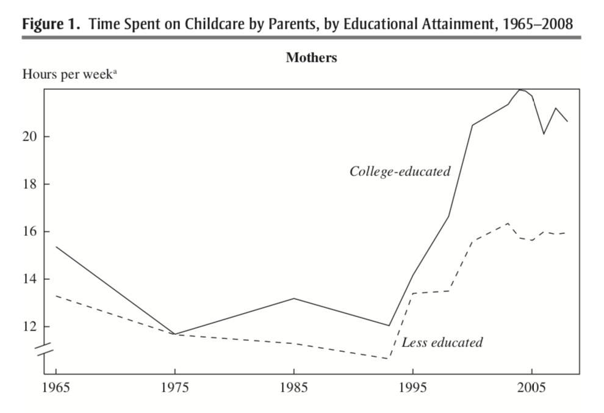
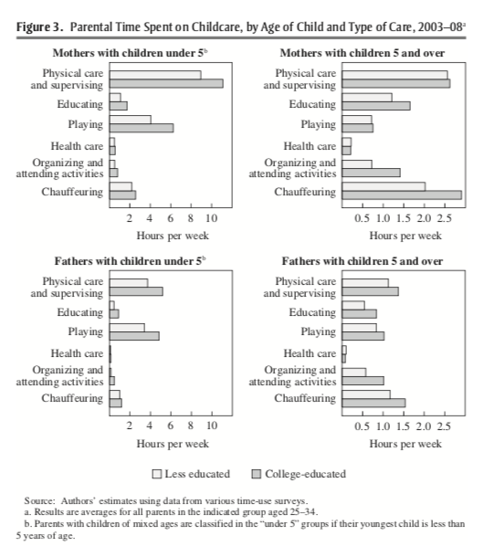

# The Rug Rat Race

## Time Diaries

```{r setup, include=FALSE}
library(Statamarkdown)
```

<html>
<head>
<style>
code {
  background-color: #f1f1f1;
}
</style>
</head>
<body>

Figure \@ref(fig:rugrat) plots a somewhat puzzling finding from Ramey and Ramey (2010). The figure shows the amount of hours per week mothers spend on childcare over time. For both college-educated and less-than-college-educated mothers, time spent on childcare rose dramatically in the early 1990s?

```{r, rugrat, echo=FALSE, out.width="90%", fig.cap="Time Spent on Childcare by Parents, by Educational Attainment, 1965-2008",fig.align='center'}

```

This rise occurs for both college-educated and less-educated mothers, but the rise is especially dramatic for college-educated mothers. Why is this puzzling? Well, this is a time period in which the returns to education were increasing a lot. In other words, these college-educated mothers had a lot to gain from working in the labor market, but in the data, we find they are spending more time on childcare. In this section of the course, we will explore why. 

In order to explore this question we will use data from the American Time Use Survey (ATUS). This is a survey administered by the Bureau of Labor Statistics, and agency that collects many important statistics concerning the U.S. economy. 

The data is based on "time diaries" which are detailed descriptions of the activities in a given day. For example, if the interview was held on a Tuesday, the individual would report everything they did on Monday (from 4 AM Monday to 4 AM Tuesday). This is a useful survey technique to get an accurate representation of how much time people spend on various activities.

Before digging into the data, however, we are going to learn a bit more about the R programming language. In particular, in this chapter we will cover some important functions for **data wrangling**.

## Conditional Statements

The basic idea behind conditional statements is that sometimes in R we want to execute some code, but only if a certain condition is true. Conditional statements are incredibly important in all programming languages. For example, when you type something on a computer and get and error statement, that is a conditional statement at work. A certain condition was met (some error in this case), so the computer output an error message. 

The way we will implement this idea in R is to use ``if`` statements. The general syntax for ``if`` statements is:

```{r, echo=T, eval=F}
if (logical statement) {
  
  code to be executed if logical statement is TRUE
  
}
```

It might be a bit easier to understand this syntax with a simple example. To begin, we are going to create an object in R called ``door`` which is equal to ``locked``.

```{r, echo=T}
door <- "locked"
```

Now, we are going to write some code to return a message if the object ``door`` is indeed locked. 

```{r, echo=T}
if (door=="locked") {
  
  print("sorry, you need a key to enter")
  
}
```

What is R doing here? Well, because we have assigned the value ``locked`` to the object door, the logical statement in parentheses ``door=="locked"`` is TRUE. Therefore, if we run this section of code, the code inside the curly brackets ``{}`` will be executed. In this case, the code just prints a message. 

What happens if we change the value of door to ``unlocked``. Well, in that case ``door=="locked"`` is no longer TRUE. Therefore, the code inside the brackets will **not** be executed.

```{r, echo=T}
door <- "unlocked"

if (door=="locked") {
  
  print("sorry, you need a key to enter")
  
}
```

Let's try another example. Say we take a random draw from three numbers: -1, 0, and 1. We can take a random draw from this list of numbers by using the sample function:

```{r, echo=TRUE}
x <- sample(-1:1,1)
x
```

The part of the code ``-1:1`` controls what numbers will be drawn. If you type ``-1:1`` in R, you will see it prints out the numbers -1,0, and 1. The second part of the code ``,1`` tells R how many random samples to take. In this case, just 1. So overall, this code is simply setting x equal to either -1, 0, or 1 and doing so randomly.

So now let's write a conditional statement that depends on the outcome of x. Let's write some code that returns the absolute value of x, but only if x is less than zero.

```{r, echo=T}
if (x<0){
  abs(x)
}
```

Next, let's discuss ``else`` statements. Sometimes, we want to execute certain code if the statement is TRUE, but some other code if it is FALSE. For example, in our first example, imagine if the ``door`` object is not equal to ``locked`` then we want R to print out the message ``Please Come in!``. The way we can do this in R is with an ``else`` statement:

```{r, echo=T}
door <- "locked"
if (door=="locked"){
  print("Sorry, you need a key to enter")
} else {
  print("Please Come in!")
}
```

Since we set ``door<-"locked"``, the first statement ``door=="locked"`` is TRUE. Therefore, the code inside the first curly brackets was executed. Now, let's change door to unlocked and see how this changes the output.


```{r, echo=T}
door <- "unlocked"
if (door=="locked"){
  print("Sorry, you need a key to enter")
} else {
  print("Please Come in!")
}
```

So now the first statement ``door=="locked"`` is FALSE. Therefore, R executes the code after the ``else {}``.

There are a few important notes about conditional statements before we move on. First, the ``else`` must appear on the same line as the end curly bracket ``}``. If it doesn't, then R doesn't know what logical statement to connect the ``else`` to. Second, R will execute the code after the ``else`` brackets if ``door=="locked"`` is FALSE for any reason. 

For example, imagine I set ``door <- "Locked"``. While it might look like the first logical statement ``door=="locked"`` is true, R is case sensitive. Therefore, in this case, the statement ``door=="locked"`` is FALSE. This implies that R will print out the words ``Please Come in!``.

## For Loops

In data analysis, we often find ourselves performing the same operation many times. We might be performing the same analysis for different variables or performing the same calculation for many different numbers. 

One way to perform this analysis is through writing scripts with many, many lines of code. Much of the code might be exactly the same, but simply changes a single number or variable. An alternative way to perform this computation is through **loops**. Although we are learning how to implement loops in R, loops are a concept that you should be aware of in any programming language.

The general form for a loop in R is given below:

```{r, echo=T, eval=F}
for (some set of things) {
  do some stuff
}
```

The ``for`` tells R this will be a for loop. Some set of things will depend on exactly what you are trying to do. Often, it will be a list of numbers. The next part of the code ``{`` tells R that everything that follows is part of the loop. The end curly bracket ``}`` tells R that the loop is over. 

To understand these concepts more concretely. We are going to go through a simple example. Let's imagine that someone has demanded you use R to print out ``2*i`` for ``i`` equal to 1, 2, 3, 4, and 5. In simpler language, multiply each number between 1 and 5 by 2 and then print out the result. We are going to perform this in what we will call the brute force method. 

First, let's print out ``2*1``

```{r, echo=T}
i <-1
print(2*i)
```

So why did we code this in such a roundabout way? Why not directly type ``2*1``. Well, once we go through the loop it will become clear why we are coding this in a somewhat roundabout way. What you need to understand now is exactly what the code is doing. First, it is creating an object named ``i`` that is equal to ``1``. Then, it is multiplying that object by 2 and printing out the result. Now, we have to do this for the number 2. 

```{r, echo=T}
i <- 2 
print(2*i)
```

Note that the second part of the code ``print(2*i)`` is exactly the same as before. That will be key when we are writing our loop. We can continue to do this for the rest of the numbers

```{r, echo=T}
i <- 3 
print(2*i)
```

```{r, echo=T}
i <- 4 
print(2*i)
```

```{r, echo=T}
i <- 5 
print(2*i)
```

In each block of code, the only thing changing is what ``i`` is equal to. Well, this is exactly what a loop does.

```{r, echo=T}
for (i in 1:5){
  
  print(2*i)

}
```

When we type ``for (i in 1:5)`` we are telling R to execute ``print(2*i)`` 5 times. The first time, ``i==1``. This is referred to as the first **iteration** of the loop. Once it has executed the code for ``i==1``, it should move on to ``i==2``. This is the second iteration of the loop. 

The great thing about this is that it can greatly increase the efficiency of our coding. For example, imagine we wanted to print out ``2*i`` for ``i=1:100``. If we go the brute force way, that would be 200 lines of code (first setting ``i`` equal to the given number and then executing the code). But with the loop, only one thing changes: in the first line we simply type ``for (i in 1:100)``.

In this example we are **iterating** over a list of numbers from 1 to 5. You can also iterate over other objects in R. For example, instead of iterating over a sequence of numbers, you can iterate over a vector. 

```{r, echo=T}
for (i in c(3,10,99)){
  print(2*i)
}
```
In this loop, in the first iteration, ``i`` is equal to 3. In the second iteration ``i`` is equal to 10. In the third ``i`` is equal to 99. 

Next, we are going to go through an example that loops over words instead of numbers. In this example, we are going to print out a to do list. Let's say we need to do three sets of homework assignments: math, reading, and writing. To start this example, let's create a vector of the assignments we need to do:

```{r, echo=T}
homework <- c("math", "reading", "writing")
```

We can loop over the contents of this vector in order to print out a to-do list. 

```{r, echo=T}
for (i in homework) {
  cat("Do", i, "\n")
}
```

We introduced a few new things here, so let's go through the code slowly. First, instead of looping over numbers here, we are looping over words. In the first iteration ``i`` is equal to the first entry of the vector ``homework``. Therefore, ``i`` is equal to ``math`` in the first iteration. 

Next, we have used a knew function ``cat()``. This function concatenates and prints. Therefore, if we type ``cat("Do",i)`` what you should interpret (in the first) iteration is that we are forming the sentence ``Do Math``. The last part ``,"\n"`` is telling R to display the next text  a line down.. When you want to skip a line in a word document, you just press Enter. In R, you can type ``"\n"``. If you are still unsure what ``"\n"`` is doing, you should try to take it out of the code and see how the result looks. 

In this example, we are looping over the words in ``homework``. An alternative way to write this loop out will take advantage of indexing. The following code performs the exact same process as above, it is just coded in a slightly different way.

```{r, echo=T}
for (i in 1:length(homework)) {
  cat("Do", homework[i], "\n")
}
```

In this loop, we are again looping over numbers. ``length(homework)`` is equal to 3. So we are looping over the numbers 1 to 3. In the first iteration, we are concatenating the words "Do" and ``homework[1]``. Since ``homework[1]`` is equal to Math, we are retrieving the exact same output as before.

So why would we want to code this loop in this way? Well, in this setting, it doesn't really matter how you write the code. However, that won't always be the case. Using the loop index (``i``) in order to subset vectors or data frames is a very common practice, so it is important to be exposed to this aspect of loops as well. 

## For Loops (Data)

Next, we are going to use for loops to make calculations in our data. To remind you, our empirical application is going to study how time spent on childcare, particularly for mothers, has changed over time. To begin, we are going to load in data from the American Time Use Survey.

```{r, echo=T}
rr <- read.csv("rugratrace.csv")
dim(rr)
```
  
As you can see, this is a pretty large dataset. There are 106,020 observations and 54 variables. Because this data is so large, we are first going to explain a subset of variables that we will be focusing on. Our goal is to compute time spent on childcare over time for mothers. The variable ``mother2`` is an indicator variable that is equal to one if the individual is a mother with a child currently living in the household. ``age`` is holds the age of the individual. ``childtot`` is the total hours spent on childcare in a week. ``dataset`` actually holds the year the data was collected. Different years come from datasets. This will be important to keep in mind going forward with the analysis. 

Our goal is to follow the Ramey and Ramey (2010) analysis as closely as possible. In order to do this, we are going to make a number of restrictions in our data so that we have the same sample of individuals studied by Ramey and Ramey (2010). This will involve restricting to mothers between ages 25 and 34 with a child in the household. In terms of the variables in the data frame, these are individuals such that ``age>=25 & age<=34 & mother2==1``. This is a logical statement composed of three statements, strung together by ``&`` operators. Therefore, in order to be ``TRUE``, every individual statement must be ``TRUE``. You should be able to convince yourself that this statement is only ``TRUE`` for mothers between the ages of 25-34.

The way we can subset to these individuals is through the ``subset`` command.

```{r, echo=T}
mothers2534 <- subset(rr, mother2==1 & age>=25 & age<=34)
```

Now we have a data frame restricted to the sample we are analyzing. Our goal is to compute the average amount of ``childtot`` over years (in our case, over different values of the variable ``dataset``). Therefore, what we need next is a list of the years in the data frame. 

Luckily, there is a function ``unique()`` that will come in handy here. ``unique()`` retrieves  list of the unique values of a variable. In other words, if we type ``unique(rr$dataset)`` we will get a list of all the years in the data frame. 

```{r, echo=T}
years <- unique(mothers2534$dataset)
years
```
  
So we are going to write a loop and iterate over the years. Before writing the full loop, let's make sure we understand how to code this for the first iteration. First, let's set ``i`` equal to one.

```{r, echo=T}
i <- 1 
```

Next, let's subset the data so that we create a dataframe that only contains observations such that ``dataset==years[i]``. Since ``i`` is currently equal to 1, this will subset the data to observations from 1965. 

```{r, echo=TRUE}
sub <- subset(mothers2534, dataset==years[i])
```

Since the data frame ``sub`` only contains observations from 1965, we can simply take the average of ``childtot`` within this data frame to retrieve the average amount of hours spent on childcare per week in 1965. 

```{r, echo=TRUE}
mean(sub$childtot)
```

When we actually go to iterating over a loop, we will want to keep track of what each number printed out corresponds to. Therefore, let's use the ``cat()`` function to clarify exactly what is being printed out. We are actually going to print out two things. First, we are going to print out the year we are studying. Then, we are going to print out the average childcare in that year.

```{r, echo=T}
# prints out year
cat("Year", years[i],"\n")
# prints out average childcare for this group
cat("Average childcare per week:", mean(sub$childtot),"\n")
```

Now that we have written all the code for ``i<-1``, we just need to put this code inside a loop that loops over from 1 to the total number of years. The total number of years is given by ``length(years)``:

```{r, echo=T, eval=F}
for (i in 1:length(years)) {
  
  # subset to year i
  sub <- subset(mothers2534, dataset==years[i])

  # prints out year
  cat("Year", years[i],"\n")
  
  # prints out average childcare for this group
  cat("Average childcare per week:", mean(sub$childtot),"\n")
  
}
```

```{r, echo=F, eval=T}
for (i in 1:length(years)) {
  
  # subset to year i
  sub <- subset(mothers2534, dataset==years[i])

  # prints out year
  cat("Year", years[i],"\n")
  
  # prints out average childcare for this group
  cat("Average childcare per week:", mean(sub$childtot),"\n")
  
}
```

As we can see in this table, this replicates one of the main findings in Ramey and Ramey (2010). In 1965-1993, the average time spent on childcare fluctuated between 9 and 13 hours. From 1998 onwards, the average amount of time spent on childcare increases dramatically, often between 15-17 hours per week on average.

## Tidyverse

So far we have been using what is referred to as base R. We have only utilized functions that come standard in R. However, one of the main strengths of R is its very active user community. Because R is open-source, users can write their own packages in R and make them widely available. This means the functionality of R is essentially growing every day. 

One of the most useful collection of packages for data analysis is the tidyverse package. This collection of packages can do many things. We will cover a small portion of what the package is capable of. If you want to get a more thorough understanding of the tidyverse, you can go to [R for Data Science](https://r4ds.had.co.nz/) and read more.

But before using the tidyverse, we actually have to install it into our version of R. In order to install a package, you can use the ``install.packages()`` function. For example, to install tidyverse, type:

```{r, echo=T, eval=F}
install.packages("tidyverse")
```

This will download all the necessary components of the tidyverse package onto your computer. You only need to install a package once.

Next, in order to use a package in a given R session, you need to load it into memory using the ``library()`` function:
```{r, echo=T, message=F}
library(tidyverse)
```

A common mistake for students is to forget to load a package for a given R session. If you do this, you might get an error such as "[function] not found". If you are using functions from an external package, you need to make sure to load that package in every session of R that you want to use it in. 

The first concept we will learn from tidyverse is the concept of a tibble. A tibble is very similar to what we have been calling a data frame. For our purposes, you can think of a tibble as synonymous with data frame. The main difference is in how the data is stored and presented. For us, this won't matter too much. For larger datasets, sometimes loading as a tibble can make a big difference in terms of how long computations take. 

To start, let's load ``rugratrace.csv`` as a data frame.

```{r,echo=T}
rr <- read.csv("rugratrace.csv")
```
To convert a data frame to a tibble, you can use the function ``as_tibble()``. 

```{r, echo=T}
rr <- as_tibble(rr)
```

If you are following along, you may think the code above did not actually do anything. However, you can tell the difference if you print out the data set. 

```{r, echo=T}
rr
```

You get more information printing out a tibble relative to a data frame. For our purposes, it won't matter too much if you load a dataset as a tibble or a data frame. However, it is important to understand these concepts, as you may see various online resources reference a tibble or a data frame. Generally, in this class we will load our datasets as tibbles from now on.  

To load a dataset as a tibble directly, you can use the ``read_csv`` function, the only difference being now an underscore separates the words in the function, rather than a period. 

```{r, echo=TRUE, eval=F}
rr <- read_csv("rugratrace.csv")
```

So now let's discuss some functions that come with tidyverse. The first functions we will introduce are ``filter``, ``select``, and ``arrange``.

The ``filter()`` function retrieves observations (rows) in the data that meet a certain condition. For example, maybe you want to restrict the analysis to a certain demographic. You can use the ``filter()`` function to do this. In our example, we want to restrict to mothers between ages 25 and 34. We can use ``filter()`` to accomplish this. The general syntax for ``filter()`` is:

```{r, echo=TRUE, eval=F}
filter(dataframe, some logical statement)
```

In our example, we can create the subset of the dataset we want by typing:

```{r, echo=T}
mothers2534 <- filter(rr, age<=34 & age>=25 & mother2==1)
```

You can use other logical operators in combination with filter as well. For example, imagine for a subset of our analysis we only want years between 2003 and 2008. We can use the operator ``%in%`` to accomplish this. 

```{r, echo=TRUE}
filter(mothers2534, dataset%in%2003:2008)
```

This code is saying restrict to ``mothers2534`` only for observations such that dataset is in the range of 2003 through 2008. One important note here is that in the code above we did not overwrite ``mothers2534``. That is why we can see the tibble being printed out. If you want to save the result of the ``filter()`` you need to assign the resulting tibble a name. Otherwise it will simply be printed to the console but not actually saved.

Next, let's discuss ``select()``. This function chooses which variables you want to remain in your tibble. For example, in our current tibble we have many variables, but we really only need a subset of them for our analysis. So we can select the variables we really need:

```{r, echo=TRUE}
mothers2534 <- select(mothers2534, dataset, mother2, age, childtot)
```

Now if we print out ``mothers2534``, it has only four variables now.

```{r, echo=TRUE}
mothers2534
```

Finally, our last function for this section is ``arrange()``. The ``arrange()`` function will sort the data based on the values of a variable. For example, imagine I want the observations in ``mothers2534`` to be arranged from the youngest age to the oldest age. I could type:

```{r, echo=TRUE}
mothers2534 <- arrange(mothers2534,age)
```

Now, we can verify that the youngest individuals are first:

```{r, echo=TRUE}
head(mothers2534$age)
```

And the oldest are last.

```{r, echo=TRUE}
tail(mothers2534$age)
```

If you instead want to sort from the oldest to youngest, you can use the function ``desc()``, which stands for descending. In other words, the dataset will be sorted from the highest value to the lowest value. 

```{r, echo=TRUE}
mothers2534 <- arrange(mothers2534,desc(age))
head(mothers2534$age)
```

To finish off this chapter, let's summarize all of the new functions in tidyverse that we learned. First, ``read_csv()`` is used in order to read data sets into R as a tibble. Next, we learned three functions that are useful for manipulating data. First, ``filter()`` selects observations of the tibble that meet a certain condition. In our case, mothers between the ages 25 and 34. Second, ``select()`` chooses which variables to keep in a tibble. In our case, we kept variables that indicated whether an individual is a mother, the year the data was collected, the age of the individual, and the amount of time spent on childcare of the individual. Lastly, ``arrange()`` is used to sort the data based on a value of a variable. In this chapter we showed how to use this to sort the data from youngest to oldest. 

## The Pipe Operator

In this section we are going to be going over the pipe operator: ``%>%``. The pipe operator is a very useful tool to use when working with the tidyverse. For our purposes, we can use it to string along a number of commands. Eventually, we will see that this greatly improves the efficiency of our code. First, however, we simply need to learn mechanically what the pipe operator does (although why we are using it might not be immediately clear). 

So far, in R, we have been applying functions to objects. For example, imagine we have a vector ``x`` and we want to take the mean. We would apply the ``mean()`` function to ``x`` by typing ``mean(x)``. The pipe operator gives us an alternative way to write this. We can type: ``x %>% mean()``. In general, when we have a function ``f()``, we can either write ``f(x)`` or ``x %>% f()``.

So what is the benefit of the pipe operator. Well, often in data analysis, we will want to apply many functions. For example, we may want to restrict to certain observations, select certain variables, and so on. We can think of this as applying many functions to an objects in sequency. For example, if we first apply ``f()``, then ``g()`` and then ``h()`` we can represent this as:

```{r, echo=T, eval=F}
h(g(f(x)))
```

Using pipe operators, we can equivalently write this out as:

```{r, echo=T, eval=F}
x %>% 
  f %>%
    g %>%
      h
```

What are we doing here? We are taking in an object x, and then applying f, and then applying g, and then applying h. When you read a pipe operator, you can think to yourself **and then**. This will be a helpful tool to remember what a pipe operator is doing. It is stringing together a number of different functions in R. 

So far, this has been a relatively abstract discussion of pipe operators. Let's load some real data so we can see how this works in practice. 

```{r, echo=T}
rr <- read_csv("rugratrace.csv")
```

In a previous chapter, we generated a new data set that (1) filters to mothers between 25 and 34. To understand pipe operators, let's first see how we can perform the same task using ``%>%``. 

To remind you, the code to filter from the previous section is:

```{r, echo=T, eval=F}
mothers2534 <- filter(rr, age<=34 & age>=25 & mother2==1)
```

Instead, when we use a pipe operator, we first supply the data frame ``rr`` and then call the function (with the relevant logical statement):

```{r, echo=T, eval=F}
mothers2534 <- rr %>% filter(age<=34 & age>=25 & mother2==1)
```

This is a useful way to think about the pipe operators when using it with data. First supply the tibble or data frame, **and then** apply all the functions you would like to the data. 

So far, we can't really see the benefit of the pipe operator with this example. It looks as if we have just rewritten the code. The main benefit for the pipe operator for us, however, will be that we can string along multiple commands. For example, imagine we want to (1) filter the data as above, and then (2) select only the variables we need. Before, we did this in two steps:

```{r, echo=T}
# filter to mothers 25-34
mothers2534 <- filter(rr, age<=34 & age>=25 & mother2==1)
# select certain variables
mothers2534 <- select(mothers2534, dataset, mother2, age, childtot)
```

These steps are not very efficient. In the first step we create ``mothers2534``. In the next step, we overwrite it with a new ``mothers2534``. In total, we needed to type ``mothers2534`` three different times to get the final tibble. Now, let's see how pipe operators will clean up this code:

```{r, echo=TRUE}
mothers2534 <- rr %>%
  filter(age<=34 & age>=25 & mother2==1) %>%
  select(dataset, mother2, age, childtot)
```

Now the code is a bit easier to digest. What are we doing? First we are specifying the tibble ``rr``, and then we are filtering it, and then we are selecting the variables we want. Now in this example, there are only two steps. But now imagine we want to also sort the dataset from oldest to youngest. No problem, we can just add a pipe operator that calls the ``arrange()`` function to the previous code:

```{r, echo=TRUE}
mothers2534 <- rr %>%
  filter(age<=34 & age>=25 & mother2==1) %>%
  select(dataset, mother2, age, childtot) %>%
  arrange(desc(age))
```

And our resulting code is still very clear an interpretable. Now imagine you had many, many more steps you needed to perform. You will soon be glad you have the pipe operator!

## Mutate

So far, we have documented that parents increased the amount of time spent on childcare in the 1990s and through the 2000s. Ramey and Ramey (2010) further document that this increase is even more dramatic for college-educated mothers. 

Ramey and Ramey (2010) argue the increased time spent on childcare for college-educated mothers is being driven by the competitiveness of college. To provide evidence for this, they break down the components of childcare. Figure \@ref(fig:timebreakdown) from Ramey and Ramey (2010) plots the amount of time spent on childcare for college-educated and less-than-college educated mothers by type of care.

```{r, timebreakdown, echo=FALSE, out.width="90%", fig.cap="Time Spent on Childcare, by Age of Child and Type of Care 2003-2008 ",fig.align='center'}

```

Let's focus on the top-right panel: mothers with children above the age of 5. College-educated mothers (the darker gray bars) are spending more time on a few categories: education, organizing and attending activities, and chauffeuring. Ramey and Ramey (2010) argue that these may be driven by college competitiveness. To be competitive in college, students need to earn higher scores on tests and participate in more extracurricular activities.

In our data, we are going to create a variable named ``collegeprep`` that is the sum total of time spent on education and time spent on travelling with children. Right now, however, our data set does not have this variable. So in order to add this, we will need to learn how to create variables in R. 

There are two ways to create new variables in R. The first uses base R. The general syntax is:

```{r, echo=T,eval=F}
df$newvarname <- expression
```

For example, let's add the variable ``collegeprep`` which will be the addition of ``childeduc`` and ``childtravel``, which are two variables in our ``rugratrace.csv`` data set. 

```{r, echo=TRUE}
rr$collegeprep <- rr$childeduc + rr$childtravel
summary(rr$collegeprep)
```

So the mean amount of time spent on ``collegprep`` is about 1.2 hours. Recall we haven't made any restrictions on ``rr``, so this includes everyone in the data set, including those who don't have children. This explains why the value is so much lower than the values we have been studying for mothers with children in the house. 

We can also generate new variables using the ``mutate()`` function (from tidyverse). The general syntax is:

```{r, echo=T, eval=F}
mutate(dataframe, newvarname = expression)
```

For example, if we want to add ``childprep`` using ``mutate()`` we can type:

```{r, echo=TRUE}
rr <- mutate(rr, collegeprep=childtravel+childeduc)
```

Note that the first step was to type ``rr <-``. If you don't overwrite ``rr`` by specifying this step, R will generate a new tibble with the added variable, but it won't be saved anywhere.

A nice thing about ``mutate()`` relative to base R is that you can generate a number of variables within the same ``mutate()`` command. For example, imagine we also want to create a variable that captures childcare time not spent on college prep. In other words, we want to add the variable ``childnotcollegeprep = childtot - childcollegeprep`` to the tibble. We can do this using the following:

```{r, echo=TRUE}
rr <- mutate(rr, collegeprep=childtravel+childeduc,
             childnotcollegeprep=childtot-childcollegeprep)
```

If you have more variables to add or change, you can simply add a comma to the end of the last line, and add the new variable below. Note, we can even call variables that are created earlier in the function (i.e. ``childnotcollegeprep`` can only be created if ``childcollegeprep`` is created first).

Lastly, let's talk about the ``transmute()`` function. This function also generates new variables, but at the same time, it drops all pre-exisiting variables. For example, if you wanted to create a tibble that only contains ``collegeprep`` and ``childnotcollegeprep``, you could use the ``transmute()`` function:

```{r, echo=TRUE}
collegeprepdat <- transmute(rr,
                            collegeprep = childeduc + childtravel,
                            notcollegeprep = childtot - collegeprep)
```
```{r, echo=TRUE}
collegeprepdat
```

As you can see, this is a data set that only contains the two variables we created using ``transmute()``. 

## Group By and Summarize

Often in the course of our data analysis we will want to break down some summary statistics by some groups. For example, maybe we have a dataset on individual-level voting records and want to compute average voting rates by state. Maybe we have data on wages over time, and we want to compute the average wage by year. In R, a convenient way to make this calculation is by combing the  ``group_by()`` function with the ``summarize()`` function.

To begin our discussion of these functions, we will first illustrate how to use the ``summarize()`` command before combining it with ``group_by()``. Our application will again utilize the data from Ramey and Ramey (2010) on time use. 

To remind you, the tibble ``rr`` contains the year of the observation in a variable named ``dataset`` and the amount spent on childcare in a variable named ``childtot``.

```{r, echo=T}
head(rr$dataset,rr$childtot)
```

The ``summarize()`` function is used to generate summary statistics. For example, imagine I just want to take the average level of ``childtot`` across the entire sample. We can do this by typing:

```{r, echo=T}
summarize(rr, meanchildtot = mean(childtot, na.rm=T))
```

The first part of the code, ``summarize(rr,`` tells R that we are generating summary statistics from the ``rr`` data set. The second, part ``meanchildtot=`` is actually giving a name to the summary statistic. In other words, you can change this part of the code and the only difference will be the name on the column that is output. The actual code will still execute without error. This is a helpful feature of the ``summarize()`` command because often we will want to save our summary statistics in a new tibble. If there are multiple summary statistics computed, we need to be able to keep track of the various summary statistics. The last part of the code ``mean(childtot, na.rm=T)`` is declaring that ``meanchildtot`` will be equal to the average of ``childtot``. Because we have specified ``na.rm=T``, missing values are ignored in the computation.

A nice feature of the ``summarize`` function is that we can generate multiple statistics in a single line. For example, imagine we would like to compute both the mean level of childcare and the median level of childcare. We can simply add this code to the previous summary command by giving the median a different name:


```{r, echo=T}
summarize(rr, 
          meanchildtot = mean(childtot, na.rm=T),
          medianchildtot=median(childtot, na.rm = T))
```

The median is actually zero here because we are taking the median for the entire sample. Many individuals will have zero time spent on childcare, as there aren't any children in many households.

Next, we will discuss the real usefulness of the summarize command: summarizing by groups. Many times as part of our analysis, we might want to provide summary statistics over some group variable. At other times, we may actually want to change the unit-of-observation of our dataset. Using the ``group_by()`` function with the ``summarize()`` function is an easy way to accomplish this. 

The ``group_by()`` function tells R that any subsequent functions should be done separately by the values of the ``group_by()`` variable. For example, in our dataset, we have a list of years:

```{r, echo=T}
unique(rr$dataset)
```

Therefore, if we specify ``group_by(dataset)``, then subsequent functions will be applied separately by each value of ``dataset``. In particular, if we next ``summarize(meanchildtot = mean(childtot, na.rm=T))``, then the mean of ``childtot`` will be taken separately for each value of ``dataset``. Let's try this all together now.

```{r, echo=TRUE, eval=F}
rr %>%
  group_by(dataset) %>%
  summarize(meanchildtot=mean(childtot,na.rm=T))
```

```{r, echo=F, eval=T}
rr %>%
  group_by(dataset) %>%
  summarize(meanchildtot=mean(childtot,na.rm=T))
```

The way we can read the code above is: first read in ``rr`` tibble, and then group by values of the variable ``dataset``, and then for each value of ``dataset``, take the average of ``childtot``, and store this information under the name ``meanchildtot``. 

We can also make this even more complicated by summarizing by two variables. If you type ``group_by(var1,var2)``, then R will group by the unique combination of variables. Before proceeding to the main example, let's generate a small data frame through which we can understand grouping by two variables. 

```{r, echo=T, eval=T}
student.df <- data.frame(school=c("A", "A", "A", "B", "B", "B"),
                        graduationdate=c(2010,2010,2015,2010,2010,2015),
                        gpa = c(3.2,3.7,2.9,4.0,3.2,1.8))
```

```{r,echo=T}
student.df
```

If I type ``group_by(school,graduationdate)``, then any subsequent ``summarize()`` command will be done completely separately by unique combinations of ``school`` and ``graduationdate``. In this data frame, there are 4 unique combinations -- "A 2010", "A 2015", "B 2010", "B 2015". So let's see what we get when we summarize by groups of two variables:

```{r, echo=T}
student.df %>% 
  group_by(school,graduationdate) %>%
  summarize(mean.gpa=mean(gpa))
```

To understand how the unique combinations are generated, let's change the dataset slightly. 
```{r, echo=T, eval=T}
student.df <- data.frame(school=c("A", "A", "A", "B", "B", "B"),
                        graduationdate=c(2010,2010,2010,2015,2015,2015),
                        gpa = c(3.2,3.7,2.9,4.0,3.2,1.8))
```

Now there are only two unique combinations in the data of school and graduation date: "A 2010" and "B 2015". Therefore, when we summarize by groups, there will be only two averages taken:

```{r, echo=T, message=FALSE}
student.df %>% 
  group_by(school,graduationdate) %>%
  summarize(mean.gpa=mean(gpa))
```

Now, let's return to the ``rr`` tibble. In Ramey and Ramey (2010), the authors compared time spent on childcare over time separately for college-educated and less-than-college educated individuals. We can achieve a similar analysis by grouping over ``dataset`` and ``college``. The variable ``college`` is a variable that takes on a value of 1 if the individual graduated from college, and zero otherwise. 

```{r, echo=TRUE, message=FALSE}
rr %>%
  group_by(dataset,college) %>%
  summarize(meanchildtot = mean(childtot, na.rm=T))
```

To understand this table, let's look at the first row. This first row has ``dataset==1965`` and ``college==0``. In other words, this row corresponds to individuals in 1965 without a college education. The value in the ``meanchildtot`` column is the average amount of time spent on childcare for these individuals. If we move down this table, we will see R has computed the man time spent on childcare for every unique combination of ``dataset`` and ``college``. 

Often in practice, we may want to actually save the output of this function. To do so, we just need to assign it a name, as usual:

```{r, echo=TRUE, message=FALSE}
totchildbyyearcollege <- rr %>%
  group_by(dataset, college) %>%
  summarize(meanchildtot = mean(childtot, na.rm=T))
```

Now we have created a new tibble ``totchildbyyearcollege`` that contains these averages over time by college education. 

We could have also accomplished this by looping over values of dataset and college and then computing the means and storing them. But doing so would have included (1) writing much more code and (2) actually taken longer to run. Using ``group_by()`` with ``summarize()`` is a much more efficient way to accomplish this. 

## Conclusion 

In this final section we will put all the various functions we've learned together into one analysis. As a reminder, our goal is to compute the average time spent on childcare for mothers over time, separately by college-education status. In other words, replicate Figure \@ref(fig:rugrat) from Ramey and Ramey (2010) which shows increased time spent on childcare beginning in the 1990s, especially for college-educated mothers. 

This review will focus on the ``tidyverse`` package. As a reminder, the first time using a package you need to install it using ``install.packages("packagename")``. You only need to do this once. However, every time you want to use the package in a given R session, you need to load it into memory using the ``library()`` function. For example, to load tidyverse we would type:

```{r, echo=TRUE, eval=F}
libary(tidyverse)
```

To begin, let's first re-load our data into R as a tibble using the ``read_csv()`` function. The ``read_csv()`` function reads in a dataset as a tibble, while the ``read.csv()`` finction reads the dataset into memory as a data frame. For our purposes, there won't be too much differences between these formats, but tibbles will be more efficient with large datasets. 

```{r, echo=TRUE}
rr <- read_csv("rugratrace.csv")
```

Our first issue is that the Ramey and Ramey (2010) analysis was for a particular group of individuals: mothers aged 25-34. Therefore, we first need to create a dataset restricted to these individuals. We can achieve this by using the ``filter()`` function.

```{r, echo=TRUE}
mothers2534 <- filter(rr, mother2==1, age>24, age<35)
```

Now, a focus of our analysis will be what is driving the increase in time spent on childcare. One potential driver is increased time spent on college prep activities, given an increase in the competitiveness of college during this time. We are going to add a variable named ``collegeprep`` to this dataset which is the time spent either on traveling with children or time spent educating children. 

```{r, echo=TRUE}
mothers_collegeprep <- mutate(mothers2534, 
                              collegeprep = childeduc + childtravel)
```

Our goal is to compute the amount of time spent on ``collegeprep`` over time, by college education status. We can accomplish this by using ``group_by()`` and ``summarize()`` functions together. 

```{r, echo=TRUE}
collegeprep <- mothers_collegeprep %>%
  group_by(dataset, college) %>%
  summarize(meancollegeprep=mean(collegeprep, na.rm=T))
```

Now if we look at our resulting tibble, we can use it to understand trends in time spent on college prep over time:

```{r, echo=TRUE}
print(collegeprep,n=25)
```


What do we find in this data? In the 60s-70s, on average, mothers spent around 1.5-2 hours on activities that may be related to college preparation. This number of hours increases over time. In the 2000s, it has stabilized to closer to 3 hours on average. Therefore, we find something broadly consistent with Ramey and Ramey (2010). Time spent on childcare has increased over time, and in particular, for activities that may be related to college preparation. In this data, however, we are finding relatively similar increases for both college-educated and less-than college educated individuals.  

Now, one thing to note is that we have done this analysis step-by-step. First we restricted our sample, then we added the variables, and lastly we summarized by group. However, we could have also done this entire analysis in a single block of code by stringing together functions using the pipe operator, as is done below: 

```{r, echo=TRUE}
collegeprep <- rr %>%
  filter(mother2==1, age>24, age<35) %>%
  mutate(collegeprep = childeduc + childtravel) %>%
  group_by(dataset, college) %>%
  summarize(meancollegeprep=mean(collegeprep, na.rm=T))
```

Going forward in the book, the tools we have learned in this section will be very important. It is extremely common to need to perform some data wrangling steps before proceeding to your actual analysis. The tidyverse package has given us a convenient set of functions in order to perform this analysis. 

## <u>Function Descriptions</u> {-}


::: {.rmdnote}

**<u>Tidyverse Functions</u>**

- ``read_csv()`` -- Reads a csv into memory as a tibble. A tibble is similar to a data frame, but more efficient in many settings. 

- ``as_tibble()`` -- Converts a data frame to a tibble. 

- ``filter()`` -- Restricts to certain observations in a data set. For example, ``filter(df, age>18)`` would restrict the hypothetical data frame ``df`` to individuals with ``age>18``.

- ``arrange()`` -- Sorts the data based on the value of a variable. For example, ``arrange(df, age)`` would sort the dataset ``df`` from youngest to oldest.

- ``select()`` -- Selects certain variables from a dataset. It can be used to restrict to only the variables needed for your analysis.

- ``mutate()`` -- used to generate new variables. 

- ``group_by()`` -- Groups data based on values of a variable. Any subsequent commands will be done separately by the values of the variable.

- ``summarize()`` -- Used to generate summary statistics. Often combined with ``group_by()`` in order to generate summary statistics by groups.

- 

**<u>Other Functions<u>**

- ``sample()`` -- Draws a random number from a list of numbers. For example, ``sample(-1:1,1)`` draws a single number from the list of numbers ``-1:1``. In other words, it will draw a random number from -1 to 1. ``sample(c(0,1,2),4)`` would draw 4 random numbers from the list of numbers 0,1, or 2.

- ``cat()`` -- Concatenates text in R. For example, ``cat("Hello","World")`` will yield the phrase "Hello World".

- ``unique()`` -- Retrieves a list of the unique values a variable takes on. 

**<u>Installing/Loading Functions<u>**

- ``install.packages()`` -- Installs a package onto your version of R. For example, ``install.packages("tidyverse")`` will install the tidyverse into R. You need to install a package once.

- ``library()`` -- Loads a package into memory. 


::: 

