# Intergenerational Mobility and Higher Education (Stata)

## Opportunity Insights


In this section, we will be discussing the relationship between **intergenerational mobility** and the higher education system in the United Stata. Before we start exploring this relationship, we first need to understand the concept of intergenerational mobility. This concept asks a simple question: if you are born from low-income parents, what is the chance you move up the income distribution?

Generally, we think of societies with high rates of intergenerational mobility as more equal. If a society has high rates of intergenerational mobility, then that means individuals from low-income backgrounds have opportunities to move up the income distribution. One common path to upward mobility is the higher education system. 

However, there are a few reasons why the higher education system may or may not lead to higher rates of intergenerational mobility. First, some colleges may not be particularly effective in increasing incomes. For example, for-profit colleges are often criticized as costly and low quality (See [NYT Article](https://www.nytimes.com/2020/06/17/business/coronavirus-for-profit-colleges.html)). If a college accepts a large fraction of students from low-income backgrounds, it may still not promote intergenerational mobility if its students don't actually benefit from attending. Second, individuals from lower-income backgrounds may have lower access to the higher education system. Rising cost of college may be making this worse over time. 

So how do we go about studying this question? We are going to use a dataset made publicly available by the researchers at **Opportunity Insights**. This data has made a big splash, both in academia and in policy circles.Figure \@ref(fig:oi) shows a headline from an Upshot article about the dataset. In this article, the authors discuss how this dataset has led us to new insights about how access varies dramatically at some schools. The headline reads, "Some Colleges Have More Students From the Top 1 Percent Than the Bottom 60. Find Yours". If a school has more students from the top 1 percent than the bottom 60, then it probably does not promote intergenerational mobility. Most of the students are already from relatively well-off backgrounds. This is our first hint that colleges may vary dramatically in the extent that they promote intergenerational mobility.

<div class="figure" style="text-align: center">
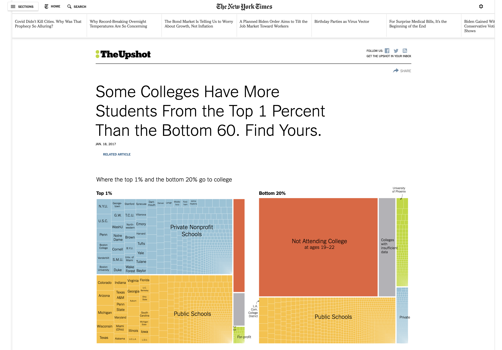
<p class="caption">(\#fig:oi)New York Times Graphic on Opportunity Insights</p>
</div>

Let's get a little bit more into the details on what data we will be using in this empirical application. The data comes from federal income tax returns. Researchers at Opportunity Insights have linked to federal tax returns to tax records of universities and data from Pell grants. The result is a dataset with (1) Children linked to their parents (children are reported as dependents) (2) Income data for both children and parents and (3) children linked to the universities they attended. 

This will give us everything we need to know to understand how a given college promotes intergenerational mobility. It will allow us to know both the know both the background of students attending a given college as well as their eventual earnings. It is important to emphasize that this was a huge data task that gives us a new way to study an important question. This comprehensive data has only recently become available. 

We have discussed at a high level the concept of intergenerational mobility. But when we turn to the data, we will need to compute a metric of intergenerational mobility that allows us to compare across colleges. Before introducing this measure, we will introduce a statistical concept that will be important throughout the course, and in particular, in understanding our measure of intergenerational mobility: **quantiles**.

## Quantiles

To begin our discussion of quantiles, let's imagine we have a small dataset of only 10 individuals. Each individual reports an income (in the thousands) and we sort the ten individuals based on their income.

Imagine we have 10 individuals and we sort them based on income (in the thousands per year) \smallskip

$$			
\{5,6,20,29,38,42,55,62,80,88\} \nonumber
$$

We can break up the data into equal-sized groups based on income. Each equal sized group is a **quantile**. For example, imagine we break the 10 individuals into 5 groups (or 5 quantiles).

$$
			\{\underbrace{5,6}_{Q1},\underbrace{20,29}_{Q2},\underbrace{38,42}_{Q3},\underbrace{55,62}_{Q4},\underbrace{80,88}_{Q5}\} \nonumber
$$
		
When we break up the observations into 5 equal-sized groups, this is referred to as breaking the data into **quintiles**. Q1 is referred to as the first quintile (or lowest quintile). Q5 is referred to as the fifth quintile (or highest quintile). Quintiles will be important for us because we will use them to define intergenerational mobility. In particular, we have conceptualized intergenerational mobility as the movement from a low-income background to high income. But low income and high income do not have any exact definition. The researchers at Opportunity insights use quintiles to define thse terms. 

In particular, an individual is defined as coming from low-income parents if the individual's parents are in the bottom quintile (Q1) of the income distribution. The bottom quintile implies the parents are in the bottom 20 percent of the income distribution.

An individual is defined as high income individual is in the top quintile (Q5) of the income distribution, or equivalently, the top 20 percent of the income distribution.

Quintiles are just one way to break up the data. If we break the data into four equal-sized groups, then we have broken the data into quartiles. If we break the data into a hundred equal-sized groups, we have broken the data into percentiles. In general, if we break the data into $q$ groups, we have created $q$ quantiles

Certain percentiles are often reported as descriptive statistics. For example, the median (50$^{th}$ percentile) is often reported as a summary statistic. In 2019, according to the U.S. Census, the median household income was \$68,703. This implies 50 percent of households had income less than \$68,703, while 50 percent had income more than \$68,703.


## Intergenerational Mobility Definition

Now that we understand quantiles, we will define a college's intergenerational mobility rate. Intuitively, a college will promote intergenerational mobility if it (1) admits students from low-income backgrounds and (2) these students become high earners later in life. Again, we have  defined low income as the bottom quintile of earnings, while high income is the top quintile of earnings. We will define the **mobility rate** as the fraction of low-income students, multiplied by the probability these low-income students go on to become high earners:

::: {.rmdnote}
$$
\text{mobility rate}= \underbrace{\text{(frac. of students from Q1)}}_{\text{Acess}} \; \cdot \; \underbrace{\text{(frac. of Q1 that reach Q5)}}_{\text{Success}} \nonumber
$$
:::

Let's talk about each of these terms independently. "Access" depends on the fraction of students enrolled in a school that come from low-income backgrounds, or Q1. There is potential for schools with high access to have large impacts on intergenerational mobility. But this might not necessarily be true. For example, some work has found while for profit colleges tend to admit disadvantaged individuals, the outcomes for these individuals tend to be poor.[@deming2013profit] Therefore, even though the Access rate might be high, these schools will not tend to promote intergenerational mobility. The reason is due to the second term: Success. This measures the fraction of students from low-income backgrounds that reach the top quintile of earnings. 

Intuitively, we can interpret the mobility rate as the fraction of students that are from low-income backgrounds that reach high income at a school. For example, if 10 percent of a school's enrollment comes from a low-income background, and half of these students end up in the top quintile of earnings, then that means 5 percent (overall) of the student body came from low-income backgrounds and achieved high income. This number is equal to the school's mobility rate ($\text{mobility rate}=0.10 \cdot 0.50 =0.05$).

But now let's get into the specifics of the data. How do we (exactly) determine if a students comes from a low-income background? Here are the steps:

- 1. Take all parents that have a child in the same year (e.g. 1985)

- 2. Compute average income for these parents when children are 15-19 (i.e. from 2000-2004)

- 3. If parents' income is in bottom 20 percent over this period (i.e. in Q1), then classify students as coming from low-income background

Now that we have low-income background, how (exactly) do we determine if a student becomes a high earner? 

- 1. Take all individuals that are the same age and calculate earnings in 2014

- 2. If individual's income is in the top 20 percent relative to individuals the same age (i.e. in Q5), then classify student as a high earner
    
A general lesson here is to understand the details before you proceed with the analysis. In this example, low income and high income have very specific definitions. We need to understand our variables and how they are measured before we can dive into our analysis.     


## The Stata GUI

Before digging into the Opportunity Insights dataset, we first need to learn how to use Stata. Every time you launch Stata, you will be greeted by the Graphical User Interface (GUI) you see in Figure \@ref(fig:gui)

<div class="figure" style="text-align: center">

<p class="caption">(\#fig:gui)Stata Graphical User Interface</p>
</div>

There are 4 main panels here. Let's start in the bottom left: the Command window. This is where you can type code. When you press enter, the code will executed. When we learn how to. When we learn how to use Stata as a calculator, this is where we will type the code

When we execute code, any resulting output will be displayed in the Results window. When we learn how to use Stata as a calculator, this is where the results will be displayed.  

When we load data, the name of the variables in the dataset will appear in the first column. Many times, datasets come with labels, that give us more description about the variable. For example, in the figure below there is one variable named ``income`` with the label ``Total Annual Income``. 

<div class="figure" style="text-align: center">
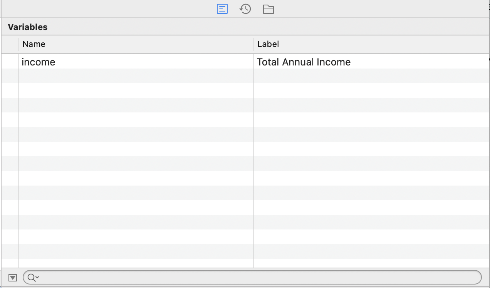
<p class="caption">(\#fig:main)Variables Window Example</p>
</div>

The Properties window gives us more information about the variables and data loaded in memory. For example, in addition to the name and label of a variable, the type (i.e. numeric or string) and format of the variable (i.e. how the variable will be displayed). Additionally there is information about the size of the data (number of variables, observations, etc.)


Now that we have learned about the various windows, we are going to execute our first line of code. In particular, we are going to use Stata as a calculater by typing ``display`` followed by a mathematical expression. 

For example, to compute ``2+2`` type

```stata

display 2+2
4
```

The result will be visible in the Results window. ``display`` is called a command in Stata. Stata comes with many commands that will be useful to explore and analyze our data. Whenever you learn a new command in Stata it is helpful to look at the help file that comes along with this file. To access the help file for the display command type ``help display`` into the command window. This will open up a file that has instructions on how to use the given command

The first thing you will generally see in any help file is the syntax of the command. Syntax refers to the format of the code. It is similar to the "grammar" of the software language. If you use incorrect grammar in language, you may not be expressing the right meaning. Similarly, if you use the wrong syntax in software language, you may not get the correct output, and more than likely, an error will be reported

Figure \@ref(fig:helpdisplay) shows the Syntax from the help file for the display command.

<div class="figure" style="text-align: center">
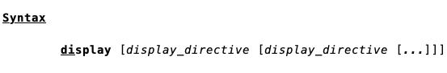
<p class="caption">(\#fig:helpdisplay)Variables Window Example</p>
</div>

The fact that ``di`` is underlined means to use the display command you only need to type ``di`` as a shortcut. Many commands in Stata have shortcuts associated with them. To figure out those shortcuts, you just need to open the help file. We will fill in the ``[display_directive]`` in a couple of ways 

We can use Stata to perform calculations just like you would in a calculator. For example, for subtraction, type:


```stata

di 6-4
2
```

For multiplication type:


```stata

di 2*4
8
```

For division type:


```stata

di 12/2
6
```

We can also use ``display`` to print text. This can be very helpful when writing programs. For example, if something goes wrong in a program, you, might want to display an error code. To display the words in Stata, you just need to put the words you would like to display in quotation marks. For example, to display "Hello World" type: 


```stata

display "Hello World"
Hello World
```

Words are referred to as strings in Stata (later we will have string variables and numeric variables). When you reference a string, need to put in quotation marks. For example, if we were to type ``display Hello World`` into Stata, we would get the error depicted in Figure \@ref(fig:helloerror) If you forget you will get an error, as is displayed below:

<div class="figure" style="text-align: center">

<p class="caption">(\#fig:helloerror)Forgetting Quotation Marks When Referencing Strings</p>
</div>

``Hello`` was not found because Stata looked for a command or variable named ``Hello``, but could not find one, and therefore reported an error. The command did not realize it was just meant to display text, because the text was not in quotation marks.

## Do-files

So far, we have discussed how to execute code by typing it into the command window. In practice, we will seldom use the command window to execute code. Instead, we will use a **do-file**.

To understand the importance of a do-file, let's imagine you have a project that has a large number of steps. Maybe you need to clean the data (usually a necessity) and then run a large number of results. A single project could end up being thousands of lines of code. What would it entail to complete this project if you were to use the command line? 

You would need to type in the lines of code one at a time. But what if you make a mistake at the beginning of your project. For example, you accidently deleted some observations relevant to your analysis. This is a disaster! You now need to remember what you did, type all of the code again, and then execute it. 

A better way to approach any project is to use a do-file. A do-file allows you to run multiple lines of code sequentially. You can save your progress periodically, just as you save your progress when writing a report in Word. Then, if you realize you made a mistake early in the project, you can just alter that one line of code and then re-run the entire project.

To begin, we need to learn how to open a do-file. At the top of the GUI there is an icon that looks like a piece of paper and pencil above it (see Figure \@ref(fig:maincopy)). 

<div class="figure" style="text-align: center">

<p class="caption">(\#fig:maincopy)Opening a New Do-File in Stata</p>
</div>

Figure \@ref(fig:dofileicon) shows a larger version of the do-file icon.

<div class="figure" style="text-align: center">
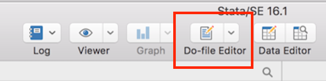
<p class="caption">(\#fig:dofileicon)Do-File Icon</p>
</div>

To open a new do-file we can simply click the icon. When you do, you will see a blank file. This is where we are going to type code into (see Figure \@ref(fig:blankdofile)).

<div class="figure" style="text-align: center">
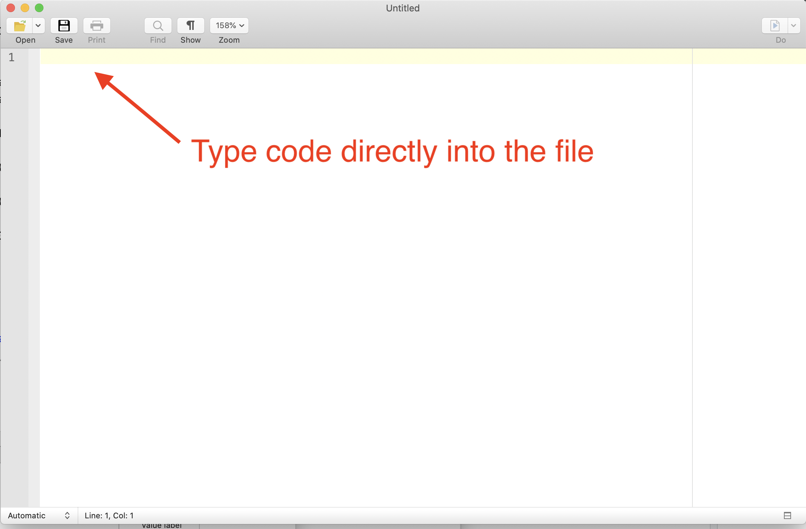
<p class="caption">(\#fig:dofile1)Blank Do-File</p>
</div>

For example, if we want Stata to compute the sum of 2+2, we would type ``display 2+2`` into the dofile, as seen in Figure \@ref(fig:dofile2).

<div class="figure" style="text-align: center">
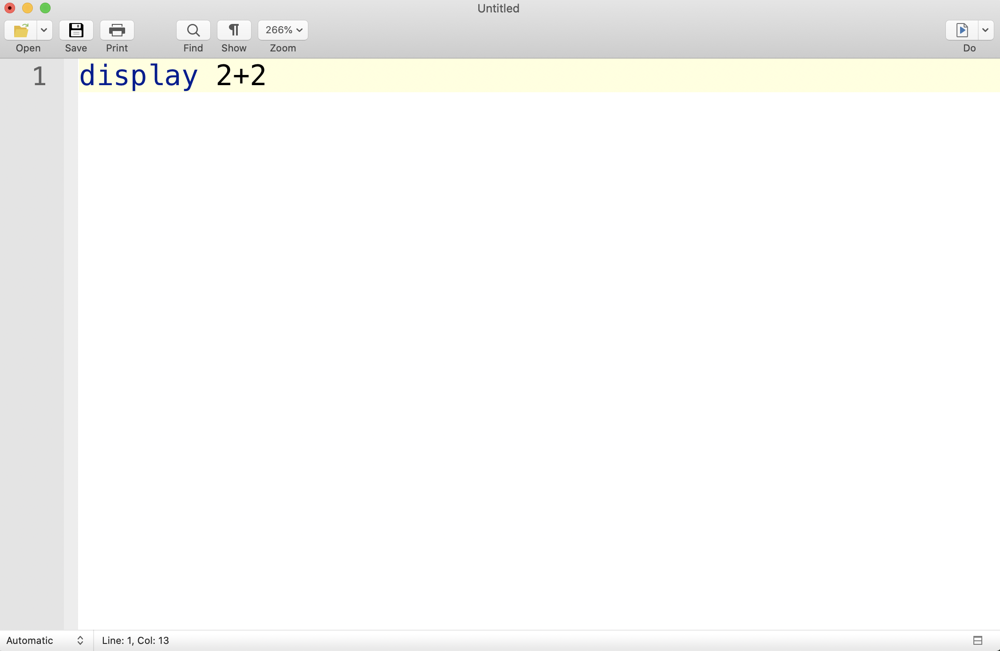
<p class="caption">(\#fig:dofile2)Display 2+2 in a Do-File</p>
</div>

So now that we have our code written, how do we execute it? There are actually a couple of different ways. The first is pressing the "Do" button, which is the icon on the top right of the do-file that looks like a piece of paper with an arrow.

If you press this button without highlighting any text, it will execute every single line of code in the file in the sequence they appear. Depending on your goal, you may want to only run select portions of your code. For example, we often need to "debug" our code, and it is more efficient to run a few lines at a time. In this case, we can highlight the lines we would like to be executed, and when we press "Do", only the highlighted lines of code will be executed. 

For example, in Figure \@ref(fig:dofile7), hitting "Do" will execute the first two lines of code. In Figure \@ref(fig:dofile8), hitting "Do" will execute the second and third line of code.

<div class="figure" style="text-align: center">
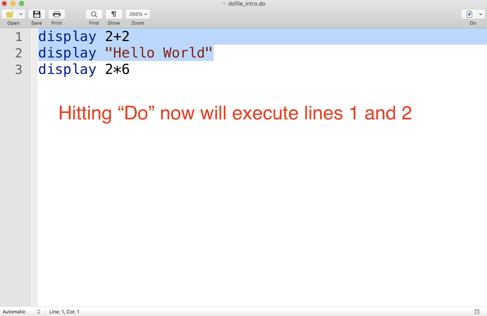
<p class="caption">(\#fig:dofile7)Executing Lines 1 and 2</p>
</div>

<div class="figure" style="text-align: center">
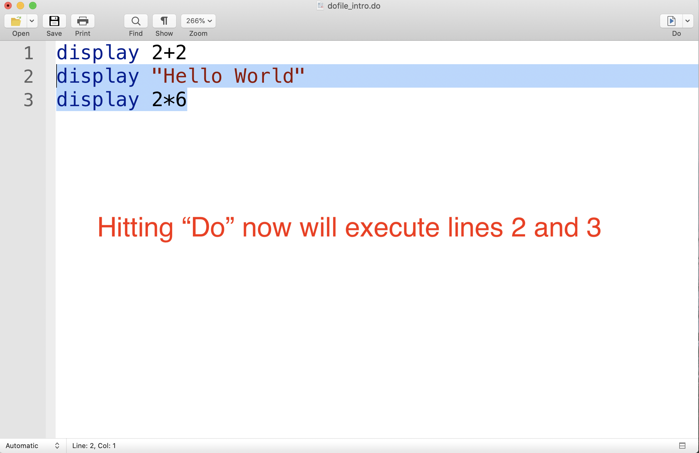
<p class="caption">(\#fig:dofile8)Executing Lines 2 and 3</p>
</div>

We don't actually have to hit "Do" to execute the entries of a dofile. Stata does have built-in shortcuts that you can use. A shortcut is a set of keys that you can press in order to perform the same operation as pressing a button. For example, in a Mac, if you press "Cmd + Shift + D" when highlighting sections of code, the highlighted sections will be executed. On a PC, the shortcut is "Ctrl + D". 

Lastly, the key aspect of do-file is that you can save your progress. For example, if you do a homework assignment in multiple sittings, you better have a way to start where you left off! To save a do-file press the "Save" button in the top left corner of the page, as seen in Figure \@ref(fig:dofile5)

<div class="figure" style="text-align: center">
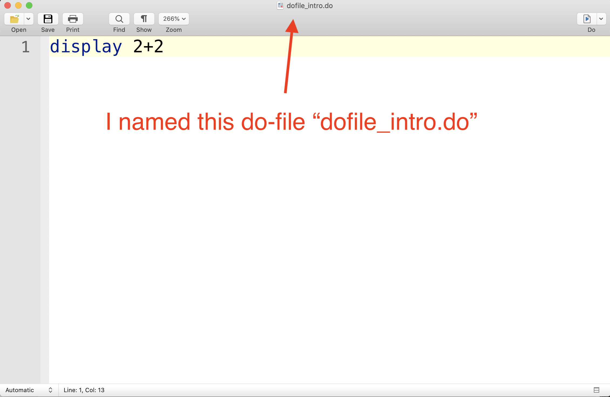
<p class="caption">(\#fig:dofile5)Saving A Do-File</p>
</div>

You should save the do-file somewhere convenient on your computer, so that you can quickly find it next time you need it. 

## The Working Directory

Next we are going to discuss the working directory. To understand the working directory, you first need to understand that every file and folder on your computer has an "address" associated with it. Most of us are used to navigating through either Finder in Mac or through File Explorer in a PC to open a file we need. 

But this is not the only way to open files. And in fact, originally, there was no convenient user interface in computers to access files in this way. Instead, you needed to direct your computer to the location of the file by typing in the files' "address". The "address" of a file or folder is know as the path name. It is a string of text that tells your computer where the file or folder is located. 

The **working directory** is the default path in Stata. This is where Stata looks for files by default. For example, imagine I have a dataset named, "interesting_data.dta" and I want to load it into Stata. The command to load data in Stata is the ``use`` command. Therefore, I might want to type:


```stata
use interesting_data.dta, clear
```

The ``, clear`` tells Stata to clear out any data that is currently loaded into memory. Where will Stata look for the file "interesting_data.dta"? In the working directory!

Therefore, before you start loading in data, you need to learn what your working directory is currently set to. To check this in Stata, we use the ``pwd`` command, which is short for "print working directory". To check your working directory in Stata, just type ``pwd`` into the command window. When I typed this into my command window, this is the path name that came out:

\begin{center}
\colorbox{gray!20}{\texttt{/Users/davidarnold/Documents/Stata}}
\end{center}

This will not be a convenient folder for our working directory. We want the working directory to be set to the place where we put the data after downloading it. For me, this folder is "/Users/davidarnold/Dropbox/Teaching/EP5/online/02_week/data".

For this course, I would suggest creating a folder dedicated to this course. For me, this Folder is on my Dropbox and located within the "Teaching" folder. I named my folder for this course "EP5", but you can name yours whatever you like.

Additionally, given the large number of datasets we will be using, it will be convenient to separate them somehow. I have divided the course into weeks. Given this application corresponds to the second week, I have named the folder "02_week". Lastly, inside this folder I want to quickly understand where my data is, therefore, I have a dedicated data folder that holds all the datasets we will explore this week. 

The structure described above is displayed below in Figure \@ref(fig:hierarchy)

<div class="figure" style="text-align: center">
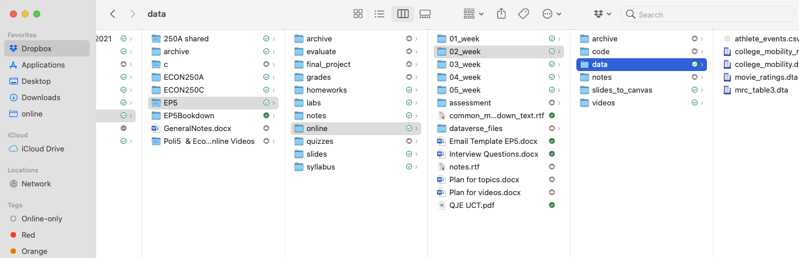
<p class="caption">(\#fig:hierarchy)Example Structure of a Folder Hierarchy for this Course</p>
</div>

One brief aside before we continue with understanding the working directory. The best time to organize the folders on your computer is now! What does this mean? It means do not place everything you download in one place. Do not have your desktop cluttered with numerous files. Create folders on your computer that neatly divide up your work. For me this means different folders for Research and Teaching. Within Teaching, I need different folders for every course I teach. Within each course, I need different folders for every week of the course. Therefore, if I need to access a dataset or set of notes for a given week of the course, I can do so quickly and easily. Doing this organization now will save you a lot of time in the future, not just in this course, but even more generally. 

Returning to the working directory, now that we know where the data is, we need to change our directory to the location of the data. To do this we can use the ``cd`` command which is short for "change directory."


```stata
cd "/Users/davidarnold/Dropbox/Teaching/EP5/online/02_week/data"
/Users/davidarnold/Dropbox/Teaching/EP5/online/02_week/data
```

This is the path for me, but it will be different depending on where you put the downloaded data for the week. One issue that commonly confuses students is that even though they can navigate to a file, they don't actually know the full path to that file. 

In a PC, retrieving the full path is relatively simple. In the file explorer there will be a panel at the top that shows the different subfolders. Clicking on the arrow next to this path will convert it to the full path name. You can simply copy and paste this pathname into Stata to change your working directory. 

On a Mac, it is slightly more complicated. If you right click a folder and then press the "option" key, there will be an option to "copy as pathname". Pressing this option will copy the path name for you (i.e. you can press Cmd+v to paste it, or right click and then select paste.)

## Use, Describe, and Browse

In this section we are going to learn a few basics of loading data into Stata. To get started, let's load in the main data for this chapter, which contains data from Opportunity Insights that will allow us how colleges vary in the extent that they promote intergenerational mobility. To load in the data type:


```stata
cd "/Users/davidarnold/Dropbox/Teaching/EP5/online/02_week/data"
use college_mobility.dta, clear
```

Again, the first part of this code (the part following "cd") will look different for you depending on the path to data in your computer. Now the data has been loaded into memory, but don't yet understand what is actually in the data. The first command that can be used to start exploring the data is the ``describe`` command. The ``describe`` command allows us to quickly review the variables in a dataset.


```stata
describe
```

Figure \ref(fig:describe) displays the results of this command, which is a table of variables, as well as the format of the variable and the label associated with the variable. 

<div class="figure" style="text-align: center">
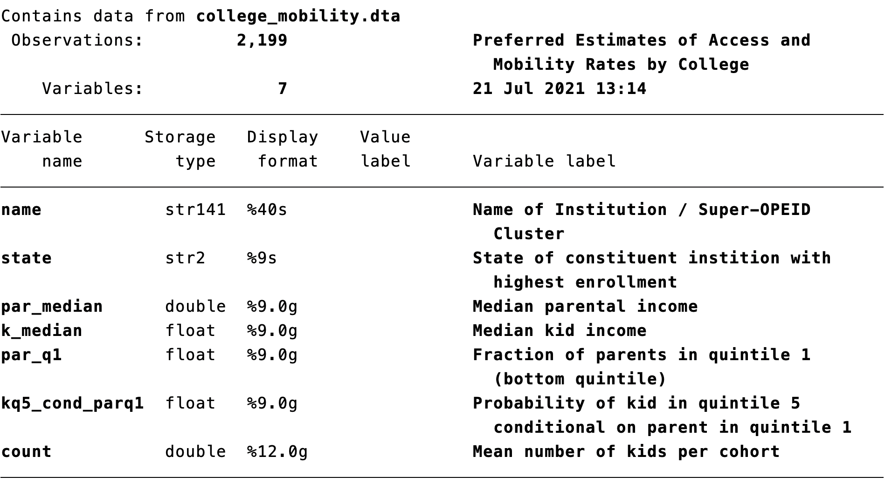
<p class="caption">(\#fig:describe)Describe Command</p>
</div>


## References {.unnumbered}
