# (PART) Excel {-}

# College Instruction Experiments

## Experiments

<html>
<head>

</head>
<body>

Did you know that countries with higher consumption of chocolate per capita tend to win more Nobel prizes? 

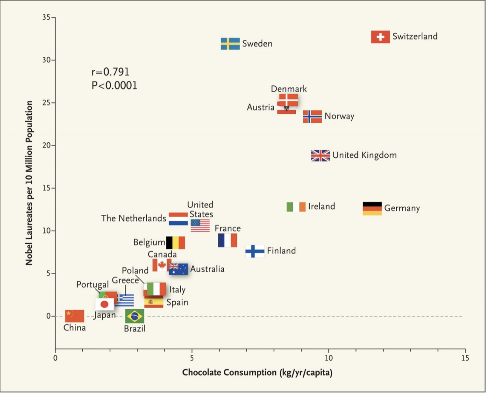

(\#fig:chocolate)Chocolate Consumption and Nobel Prizes

In Figure \@ref(fig:chocolate), the number of Nobel laureates per 10 million of the population (vertical axis) is plotted against the chocolate consumption in kilograms per capita in a given year (horizontal axis). As is clear in this graph, countries with higher rates of chocolate consumption also tend to have higher rates of Nobel laureates. This is an example of a **correlation**. A correlation is any statistical relationship between two variables. 

Correlations can be very interesting. In many cases, they can lead to new research questions. But they don't often answer the questions social scientists are actually interested in. We are generally interested in understanding **causal relationships** between variables. 

To understand causal relationships, let's again consider the relationship between chocolate consumption and Nobel prizes. Do you think that if the U.S. wanted to increase the number of Nobel laureates, they should invest in chocolate and include chocolate in lunch meals for students? Probably not! It's unlikely that increased chocolate consumption **causes** an individual to win a Nobel prize. In this case, it is more likely that this correlation in the data just arose due to chance. Therefore, we have uncovered a **spurious correlation**, which is defined as a correlation that arose due to chance. There are many interesting spurious correlations (See [spurious-correlations](https://www.tylervigen.com/spurious-correlations)). For example, you probably would not guess that consumption of mozzarella cheese is correlated with civil engineering doctorates awarded, but see Figure \@ref(fig:spurious) for this surprising correlation.
 

(\#fig:spurious)Example of a Spurious Correlation from tylervigen.com

While spurious correlations can be interesting and fun, if we need to decide whether a given policy should be implemented, we need to understand how it causally impacts an individual's outcomes. To see why, let's imagine a high school is trying to decide whether to invest in a new after-school program designed to help students with standardized tests. Currently, they do not have such a program on campus, but they know some of their students attend programs offered outside the school. To try and understand the benefits of such a program program, the school decides to use data to see if those who attended standardized test prep programs outperformed students who did not.

The school finds those who attended the test prep programs score much higher on standardized tests than those who didn't. Does this mean the test prep program works and the school should invest in one? 

Maybe, maybe not. Two stories could potentially rationalize this finding. Story 1 is that the programs are effective ways for students to learn the material they need to perform well on standardized tests. That is, the program has a causal impact on SAT scores. Story 2 is that the programs are not actually effective. However, students who self-select into test prep programs also tend to be more motivated overall. They could, in theory, vary along many dimensions: academic ability, interest in college, parental background. It could be that any of these differences are actually driving the differences in standardized test scores. 

With only **observational data** it is difficult to tell which story is true. However, there is a long-established way to identify causal relationships in medicine: the randomized control trial (RCT). To understand RCTs, imagine we are testing whether a given drug reduces blood pressure. To study the effectiveness we recruit a group of participants. Half of the participants are randomly placed into the **treatment** group and given the drug. The other half are placed into the **control** or **placebo** group and given a placebo drug. Now we can just compare outcomes for the two groups over time to understand the impact of the drug. 

The key to a well-done experiment is **randomization**. If who receives the treatment is completely random, then on average, the two groups will be very similar. For example, in our test prep example, if we could randomly split students into two groups: test prep vs. no test prep, then we could evaluate the impacts of the program. Since students are no longer self-selecting into the program, there should be little difference between the two groups in terms of academic ability, college interest, parental background. Why would there be? We randomized the students into the program.

Not all questions in social science can be answered with an experiment. In certain cases, it may be prohibitively expensive or unethical to run an experiment. However, if an experiment can be done, it is hard to find more convincing evidence. Experiments have been widely influential in many social sciences. For example, in the field of development economics, a large number of experiments have been undertaken to develop policies aimed at alleviating global poverty. In 2019, Abhijit Banerjee, Esther Duflo, and Michael Kremer won the Nobel Prize in Economics "for their experimental approach to alleviating global poverty."

In this course, we will be studying a number of social science experiments. Our first experiment comes from Brownback and Sadoff (2020). The motivation for this experiment is a startling statistic. Only 40 percent of community college students earn a college degree within 6 years (Shapiro et al. 2017). Given these poor outcomes, it is important to consider tools to improve performance. In Brownback and Sadoff (2020) the researchers explore one potential tool that has been previously unexplored: financial incentives to instructors. This is often referred to as a pay-for-performance model. Instructors are paid for how well their students perform. 

To get specific, Brownback and Sadoff (2020) ran the following experiment at a community college in Indiana (Ivy Tech):

  - Some instructors (the treatment group) received \$50 for each student that passed an externally-administered test 
  - Other instructors (the control group) did not receive such an incentive. 
  
The key in their design is that the instructors that are chosen to receive the incentives are randomly selected. Therefore, they are not, on average, better teachers than instructors in the control group. Therefore, if we observe any difference in student performance between the treatment and control, then it must be due to the financial incentives for instructors! 

::: {.rmdtip}

**Question: The key aspect of an experiment that allows us to infer causation is...**

<label><input type="radio" autocomplete="off" name="radio_LWKAMLKLEK" value="answer"></input> Ability to randomize individuals across treatment and control</label><label><input type="radio" autocomplete="off" name="radio_LWKAMLKLEK" value=""></input> Ability to collect large amounts of data</label><label><input type="radio" autocomplete="off" name="radio_LWKAMLKLEK" value=""></input> Ability to follow individuals over time</label><label><input type="radio" autocomplete="off" name="radio_LWKAMLKLEK" value=""></input> Ability to collect information about confounding variables</label>

:::

## Community College Data

In many disciplines, there has been a push toward transparency and replication. Past work has shown that some very influential studies have failed to replicate (see [here](https://en.wikipedia.org/wiki/Replication_crisis#In_economics)). A common way to provide transparency is to have authors make the data from their research publicly available. That means we will get to use the actual data from the experiments we are studying in this class. 

Table \@ref(fig:bsdata) shows a selection of the data from Brownback and Sadoff (2020). The actual data is much larger, but only a subset of the variables will be relevant for our analysis. This is referred to as a **data table**. Each **row** in a data table is an **observation**, while each **column** is a **variable**. 

(\#fig:bsdata)Data From Brownback and Sadoff (2020)

It is always important to understand the structure of your data before proceeding with any data analysis. One of the most important components of understanding the structure is to discern the **unit of observation**. The unit of observation is the level at which the data is reported. To discern it for yourself, just think about what each row of the dataset represents. Is each row an individual, a neighborhood, a state, or a country? To practice, let's go through a few examples.

 
What is the unit of observation in Figure \@ref(fig:student), which displays a data table for just two observations?

(\#fig:student)Unit of Observation Example 1

To answer this question, we need to decide what a row represents. In this case, each row corresponds to a different student. Therefore the observation level is a student.

 
What is the unit of observation in Figure \@ref(fig:studentterm)?

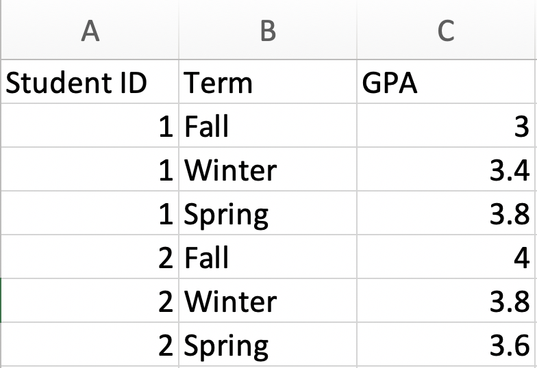

(\#fig:studentterm)Unit of Observation Example 2

Again, we need to decide what a row represents. In this case, each row corresponds to a particular student in a particular term. Therefore the observation level is a student-term.

Now let's think about what the unit of observation is in the Brownback and Sadoff (2020) data. The variable **AnonID** is the identifier for a student. The variable **CourseNumber** is the identifier for a course. This dataset seems to be giving us the information for a student in a given course. Therefore the observation level is a student-course. 

Before we get to analyzing the data, let's actually learn about our first feature in Excel. When browsing an excel file, it is often convenient to **freeze** the first row so that it is always visible. In our case, the first row holds variable names. Therefore, if we freeze the first row we can scroll through the data without having to remember what each column corresponds to. 

To freeze the first row go to the **View** and then click **Freeze Top Row**.

(\#fig:freeze)Freezing the First Row

Let's talk a little bit about our goal with this dataset. Our goal is to determine if providing financial incentives to teachers impacts student performance. The variable **Treatment Arm** details whether a student has an instructor who received incentives or is in the control group. Therefore, we can see if test scores improve based on the Treatment Arm of the student. To perform this analysis, we need to learn how to use **functions** in Excel. 

::: {.rmdtip}

**Question: Imagine we have a dataset where each row contains the average unemployment rate for a given state in a given year. The unit of observation in this dataset is**

<label><input type="radio" autocomplete="off" name="radio_MEWVQRPJWW" value=""></input> State</label><label><input type="radio" autocomplete="off" name="radio_MEWVQRPJWW" value=""></input> Year</label><label><input type="radio" autocomplete="off" name="radio_MEWVQRPJWW" value=""></input> Individual-year</label><label><input type="radio" autocomplete="off" name="radio_MEWVQRPJWW" value="answer"></input> State-year</label>

:::

## Statistical Functions

A function is something that takes in an input and produces an output. For example, you can think of taking the average as a function. The input is a list of numbers, and the output is the average of that list of numbers.  When the inputs and outputs of a function are numbers, then it is a **statistical function**. 

In Excel, statistical functions are extremely important to understand. If you are doing research, it is common to start with a list of summary statistics. If you are in a business, it might be important to know some summary statistics about your products. To create these summary statistics we use statistical functions. 

In order to illustrate the use of statistical functions, let's consider the following dataset that has information on Gross Domestic Product (GDP) for ten countries

(\#fig:gdp2020)GDP in 2020

Let's introduce our first statistical function: the ``AVERAGE`` function. This function will take in a list of numbers and output the average of all those numbers. There are many statistical functions in Excel, including:
 
  - ``COUNT`` -- counts the number of numbers  
  
  - ``SUM`` -- adds up the numbers
  
  - ``MEDIAN`` -- retrieves the median of all numbers
  
  - ``MAX``, ``MIN`` -- retrieves the maximum and minimum of all numbers
  respectively 
  
  - ``MODE`` -- retrieves the mode of all numbers

To make use of statistical functions, we first need to learn how to reference cells. In Excel, every cell is identified by a column letter and a row number. For example, in Figure \@ref(fig:japan), I have clicked on the cell that holds the word "Japan". This entry is in column A of row 4. Therefore, this is cell A4. 

(\#fig:japan)How to Reference a Cell

You can also reference a range of cells (this will be useful when taking averages). For example, to reference rows 2-6 of column C we could type ``C2:C6`` (See Figure \@ref(fig:cells)). Whenever you read a colon in Excel, you should read it as "through". Therefore, the text ``C2:C6`` can be read as "cells C2 through C6".  
  

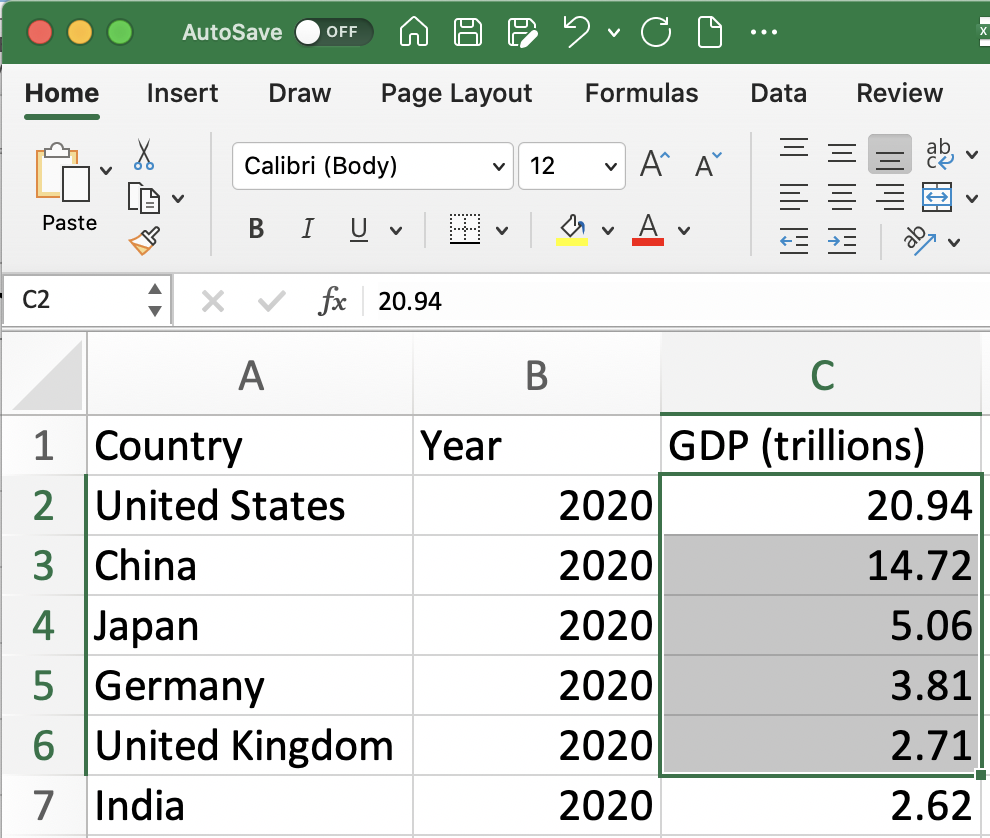

(\#fig:cells)Referencing a Range of Cells

Sometimes, it is helpful to reference an entire column. For example, later we will open an Excel spreadsheet that has thousands of students, which might make it difficult to reference the exact row at which the data ends. We can still very compactly take the average of this variable without referencing all the observations. For example, if the variable is in column C, we can type ``C:C`` to reference the entire column. 

Now that we understand how to reference cells, we can begin to apply functions. We will begin with the ``AVERAGE`` functions which can compute an average of a list of numbers. In our spreadsheet, we are interested in computing the average GDP across these ten countries. To do so, we can first click in an unpopulated cell (i.e. a cell without any values in it yet) and type:

\begin{center}
\colorbox{gray!20}{\texttt{=AVERAGE(C:C)}}
\end{center}

Note the ``=`` sign in the text above. This tells Excel to evaluate the function. If you omit the ``=`` you will find that the cell is just populated with the text ``AVERAGE(C:C)`` and not the average value of column C. 

Figure \@ref(fig:average1) depicts an example where we have set up a Summary Statistics table for this dataset. In cell F3, we have written the function that calculates the average GDP across these ten countries. 

  

(\#fig:average1)Computing Average GDP in 2020 (Before Pressing Enter)

As soon as we press enter, the function will be evaluated and the average will appear in cell F3 (see Figure \@ref(fig:average2)).

(\#fig:average2)Computing Average GDP in 2020 (After Pressing Enter)

The rest of the summary statistics are completely analogous, replacing ``AVERAGE`` with the relevant function. See Figure \@ref(fig:gdpsumstats) for the output of the rest of the Summary Statistics table.

(\#fig:gdpsumstats)Summary Statistics Table

::: {.rmdtip}

**Question: I try to take the AVERAGE of a column by specifying ``AVERAGE(C:C)``. Yet, when I press enter, Excel does not compute the average. What has gone wrong**

<label><input type="radio" autocomplete="off" name="radio_CPZNCTZTNH" value=""></input> AVERAGE is the wrong function to use</label><label><input type="radio" autocomplete="off" name="radio_CPZNCTZTNH" value=""></input> Column C must not be numeric</label><label><input type="radio" autocomplete="off" name="radio_CPZNCTZTNH" value="answer"></input> Need to specify equals sign ``=`` before the function</label>

:::

## Logical Functions

Another type of function in Excel is called a **logical function**. Before learning about **logical functions** we need to learn more about logical statements in general. A logical statement is a statement that is either true or false. For example, all of the following statements are either true or false. 

  - "The student passed the class" 
  
  - "The participant is in the treatment group" 
  
  - "The temperature is below freezing"
  
These statements are all either true or false. This type of binary logic is incredibly important in certain areas of mathematics as well as the development of computers. An entire branch of mathematics, termed **Boolean algebra**, deals with variables that take on binary values.

In Excel, we can type logical statements and Excel will evaluate whether the statement is True or False. The key is you need to type the statement in the correct format so that Excel understands what you are trying to ask. 

For example, in our dataset on GDP in 2020, a logical statement is: "GDP is greater than 10 trillion dollars." This is True for some countries and False for others. But how do we type the statement "GDP is greater than 10 trillion dollars" in Excel? 

Figure \@ref(fig:tf1) depicts how we would type this statement for the first observation in the dataset (the U.S.). To evaluate whether GDP is greater than 10 trillion for the U.S. we type ``=(C2>10)``. The equals sign tells Excel to evaluate the logical statement that follows. The logical statement that follows ``C2>10`` is simply asking whether the value in cell C2 (i.e. U.S.'s GDP) is greater than 10. 

(\#fig:tf1)Is GDP Greater than 10 in the U.S. Part 1

Once we press enter, we will get the result. In this case, we can see GDP in the U.S. is indeed greater than 10 trillion dollars. Therefore, when the function in cell D2 is evaluated it returns the answer ``TRUE``, as can be seen in Figure \@ref(fig:tf2).

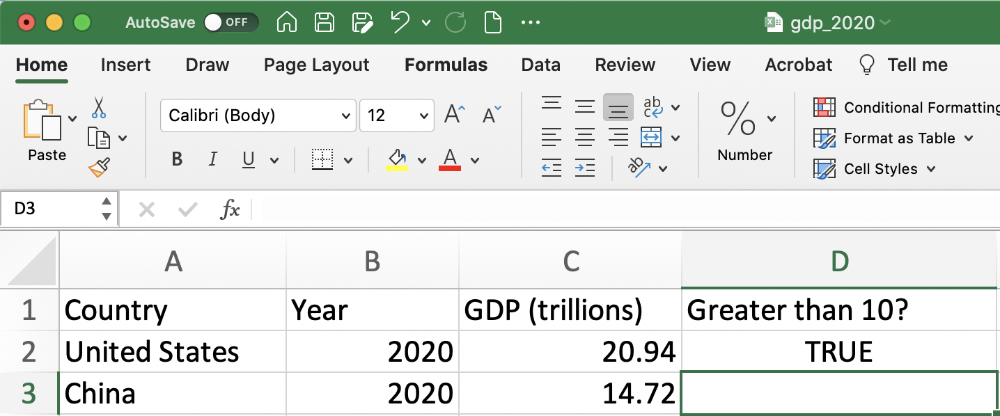

(\#fig:tf2)Is GDP Greater than 10 in the U.S. Part 2

Once we have filled in the formula for one cell, we can also apply it to the remaining observations. In our example, this would mean testing whether each country's GDP is more than 10, not just the U.S. There are a couple of ways to do this efficiently in Excel.

One way to fill in the formula is to click the bottom right corner of cell D2 and then drag down. This allows you to apply to as many observations as you would like. However, we often want to apply the logical statement to all observations. Therefore, continuously dragging will be inefficient if there are thousands of observations in the data. To quickly apply a formula to all cells in a column, we can simply double-click the bottom right corner of a cell. In our example, this would mean double-clicking the bottom right corner of the D2 cell.  

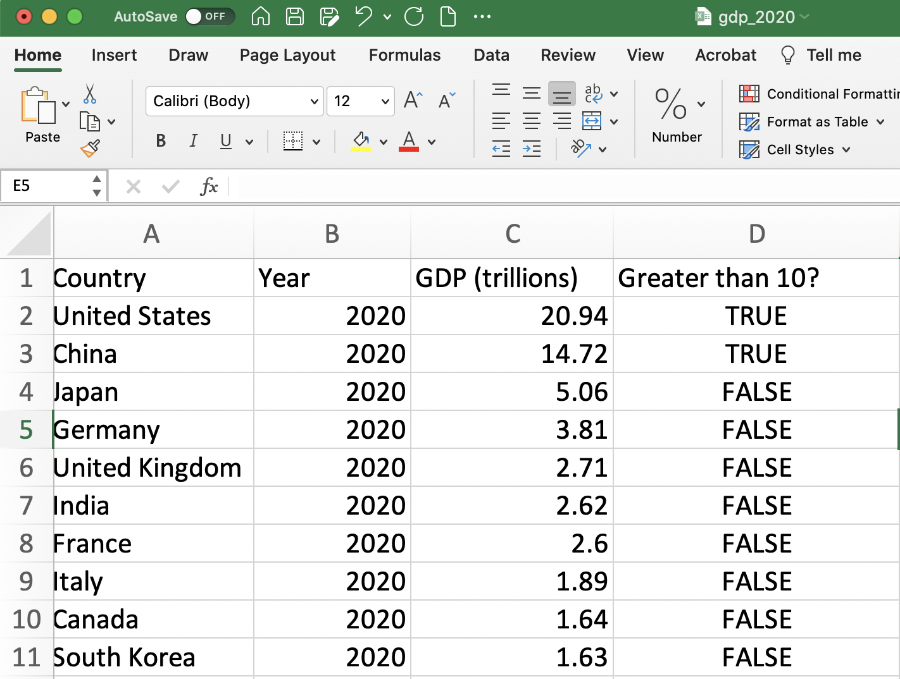

(\#fig:fill)Filling in the Formula

Oftentimes, instead of returning "TRUE" or "FALSE", it is convenient to have Excel return the value in another form. For example, a common way to represent "TRUE" is with the number 1 and "FALSE" with the number 0. To accomplish this in Excel we will use the ``IF`` function. 

The basic format for the ``IF`` function is: 

``=IF(logical test,value if TRUE, value if FALSE)``

For example, in our dataset, if we want to return the value of 1 if GDP is greater than 10 and 0 if otherwise, we can type:

``=IF(C2>10,1,0)``

(\#fig:ifex1)Using the IF function (Before Pressing Enter)

Once we press enter, the function is evaluated. To fill in the formula for the rest of the observations you can follow the same steps as above.

(\#fig:ifex2)Using the IF function (After Pressing Enter)

## Summary Statistics 

Now let's return to our data from Brownback and Sadoff (2020). Our goal is to create a table of basic summary statistics. However, a key variable in the Brownback and Sadoff (2020) experiment is whether a given student passed the test or not. In this setting, a score of 70 or higher indicates that the student passed the test. Therefore we need to create a new variable that is equal to 1 if the individual received a ``TestScore`` greater than or equal to 70 and zero otherwise. We will show later that storing this information as a 1 or zero will be particularly convenient for our analysis.  

To create this variable we need to take three steps:

- **First Step:** Title the column with the variable name "Passed" 

- **Second Step:** Use the ``IF`` function to fill in this variable for the first observation 
- **Third Step:** Double click the bottom right of the cell in step 2 to fill in the variable for all observations

Figure \@ref(fig:passed1) presents steps 1 and 2 in Excel.

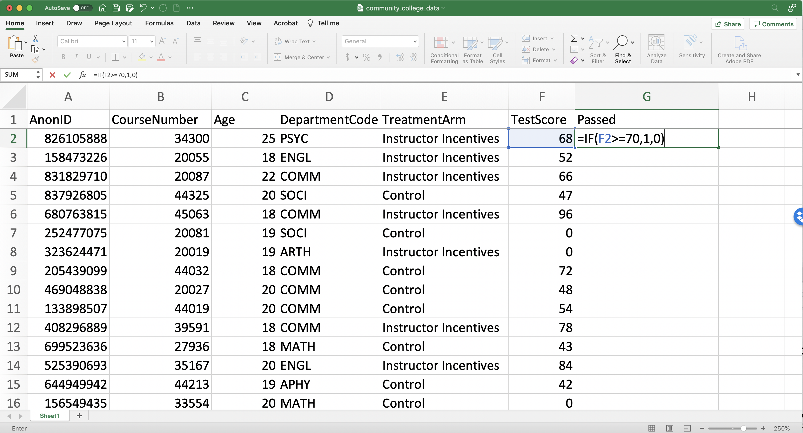

(\#fig:passed1)Generating a Passed Variable (Steps 1 and 2)

We simply can double-click the bottom right of G2 to fill in the rest of the observations (as seen in Figure \@ref(fig:passed2)).

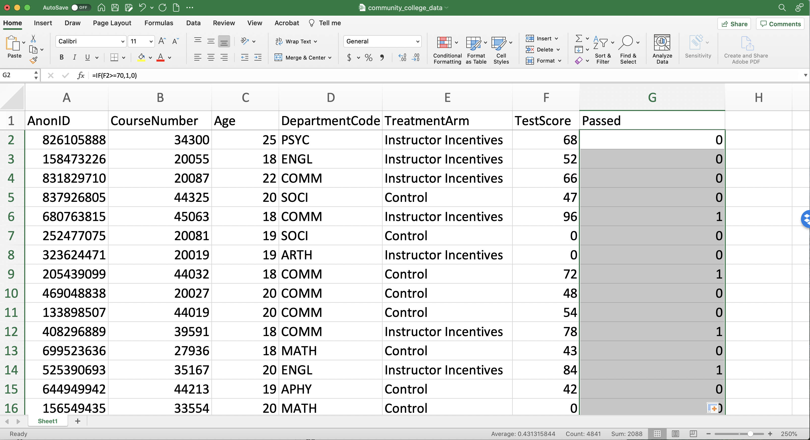

(\#fig:passed2)Generating a Passed Variable (Step 3)

Now that we've generated the variables we need let's fill in some summary statistics displayed on the right side of the datasheet in Figure \@ref(fig:sumstats1)

(\#fig:sumstats1)Blank Summary Statistics Table

To compute the average age in the dataset we just need to use the ``AVERAGE`` function and reference column C. 

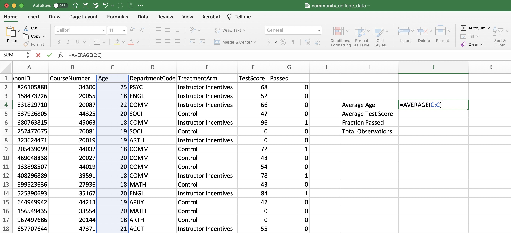

(\#fig:sumstats2)Average Age

Average test score is completely analogous to age, but we now reference column F.

(\#fig:sumstats3)Average Test Score

To compute the fraction that passed the test, we are first going to make a small digression, one that will clarify one reason it was convenient to store the variable Passed with a 1 if the individual passed and a zero otherwise. Because we have stored the variable in this way, we can simply take the average value of ``Passed`` and this will be equal to the fraction that passed the test. 

To see why this is true, let's first write out the equation for the average of a generic variable $X$: 

$$
  \bar{X} = \frac{X_1 + ... + X_N}{N} 
$$

Where $\bar{X}$ is the average, $N$ is the number of observations, $X_1$ is the first observation and $X_N$ is the $N^{th}$ observation. If $X$ is a binary variable that is equal to 1 or zero, then the average will be the fraction of individuals with a 1
$$
  \bar{X} = \frac{X_1 + ... + X_N}{N}=\frac{\text{Number of observations =1 }}{\text{Total Observations}} 
$$
Since our variable "Passed" is equal to 1 if passed and zero otherwise, the fraction who passed is the average of our "Passed" variable. Therefore, in Excel we simply need to compute the average of the G column

(\#fig:fracpassed)Computing the Fraction Passed

We will take a lot of averages of binary variables in this book. It will be beneficial down the road to convince yourself that the average of ``Passed`` is equal to the fraction that passed. If you are still confused about this concept, try to convince yourself in datatsets with only a few observations why this fact is true.

Finally, to finish our summary statistics table, we need to fill in the total number of observations. To do this, we can use the ``COUNT`` function, which will count the total number of numbers in a column. While Figure \@ref(fig:count) uses Column G to compute total observations, this could be replaced with any column that has non-missing numeric data. 

(\#fig:count)Computing Total Observations

## Pivot Tables {#S:pivottables}

So far, we have learned to retrieve summary statistics using functions. This works very well for retrieving summary statistics for the entire dataset. Sometimes however we want more complicated summary statistics. For example, in our empirical application, we might be interested in passing rates for different departments. While it is possible to retrieve these using functions, an easier way is through a **pivot table**. The name "pivot" comes from "pivoting" the data into a format that provides useful information. 

To understand what we are trying to accomplish with our pivot table, let's start by looking at our end goal in Figure \@ref(fig:pivotfinal). In the Pivot Table, each **row** is a separate department. Next to each department, we have the fraction of students who passed the standardized test in that department. The departments give different tests based on the material taught in the course, but a score of 70 or greater counts as a pass in all departments.  

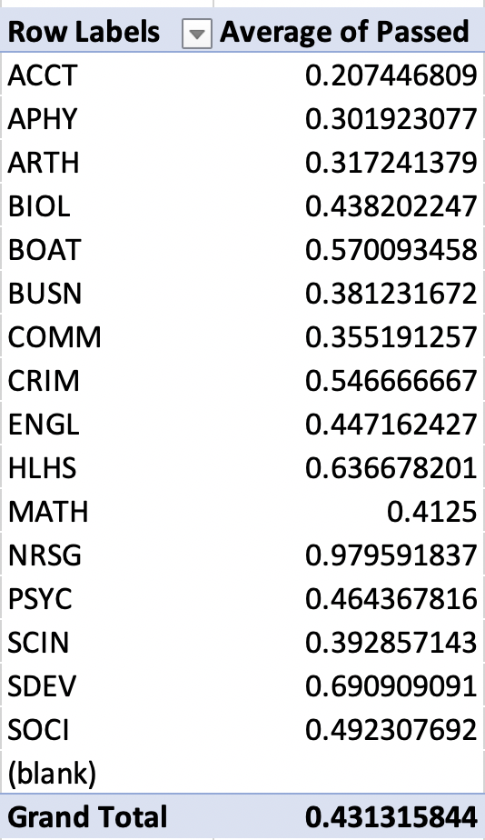

(\#fig:pivotfinal)Pivot Table: Pass Rates by Department

Now let's go through how to construct Figure \@ref(fig:pivotfinal). To insert a pivot table, go to the Insert tab and click "Insert Pivot Table", as seen in Figure \@ref(fig:pivot1)

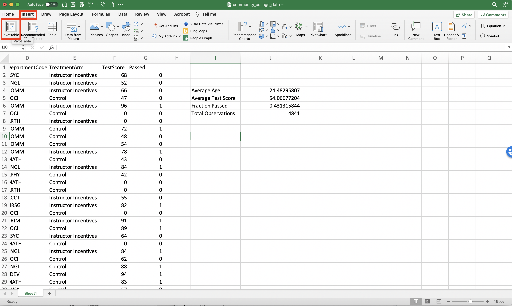

(\#fig:pivot1)Inserting a Pivot Table

Next, you need to select a table or range. You should select all of the variables that you want to be in your pivot table. In our case, we need to have both the department and whether an individual passed. To select a range, we can click on a column (for example D), hold down, and then drag to another column (for example G). Since we began at D and dragged to G, the variables ``DepartmentCode``, ``TreatmentArm``, ``TestScore``, and ``Passed`` will all be variables that we can include in the pivot table. 

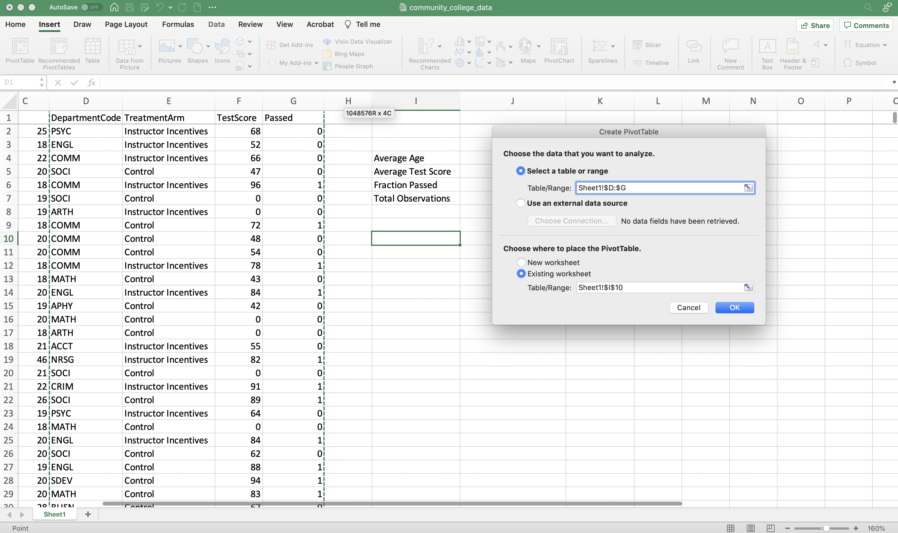

(\#fig:pivot3)Selecting a Range for the Pivot Table

You can also choose where you would like your pivot table to appear. By default, the table will be placed in whichever cell you clicked last (in my case this is cell ``I10``). Therefore, before you insert a pivot table, you should click the cell where you would like it to appear.

As can be seen in Figure \@ref(fig:pivot4), Excel has drawn a blank Pivot table. On the right, we can see the new panel "PivotTable Fields" which we will use to build our Pivot table.

(\#fig:pivot4)A Blank Pivot Table

We want each row in our pivot table to be a Department Code. So click the box next to ``DepartmentCode`` to put it into the pivot table.

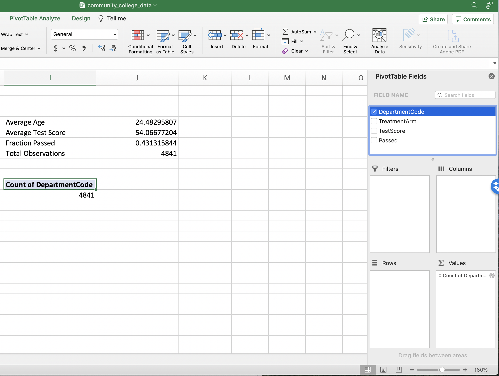

(\#fig:pivot5)Adding DepartmentCode to the Pivot Table

By default (see Figure \@ref(fig:pivot5)), Excel has placed this variable into the Values panel, but we want it to be in the Rows panel. We can move variables between these windows by clicking and dragging. In this example, we want to move ``DepartmentCode`` to the Rows panel.

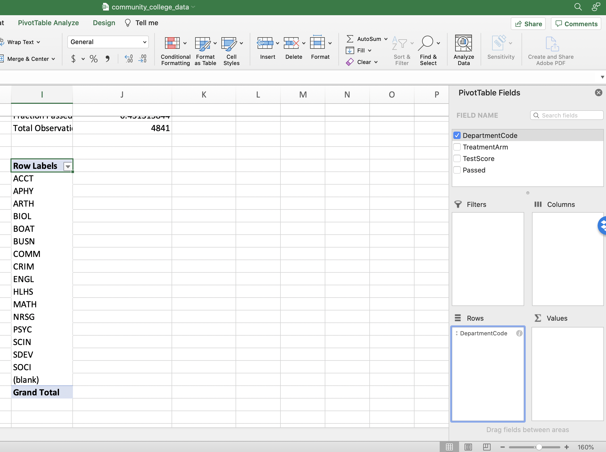

(\#fig:pivot6)Adding DepartmentCode to the Pivot Table

In the Values panel, we want pass rates. We will compute these pass rates from the variable "Passed" 

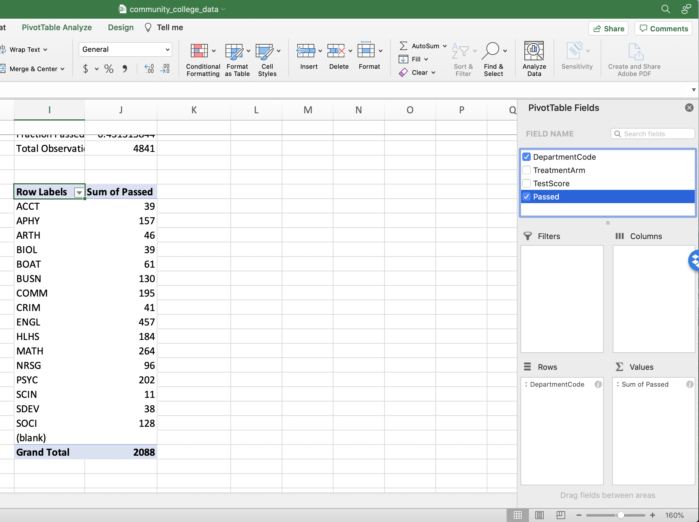

(\#fig:pivot7)Adding Passed to the Pivot Table

By default Excel is displaying the "SUM" by department (i.e. number of individuals that passed, not the fraction that passed). To change the displayed statistic click the "i" next to the "Values" label and then select "Average".

(\#fig:pivot8)Average Pass Rates

Now we've reached our goal! If you've followed these steps, the next table you see should be identical to Figure \@ref(fig:pivotfinal). If you found this discussion difficult to follow, I urge you to play around with pivot tables. Move variables to different panels to see how the table will change.

## Balance Tables

The key aspect of a randomized control trial that allows us to infer causality is randomization. If randomization is successful, then individuals selected for the treatment should be similar (on average) to those selected for the control. Therefore, a key component of any analysis of experimental data is to show that the treatment and control are similar based on observable characteristics.

To understand how a balance test might fail, let's imagine researchers are testing whether a given drug reduces cholesterol. The experimenters receive a list of 200 participants for the trial and decide the first 100 names on the list will receive the treatment and the second 100 will receive the placebo. What they fail to realize is that the list of applicants is sorted from youngest to oldest. Therefore, only the youngest participants receive the treatment. But younger applicants, on average, probably have lower cholesterol to begin with, so differences between treatment and control may be due to age, not due to the treatment. 

If we perform a balance test (i.e. calculate average age by treatment and control) we would immediately detect our error. Now, no "real" experiment would ever be run in such a way. To do so would be ignoring standard protocol for well-run experiments! Still, it is important to understand whether there are differences between treated and control units before proceeding with the main analysis. Finding persistent differences with respect to observables could be evidence that randomization somehow failed. In our empirical application, we have information on the age of the student, so let's see if age varies between the treatment and control.

We want to retrieve the average age by Treatment Arm. To do so we can use a pivot table! The **Rows** will be the Treatment Arm, while the **Values** will be age. We can follow the exact same steps as in Section \@ref(S:pivottables) to build the balance table displayed in Figure \@ref(fig:balance)

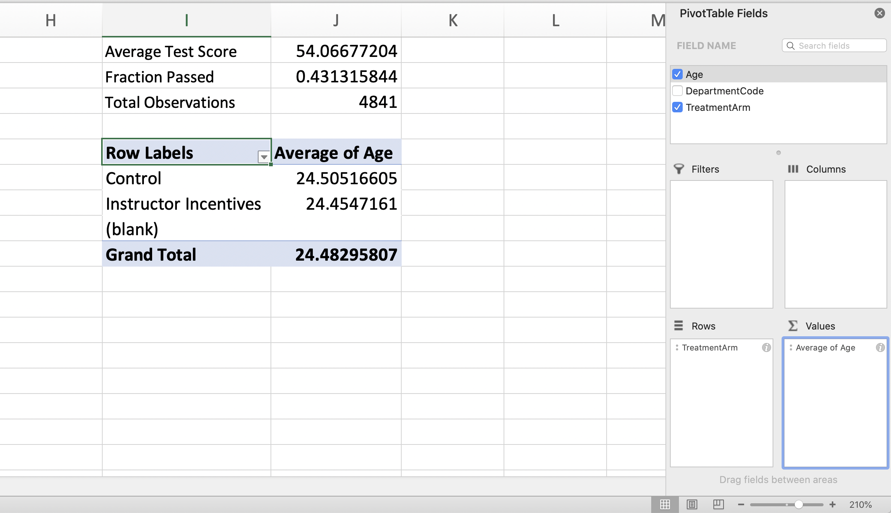

(\#fig:balance)Average Age by Treatment Group

As can be seen in Figure \@ref(fig:balance), the average age in the treatment group (i.e. the Instructor Incentives group) and the control group is roughly the same, at 24.5 years of age. While we are keeping this illustrative example simple, generally papers will show a balance table for many observables. While there may occasionally be differences between certain characteristics, on average, the two groups will tend to be similar if randomization was implemented successfully. 

## Impact of Financial Incentives {#S:impact}

Now that we have checked that randomization was successful, let's estimate our first result. As a reminder, we are studying whether offering financial incentives to instructors (a 50-dollar bonus for a student passing a test) improves the performance of the students. Given only 40 percent of community college students earn a college degree within 6 years (Shapiro et al. 2017), it is important to consider tools to improve performance.

We want to compute the average pass rate for individuals in the treatment vs. individuals in the control. We can again use a pivot table to accomplish this! Our **Rows** will be ``TreatmentArm`` and the **Values** will be ``Passed``. Again, we can follow the steps in Section \@ref(S:pivottables) to construct this table. The pivot table is displayed in Figure \@ref(fig:firstresult).

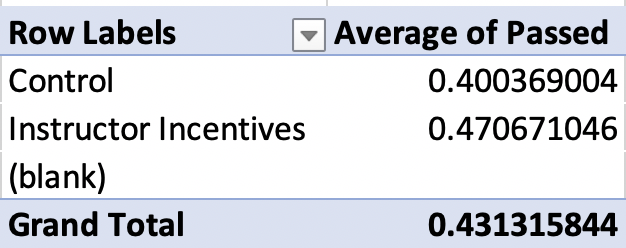

(\#fig:firstresult)Impact of Financial Incentives on Pass Rates

Giving instructors incentives increases pass rates by 7 percentage points. That is a big impact! Before exploring this result further, now is a good time to discuss how we accurately discuss this result. One common mistake (for both students and journalists) is to mix up the terms percentage point and percent. 

In our example, 40 percent of control students pass the test, while 47 percent of treated students pass the test. Therefore, treatment increased pass rates by 7 **percentage points**. We use the term percentage points when we are comparing two percents or two rates. **The terms percentage point and percent are not interchangeable**. 

How would we accurately use the term percent here to compare 40 and 47 percent? To calculate the percent increase in pass rates for the treatment relative to the control we can compute:

$$
\frac{\text{Pass Rate Treatment}-\text{Pass Rate Control}}{\text{Pass Rate Control}}= \frac{0.471-0.400}{0.400}=0.1775
$$

So the treatment pass rate is 17.75 percent higher relative to the control. This mistake can be misleading! For example, let's imagine the probability of dying during a given procedure is 2 percent. However, a doctor tries a new surgical technique and finds the probability of dying under the alternative procedure is 1 percent. 

This is a 1 percentage point decrease in the probability of dying during the procedure. However, it is a 50 percent decrease in the probability of dying during the procedure. Now, if a journalist wrote an article and incorrectly stated that the new procedure decreases death rates by 1 percent, then it sounds as if the new technique is not that much better than the old technique. However, that is the wrong conclusion. The correct conclusion is that a 1 percentage point decrease in the probability of dying implies a 50 percent reduction in the probability of dying, a huge advance!

So let's take stock of what we have learned. Providing financial incentives to community college instructors seems to increase pass rates on average. This is an important finding. Prior work on "pay-for-performance" in the United States has shown limited effectiveness in K-12 schools (See Neal (2011)). But this is the first study to show financial incentives can be an effective tool in the Community College setting. This is an important general lesson:  the context of the treatment matters. Just because a treatment is effective in one setting doesn't mean it will be effective in another (or vice-versa).

Next, let's talk about what else we can learn from this experiment. Well, this study was done across many different subjects. Maybe the effect of financial incentives differs depending on the department. It may be easier to get students over the pass threshold in some disciplines, making the incentives potentially more effective.

To explore this question we can adjust our pivot table a bit. We will proceed in two steps:
  
  - First: Move "TreatmentArm" to Column Panel
  
  - Second: Move "DepartmentCode" to Row
  
If you have successfully moved the variables around, your PivotTable Fields should look like \@ref(fig:pivotfield).
  

(\#fig:pivotfield)Pivot Fields

Figure \@ref(fig:hetresults) displays the results.

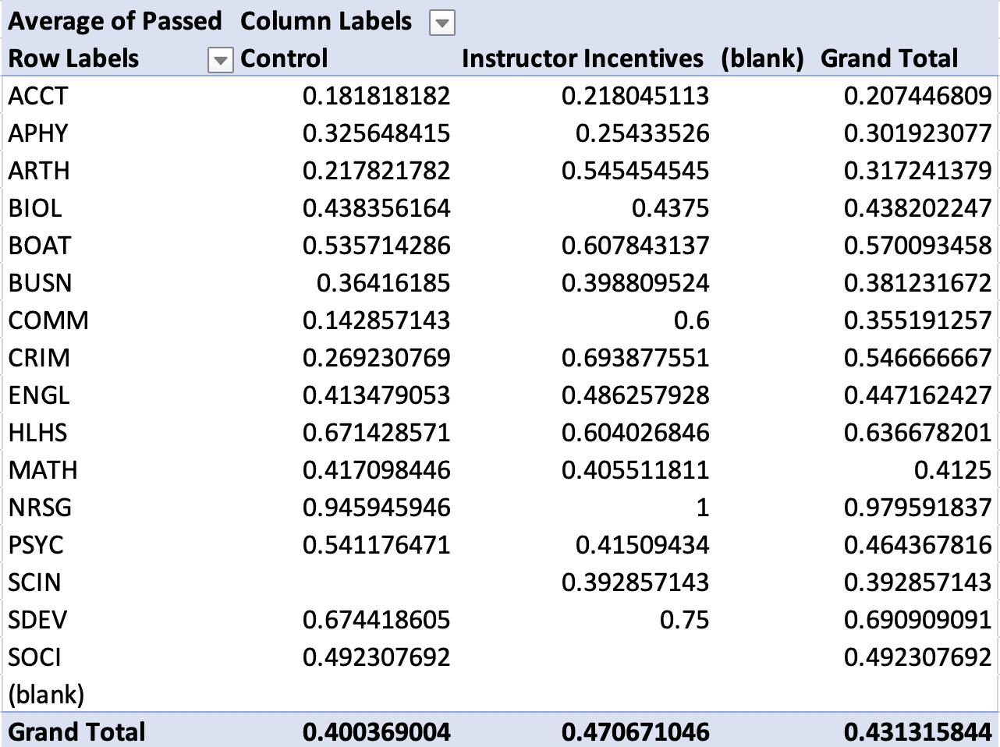

(\#fig:hetresults)Pivot Table Showing Pass Rates by Treatment and Control Across Departments

In some departments, the instructor incentives were incredibly effective. For example, in the communications department (``COMM``), the instructor incentives led to a dramatic increase in pass rates. In the control group, the pass rates were only 14 percent, while they were 60 percent in the treatment group. This is a 46 percentage point increase in pass rates, or equivalently, a 329 percent increase in pass rates in the treatment relative to the control

In other departments, however, the instructor incentives don't seem particularly effective. For example, in the math department (``MATH``), pass rates were similar in both the treatment group (41 percent) and the control group (42 percent). Therefore, it does not seem as if these incentives impact all departments in the same way. 

It is often useful to explore heterogeneity in this way. Through this analysis, we learned financial incentives are not necessarily a "one-size fits all" solution.  Some departments can increase pass rates considerably, while others show modest or even zero/negative impact. If we want to apply these results to other settings we will need to think about how the other setting is similar or different to ours.

## Pivot Charts (Basic) {#S:pivotbasic}

In this section, we will learn about something closely related to pivot tables: a pivot chart. Pivot charts and pivot tables contain the same information, but often charts/figures are more effective in presenting information. In popular press articles, it's common to see a nicely designed figure to grab readers' attention. 

Let's walk through how to make a pivot chart in Excel. To insert a pivot chart, go to the Insert tab and click the Pivot Chart icon

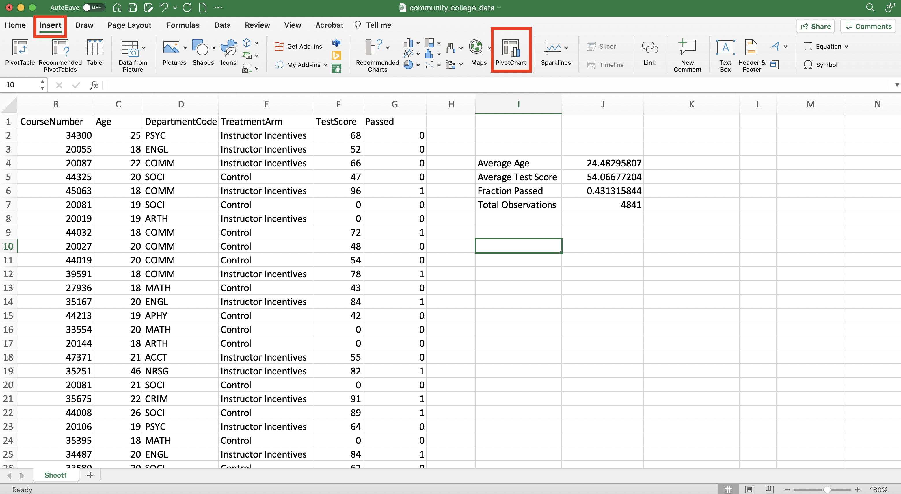

(\#fig:pivotchart1)Inserting a Pivot Chart

The pivot chart fields are similar to the pivot table fields. We can choose different combinations to create different figures

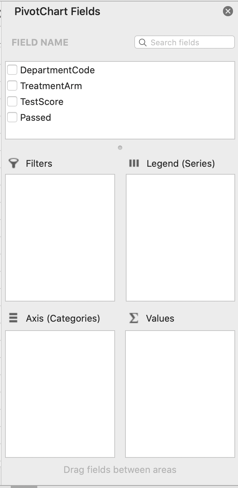

(\#fig:pivotchart2)Pivot Chart Fields

Our goal now is to create a pivot chart that presents the first main result. In other words, a chart that shows average pass rates by ``TreatmentArm``. Therefore, in the pivot chart fields we will put ``TreatmentArm`` on the Axis and ``Average of Passed`` as the Values. 

(\#fig:pivotchart3)Pivot Chart Fields

You can see a pivot table has also been created in Figure \@ref(fig:pivotchart3). The pivot table and chart are linked (i.e. changes made to the pivot table will be reflected in the chart). 

The "(blank)" on the horizontal axis serves no purpose. We can rid of it by altering the pivot table. To do so we can click the arrow on the bottom right of the cell that reads "Row Labels"

(\#fig:pivotchart4)Filtering Out Blank

Next, a window will pop up. We can deselect "(blank)" to remove it from the Pivot Table

(\#fig:pivotchart5)Filtering Out Blank

Blank has now been removed from both the Pivot Table and the Pivot Chart. While our current figure technically has all the relevant information to understand the impact of financial incentives on student performance, it leaves a lot to be desired. We need a reader to understand the information clearly, but right now we are missing proper titles and labels. This is something that will come up many times throughout the course. To convey our data analysis effectively, we need to ensure that figures and tables are properly titled and labeled. One "trick" is to pretend you have never seen the table or figure you have created. Would you be able to understand the information? If not, what is missing?

To edit the title, we can just click in the "Total" box at the top and edit. Make sure to always give descriptive titles with proper capitalization

(\#fig:pivotchart8)Adding a Title

We also need to add horizontal and vertical axes titles. To insert these go to "Design", click "Insert Chart Element", and select one of the Axes Titles to add in a text box that we can edit

(\#fig:pivotchart9)Adding Axes Titles

Once we have added in proper axes titles, there is just one last thing to do. Our figure has a legend on the right, but it is neither descriptive nor necessary in this particular figure. Legends are important when you are trying to differentiate between the bars in a bar chart. For our figure, we can already discern this from the horizontal axes labels. Therefore, we can simply click on the legend and press backspace to delete it. Finally, we have our ultimate figure that shows average pass rates by ``TreatmentArm``

(\#fig:pivotchart11)Average Pass Rates by Treatment Arm

## Pivot Charts (Advanced) {#S:pivotadvanced}

Next, we are going to use pivot charts to display the heterogeneity in treatment effects across different departments. Our pivot chart currently displays the average of ``Passed`` by ``TreatmentArm``. We want to present the average of ``Passed`` by ``TreatmentArm`` separately for every value of ``DepartmentCode``. 

Therefore, we need to place ``DepartmentCode`` somewhere in our Pivot Chart Fields. But where? Legend(Series) seems like a potentially good choice. Whatever variable you put into Legend(Series), Excel will create a plot similar to the current plot, but with separate bars for every value of the variable in Legend(Series). In our case, separate bar charts for every value of ``DepartmentCode``

Figure \@ref(fig:advpivot2) displays the results if we drag ``DepartmentCode`` to Legend(Series).

(\#fig:advpivot2)Average Pass Rates by Treatment Arm and Department

Here would be a good time to check whether this figure is interpretable for someone who did not create it. Right now, it is unclear what the different bars represent. There is no legend that shows which color bar is associated with which department.

To insert a Legend, go to "Design", press "Add Chart Element" and navigate to "Legend"

(\#fig:advpivot3)Average Pass Rates by Treatment Arm and Department

 
Figure \@ref(fig:advpivot3) displays the resulting figure. This is the resulting figure. 

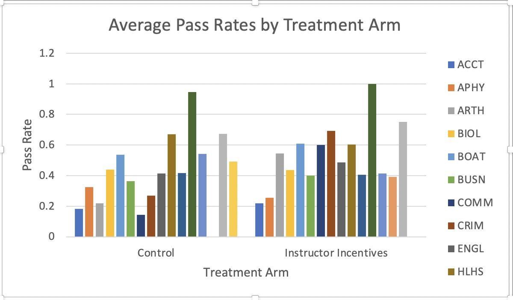

(\#fig:advpivot4)Average Pass Rates by Treatment Arm and Department

This has all the elements of a good figure, but is it possible to improve it in any way? Let's think about our goal for this analysis. What do we want a reader to take away from this figure? Ideally, the reader should be able to look at different departments and see how the treatment effect varies by department. This is possible, but it takes a bit of work. For example, The "Control" bar for the ACCT department is pretty far away from the "Instructor Incentives" bar for the ACCT department. It would be much easier to quickly understand the treatment effect if the two bars were adjacent.

To make the bars adjacent, we can switch "DepartmentCode" to the horizontal Axis, and put "TreatmentArm" in the Legend(Series). In other words, the Pivot Chart fields should look like the fields below 

(\#fig:advpivot5)Pivot Chart Fields

To complete the figure we just need to give it a more descriptive title and correct the horizontal axis label, which is no longer Treatment Arm. Figure \@ref(fig:advpivot7) displays our final product.

(\#fig:advpivot7)Average Pass Rates by Treatment Arm and Department

Now it is easy for a reader to discern the treatment effect for every department. The general lesson here is to think hard about how your information displayed. Just because all of the information is there, doesn't mean it is necessarily easily digestible.

## Conclusion {#S:Conclusion}

In this module, we studied whether instructor incentives are effective in improving student performance. Using experimental data from Brownback and Sadoff (2020), we found that instructors who receive financial bonuses for each student who passes a course lead to significant increases in passing rates. However, the effects varied dramatically by department, with some departments showing enormous effects and others negligible effects. This is only part of the analysis in Brownback and Sadoff (2020). In this concluding section, let's talk about a few other results from their work.

So far, we have found performance increases in the course that is incentivized by financial incentives. But is there a cost to this increase in performance? For example, maybe instructors respond to the incentives by increasing the workload in their course. This may improve students' performance in the course, but it may come at the cost of neglecting other courses. Therefore, it could be that the treatment does not actually increase performance overall, but simply forces students to spend more time in one class relative to another.

However, Brownback and Sadoff (2020) collect grades for all courses a student is enrolled in, not just the courses in the experiment. In contrast to the hypothesis above, the authors find student outcomes in the treatment improve **in all courses**. This suggests positive spillovers of the treatment. Improved performance in one course leads to improved performance in others. If students feel overwhelmed by poor grades in one course they may "give up" on the rest of their courses. Therefore, a treatment that increases performance in a single course has the scope to increase performance in all courses. 

This analysis shows evidence of positive effects, but only in the short term. Our real goal is to improve graduate rates. Again, the richness of the data in Brownback and Sadoff (2020) will come in handy here. The authors find that students in the treatment are about 2.8 percentage points more likely to transfer to a 4-year university than control students. This represents a 28 percent increase in the probability of transferring. Overall, this suggests financial incentives to instructors may be a particularly cost-effective way for community colleges to achieve a number of important goals 

We have focused on financial incentives for instructors, but maybe providing bonuses for students is even more effective. During the experiment, the authors offered free tuition for one summer course (face value of \$400) if they passed the test. Interestingly, the authors find this intervention had no impact on student performance

To conclude, this paper asks an important question: how can we improve student performance in community colleges? In particular, are financial incentives for instructors effective? Before this paper, we had no clear answer to this question. Prior work focused on other settings and found differing results. By running a carefully designed experiment, the authors can convincingly answer this question. Financial incentives cannot only increase short-run performance but also increase long-term outcomes, such as overall course completion and transfer rates to 4-year universities.

