# (PART) Stata {-}


# Intergenerational Mobility 

## Opportunity Insights


<html>
<head>
<style>
code {
  background-color: #f1f1f1;
}
</style>
</head>
<body>

In this section, we will be discussing the relationship between **intergenerational mobility** and the higher education system in the United Stata. Before we start exploring this relationship, we first need to understand the concept of intergenerational mobility. This concept asks a simple question: if you are born from low-income parents, what is the chance you move up the income distribution?

Generally, we think of societies with high rates of intergenerational mobility as more equal. If a society has high rates of intergenerational mobility, then that means individuals from low-income backgrounds have opportunities to move up the income distribution. One common path to upward mobility is the higher education system. 

However, there are a few reasons why the higher education system may or may not lead to higher rates of intergenerational mobility. First, some colleges may not be particularly effective in increasing incomes. For example, for-profit colleges are often criticized as costly and low quality (see [NYT Article](https://www.nytimes.com/2020/06/17/business/coronavirus-for-profit-colleges.html)). If a college accepts a large fraction of students from low-income backgrounds, it may still not promote intergenerational mobility if its students don't actually benefit from attending. Second, individuals from lower-income backgrounds may have lower access to the higher education system. Rising cost of college may be making this worse over time. 

So how do we go about studying this question? We are going to use a dataset made publicly available by the researchers at **Opportunity Insights**. This data has made a big splash, both in academia and in policy circles. Figure \@ref(fig:oi) shows a headline from an Upshot article about the dataset. In this article, the authors discuss how this dataset has led us to new insights about how access varies dramatically at some schools. The headline reads, "Some Colleges Have More Students From the Top 1 Percent Than the Bottom 60. Find Yours". If a school has more students from the top 1 percent than the bottom 60, then it probably does not promote intergenerational mobility. Most of the students are already from relatively well-off backgrounds. This is our first hint that colleges may vary dramatically in the extent that they promote intergenerational mobility.

<div class="figure" style="text-align: center">
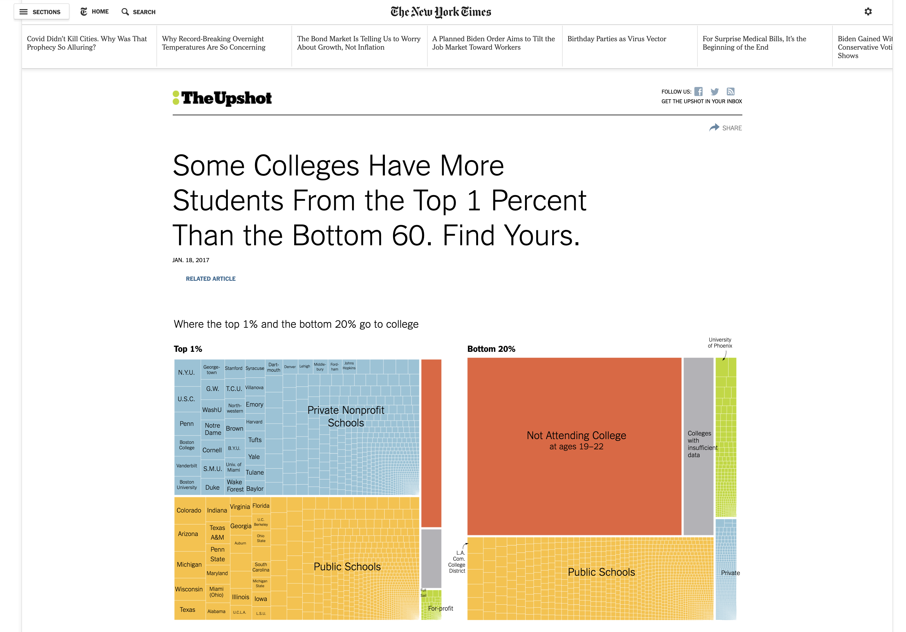
<p class="caption">(\#fig:oi)New York Times Graphic on Opportunity Insights</p>
</div>

Let's get a little bit more into the details on what data we will be using in this empirical application. The original data comes from federal income tax returns that have been linked to the tax records of universities and data from Pell grants. The result is a dataset with (1) children linked to their parents (children are reported as dependents) (2) income data for both children and parents and (3) children linked to the universities they attended. 

This will give us everything we need to know to understand how a given college promotes intergenerational mobility. It will allow us to know both the know both the background of students attending a given college as well as their eventual earnings. It is important to emphasize that this was a huge data task that gives us a new way to study an important question.  

We have discussed at a high level the concept of intergenerational mobility. But when we turn to the data, we will need to compute a metric of intergenerational mobility that allows us to compare across colleges. Before introducing this measure, we will introduce a statistical concept that will be important throughout the course, and in particular, in understanding our measure of intergenerational mobility: **quantiles**.

## Quantiles

To begin our discussion of quantiles, let's imagine we have a small dataset of only 10 individuals. Each individual reports an income (in the thousands) and we sort the ten individuals based on their income.

$$			
\{5,6,20,29,38,42,55,62,80,88\} \nonumber
$$

We can break up the data into equal-sized groups based on income. Each equal sized group is a **quantile**. For example, imagine we break the 10 individuals into 5 groups (or 5 quantiles).

$$
			\{\underbrace{5,6}_{Q1},\underbrace{20,29}_{Q2},\underbrace{38,42}_{Q3},\underbrace{55,62}_{Q4},\underbrace{80,88}_{Q5}\} \nonumber
$$
		
When we break up the observations into 5 equal-sized groups, this is referred to as breaking the data into **quintiles**. Q1 is referred to as the first quintile (or lowest quintile). Q5 is referred to as the fifth quintile (or highest quintile). Quintiles will be important for us because we will use them to define intergenerational mobility. In particular, we have conceptualized intergenerational mobility as the movement from a low-income background to high income. But low income and high income do not have any exact definition. The researchers at Opportunity insights use quintiles to define these terms. 

In particular, an individual is defined as coming from low-income parents if the individual's parents are in the bottom quintile (Q1) of the income distribution. The bottom quintile implies the parents are in the bottom 20 percent of the income distribution. An individual is defined as high income individual is in the top quintile (Q5) of the income distribution, or equivalently, the top 20 percent of the income distribution.

Quintiles are just one way to break up the data. If we break the data into four equal-sized groups, then we have broken the data into quartiles. If we break the data into a hundred equal-sized groups, we have broken the data into percentiles. In general, if we break the data into $q$ groups, we have created $q$ quantiles

Certain percentiles are often reported as descriptive statistics. For example, the median (50$^{th}$ percentile) is often reported as a summary statistic. In 2019, according to the U.S. Census, the median household income was \$68,703. This implies 50 percent of households had income less than \$68,703, while 50 percent had income more than \$68,703.


::: {.rmdtip}

**Question: If an individual is at the 33 percentile of earnings, then this individual has...**


<div class='webex-radiogroup' id='radio_PSCLQUKZNF'><label><input type="radio" autocomplete="off" name="radio_PSCLQUKZNF" value=""></input> <span>Lower earnings than 33 percent of individuals</span></label><label><input type="radio" autocomplete="off" name="radio_PSCLQUKZNF" value="answer"></input> <span>Lower earnings than 67 percent of individuals </span></label><label><input type="radio" autocomplete="off" name="radio_PSCLQUKZNF" value=""></input> <span>Higher earnings than 67 Percent of individuals</span></label></div>


:::

## Mobility Definition

Now that we understand quantiles, we will define a college's intergenerational mobility rate. Intuitively, a college will promote intergenerational mobility if it (1) admits students from low-income backgrounds and (2) these students become high earners later in life. Again, we have  defined low income as the bottom quintile of earnings, while high income is the top quintile of earnings. We will define the **mobility rate** as the fraction of low-income students, multiplied by the probability these low-income students go on to become high earners:

::: {.rmdnote}
$$
\text{mobility rate}= \underbrace{\text{(frac. of students from Q1)}}_{\text{Acess}} \; \cdot \; \underbrace{\text{(frac. of Q1 that reach Q5)}}_{\text{Success}} \nonumber
$$
:::

Let's talk about each of these terms independently. "Access" depends on the fraction of students enrolled in a school that come from low-income backgrounds, or Q1. There is potential for schools with high access to have large impacts on intergenerational mobility. But this might not necessarily be true. For example, some work has found while for profit colleges tend to admit disadvantaged individuals, the outcomes for these individuals tend to be poor (see Deming, Goldin and Katz 2013).[@deming2013profit] Therefore, even though the Access rate might be high, these schools will not tend to promote intergenerational mobility. The reason is due to the second term: Success. This measures the fraction of students from low-income backgrounds that reach the top quintile of earnings. 

Intuitively, we can interpret the mobility rate as the fraction of students that are from low-income backgrounds that reach high income at a school. For example, if 10 percent of a school's enrollment comes from a low-income background, and half of these students end up in the top quintile of earnings, then that means 5 percent (overall) of the student body came from low-income backgrounds and achieved high income. This number is equal to the school's mobility rate..

But now let's get into the specifics of the data. How do we (exactly) determine if a students comes from a low-income background? Here are the steps:

- 1. Take all parents that have a child in the same year (e.g. 1985)

- 2. Compute average income for these parents when children are 15-19 (i.e. from 2000-2004)

- 3. If parents' income is in bottom 20 percent over this period (i.e. in Q1), then classify students as coming from low-income background

Now that we have low-income background, how (exactly) do we determine if a student becomes a high earner? 

- 1. Take all individuals that are the same age and calculate earnings in 2014

- 2. If individual's income is in the top 20 percent relative to individuals the same age (i.e. in Q5), then classify student as a high earner
    
A general lesson here is to understand the details before you proceed with the analysis. In this example, low income and high income have very specific definitions. We need to understand our variables and how they are measured before we can dive into our analysis.     

::: {.rmdtip}

**Question: Imagine 10 percent of College A's students come from low-income backgrounds, and 20 percent of these individuals go on to become high earners. In contrast, 5 percent of College B's students com from low-income backgrounds and 50 percent of these individuals go on to become high earners. Which college has the higher mobility rate?**


<div class='webex-radiogroup' id='radio_RHROQBDZIW'><label><input type="radio" autocomplete="off" name="radio_RHROQBDZIW" value=""></input> <span>College A</span></label><label><input type="radio" autocomplete="off" name="radio_RHROQBDZIW" value="answer"></input> <span>College B</span></label><label><input type="radio" autocomplete="off" name="radio_RHROQBDZIW" value=""></input> <span>They have the same</span></label><label><input type="radio" autocomplete="off" name="radio_RHROQBDZIW" value=""></input> <span>Not possible to tell</span></label></div>


:::
## Stata GUI

Before digging into the Opportunity Insights dataset, we first need to learn how to use Stata. Every time you launch Stata, you will be greeted by the Graphical User Interface (GUI) you see in Figure \@ref(fig:gui)

<div class="figure" style="text-align: center">
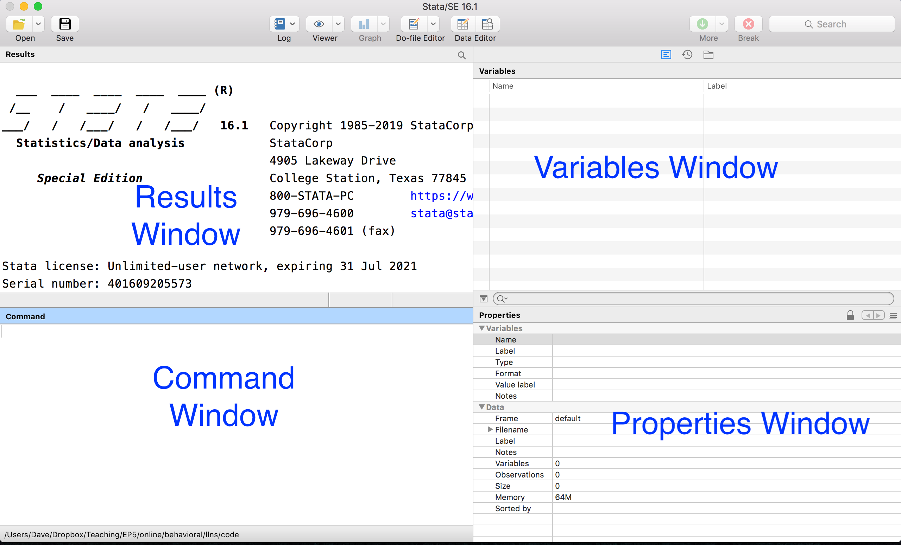
<p class="caption">(\#fig:gui)Stata Graphical User Interface</p>
</div>

There are 4 main panels here. Let's start in the bottom left: the Command window. This is where you can type code. When you press enter, the code will executed. When we learn how to. When we learn how to use Stata as a calculator, this is where we will type the code

When we execute code, any resulting output will be displayed in the Results window. When we learn how to use Stata as a calculator, this is where the results will be displayed.  

When we load data, the name of the variables in the dataset will appear in the first column. Many times, datasets come with labels that give us more description about the variable. For example, in the figure below there is one variable named ``income`` with the label ``Total Annual Income``. 

<div class="figure" style="text-align: center">
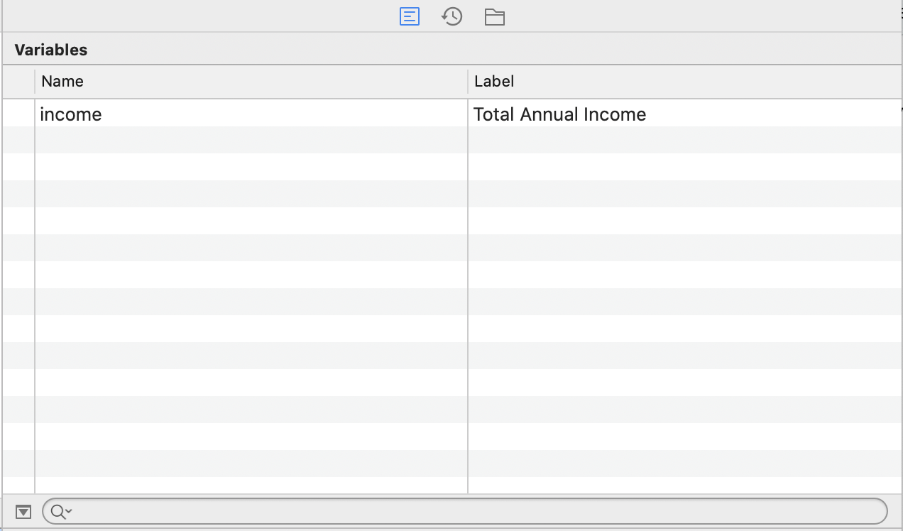
<p class="caption">(\#fig:main)Variables Window Example</p>
</div>

The Properties window gives us more information about the variables and data loaded in memory. For example, in addition to the name and label of a variable, the type (i.e. numeric or string) and format of the variable (i.e. how the variable will be displayed). Additionally there is information about the size of the data (number of variables, observations, etc.)


Now that we have learned about the various windows, we are going to execute our first line of code. In particular, we are going to use Stata as a calculater by typing ``display`` followed by a mathematical expression. 

For example, to compute ``2+2`` type

```stata
display 2+2
4
```

The result will be visible in the Results window. ``display`` is called a command in Stata. Stata comes with many commands that will be useful to explore and analyze our data. Whenever you learn a new command in Stata it is helpful to look at the help file that comes along with this file. To access the help file for the display command type ``help display`` into the command window. This will open up a file that has instructions on how to use the given command

The first thing you will generally see in any help file is the syntax of the command. Syntax refers to the format of the code. It is similar to the "grammar" of the software language. If you use incorrect grammar in language, you may not be expressing the right meaning. Similarly, if you use the wrong syntax in software language, you may not get the correct output, and more than likely, an error will be reported

Figure \@ref(fig:helpdisplay) shows the Syntax from the help file for the display command.

<div class="figure" style="text-align: center">
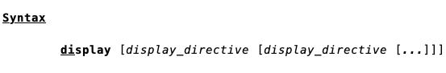
<p class="caption">(\#fig:helpdisplay)Variables Window Example</p>
</div>

The fact that ``di`` is underlined means to use the display command you only need to type ``di`` as a shortcut. Many commands in Stata have shortcuts associated with them. To figure out those shortcuts, you just need to open the help file. We will fill in the ``[display_directive]`` in a couple of ways 

We can use Stata to perform calculations just like you would in a calculator. For example, for subtraction, type:


```stata
di 6-4
2
```

For multiplication type:


```stata
di 2*4
8
```

For division type:


```stata
di 12/2
6
```

We can also use ``display`` to print text. This can be very helpful when writing programs. For example, if something goes wrong in a program, you, might want to display an error code. To display the words in Stata, you just need to put the words you would like to display in quotation marks. For example, to display "Hello World" type: 


```stata
display "Hello World"
Hello World
```

Words are referred to as strings in Stata (later we will have string variables and numeric variables). When you reference a string, need to put in quotation marks. For example, if we were to type ``display Hello World`` into Stata, we would get the error depicted in Figure \@ref(fig:helloerror).

<div class="figure" style="text-align: center">
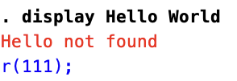
<p class="caption">(\#fig:helloerror)Forgetting Quotation Marks When Referencing Strings</p>
</div>

``Hello`` was not found because Stata looked for a command or variable named ``Hello``, but could not find one, and therefore reported an error. The command did not realize it was just meant to display text, because the text was not in quotation marks.

## Do-files

So far, we have discussed how to execute code by typing it into the command window. In practice, we will seldom use the command window to execute code. Instead, we will use a **do-file**.

To understand the importance of a do-file, let's imagine you have a project that has a large number of steps. Maybe you need to clean the data (usually a necessity) and then run a large number of results. A single project could end up being thousands of lines of code. What would it entail to complete this project if you were to use the command line? 

You would need to type in the lines of code one at a time. But what if you make a mistake at the beginning of your project. For example, you accidently deleted some observations relevant to your analysis. This is a disaster! You now need to remember what you did, type all of the code again, and then execute it. 

A better way to approach any project is to use a do-file. A do-file allows you to run multiple lines of code sequentially. You can save your progress periodically, just as you save your progress when writing a paper in a text editing program like Microsoft Word. Then, if you realize you made a mistake early in the project, you can just alter that one line of code and then re-run the entire project.

To begin, we need to learn how to open a do-file. At the top of the GUI there is an icon that looks like a piece of paper and pencil above it (see Figure \@ref(fig:maincopy)). 

<div class="figure" style="text-align: center">

<p class="caption">(\#fig:maincopy)Opening a New Do-File in Stata</p>
</div>

Figure \@ref(fig:dofileicon) shows a larger version of the do-file icon.

<div class="figure" style="text-align: center">
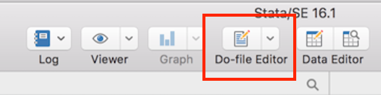
<p class="caption">(\#fig:dofileicon)Do-File Icon</p>
</div>

To open a new do-file we can simply click the icon. When you do, you will see a blank file. This is where we are going to type code into (see Figure \@ref(fig:dofile1)).

<div class="figure" style="text-align: center">
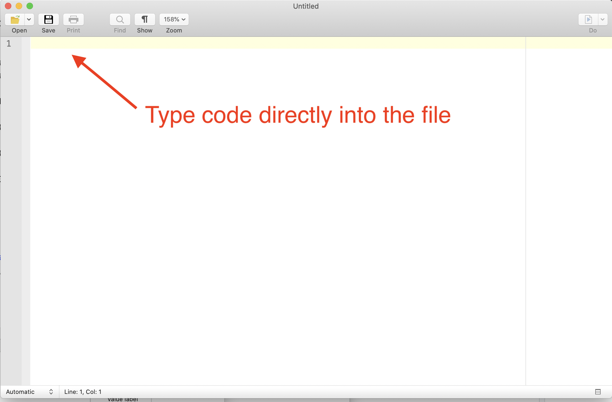
<p class="caption">(\#fig:dofile1)Blank Do-File</p>
</div>

For example, if we want Stata to compute the sum of 2+2, we would type ``display 2+2`` into the dofile, as seen in Figure \@ref(fig:dofile2).

<div class="figure" style="text-align: center">
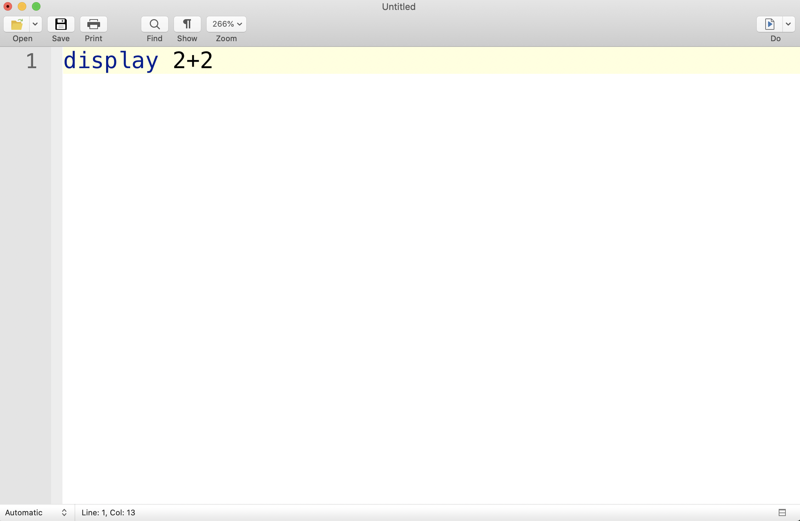
<p class="caption">(\#fig:dofile2)Display 2+2 in a Do-File</p>
</div>

So now that we have our code written, how do we execute it? There are actually a couple of different ways. The first is pressing the "Do" button, which is the icon on the top right of the do-file that looks like a piece of paper with an arrow.

If you press this button without highlighting any text, it will execute every single line of code in the file in the sequence they appear. Depending on your goal, you may want to only run select portions of your code. For example, we often need to "debug" our code, and it is more efficient to run a few lines at a time. In this case, we can highlight the lines we would like to be executed, and when we press "Do", only the highlighted lines of code will be executed. 

For example, in Figure \@ref(fig:dofile7), hitting "Do" will execute the first two lines of code. 

<div class="figure" style="text-align: center">
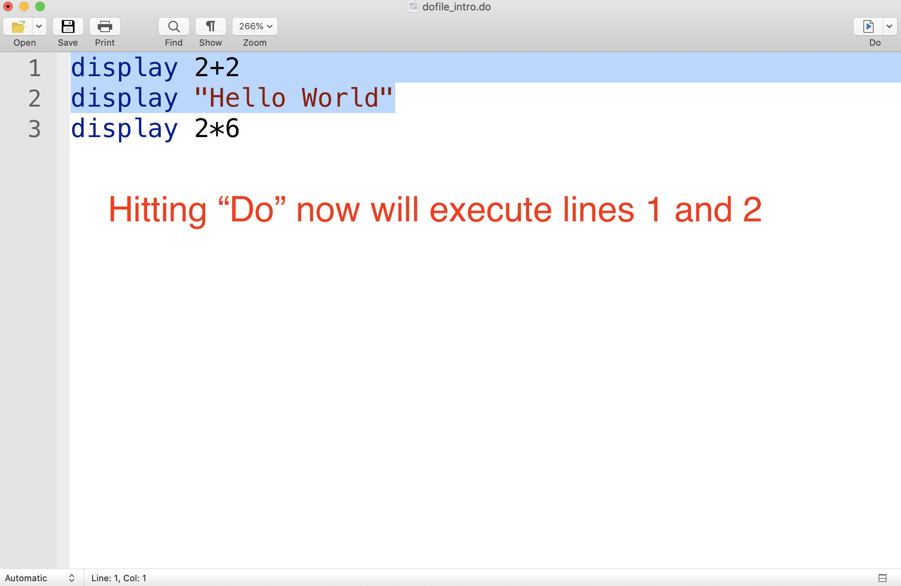
<p class="caption">(\#fig:dofile7)Executing Lines 1 and 2</p>
</div>
In Figure \@ref(fig:dofile8), hitting "Do" will execute the second and third line of code.

<div class="figure" style="text-align: center">

<p class="caption">(\#fig:dofile8)Executing Lines 2 and 3</p>
</div>

We don't actually have to hit "Do" to execute the entries of a dofile. Stata does have built-in shortcuts that you can use. A shortcut is a set of keys that you can press in order to perform the same operation as pressing a button. For example, in a Mac, if you press "Cmd + Shift + D" when highlighting sections of code, the highlighted sections will be executed. On a PC, the shortcut is "Ctrl + D". 

Lastly, the key aspect of do-file is that you can save your progress. For example, if you do a homework assignment in multiple sittings, you better have a way to start where you left off! To save a do-file press the "Save" button in the top left corner of the page, as seen in Figure \@ref(fig:dofile5)

<div class="figure" style="text-align: center">
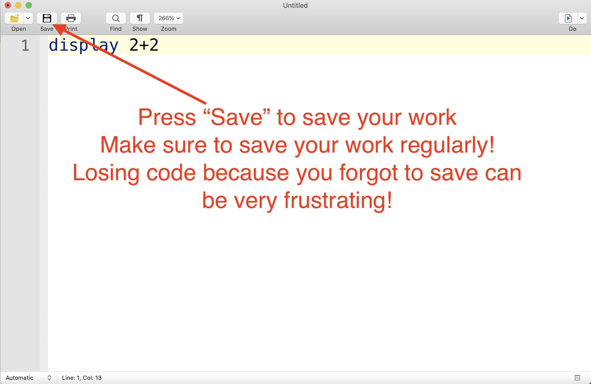
<p class="caption">(\#fig:dofile5)Saving A Do-File</p>
</div>

You should save the do-file somewhere convenient on your computer, so that you can quickly find it next time you need it. 

## Working Directory

Next we are going to discuss the working directory. To understand the working directory, you first need to understand that every file and folder on your computer has an "address" associated with it. Most of us are used to navigating through either Finder in Mac or through File Explorer in a PC to open a file we need. 

But this is not the only way to open files. And in fact, originally, there was no convenient user interface in computers to access files in this way. Instead, you needed to direct your computer to the location of the file by typing in the file's "address". The "address" of a file or folder is know as the **path name**. It is a string of text that tells your computer where the file or folder is located. 

The **working directory** is the default path in Stata. This is where Stata looks for files by default. For example, imagine I have a dataset named, "interesting_data.dta" and I want to load it into Stata. The command to load data in Stata is the ``use`` command. Therefore, I might want to type:


```stata
use interesting_data.dta, clear
```

The ``, clear`` tells Stata to clear out any data that is currently loaded into memory. Where will Stata look for the file "interesting_data.dta"? In the working directory!

Therefore, before you start loading in data, you need to learn what your working directory is currently set to. To check this in Stata, we use the ``pwd`` command, which is short for "print working directory". To check your working directory in Stata, just type ``pwd`` into the command window. When I typed this into my command window, this is the path name that came out:

``/Users/davidarnold/Documents/Stata``

This will not be a convenient folder for our working directory. We want the working directory to be set to the place where we put the data after downloading it. For me, this folder is "/Users/davidarnold/Dropbox/Teaching/EP5/online/02_week/data".

For this course, I would suggest creating a folder dedicated to this course. For me, this Folder is on my Dropbox and located within the "Teaching" folder. I named my folder for this course "EP5", but you can name yours whatever you like.

Additionally, given the large number of datasets we will be using, it will be convenient to separate them somehow. I have divided the course into weeks. Given this application corresponds to the second week, I have named the folder "02_week". Lastly, inside this folder I want to quickly understand where my data is, therefore, I have a dedicated data folder that holds all the datasets we will explore this week. 

The structure described above is displayed below in Figure \@ref(fig:hierarchy)

<div class="figure" style="text-align: center">
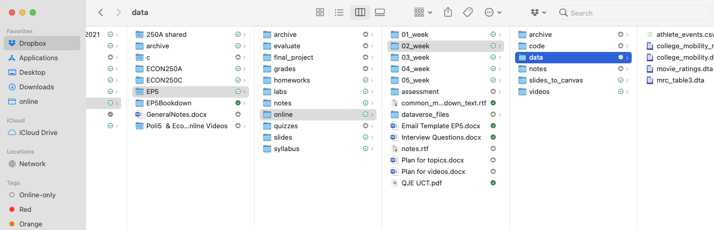
<p class="caption">(\#fig:hierarchy)Example Structure of a Folder Hierarchy for this Course</p>
</div>

One brief aside before we continue with understanding the working directory. The best time to organize the folders on your computer is now! What does this mean? It means do not place everything you download in one place. Do not have your desktop cluttered with numerous files. Create folders on your computer that neatly divide up your work. For me this means different folders for Research and Teaching. Within Teaching, I need different folders for every course I teach. Within each course, I need different folders for every week of the course. Therefore, if I need to access a dataset or set of notes for a given week of the course, I can do so quickly and easily. Doing this organization now will save you a lot of time in the future, not just in this course, but even more generally. 

Returning to the working directory, now that we know where the data is, we need to change our directory to the location of the data. To do this we can use the ``cd`` command which is short for "change directory."


```stata
cd "/Users/davidarnold/Dropbox/Teaching/EP5/online/02_week/data"
/Users/davidarnold/Dropbox/Teaching/EP5/online/02_week/data
```

This is the path for me, but it will be different depending on where you put the downloaded data for this section. One issue that commonly confuses students is that even though they can navigate to a file, they don't actually know the full path to that file. 

In a PC, retrieving the full path is relatively simple. In the file explorer there will be a panel at the top that shows the different subfolders. Clicking on the arrow next to this path will convert it to the full path name. You can simply copy and paste this pathname into Stata to change your working directory. 

On a Mac, it is slightly more complicated. If you right click a folder and then press the "option" key, there will be an option to "copy as pathname". Pressing this option will copy the path name for you (i.e. you can press Cmd+p to paste it, or right click and then select paste.)

## Describe and Browse

In this section we are going to learn a few basics of loading data into Stata. To get started, let's load in the main data for this chapter, which contains data from Opportunity Insights that will allow us how colleges vary in the extent that they promote intergenerational mobility. To load in the data type:


```stata
cd "/Users/davidarnold/Dropbox/Teaching/EP5/online/02_week/data"
use college_mobility.dta, clear
/Users/davidarnold/Dropbox/Teaching/EP5/online/02_week/data

(Preferred Estimates of Access and Mobility Rates by College)
```

Again, the first part of this code (the part following "cd") will look different for you depending on the path to data in your computer. Now the data has been loaded into memory, but don't yet understand what is actually in the data. The first command that can be used to start exploring the data is the ``describe`` command. The ``describe`` command allows us to quickly review the variables in a dataset.


```stata
describe
```

Figure \@ref(fig:describe) displays the results of this command, which is a table of variables, as well as the format of the variable and the label associated with the variable. 

<div class="figure" style="text-align: center">
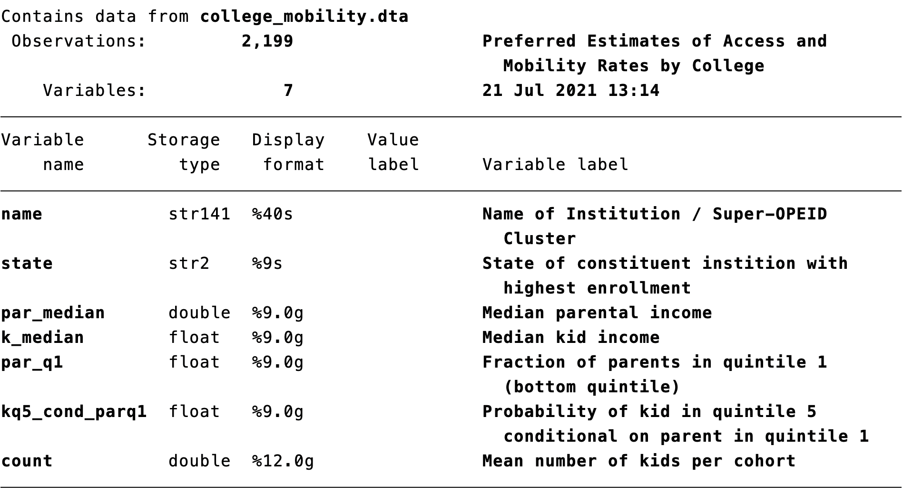
<p class="caption">(\#fig:describe)Describe Command</p>
</div>

Here we can note a few of the more important variables we will be using in this dataset. First, we have the variable ``name`` which indicates the institution. This is a dataset of 2,199 institutions in the United States. The variables we will focus on are ``par_q1`` and ``kq5_cond_parq1``. The label associated with ``par_q1`` is "Fraction of parents in quintile 1 (bottom quintile)". In terms of our definition of mobility rate, this is the access portion. A school that has a large fraction of students from the bottom 20 percent of the income distribution (quintile 1) will have high access. 

The other component of the mobility rate is the success rate, which is captured by the variable ``kq5_cond_parq1``. The label associated with this variable is "Probability of kid in quintile 5 conditional on parent in quintile 1". In other words, what fraction of students from low-income background go on to earn in the top 20 percent of all earners in their age group. 

The mobility rate is the product of the access rate and success rate. As we can see, this variable is not in our dataset, so we will eventually need to create it. 

While the ``describe`` command gives us a good sense of what variables are in the data, it is also useful look directly at the data. The ``browse`` command opens up a spreadsheet similar to an Excel spreadsheet. This allows you to look through the data to further understand how the values of each variable are stored. To browse the data, simply type into command window:


```stata
browse
```

For our dataset, this will open the data table displayed in Figure \@ref(fig:browseex)

<div class="figure" style="text-align: center">
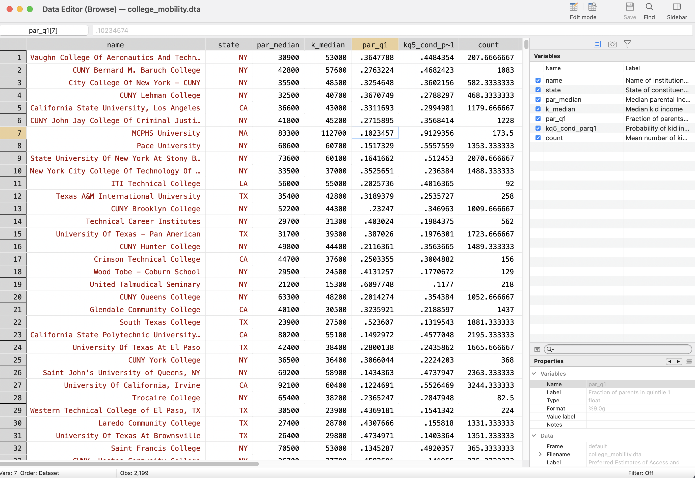
<p class="caption">(\#fig:browseex)Browse Command</p>
</div>

When you open a new dataset it is often helpful for us to browse the data. For example, now we know exactly how the ``state`` variable is stored (as abbreviations rather than full names). We can also see clearly in the data table which variables are stored as strings and which variables are stored as numbers.

:::{.rmdnote}
String variables are highlighted in red. Numeric variables are stored in black. Sometimes a variable may seem like it should be a numeric variable, but will contain non-numeric strings. For example, a value of "\$24,000" will be stored as a string because both "\$" and "," are non-numeric characters.
:::

## Summarize 

Now that we have a sense of our variables, let's generate some descriptive statistics to understand them further. A descriptive statistic is any statistic that quantitatively describes the variable (common ones are the mean, median, and standard deviation). In Stata, the ``summarize`` command is useful for retrieving summary statistics

The basic syntax for the ``summarize`` command is 

``summarize varlist``

where ``varlist`` is a list of variables that you would like to see summary statistics for. For example, imagine first we want to understand, on average, how large are institutions in this dataset? Well, the variable ``count`` is the average number of students enrolled in the institution. To retrieve summary statistics for this variable we type: 


```stata
summarize count
```


```stata
summarize count
    Variable |        Obs        Mean    Std. dev.       Min        Max
-------------+---------------------------------------------------------
       count |      2,199    946.5153    1508.825         50   26989.67
```

This table tells us a few things. First, it tells us that the average size of a cohort of students across all institutions in the dataset is about 946 students. Additionally, we can see the minimum is 50 and the maximum is 26989.67. The minimum being 50 is actually by construction. Institutions with less than 50 students per cohort were dropped from the dataset. Understanding descriptive statistics about your key variables is important before starting any data analysis. 

## Generate 

Now that we understand how to explore the data, let's get back to our question of interest: how do colleges vary in the extent that they promote intergenerational mobility? There is just one problem. We don't have mobility rates in our data. 

To remind you, the mobility rate of a college is given by: 

::: {.rmdnote}
$$
\text{mobility rate}= \underbrace{\text{(frac. of students from Q1)}}_{\text{Acess}} \; \cdot \; \underbrace{\text{(frac. of Q1 that reach Q5)}}_{\text{Success}} \nonumber
$$
:::

In our dataset, we have variables that capture the access term (``par_q1``) and 
the success term (``kq5_cond_parq1``). From these we can construct a college's mobility rate. To do this we will use the ``generate`` command

The most basic syntax of the generate command is 


```stata
gen newvar = exp
```

In this command, ``newvar`` is the name of the new variable that you would like to create. You can give the variable any name you like, but generally it is good practice to keep names short, but as descriptive as possible. The term ``exp`` is an expression. How you fill in ``exp`` depends on what variable you are creating 

Before we get to generating mobility rates, let's take some common examples. Suppose we have two variables ``x1`` and ``x2`` and we want to create new variables that are functions of these two variables. Here are a few examples of what we might want to accomplish

  - Addition: ``gen sum = x1+x2``
  
  - Subtraction: ``gen diff = x1-x2``
  
  - Multiplication: ``gen mult = x1*x2``
  
  - Division: ``gen div = x1/x2``

For us, we want to create a variable that is the product of ``par_q1`` and ``kq5_cond_parq1``. Therefore, we can type: 


```stata
gen mobility_rate = par_q1*kq5_cond_parq1

```

When we create a new variable, it won't by default have a label associated with it. If you are working on a project that has many different variables, it is a good idea to label your variables so that you can remember what they represent at a later date. For example, if we want to give the variable ``mobility_rate`` a label we type:


```stata
label var mobility_rate "Mobility rate of institution"
```

## Binary Variables

Most of the binary variables we create in this class will be the result from evaluating a logical statement. To review, a logical statement is any statement that is either true or false. For example, the statement "College X is in California" is either true or it is false. For "UCSD" this statement is true, while for "ASU" this is false.

It is often useful to create binary variables (binary meaning two) in our data based on logical statements. For example, in our data on intergenerational mobility, we might be interested in comparing mobility rates across different regions. For example, maybe we want to compare mobility rates in California to mobility rates in other parts of the country. To do this, we might want to create a binary indicator variable that is equal to 1 if the state is in California and zero otherwise.   We can create a binary variable that is equal to 1 if a logical statement is true and zero if false we type 


```stata
gen CA = (state=="CA")
```

The logical statement ``(state=="CA")`` is true if the state is in California and false if it is not. Note the double-equals sign ``==``. We use double-equals to test the equality of two things. Additionally, note the quotation marks around ``CA``. Reminder: ``state`` is a string variable and we always reference string variables with quotation marks. 

This statement mirrors the general syntax of how we can create binary variables in Stata. The general syntax is 


```stata
gen newvar = (logical statement)
```

This code will generate a new variable (named ``newvar``) which is equal to 1 if the logical statement in parentheses is true and zero if false.

To check whether the results conform to our expectations we can type ``br state CA``. Below in Figure \@ref(fig:brca) we show a small selection of the data that shows us CA is equal to 1 for colleges in "CA" and zero otherwise.

<div class="figure" style="text-align: center">
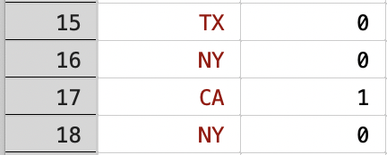
<p class="caption">(\#fig:brca)Generating A Binary Indicator for California Colleges</p>
</div>

There are a few errors that arise enough that it is valuable to go through them now. First, it is common to forgot the "double equals" sign, and instead put one equals sign, as below. 


```stata
gen CA2 = (state="CA")
```

If we execute this code, we will get the error in Figure \@ref(fig:forgotdoubleequals).

<div class="figure" style="text-align: center">
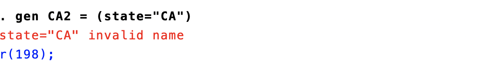
<p class="caption">(\#fig:forgotdoubleequals)Forgetting Double Equals  When Testing Equality</p>
</div>

The error report ``state="CA"`` is displayed because the command is looking for a variable with this name, which is not in a valid format. To test equality, we need two equals signs.

Another common error (not just when generating new variables) is to forget the quotation marks when referencing string variables. For example if we type:


```stata
gen CA3 = (state==CA)
```

We will get the error code displayed in Figure \@ref(fig:forgotquotes). 

<div class="figure" style="text-align: center">
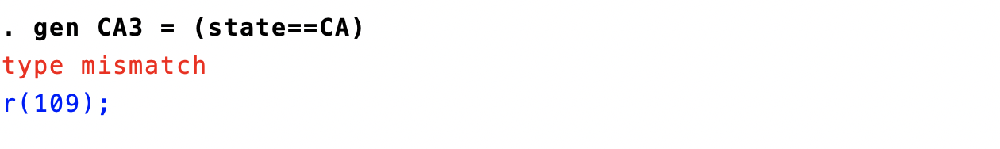
<p class="caption">(\#fig:forgotquotes)Forgetting Quotation Marks When Referencing Strings</p>
</div>

The error report ``type mismatch`` occurs because state is a string variable, yet what comes after the equals sign will NOT be interpreted as a string. To tell Stata the characters ``CA`` are strings, put ``CA`` in quotation marks!

There are many ``binary`` variables we can create from relations. For example, imagine we have two generic variables, ``x1`` and ``x2``. We can create a variable that is equal to one if ``x1`` is greater than ``x2`` and zero otherwise.


```stata
gen x1_greater_x2 = (x1>x2)
```

A variable that is equal to 1 if ``x1`` is less than ``x2`` and zero otherwise.

```stata
gen x1_less_x2 = (x1<x2)
```

A variable that is equal to 1 if ``x1`` is greater than or equal to ``x2`` and zero otherwise.

```stata
gen x1_greater_x2 = (x1>=x2)
```

A variable that is equal to 1 if ``x1`` is less than or equal to ``x2`` and zero otherwise.

```stata
gen x1_less_eq_x2 = (x1<=x2)
```

## If Statements

If statements in Stata are used when you want to execute code, but only if some condition is met. Most of the commands we use in Stata can be combined with an if statement. 

The general syntax for using if statements is 


```stata
command if (logical statement)
```

The command will only be executed for observations for which the logical statement is true. If you look at the help files for commands, you will often notice a ``[if]`` in the syntax. This means you can combine the command with an if statement. For example, in Figure \@ref(fig:sumhelp) we can see you can use if statements with the summarize command. 

<div class="figure" style="text-align: center">
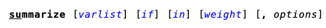
<p class="caption">(\#fig:sumhelp)Help File for the Summarize Command</p>
</div>

A general note about how syntax is presented in Stata is useful here. Words that appear brackets can be used when using the command, but don't need to be. The word ``if`` is in brackets because we don't need to include it in order to use the summarize command. However, imagine we want to compute average mobility rates, but just restricted to colleges in California. A college is in California ``if CA==1``, which is the binary variable we created before. Therefore we can compute the average mobility rate of California colleges by typing:


```stata
sum mobility_rate if CA==1 
```

```
    Variable |        Obs        Mean    Std. dev.       Min        Max
-------------+---------------------------------------------------------
mobility_r~e |        168    .0275095    .0154819          0   .0991846
```
Note that we did not put ``if`` in brackets, even though it was in brackets in the syntax. The brackets are there to tell you that you can use an if statement, but the brackets themselves are not actually part of the syntax. 

So mobility rates in California colleges are 0.028. Let's compare this number to mobility rates in non-Californian colleges:


```stata
sum mobility_rate if CA==0 
```

```
    Variable |        Obs        Mean    Std. dev.       Min        Max
-------------+---------------------------------------------------------
mobility_r~e |      2,031    .0175132     .012647          0   .1635797
```
The mobility rates in non-Californian colleges are 0.018, so mobility rates, on average, are higher at Californian schools. Why is this? Well, it could be do to either 2 factors: higher access or higher success. We can check if one vs. the other is driving this result by summarizing both access and success separately. 


```stata
sum par_q1 kq5_cond_parq1 if CA==1 
```

```
    Variable |        Obs        Mean    Std. dev.       Min        Max
-------------+---------------------------------------------------------
      par_q1 |        168    .1443805    .0889914   .0321324   .4606968
kq5_cond_p~1 |        168    .2481358    .1638556          0   .8497473
```
And now for non-Californian colleges:


```stata
sum par_q1 kq5_cond_parq1 if CA==0 
```

```
    Variable |        Obs        Mean    Std. dev.       Min        Max
-------------+---------------------------------------------------------
      par_q1 |      2,031    .1232655    .0878519   .0111896   .6097748
kq5_cond_p~1 |      2,031    .1919684    .1360417          0   .9192932
```
So let's first discuss the access results (i.e. the variable ``par_q1``). Across colleges in CA, the average fraction of students that are from low-income backgrounds is around 14.4 percent. In contrast, in non-California colleges, the average fractions of students that are from low-income backgrounds is around 12.3 percent. Therefore, on average across schools, access is higher in CA. 
Now let's discuss the success results (i.e. the variable ``kq5_cond_parq1``). Across colleges in CA, the average fraction of students from low-income backgrounds that become high earners is around 24.8 percent. Across colleges NOT in CA, the average fraction of students from low-income backgrounds that become high earners is around 19.2 percent. Therefore mobility rates are higher in CA due to both (1) greater access and (2) greater success.

We can also use ``if`` statements to reference string variables. For example, let's imagine we want to see what the mobility rate is for UCSD. In the data, we can use the variable ``name`` which contains the institution name to summarize mobility ``if name == "University Of California, San Diego"``. Note again the use of quotation marks here to reference a string value. 


```stata
sum mobility_rate if name == "University Of California, San Diego"
```

```
    Variable |        Obs        Mean    Std. dev.       Min        Max
-------------+---------------------------------------------------------
mobility_r~e |          1    .0483275           .   .0483275   .0483275
```
Here we have taken the average ``if name == "University Of California, San Diego"``. But only one observation meets this restriction, so the table is just showing us the mobility rate for UCSD, which is equal to 0.048, a bit higher than the average of 0.028 across all Californian institutions. 

In this section we have begun to explore variation across colleges in terms of intergenerational mobility rates. In the next section we will learn about a data visualization technique that is useful in understanding variation in the data more generally.

## Histogram (Theoretical)


A **histogram** is a representation of the distribution of a **numeric** variable \medskip. In our empirical application, we want to understand the distribution of mobility rates across colleges. To keep things simple, let's go through a hypothetical example of a setting you are probably familiar with: understanding the distribution of test scores in a class. 

Let's imagine we have a class of 10 students, as depicted below:

$$
  \{65,71,75,76,80,84,85,86,90,98\}
$$

We want to understand the distribution of test scores. To create a histogram, the first thing we must decide is how to "bin" our data (sometimes referred to as "bucket"). Binning the data means to divide the range into a series of intervals. For example, for test scores, I could use the following intervals:

  - Interval 1: [60,70)
  - Interval 2: [70,80)
  - Interval 3: [80,90)
  - Interval 4: [90,100]
  
Reminder: brackets mean inclusive, while parentheses mean excluding. So a score of 70 would fall in interval 2, not 1. Next we compute the fraction of observations within each bin. Only 1 test score (65) falls within interval 1, so 10 percent of observations are in interval 1. Three test scores fall within interval 2, so 30 percent of observations are in interval 2. We can compute the fraction in each interval and then plot the result in a histogram, as depicted in Figure \@ref(fig:histtestscore).

<div class="figure" style="text-align: center">
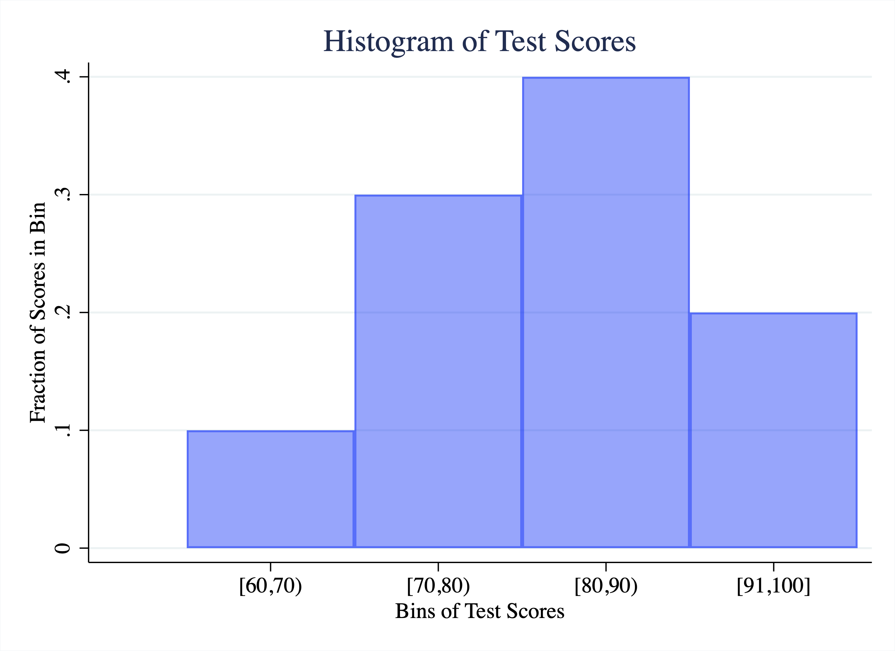
<p class="caption">(\#fig:histtestscore)Histogram of Test Scores</p>
</div>


So in a histogram, the height of the bar represents what fraction of test scores fall within a given interval. Now that we understand the basic premise, let's go through a few example from some real datasets.

For example 1 we are going to look at the distribution of Rotten Tomatoes scores for movies released in 2015 in Figure \@ref(fig:histmovies). The rotten tomato score represents what fraction of critics rated a film as positive. So a value of 50 indicates 50 percent of critics rated the movie positively. The score ranges from a minimum of 0 to a maximum of 100. 

<div class="figure" style="text-align: center">
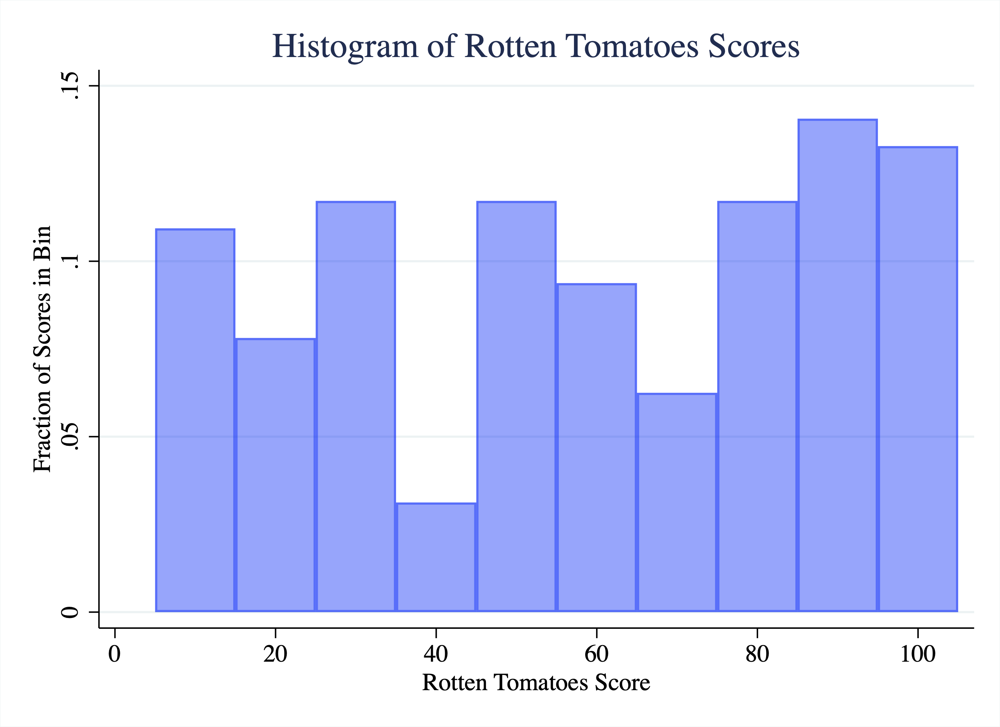
<p class="caption">(\#fig:histmovies)Histogram of Rotten Tomatoes Scores for Movies Released in 2015</p>
</div>

So what do we learn from this figure? Some movies get very low scores, in the 5-10 range. How can we tell this? The first bin starts around 5 and ends around 15. The height of this bar is a little above 0.10. That means a bit more than 10 percent of all the movies got a score in the 5-15 range. As we move across the range of possible values, we actually find that the height of the bars is relatively stable. Therefore, we can describe this distribution as relatively uniform. That means across the range of movie scores, it does not seem like some scores are especially likely relative to others (for a perfectly uniform distribution the height of the bars would be identical across the entire range of the x-axis.)

In the next example, we are going to explore the distribution of olympic athlete ages in Figure \@ref(fig:athleteages).

<div class="figure" style="text-align: center">
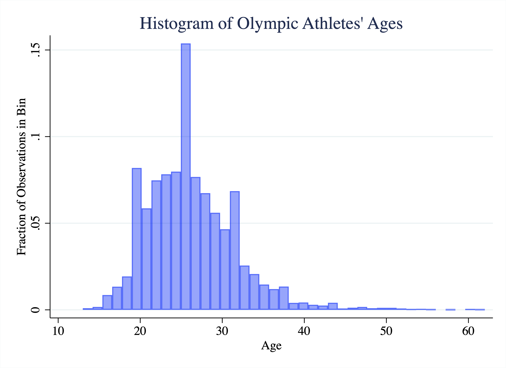
<p class="caption">(\#fig:athleteages)Histogram of Olympic Athlete Ages</p>
</div>

So what do we learn from this histogram? Well, most Olympic athletes are between the ages of 19 and 32. Between these values the bars are consistently high, indicating a large fraction of the sample. At the lower end, there are some athletes under 19, but they are relatively less common. At the upper end, there are some athletes even above 40 years old, but these are clearly outliers. They are very far away from most of the data, which is in the 20s. We sometimes describe this feature of a distribution as a "long-right tail". Or we say the distribution is skewed right. 

Finally, let's look at the distribution of calories for meals ordered at Chipotle in Figure \@ref(fig:Chipotle), which comes from an article in The Upshot.[@upshot]

<div class="figure" style="text-align: center">
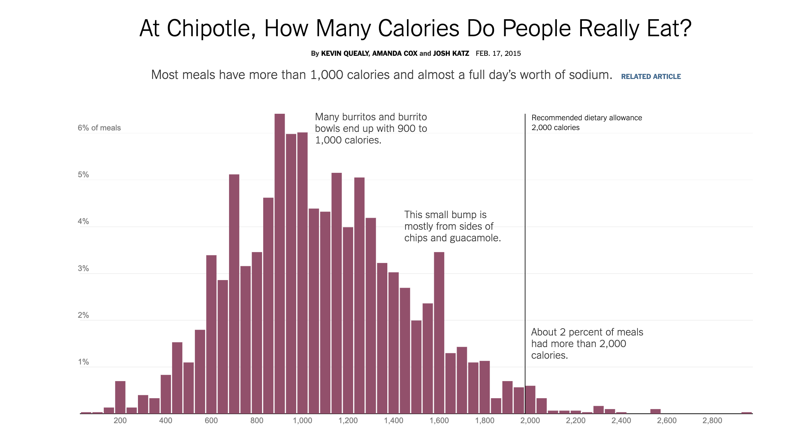
<p class="caption">(\#fig:Chipotle)Histogram of Calories of Chipotle Meals</p>
</div>

As we can see, most Chipotle meals are in the 1,000 calorie range. This is because many burritos and burrito bowls end up being around 1000 calories. However, if you order chips as well, that adds some calories to your meal, which is why we can see a bump in the histogram at around 1600 calories. At the upper end of the distribution we see some meals have over 2,000 calories, more than the total amount of calories recommended in a day! Overall, about 2 percent of all meals have calorie counts this extreme. 

## Histogram (Data)

In our empirical application, we want to understand the distribution of mobility rates across colleges. What are common values for the mobility rate? Are there outliers? To study this, we are going to create a histogram in Stata. 

To begin, we need to learn about the ``histogram`` command, which is used to plot histograms in Stata. The simplest possible syntax is to simply type


```stata
histogram varname
```

Where ``varname`` is the name of whatever variable you would like to create a histogram for. In our example, we want to plot a histogram of ``mobility_rate``, so we will type:


```stata
histogram mobility_rate
```

<div class="figure" style="text-align: center">
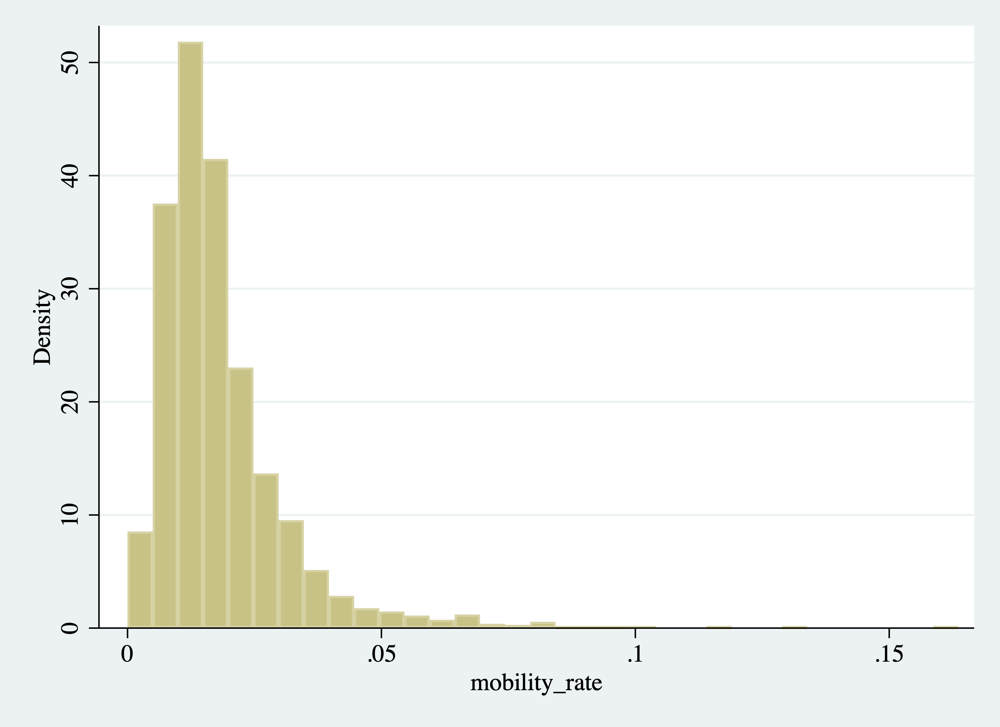
<p class="caption">(\#fig:mobilityhist1)Histogram of College Mobility Rates</p>
</div>

You will notice that the vertical axis in Figure \@ref(fig:mobilityhist1) is density. For our prior examples, we always had the vertical axis labeled as "Fraction of Observations." It is not necessary to understand this for the class, but a density integrates to 1, which is why the vertical axis is sometimes rescaled in this way. For our purposes, it will be more intuitive to display the vertical axis as the fraction of observations. This will not change the appearence of the histogram in any way, just what is displayed on the vertical axis.To plot fraction of observations instead of density, we can use an **option** of the histogram command.

In Stata, additional options are available for most commands. They give you a way to alter the command in some way. You can read through a list of options for a given command by opening the help file. The options we are looking for is the ``frac`` options, which changes the vertical axis to fraction of observations instead of density:


```stata
histogram mobility_rate, frac
```

<div class="figure" style="text-align: center">
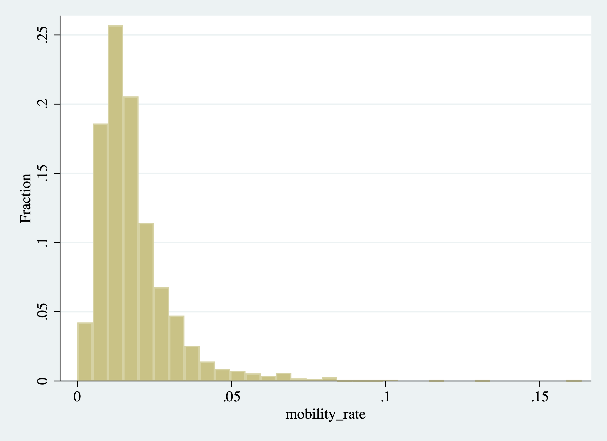
<p class="caption">(\#fig:mobilityhist2)Histogram of College Mobility Rates (Changing the Vertical Axis)</p>
</div>

Now that we have our histogram, let's start interpreting it. First, where is most of the "mass" of the histogram (i.e. where are the bars the highest)? This will be where most colleges fall in terms of mobility rates. Well, it looks like there is a spike near 0.02. For example, the highest bar in this range reaches 0.25, indicating 25 percent of all colleges fall in that interval. What does a value of 0.02 represent? A college with a mobility rate of 0.02 has 2 percent of its students coming from low-income backgrounds and achieving high income. 

Two percent seems like a low number, but there are colleges with even lower rates of mobility. For example, the first interval starts at roughly zero. The height of this bar is around 0.04, indicating about 4 percent of schools have mobility rates near zero. Again, this could due to either (1) not accepting students from low-income backgrounds (access) or (2) having graduates that do not earn enough to be categorized as high income (success).

On the other end of the distribution, we can see there are some outlier schools that have very high mobility rates relative to others. Although it is difficult to see in the graph, there are a few schools with mobility rates above 0.10, indicating over 10 percent of the students in the school come from low-income backgrounds and achieve high income later in life. 

Overall this is an example of a distribution with a long-right tail. Most schools are cluster in the 0.01 to 0.03 range, but there are some outliers at the upper end of the mobility distribution. 

Sometimes it is helpful to tweak your graphs. In some cases, you may not like the default settings, and so generally, you will be able to change them. For example, maybe we do not like how many bins were created. We can directly control the number of bins by specifying the ``bin()`` option. For example, in Figure \@ref(fig:mobilityhist6) we create a histogram with 20 bins.


```stata
histogram mobility_rate, frac bin(20)
```

<div class="figure" style="text-align: center">
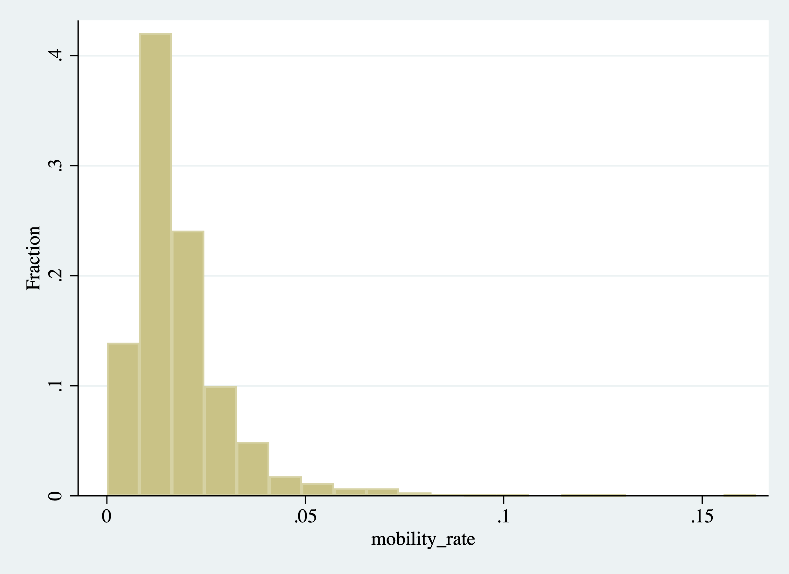
<p class="caption">(\#fig:mobilityhist6)Histogram of College Mobility Rates (Changing the Number of Bins)</p>
</div>

Because there were more than 20 bins in our original histogram, the width of each bin is larger now (some of the bin heights at the upper end of the distribution are very small and difficult to see in the figure).

Instead of directly controlling how many bins, we can also control the width of the bins. In our test score example, we chose bins of width 10, but we could have chosen bins of width 5 instead. The choice of 10 was arbitrary. In some cases, you may want to change the width of the bins. To change the width of the bin we can specify the ``width()`` option, as we do below. 


```stata
histogram mobility_rate, frac width(0.01)
```

<div class="figure" style="text-align: center">
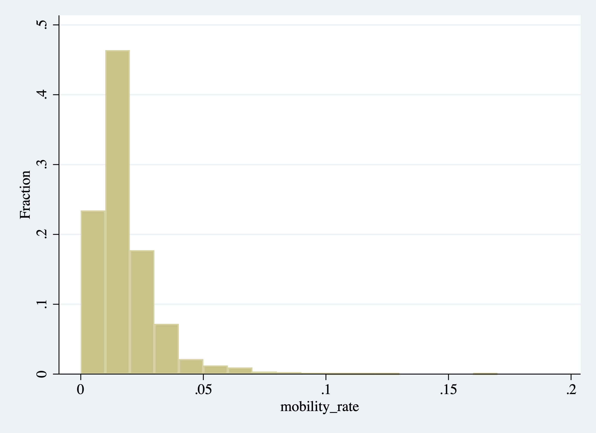
<p class="caption">(\#fig:mobilityhist7)Histogram of College Mobility Rates (Changing the Width of the Bins)</p>
</div>

In Figure \@ref(fig:mobilityhist7), the interval of each bin is 0.01. Given the range of the data, this creates about 20 equal-sized bins, which is why this figure looks similar to the figure we created when we specified 20 bins. 

## Histogram (Aesthetics)

Although we have created a histogram, it still leaves a lot to be desired. For our figures to be effective, they need to be clearly labeled and titled. To make them more visually appealing, it is also helpful to change colors and add additional elements. 

To change the color of the bars in our graph, we can specify the ``color()`` option. What I find to be effective in histograms is to also make the bars slightly translucent. This allows for plotting multiple histograms on the same figure, while still being able to distinguish the different variables. In the code below, we are going to change the color of our bars to blue, but then also make the bars transparent. We will do this by specifying `` color(blue%40)`` as one of the command options. The ``%40`` will control how translucent the bars appear. You can specify any number between zero and 100 here.


```stata
histogram mobility_rate, frac color(blue%40)
```

<div class="figure" style="text-align: center">
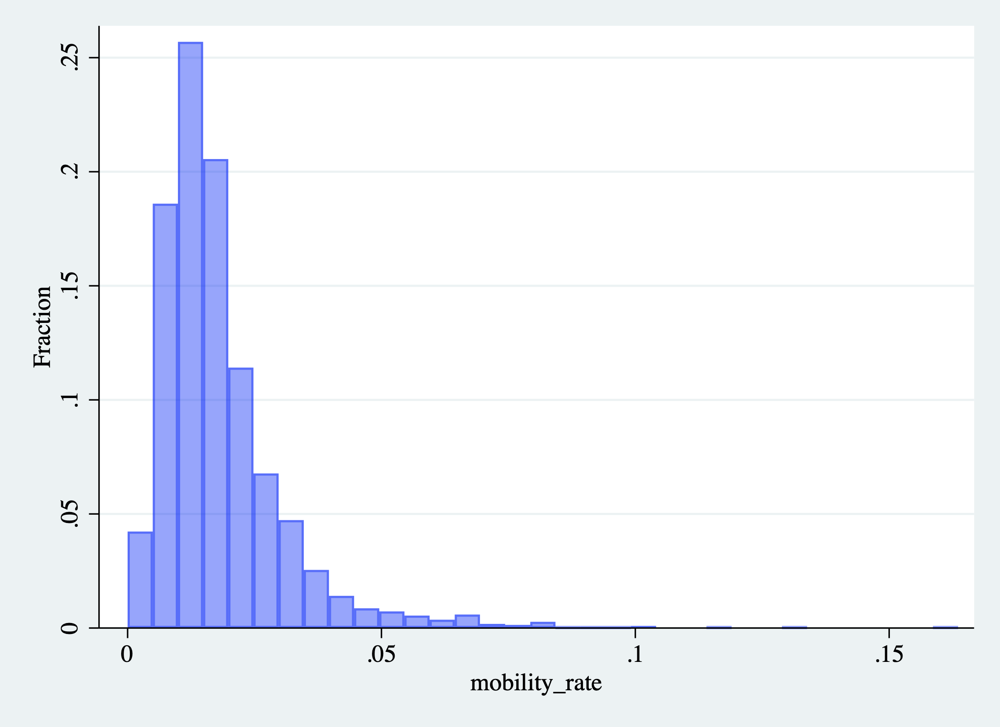
<p class="caption">(\#fig:histae2)Histogram of College Mobility Rates (Changing the Color of the Bars)</p>
</div>

Next, let's add a title to our figure. It is always important to include a title that describes what the figure is presenting. We can do this by specifying the ``title()`` option:


```stata
histogram mobility_rate, frac color(blue%40) ///
  title("Histogram of Mobility Rates Across U.S. Colleges")
```

<div class="figure" style="text-align: center">
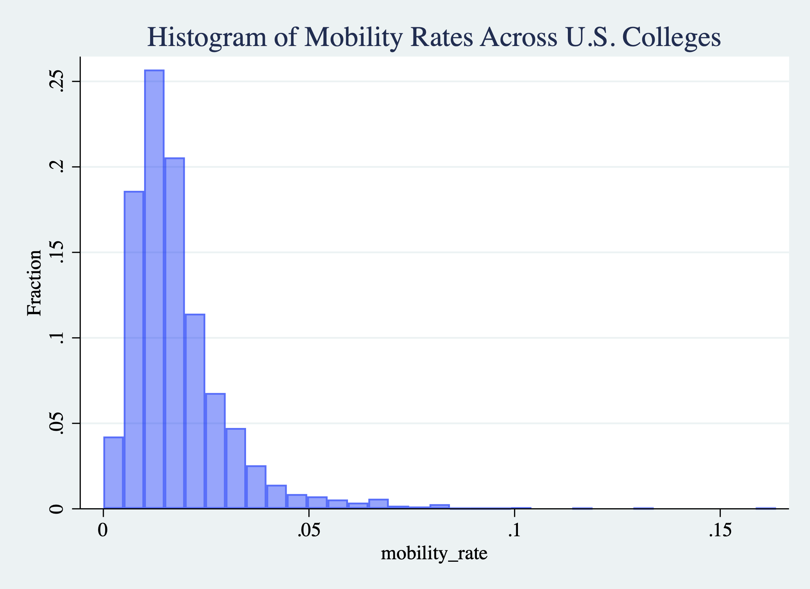
<p class="caption">(\#fig:histae3)Histogram of College Mobility Rates (Adding a Title)</p>
</div>

You will notice the three ``///`` at the end of the first line of code. Sometimes it is easier to read code if we separate the various elements into different lines. However, in Stata, if you press enter and continue your code on the next line, then Stata will not interpret the two lines as connected. In other words, if we did not include the ``///`` it will interpret the second part ``title("Histogram of Mobility Rates Across U.S. Colleges")`` as a new block of code. But ``title`` is not a command in Stata, it is an option of graphical commands. Therefore, it needs to follow some type of graphing command. By adding the ``///`` we are telling Stata that the two lines of code are actually a single block of code that should be executed as a single unit.

Next, let's work on the axis labels. The horizontal axis is currently labeled by ``mobility_rate``. It is not professional or particularly descriptive to have variable names as the titles of axes. We should change this to "Intergenerational Mobility Rates" by specifying the ``xtitle()`` option. While we are at it we can also make the vertical axis title more descriptive.


```stata
histogram mobility_rate, frac color(blue%40) ///
  title("Histogram of Mobility Rates Across U.S. Colleges") ///
  xtitle("Intergenerational Mobility Rates") ///
  ytitle("Fraction of Observations") 
```

<div class="figure" style="text-align: center">
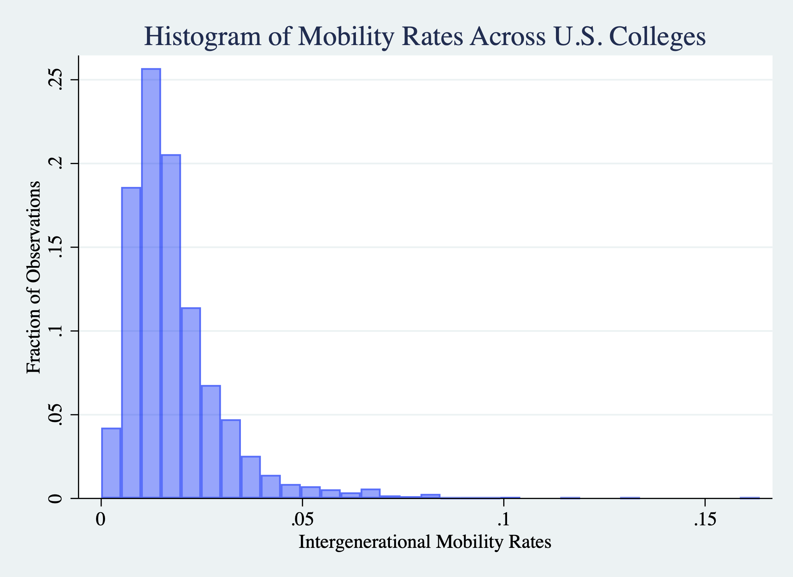
<p class="caption">(\#fig:histae4)Histogram of College Mobility Rates (Changing Axis Labels)</p>
</div>

This next step is not strictly necessary, but I find the graphs more aesthetically pleasing if we also change the background color. We can do this by specifying ``graphregion(fcolor(white))``


```stata
histogram mobility_rate, frac color(blue%40) ///
  title("Histogram of Mobility Rates Across U.S. Colleges") ///
  xtitle("Intergenerational Mobility Rates") ///
  ytitle("Fraction of Observations") ///
  graphregion(fcolor(white)) 
```

<div class="figure" style="text-align: center">
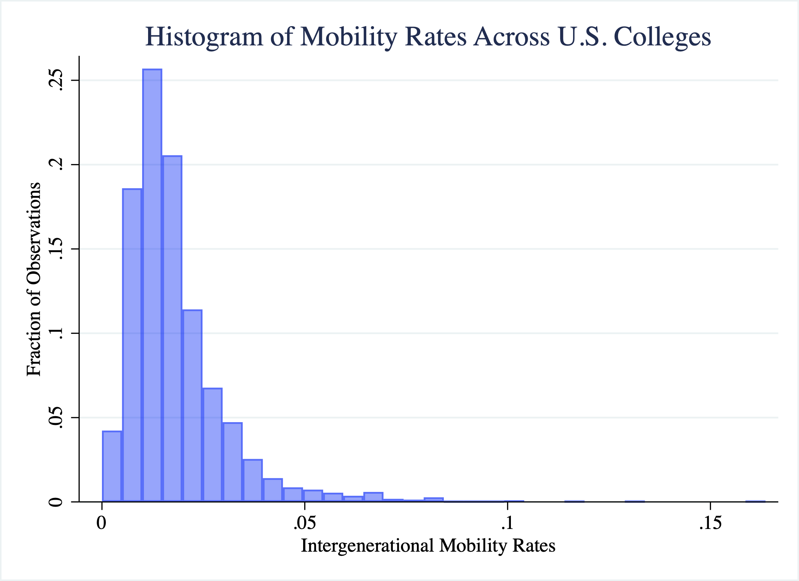
<p class="caption">(\#fig:histae5)Histogram of College Mobility Rates (Changing Background)</p>
</div>


Sometimes it is helpful to highlight important elements in a graph. Let's add a vertical line at the mobility rate of UCSD, which is about 0.048. To do this we will add the ``xline()`` option to our figure. In particular, we will place a black line at 0.048 on the x-axis that is dashed by specifying ``xline(0.048, lc(black) lp(dash))``. The option ``lc(black)`` specifies the line color (``lc``) will be black and ``lp(dash)`` indicates the line pattern (``lp``) will be dashed.

Further, we can also add text to the graph to label the dashed line. To add text, we use the ``text()`` option. In order to use the text option you need to specify the y-coordinate, the x-coordinate, and the text that should appear on the graph. For example, if we want to add the label UCSD, to the line we can add ``text(0.2 0.055 "UCSD")``. This will place the text ``UCSD`` at a value of ``(y=0.2,x=0.055)`` on the graph.

Figure \@ref(fig:histae7) displays the plot that adds the vertical line and labels UCSD's mobility rate. 


```stata
histogram mobility_rate, frac color(blue%40) ///
  title("Histogram of Mobility Rates Across U.S. Colleges") ///
  xtitle("Intergenerational Mobility Rates") ///
  ytitle("Fraction of Observations") ///
  xline(0.048, lcolor(black) lp(dash)) ///
  text(0.2 0.055 "UCSD") ///
  graphregion(fcolor(white)) 
```

<div class="figure" style="text-align: center">
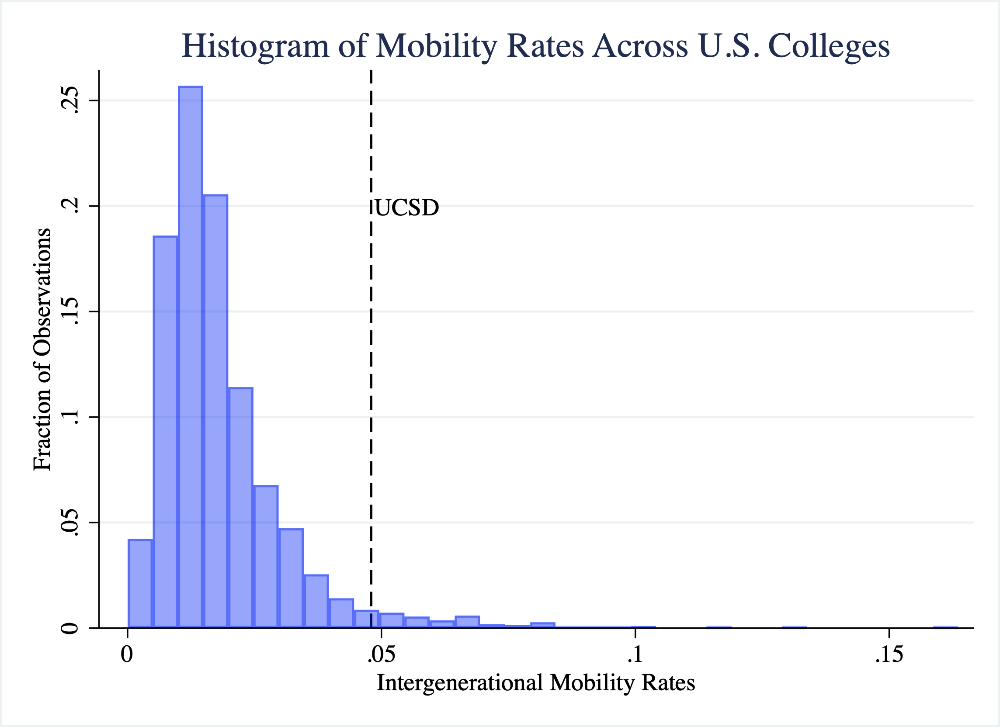
<p class="caption">(\#fig:histae7)Histogram of College Mobility Rates (Adding Vertical Line with Text)</p>
</div>

## Conclusion 

In this module, we studied a college's intergenerational mobility rate. We found wide ranges of mobility rates across U.S. colleges. Some colleges have rates close to zero, which can be due to either (1) very low access to low-income students or (2) low success rates of students. Next, let's discuss what else we can learn from this data.

In Figure \@ref(fig:avss) we plot both the access (fraction from low-income backgrounds) vs. the success (percent of low-income students achieving high income).

<div class="figure" style="text-align: center">
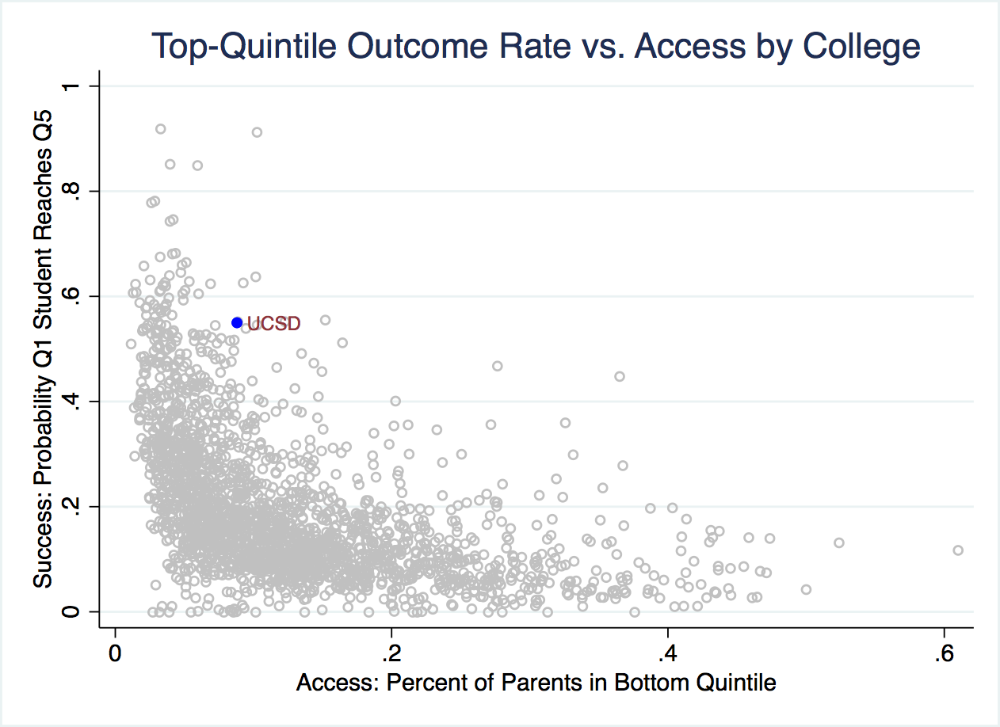
<p class="caption">(\#fig:avss)Access vs. Success Across Colleges</p>
</div>

In Figure \@ref(fig:avss), rates of college mobility increase in both the vertical and horizontal axes. In other words, higher mobility rates are observed for colleges with both high access and success. As we can see in the figure, UCSD is highlighted. UCSD has a relatively high success rate. There aren't that many colleges with higher levels of success. However, it's access rate is not particularly high. You can see that there are many many markers to the right of UCSD. This means there are many colleges with higher access than UCSD. The reason UCSD's mobility rate is relatively high is primarily due to its high success rate of graduates. 

Although the data we used was a snapshot of a point in time, Opportunity Insights also has data about how colleges have been changing over time. Figure \@ref(fig:ucsdaccess) plots the fraction of students coming from different quantiles of the income distribution over time.

<div class="figure" style="text-align: center">
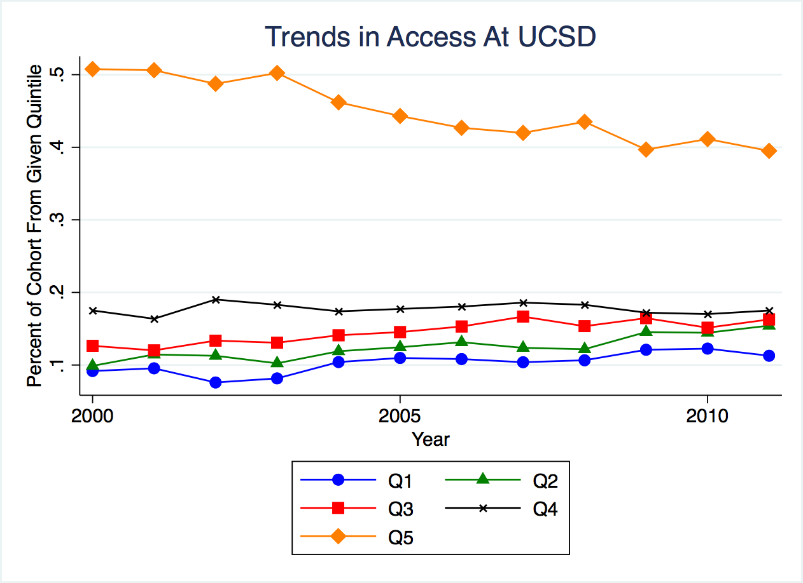
<p class="caption">(\#fig:ucsdaccess)Trends in Access at UCSD</p>
</div>

As can be seen in this figure, the fraction coming from Q5 (the top 20 percent of earners) is much greater than the other income quantiles. It starts at 0.5, indicating half of all students have parents in the top 20 percent of the income distribution. However, this number has been trending down over time. By 2013, the fraction coming from the top quintile has decreased to around 0.4 or 40 percent. 

We can also plot a similar figure with success rates by quintile of parental income. Figure \@ref(fig:ucsdsess) plots the success rate separately by the parental background of students.

<div class="figure" style="text-align: center">
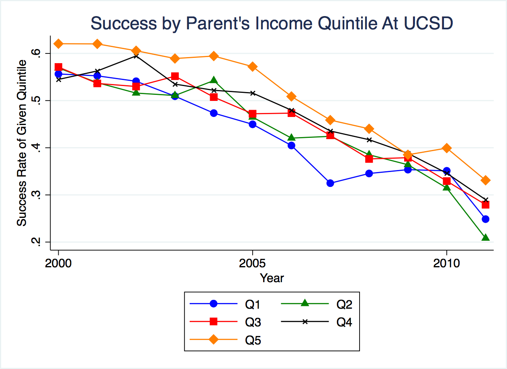
<p class="caption">(\#fig:ucsdsess)Trends in Success at UCSD by Quintile</p>
</div>

As can be seen in this figure, different quantiles have relatively similar success rates. Researchers at Opportunity Insights study this across many different colleges, and find, on average, success rates are similar across the quintiles of parental background. 

This works against a "mismatch hypothesis" that is sometimes discussed in policy circles. The hypothesis is that increasing access at elite universities to more lower-income students may not actually benefit these low-income students if they are unprepared for the curriculum. In other words, maybe it is better to go to a low-ranked school if there is a chance you will fail out of a higher-ranked school. But Opportunity Insights does not find evidence of this, on average. They find similar success rates for low-income and high-income students. 

You will note in Figure \@ref(fig:ucsdsess) success seems to be trending downward over time. This might be slightly misleading. Income in this data is measured in 2014. If UCSD students from recent cohorts are more likely to attend some form of graduate school, then earnings in 2014 might not reflect lifetime earnings. This could explain why there is a dip in these later cohorts.  

UCSD had relatively high mobility rates, but is far from the highest. Next, let's now look at the colleges with the highest mobility rates. Figure \@ref(fig:topmobility) shows a list of schools with the highest mobility rates.

<div class="figure" style="text-align: center">
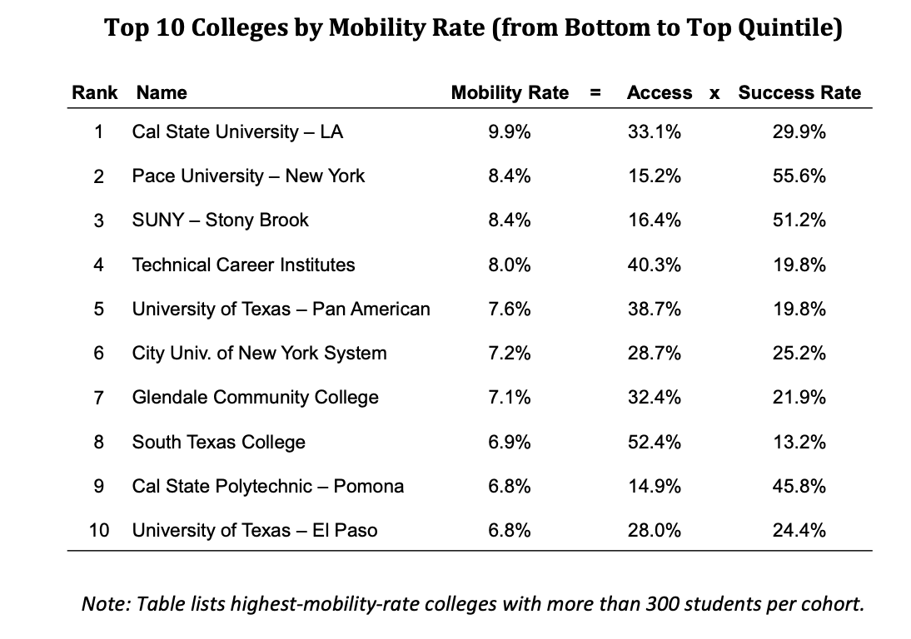
<p class="caption">(\#fig:topmobility)Schools with the Highest Mobility Rates</p>
</div>

What do many of these top schools have in common? They are mid-tier state schools. These schools appear very effective at promoting intergenerational mobility rates. The key is they tend to have high access rates, as well as reasonably high success rates. But how do trends in access look over time?

<div class="figure" style="text-align: center">
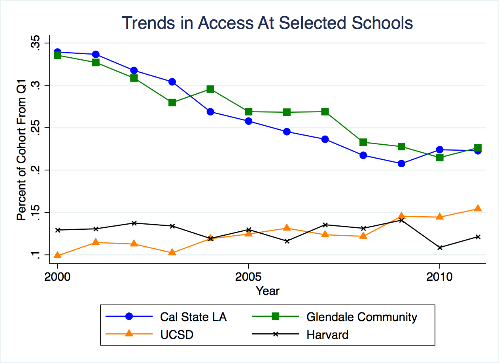
<p class="caption">(\#fig:trendstopmobility)Trends in Schools with the Highest Mobility Rates</p>
</div>

Glendale and Cal State LA are two schools with very high mobility rates. But at these schools, the access rate is actually decreasing over time. In 2000 about 35 percent of students were coming from low-income backgrounds. In 2010, this has declined to a little more than 20 percent. 

Before we end this module, let's discuss a few key takeaways from the researchers at Opportunity Insights. First, access varies widely by parental income, but success does not. Despite numerous policies aimed at increasing low-income enrollment at elite universities (e.g. Harvard), we do not see increases in low-income enrollment over time at these universities

At the same time, many schools with very high access rates have been trending towards lower access in recent years. Opportunity Insights suggests changing admissions criteria or increasing transfers from community colleges could be effective policies in promoting intergenerational mobility (among other potential policy solutions).


## <u>Command Descriptions</u> {-}


::: {.rmdnote}

**<u>Setup Commands</u>**

- `cd filepath` – this changes the working directory in Stata You should replace
``filepath`` with a file path of your choosing. If you have spaces in your file path, you need to put it into quotation marks.


- ``clear all`` -- clears data from Stata

**<u>Data Exploration Commands</u>** 

- ``describe`` -  describes the dataset and gives you information on the variables, types of variables, variable labels and number of observations.

- ``browse`` - this opens up the data so that you can look at the values (like an excel spreadsheet).

- ``summarize varname`` - retrieves summary statistics such as the mean, min and max for the variable named ``varname``. To summarize all variables just type summarize. Add the option ``, detail`` to retrieve more statistics, such as percentiles.

- ``tab varname`` -- tab retrieves a table of frequencies. This can be used for string variables as well as categorical variables. For example, if you have a categorical named region, then the command ``tab region`` will display the number of observations in each region. 

If you are trying to decide between ``tab`` and ``summarize``, use ``summarize`` if the variable takes on many different values. Use ``tab`` if the variable takes on only a few values.

**<u>Data Manipulation/Data Generation Commands</u>**

- ``gen newvar = exp`` - ``gen`` is used to generate new variables. ``newvar`` is the name of the new variable, while ``exp`` denotes an expression. For example, if you want a new variable named ``sum`` which is the addition of ``x1`` and ``x2`` then you can type ``gen sum = x1 + x2``.

- ``replace var = exp`` - replaces the values of variable ``var`` to the value in the ``exp``. For example, if I have a numeric variable in which ``-99`` refers to missing values (as is sometimes the case in surveys). I can type ``replace var = . if var==-99`` to replace the variable to missing if the variable is currently equal to -99.

**<u>Graphing Commands</u>**

- <code>histogram var, frac</code> -- computes a histogram (an approximation of the distribution of a continuous variable). There are many options to change the format of the graph. In this version of the code ``, frac`` is specified so that the vertical axis depicts the fraction of observations that falls within each bin.
:::

## References {-}
