# Classroom Technology

## Disrupting Education Intro


<html>
<head>
<style>
code {
  background-color: #f1f1f1;
}
</style>
</head>
<body>


Many developing countries have rapidly expanded access to education. However, not all places see measurable gains in learning. For example, in India, over 50 percent of students in grade 5 cannot read at a grade 2 level, despite enrollment rates around 95 percent (Pratham 2017)[@pratham2017].

One hypothesis behind this puzzling fact is termed the mismatch hypothesis. If the curriculum is beyond a student's level of understanding, they may learn very little, even if attendance is high. In other words, there is a mismatch between the level of understanding and the curriculum being taught. In Muralidharan, Singh and Ganimiam (2019)[@msg2019disrupting], the authors study whether a technology that aims to "Teach at the Right Level" can be used to improve learning outcomes. This is an important question: we need to find interventions that work! It is not necessarily true that more investment in education results in better outcomes if we are investing in the wrong things.

The technology the authors study is called Mindspark. Mindspark is a computer software that provides learning materials that are appropriate for a student's understanding level. It does this by using information on what questions a student gets right vs. wrong. The level of material only increases in difficulty once the student has learned the previous concepts. Mindspark centers provide 6-day-a-week instruction for 90 minutes (45 minutes with Mindspark, 45 minutes with a teaching assistant). The question in Muralidharan, Singh and Ganimiam (2019) is: does this program improve learning outcomes?

To answer this question, the authors recruited participants from low-income neighborhoods in Delhi. At demonstration sessions for Mindspark, parents were introduced to the program. All participants interested in participating needed to fill out a baseline assessment. Then, parents were told that about half of the participants would receive a voucher that waived tuition for the Mindspark program (participants were chosen by lottery). Students not chosen by lottery were told they would obtain free access to the centers after February 2016 (after the experiment had concluded). The result is 619 participants, 305 in the control (i.e. no access to Mindspark) and 314 in the treatment (access to Mindspark)

To begin, let's load the dataset ``mindspark_data.dta``


```stata
cd "/Users/davidarnold/Dropbox/Teaching/EP5/online/04_week/data"
use mindspark_data.dta, replace
/Users/davidarnold/Dropbox/Teaching/EP5/online/04_week/data
```

As usual, let's begin by describing the dataset 

<div class="figure" style="text-align: center">
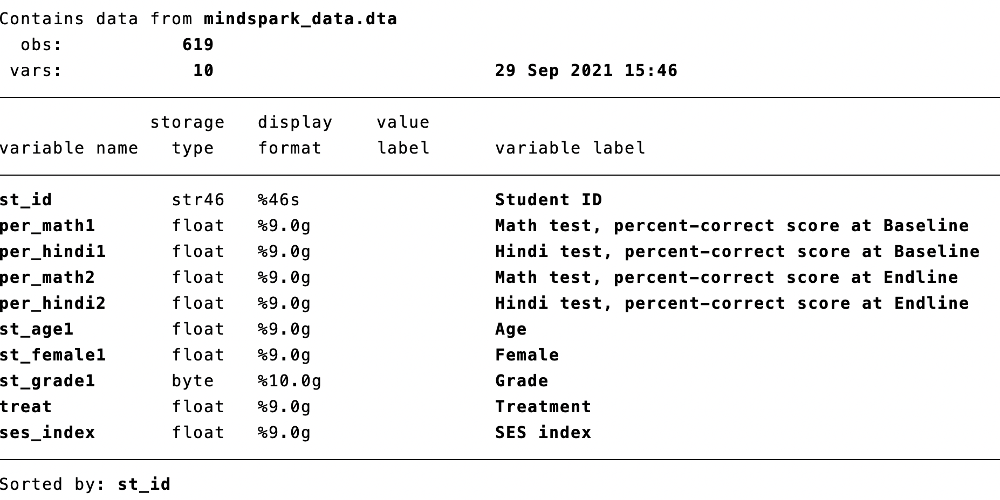
<p class="caption">(\#fig:msdescribe)Describing the Mindspark Data</p>
</div>

This is a subset of all variables in Muralidharan, Singh, and Ganimian (2019). We are interested in how being treated impacts learning outcomes. We have information about Math and Hindi tests at both the baseline and endline. Baseline means the test was taken before any student has been offered free Mindspark. Endline means the test was taken after the treated students had received Mindspark and had been using the software for several months. To start, let's summarize these variables to get a sense of average test scores as well as the variation in test scores at baseline.


```stata
sum per_math1
sum per_hindi1
```


```
    Variable |        Obs        Mean    Std. dev.       Min        Max
-------------+---------------------------------------------------------
   per_math1 |        619    .3177475    .1115478          0   .7428572

    Variable |        Obs        Mean    Std. dev.       Min        Max
-------------+---------------------------------------------------------
  per_hindi1 |        619    .4278406      .16484          0         .9
```

At the baseline, the average score on the math test was 0.318. This indicates that on average across students, the average score was 31.8 percent on the math test. For the Hindi test, the average was a bit higher at 0.428. Now let's look at endline scores.


```stata
sum per_math2
sum per_hindi2
```


```
    Variable |        Obs        Mean    Std. dev.       Min        Max
-------------+---------------------------------------------------------
   per_math2 |        539     .503101    .1725604          0   .9411765

    Variable |        Obs        Mean    Std. dev.       Min        Max
-------------+---------------------------------------------------------
  per_hindi2 |        539    .5521954    .1911098          0   .9666666
```

At endline, scores are higher. The average math score has increased to 0.503 and the average Hindi score has increased to 0.552. Our ultimate goal, however, is to understand how test scores change depending on whether you are given access to Mindspark. In other words, do test scores at endline depend on whether ``treat==1`` or ``treat==0``? Before we start analyzing the data, however, we are going to learn a new statistical technique: **regression**.


## Linear Regression (Theory) 

Linear regression estimates a linear relationship between variables. Before getting to the estimation part, let's first review linear equations. A linear equation is any equation that can be written in the following form 

$$
y=mx+b
$$

Where $m$ is the slope and $b$ is the intercept. For example, there is a linear relationship between degrees in Celsius (C) and degrees in Fahrenheit (F)

$$
F= 1.8 \cdot C + 32
$$

<div class="figure" style="text-align: center">
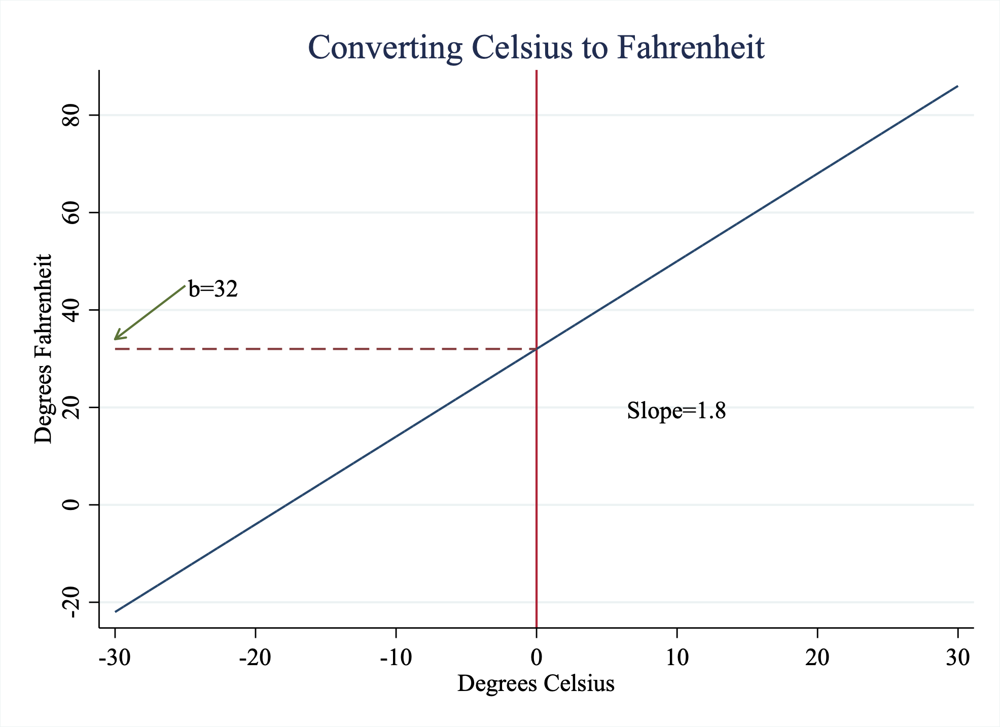
<p class="caption">(\#fig:ctof)Converting Celsius to Fahrenheit</p>
</div>

In this example, there is a direct linear relationship between these two variables, Celsius and Fahrenheit. Often in the social sciences, we are interested in **estimating** the relationship between two variables. How much does education increase income? Does precipitation impact voter participation? One way to understand how two variables are related is through estimating linear relationships. **Linear Regression** is a way to estimate linear relationships between one or more variables

We want to model some outcome of individuals $Y_i$ as a function of some explanatory variable of the individual $X_i$ (in math: $Y_i=f(X_i)$). $Y_i$ is often referred to as the dependent variable (or outcome variable). $X_i$ is often referred to as the independent variable (or explanatory variable). If we assume the function $f(X_i)$ is linear, then we can write this model as 

$$
Y_i = \beta_0 + \beta_1 \cdot X_i + \varepsilon_i \nonumber
$$

Imagine we hypothesize that students who watch too much TV the night before a test perform worse. Then we want to understand if test scores (our outcome variable $Y_i$) is related to hours of TV watched (our explanatory variable $X_i$). We could posit a linear relationship between the two 

$$
\text{Test Score}_i = \beta_0 + \beta_1 \cdot \text{Hours Watched TV}_i + \varepsilon_i 
$$

The parameters of the model are the parameters we are estimating. In a linear regression model, there are two parameters we need to estimate: $\beta_0$ and $\beta_1$ as the parameters of the model. We use "hats" to denote the estimates of these parameters. $\hat{\beta}_0$ is the estimate of the intercept. $\hat{\beta}_1$ is the estimate of the slope coefficient. We choose $\hat{\beta}_0$ and $\hat{\beta}_1$ to construct a regression line that best fits our data.

But what does best fit actually mean? We choose $\hat{\beta}_0$ and $\hat{\beta}_1$ to minimize the sum of squared errors ($\sum \varepsilon_i^2$). Choosing the parameters to minimize the sum of squared errors is referred to as **Ordinary Least Squares** and is commonly simply referred to as linear regression.

 
How do we go about finding the best fit? Let's consider estimating the relationship between the two variables below in Figure \@ref(fig:reg2). On the horizontal axis, we have hours spent watching TV, while on the vertical axis, we have how the student performed on the test. In this example, we have only four data points.

<div class="figure" style="text-align: center">
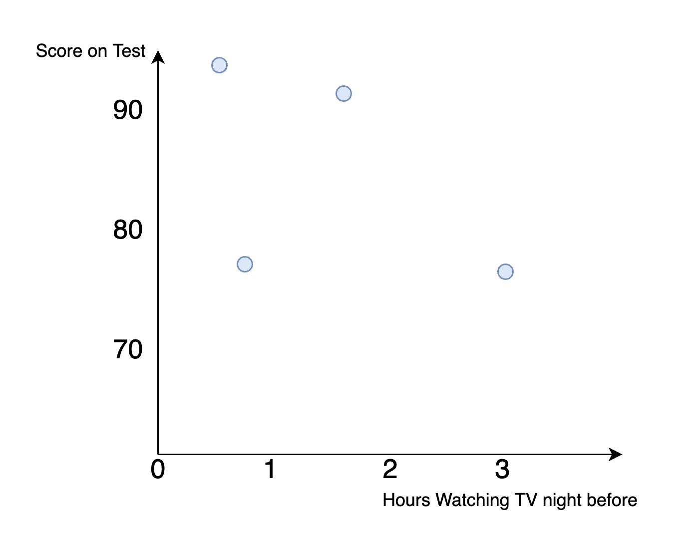
<p class="caption">(\#fig:hypreg2)Hypothetical Dataset: Finding the Best Fit Line</p>
</div>

Let's draw a line and then assess whether the fit is good or bad. Consider the line in Figure \@ref(fig:hypreg3).

<div class="figure" style="text-align: center">
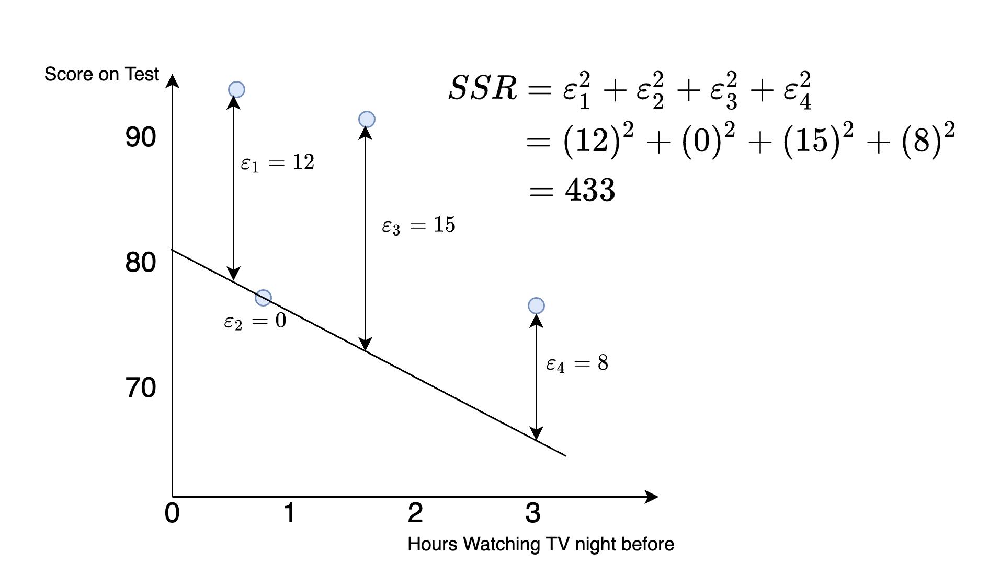
<p class="caption">(\#fig:hypreg3)Hypothetical Dataset: Finding the Best Fit Line</p>
</div>

How well does this line fit? To measure this we take the difference between the line and the actual values, which is known as the residual. Some residuals are negative (meaning the actual value is less than that predicted based on our line), while others are positive (meaning the actual value is greater than that predicted based on our line). In terms of "fit" we don't care about whether the error is positive or negative, which is why when we assess fit we first "square" the residuals. The square of all residuals will then be a positive number, with larger positive numbers indicating higher error. 

To construct one number that tells us how well the line fits the data we construct the sum of squared residuals. In this example, this number is given by 

$$
SSR = (12)^2+(0)^2+(15)^2+(8)^2=433
$$

Now, let's try to draw a new line and assess whether the fit is improved. Consider the line in Figure \@ref(fig:hypreg4)

<div class="figure" style="text-align: center">
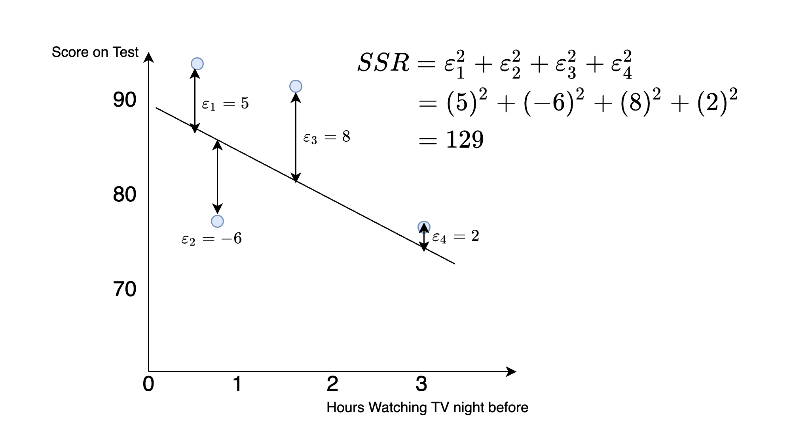
<p class="caption">(\#fig:hypreg4)Hypothetical Dataset: Finding the Best Fit Line</p>
</div>

We can again compute the sum of squared residuals, which is now equal to:

$$
SSR = (5)^2+(-6)^2+(8)^2+(2)^2=129
$$
So comparing this to the previous line, we can see this fits better. The sum of squared residuals is smaller. Intuitively, this indicates the points we are trying to predict (the test scores) are closer to the line in Figure \@ref(fig:hypreg4) than in Figure \@ref(fig:hypreg3).

Now, linear regression picks the line that minimizes the SSR. Lucky for us, we don't need to keep drawing hypothetical lines and computing the SSR to figure out the solution. There is a mathematical solution to this problem which you will learn about in future statistics or econometrics courses. What that means for our purposes is that computers can find the line that best fits the data very fast. 

## Predicted Values

Now that we have learned how the linear regression line is estimated, let's talk about what we can do with this information. The first concept we will introduce is **predicted values** or **fitted values**. To understand this concept, we are first going to set up a real-world application. 

For this application, we are interested in the relationship between life expectancy in a country and the average income in a country. We propose modeling life expectancy as a linear function of average income:

$$
\text{Life Expectancy}_i = \beta_0 + \beta_1 \cdot \text{Average Income in 1000s}_i + \varepsilon_i
$$

Figure \@ref(fig:scatter1) plots the life expectancy in a country vs the average income, which is stored in \$1,000 US dollars. For example, a value of 50 indicates that the average income in that country is 50,000 U.S. dollars per year. 

<div class="figure" style="text-align: center">
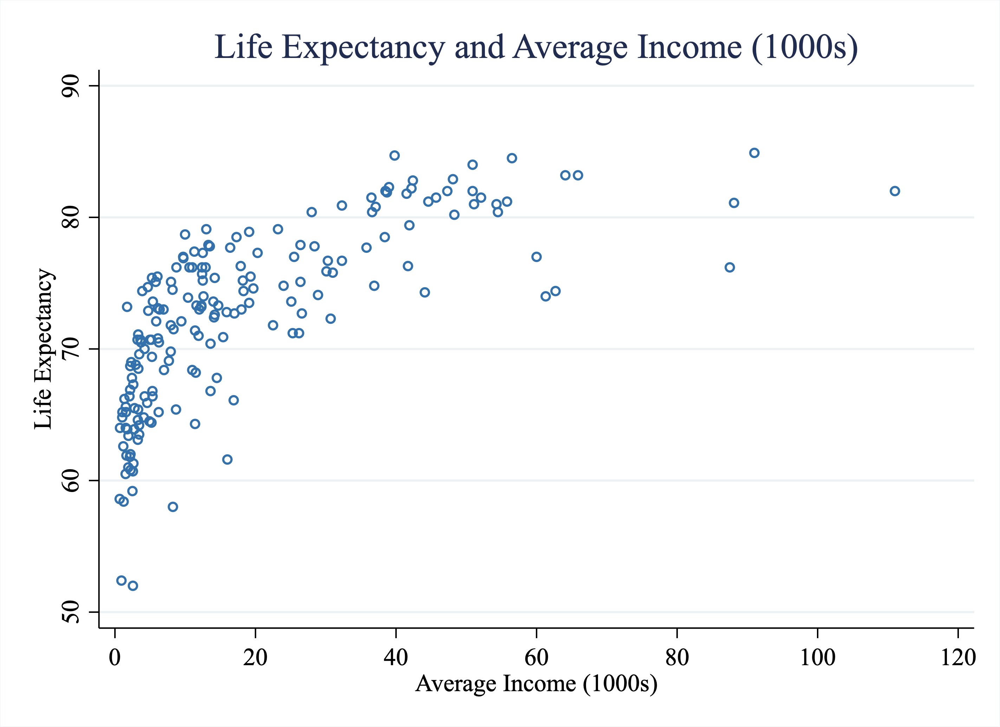
<p class="caption">(\#fig:scatter1)Life Expectancy vs. Average Income (1000s) Across Countries</p>
</div>

Imagine now we use linear regression to fit a line to the data in Figure \@ref(fig:scatter1). Imagine we find $\hat{\beta_0}=67.97$ and $\hat{\beta_1}=0.24$. These values define a line with an intercept equal to 67.97 and a slope equal to 0.24. Our question now is, what can we do with this information?

Well, one thing we can do is form predictions for life expectancy given a value of average income. In other words, if I tell you a country's average income, you could use the linear regression estimates to predict what the life expectancy in that country is. In social sciences, there is sometimes less emphasis on prediction. However, in many settings, one might be interested in forming predictions. For example, imagine you work for a company that is trying to predict who will buy their good based on the characteristics of individuals. You could use linear regression for this prediction problem. In policy settings, decisions often depend on predictions. For example, a policymaker may want to predict whether a given defendant will recidivate if released on parole. Linear regression is one (powerful) way to form predictions. It is likely the first tool you will learn in most machine learning classes which focuses primarily on prediction. 

Imagine I tell you a country has an average income of \$50k. How do we use the regression results to form our best guess for the life expectancy in this country? Well, to begin, let's plot the line that best fits the data. The orange line in Figure \@ref(fig:bestfit1) is the line of best fit. It is a line with an intercept equal to 67.97 and a slope coefficient equal to 0.24.

<div class="figure" style="text-align: center">
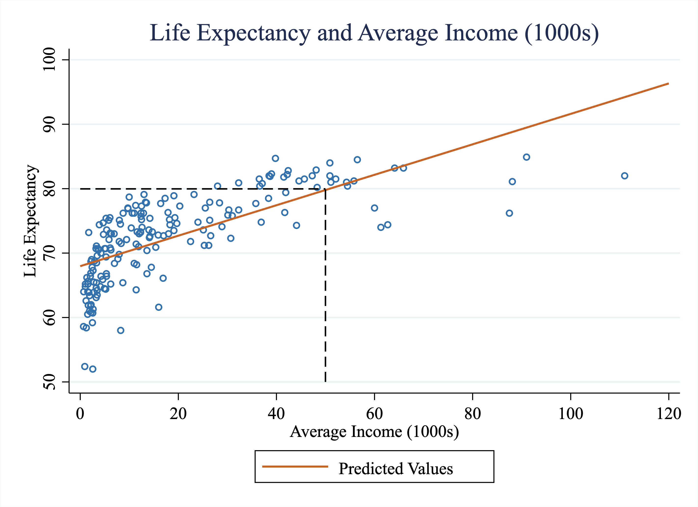
<p class="caption">(\#fig:bestfit1)Life Expectancy vs. Average Income (1000s) Across Countries</p>
</div>

One way to interpret this line is that this is our best (linear) prediction of life expectancy given average income. In other words, if we want to predict the life expectancy for a country with an average income of \$50k, we can just find what our line would predict for this country. In Figure \@ref(fig:bestfit1), we have added a dashed line at an average income \$50k. At an average income of \$50k, it appears as if the value of the line is around 80. But we don't need to just eyeball this graph to figure this information out. We have the exact parameters of this line from our regression estimates. We know the intercept is 67.97 and the slope coefficient is 0.24. Therefore, we can use the linear equation to form the predicted life expectancy of a country with income equal to \$50k:


$$
\text{Predicted Life Expectancy}_i = 60.97 + 0.24 \cdot 50 = 79.97
$$

In general, if you want to form the predicted value for an observation with a value of $X_i$, you can form 

$$
\text{Predicted Y}_i = \hat{Y}_i= \hat{\beta_0} + \hat{\beta}_1 \cdot X_i
$$
It is common to denote the predicted value for an observation $i$ as $\hat{Y}_i$.

Now, of course, any prediction is prone to error. Even complex predictions that use potentially hundreds of variables won't always be right. For example, Netflix uses a complicated machine-learning algorithm to predict what shows to recommend you. But they are sometimes wrong. Sometimes you are not interested in the recommended shows. 

Therefore, it is often helpful to characterize the error associated with a model. For a given observation, the error associated with the model is given by 

$$
\text{Error}_i = \text{Actual}_i-\text{Predicted}_i
$$

For example, the U.S.'s average income is 60k. If I use the regression model to predict Life Expectancy, I would get:

$$
\text{Predicted Life Expectancy}_i = 67.97 + 0.24 \cdot 60 = 82.37
$$

In other words, based on the U.S.'s average income, I expect the life expectancy to be 82.37 years. But when I look in the data, I see that it is actually 77 years. Therefore, the error associated with the U.S. is equal to


$$
\text{Error}_i = \text{Actual}_i-\text{Predicted}_i = 77-82.37=-5.37
$$
Therefore, the actual life expectancy in the U.S. is 5.37 years lower than the life expectancy predicted by the linear model.

As we have alluded to, there are other ways to form predictions. In certain cases, this linear model might not be an appropriate way to model the data. Maybe the relationship does not appear particularly linear. For example, in Figure \@ref(fig:scatter1), it appears at low incomes, an increase in income results in a very steep rise in life expectancy. Then, at higher incomes, near \$60k, \$70k, it doesn't appear that increases in income are associated with increases in life expectancy. If I were given free discretion to draw a **curve** to the data, the curve would start out steep at low incomes, and get flatter at high incomes. In other words, the curve would be nonlinear. 

We are not going to cover nonlinear methods in this course. But it turns out that we can sometimes improve our model by simply changing the variables a bit. What we are going to try next is to estimate a linear regression that models life expectancy as a function of the **natural logarithm of average income**. In other words, we will estimate a linear regression of the following form.

$$
\text{Life Expectancy}_i = \beta_0 + \beta_1 \cdot \text{Ln(Average Income)}_i + \varepsilon_i
$$

The key difference is that we now have **Ln(Average Income)** as our explanatory variable. **Ln()** stands for natural logarithm. You have probably seen a graph with one of the variables "logged". This can be done for a few reasons. First, it can reduce the influence of outliers. The natural logarithm is a concave function, which in simple terms, means it shrinks large numbers more than it shrinks small numbers. A second reason that you often see logged graphs is that the relationship between two variables Y and X may be nonlinear, but the relationship between Y and ln(X) may be linear.

::: {.rmdnote}

There are different bases for the logarithmic function. We will always use the natural logarithm. This is by far the most widely used and interpretable. If you ever hear or read "log" in this class, always interpret this as "the natural logarithm".

In Stata, if you want to take the natural logarithm of a variable, you can use either ``log()`` or ``ln()``. For example, to create a variable that is equal to the natural logarithm of income, you could type either ``gen log_income = log(income)`` or ``gen log_income = ln(income)``

:::

Let's look at how "logging" changes our scatterplot. Figure \@ref(fig:scatter3) plots life expectancy against the natural logarithm of average income. As you can see, the relationship appears more linear now. Taking the natural logarithm shrunk the values of income for countries with high incomes more than countries with low incomes. The result in this setting is that the relationship between life expectancy and log average income appears more linear than the relationship between life expectancy and average income.

<div class="figure" style="text-align: center">
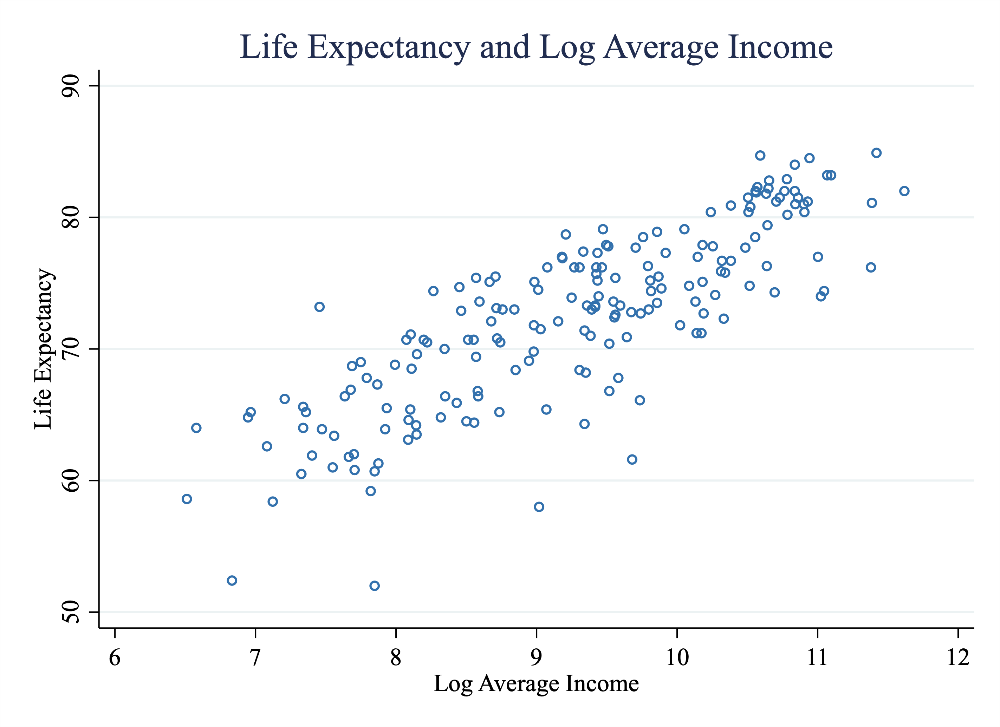
<p class="caption">(\#fig:scatter3)Life Expectancy vs. Log Average Income Across Countries</p>
</div>

So now imagine we find $\hat{\beta_0}=28.69$ and $\hat{\beta_1}=4.72$. I again ask what is the predicted life expectancy for a country with an average income of \$50k?

A very common mistake is forgetting to remember exactly what we are modeling. We are modeling life expectancy as a function of the natural logarithm of income. So to form the correct predicted value, we need to plug in $Ln(50000)$ into the equation for our best-fit line:

$$
\text{Predicted Life Expectancy}_i = 28.69 + 4.72 \cdot Ln(50000) = 79.76
$$
Now, imagine we had forgotten to take the logarithm. If we had instead plugged in 50 (like when the X-variable was income in the thousands), we would get: 

$$
\text{Predicted Life Expectancy}_i = 28.69 + 4.72 \cdot 50 =264.69
$$

We should immediately realize that 264.69 is way too high a life expectancy. You should always think about the numbers you get when forming predictions. If they seem wildly off, then you may have forgotten to transform a variable appropriately.

## Slope Coefficient

As social scientists, we are often interested in how changes in our explanatory variable ($X$ variable) are associated with changes in our outcome variable ($Y$ variable). The slope coefficient ($\beta_1$) in our linear regression model is informative about this.

Recall that we modeled Life Expectancy as a linear function of Average Income (1000s) and found 

$$ 
\text{Predicted Life Expectancy}_i = 67.97 + 0.24 \cdot \text{Average Income 1000s}_i 
$$

The slope coefficient captures how changes in Average Income (1000s) are associated with changes in Predicted Life Expectancy.

To understand the interpretation of the slope coefficient (0.24), let's go through a simple example. Imagine I tell you I have two countries, Country A and Country B. Country A has an Average Income of \$50k. Country B has an Average Income of \$51k. What is the expected difference in Life Expectancy between these two countries?

We can form the Predicted Life Expectancy in both of these countries:
$$
\text{Predicted Life Expectancy A} = 67.97 + 0.24 \cdot 50 \nonumber \\
\text{Predicted Life Expectancy B} = 67.97 + 0.24 \cdot 51 \nonumber
$$

Taking the difference between these two yields 

$$
\text{Difference in Predicted Life Expectancy} = 0.24 = \text{slope coefficient} 
$$

The slope coefficient is generally reported in order to understand the magnitude of a relationship. The general interpretation is:

::: {.rmdnote}

Interpretation of slope coefficient: A 1-unit change in X is associated with a **slope-coefficient** unit change in the Y variable

:::

When you actually discuss your results, though, you want to be clear about what a unit represents. For example, in our example, we would write a 1-unit change in Average Income (1000s) is associated with 0.24-year increase in Life Expectancy.

This discussion highlights an important to keep in mind when discussing results: always be clear with units. For example, in this case, our X-variable (Average Income) was denoted in the thousands. This is why 50 was plugged for the calculation of predicted life expectancy for Country A, not 50,000. To highlight the confusion that can occur if you are not careful about units, let's turn back to our regression in which X is equal to Ln(Average Income):

$$
\text{Predicted Life Expectancy}_i = 28.69 + 4.72 \cdot \text{Ln(Average Income)} 
$$
How do we interpret the slope coefficient now? A 1-unit change in Ln(Average Income) is associated with a 4.72-year increase in life expectancy. 

The reason the coefficient is so much bigger now is simply because a 1-unit change in Ln(Average Income) is much larger than a 1000-dollar change in income. For example, imagine we compare two countries, one with $\text{Ln(Average Income)}=9$ and another with $\text{Ln(Average Income)}=10$. The Average Income in levels for a country with $\text{Ln(Average Income)}=9$ is about 8,103 U.S. dollars (i.e. $Ln(8103) \approx 9$). The Average Income in levels for a country with $Ln(Average Income)=10$ is about \$22026 dollars. So a 1-unit change in Ln(Average Income) is quite large when translating to dollars in levels. 

::: {.rmdtip}

**Concept Check**

Try to figure out what an increase from $Ln(Average Income)=10$ to $Ln(Average Income)=11$ is in levels. In Stata, if you want to figure out how to transform $Ln(Average Income)=10$ to $Average Income$, you can type ``di exp(10)``. This gives you the correct answer because the exponential function is the inverse of the natural logarithm function $exp(Ln(average income))=average income$.

:::

In almost all of our applications, we are interested in the relationship between some outcome $Y$ and some explanatory variable $X$. The way we gauge the magnitude of this relationship in a regression framework is through the slope coefficient. The slope coefficient captures how much we expect $Y$ to change in response to a 1-unit change in $X$. That is why the slope coefficient plays such a pivotal role in social science research. 

## Regression (Stata)

Now that we understand the concept of linear regression, let's learn how to estimate a linear regression in Stata. To begin, we are going to set up the general linear regression framework.

$$ 
Y_i = \beta_0 + \beta_1 X_i + \varepsilon
$$

The basic syntax for the ``reg`` command is:


```stata
reg yvar xvar
```
  
This will produce a table with many statistics. For now we will focus on the intercept $\hat{\beta_0}$ and slope $\hat{\beta_1}$. To see how this works in practice, let's load up the data on life expectancy and average incomes across different countries, which is named ``gapminder.dta``. 


```stata
/*load data*/ 
cd "/Users/davidarnold/Dropbox/Teaching/EP5/online/04_week/data"
use gapminder.dta, replace 
/Users/davidarnold/Dropbox/Teaching/EP5/online/04_week/data
```

Reminder, we are modeling life expectancy as a function of income per capita (in the thousands). This means our dependent variable (or Y-variable) will be life expectancy and our independent variable (or X-variable) will be income per capita (in the thousands). Now let's estimate the regression:


```stata
reg life_expectancy average_income
```


```
      Source |       SS           df       MS      Number of obs   =       186
-------------+----------------------------------   F(1, 184)       =    178.14
       Model |  4150.14525         1  4150.14525   Prob > F        =    0.0000
    Residual |  4286.67682       184  23.2971567   R-squared       =    0.4919
-------------+----------------------------------   Adj R-squared   =    0.4891
       Total |  8436.82208       185  45.6044436   Root MSE        =    4.8267

--------------------------------------------------------------------------------
life_expecta~y | Coefficient  Std. err.      t    P>|t|     [95% conf. interval]
---------------+----------------------------------------------------------------
average_income |   .2363563   .0177087    13.35   0.000      .201418    .2712945
         _cons |   67.97336   .4874037   139.46   0.000     67.01174    68.93498
--------------------------------------------------------------------------------
```

So there are a lot of numbers in the table above. The ones we will focus on are under the column "Coefficient." The first coefficient is in the row that begins with ``average_income``. This is the slope coefficient. This number tells you how a 1-unit change in ``average_income`` is predicted to change the Y-variable. In this case, the regression tells us that a 1-unit change in average income (which is denoted in the 1,000s) is associated with a 0.24-year increase in life expectancy. In simpler terms, a \$1,000 dollar increase in average income is associated with a 0.24-year increase in life expectancy.

The intercept of the linear regression model appears in the next row, next to the label ``_cons``. The label ``_cons`` stands for constant. The terms intercept and constant are often used interchangeably in linear regression models. 

From this output, you should be able to draw the linear regression line. A good exercise is to try and draw this with pen and paper, instead of using Stata. If you can draw it correctly, then that indicates you understand the various components of this output. 

It is easy to check your work using built-in functions in Stata. Stata can plot the regression line for you through the ``twoway lfit`` command. ``lfit`` stands for linear fit. The basic syntax of the command is to type:


```stata
twoway lfit yvar xvar
```

This will plot the linear regression line from the output of:


```stata
reg yvar xvar
```

In our example, to plot the linear regression line, along with the scatter plot, we can type:


```stata
twoway scatter life_expectancy average_income, ///
	msymbol(circle_hollow) msize(small) ///
	|| lfit life_expectancy average_income, lw(0.4) lc(red) ///
    title("Regression of Life Expectancy on Average Income") ///
    xtitle("Average Income (1000s)") ///
    ytitle("Life Expectancy") ///
    graphregion(color(white) fcolor(white)) 
```

This code will generate Figure \@ref(fig:bestlfit) below.

<div class="figure" style="text-align: center">
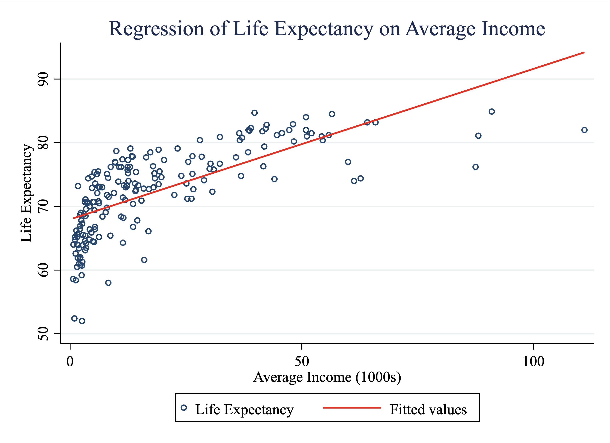
<p class="caption">(\#fig:bestlfit)Life Expectancy vs.Average Income Across Countries</p>
</div>

## Predict

In this section, we will discuss how to form predicted values in Stata. To remind you, the predicted value for an observation is equal to:

$$
\text{Predicted Value}_i = \hat{\beta_0} + \hat{\beta}_1 X_i
$$
In our example

$$ 
\text{Predicted Life Expectancy}_i = \hat{\beta_0} + \hat{\beta}_1 \cdot \text{Average Income}_i
$$
We can manually construct predicted values for every country in our dataset. We just need to take the value of average income and form predicted value using the linear regression output. However, we can also do this quickly and efficiently using the ``predict`` command. The most basic syntax of the ``predict`` command is 


```stata
predict newvar
```

You just need to replace the word ``newvar`` with whatever you want the variable that holds predictions to be named. 

Our first step when forming predictions is to first to estimate the regression (``predict`` uses the results from the most recently executed regression estimation). In other words, the ``predict`` command won't work if you don't estimate a regression first. We are going to estimate the regression from the prior section:


```stata
reg life_expectancy average_income
```


```
      Source |       SS           df       MS      Number of obs   =       186
-------------+----------------------------------   F(1, 184)       =    178.14
       Model |  4150.14525         1  4150.14525   Prob > F        =    0.0000
    Residual |  4286.67682       184  23.2971567   R-squared       =    0.4919
-------------+----------------------------------   Adj R-squared   =    0.4891
       Total |  8436.82208       185  45.6044436   Root MSE        =    4.8267

--------------------------------------------------------------------------------
life_expecta~y | Coefficient  Std. err.      t    P>|t|     [95% conf. interval]
---------------+----------------------------------------------------------------
average_income |   .2363563   .0177087    13.35   0.000      .201418    .2712945
         _cons |   67.97336   .4874037   139.46   0.000     67.01174    68.93498
--------------------------------------------------------------------------------
```

Now that the regression has been estimated, we can form predictions 


```stata
predict predicted_life_expectancy
(option xb assumed; fitted values)
```

Now a variable ``predicted_life_expectancy`` has been added to our dataset. Let's look at the value of predictions for the first three countries in our dataset. 


```stata
list country life_expectancy average_income predicted_life_expectancy if _n<=3
     |     country   life_e~y   averag~e   predic~y |
     |----------------------------------------------|
  1. | Afghanistan       63.4       1.92   68.42716 |
  2. |     Albania       77.9       13.3    71.1169 |
  3. |     Algeria       76.2       10.6   70.47874 |
     +----------------------------------------------+
```

So the first country is Afghanistan. The life expectancy in Afghanistan is equal to 63.4 years. The average income in Afghanistan is equal to 1,920 U.S. dollars per year. Given this average annual income, the linear model predicts the life expectancy in Afghanistan would be 68.4 years.

You will notice our predictions are prone to error. In some cases, we may want to generate a new variable that has the error associated with a given observation. Now that we have formed ``predicted_life_expectancy`` we can form the ``error`` as 


```stata
gen error = life_expectancy - predicted_life_expectancy

```

Let's ``summarize`` our new ``error`` variable 


```stata
sum error
    Variable |        Obs        Mean    Std. dev.       Min        Max
-------------+---------------------------------------------------------
       error |        186   -2.05e-08     4.81365  -16.57843   8.367805
```

The mean is about zero (which is by construction, the regression line is chosen so that on average the predictions are correct). There is a large variance though, for some countries the life expectancy is much lower than expected (negative error), while some it is much higher. 

Let's look at the 3 countries with the most negative errors (implying life expectancy is much lower than predicted from income):


```stata
sort error
list country life_expectancy predicted_life_expectancy error if _n<=3
     |                  country   life_e~y   predic~y       error |
     |------------------------------------------------------------|
  1. |                  Lesotho         52   68.57843   -16.57843 |
  2. | Central African Republic       52.4    68.1927   -15.79269 |
  3. |                    Qatar       76.2   88.65453   -12.45454 |
     +------------------------------------------------------------+
```

We can also look at the 3 countries with the most positive errors (implying life expectancy is much higher than predicted from income):


```stata
sort error
list country life_expectancy predicted_life_expectancy error ///
if _n>=184
     |  country   life_e~y   predic~y      error |
     |-------------------------------------------|
184. |    Japan       84.7   77.38034   7.319656 |
185. | Maldives       79.1   71.04599   8.054008 |
186. |     Cuba       78.7   70.33219   8.367805 |
     +-------------------------------------------+
```

It is sometimes interesting to explore what observations are hard to predict for our model. In these countries with very negative or very positive errors, there are likely many other factors that are impacting life expectancy, besides average income. This could be why we have a hard time predicting life expectancy for these countries.

## Macros

Before continuing our discussion of regression, we are going to discuss the concept of **macros**. Macros are simply words or characters that store certain output. In Stata, many commands store the results of commands in **macros**. For example, after the ``sum`` command, the value of the mean is stored in the macro ``r(mean)``. To see how these work in practice, let's continue with our example that studies the relationship between life expectancy and average income. 

To begin, let's summarize the ``life_expectancy`` variable:


```stata
sum life_expectancy
    Variable |        Obs        Mean    Std. dev.       Min        Max
-------------+---------------------------------------------------------
life_expec~y |        186    72.44624    6.753106         52       84.9
```

The mean life expectancy is equal to 72.45. Stata has automatically stored the mean in ``r(mean)``
To access the value within this macro, type:


```stata
di `r(mean)'
72.446237
```

This is often useful when you want to reference a value later in your code. Copying the value from the results window can be prone to transcription errors. Using macros that store the information will lead to fewer errors. 

After regressions, Stata also stores several useful results. In particular, Stata stores the value of the intercept and slope coefficient. In general, ``_b[varname]`` stores the coefficient estimate for a variable named ``varname``. 

For example, if we estimate:


```stata
reg life_expectancy average_income 
      Source |       SS           df       MS      Number of obs   =       186
-------------+----------------------------------   F(1, 184)       =    178.14
       Model |  4150.14525         1  4150.14525   Prob > F        =    0.0000
    Residual |  4286.67682       184  23.2971567   R-squared       =    0.4919
-------------+----------------------------------   Adj R-squared   =    0.4891
       Total |  8436.82208       185  45.6044436   Root MSE        =    4.8267

--------------------------------------------------------------------------------
life_expecta~y | Coefficient  Std. err.      t    P>|t|     [95% conf. interval]
---------------+----------------------------------------------------------------
average_income |   .2363563   .0177087    13.35   0.000      .201418    .2712945
         _cons |   67.97336   .4874037   139.46   0.000     67.01174    68.93498
--------------------------------------------------------------------------------
```

Then we can retrieve the coefficient on ``average_income`` by typing: 


```stata
di _b[average_income]
.23635625
```

You can retrieve the intercept by typing:


```stata
di _b[_cons]
67.973358
```

Using macros can be helpful when generating new variables. For example, we can form the predicted value of each observation by forming: 


```stata
gen predicted_value = _b[_cons] + _b[average_income]*average_income 
```

We could also do this "manually" by copying the values of the intercept and slope coefficient from our output, but using macros ensures we will not make any transcription errors.

Not only does Stata store useful macros for you, but you can also construct your own macros in Stata. This can be useful when you are typing something over and over that is very long. Instead of repeatedly typing, you can store the information in a macro. For example, one common way to use macros is to store a list of variables. In the next example, we will create a **global macro** that stores a list of variables. 


```stata
global vars = "average_income life_expectancy"

```

Now whenever I type ``\$vars`` into Stata, Stata will interpret it as "average_income life_expectancy". Let's see what happens if I type: 


```stata
sum $vars
    Variable |        Obs        Mean    Std. dev.       Min        Max
-------------+---------------------------------------------------------
average_in~e |        186    18.92431    20.03912       .673        111
life_expec~y |        186    72.44624    6.753106         52       84.9
```

One could do the same thing but with a "local" macro. 


```stata
local vars = "average_income life_expectancy"
sum `vars'
    Variable |        Obs        Mean    Std. dev.       Min        Max
-------------+---------------------------------------------------------
average_in~e |        186    18.92431    20.03912       .673        111
life_expec~y |        186    72.44624    6.753106         52       84.9
```

So what is the difference between a local macro and a global macro. In practice, you reference a global macro with a dollar sign ``$``, a local with apostrophes ```macro'``. Both can store the same information, but locals can only be accessed within a given Stata session. Many advise to only use local macros. Setting globals can conflict with other aspects of Stata. For our purposes, we will rarely need to use macros, let alone global vs. local. This section introduces macros as an important programming tool to understand conceptually, but it is not required to fully understand the nuances between local and global macros in Stata to understand the rest of the course material.

## Explore Data

In this section, we are going to introduce the data from the experiment run by Muralidharan, Singh, and Ganimian (2019). To begin exploring the data, we are going to explore achievement gaps. The motivation for this paper is that many students in India are not at their grade level in terms of understanding. If students are not at their grade level, they may not actually learn much from attending school. In this section, we will document that (1) on average students are performing well below grade level and (2) a year in school is not associated with an additional year of understanding.

The variables we will be exploring are in the dataset ``mindspark_levels.dta``. ``class`` is the grade the student is enrolled in. ``mathelevel`` is the assessed level of the student's understanding. Therefore, if an individual's class is greater than their assessed math level, they are behind in their understanding of the curriculum. 

To begin, let's provide a scatter plot of assessed math level on actual grade. Our first step will be to load the data:


```stata
cd "/Users/davidarnold/Dropbox/Teaching/EP5/online/04_week/data"
use mindspark_levels.dta, clear
/Users/davidarnold/Dropbox/Teaching/EP5/online/04_week/data
```

The most basic scatterplot we could create from this data is displayed below 


```stata
set scheme plotplainblind
twoway scatter mathlevel class
```

<div class="figure" style="text-align: center">
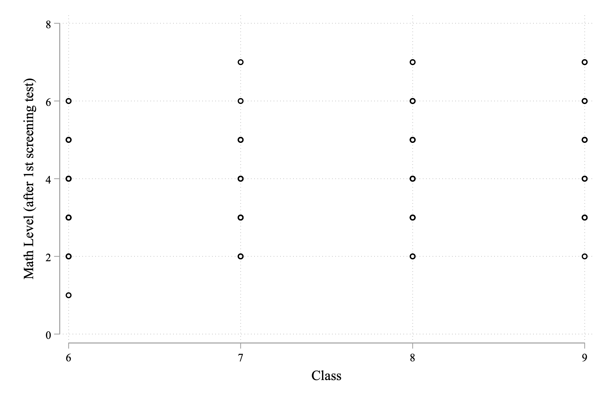
<p class="caption">(\#fig:basicscatter)Assessed Math Grade Level vs. Actual Grade Level </p>
</div>

Figure \@ref(fig:basicscatter) doesn't seem particularly informative. The reason is because so many points are overlapping. We know that there are over 600 participants in the experiment, but we only see a handful of dots in the graph. The reason is that many individuals have the same values for these variables. In other words, there are many people, for example, with an assessed math level equal to 4 and an actual grade level equal to 6. From this figure, however, we can't tell how many. One way we can improve the graph is to use the ``jitter()`` option.

Scatter plots give us a transparent way to view our data, but when variables are categorical (like ``grade`` and ``mathlevel`` in our example), they can be less informative because so many observations overlap. ``jitter()`` adds a small amount of noise (small perturbations) to the data so that the points no longer overlap on the graph. The way it works is that in parentheses you place a number that determines how much noise is added. ``(5)`` is a common choice. A value of ``(100)`` would make it so that the graph is completely dominated by noise.

To understand what ``jitter()`` does, let's try it out on our scatter plot. 


```stata
twoway scatter mathlevel class, jitter(5) ///
	xlabel(5(1)10) ///
	xtitle("Grade enrolled in") ///
	ytitle("Assessed grade level of student achievement") 
```

<div class="figure" style="text-align: center">
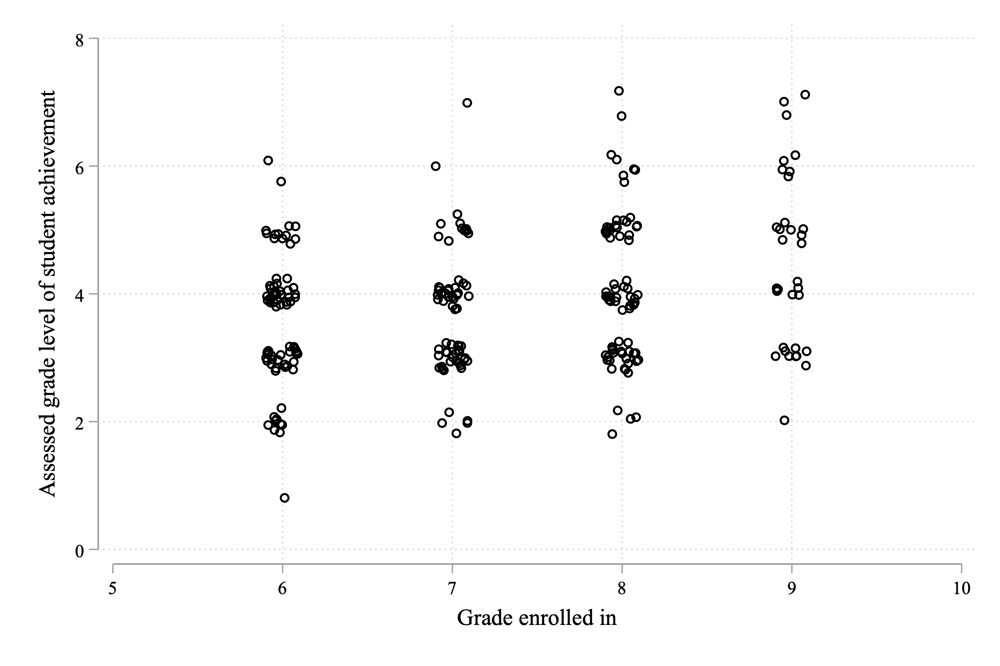
<p class="caption">(\#fig:improvescatter)Assessed Math Grade Level vs. Actual Grade Level </p>
</div>

As you can see in the figure, very few students are performing at their grade level, with none performing above grade level. There are large clusters at grades several years below grade level. For example, for students in grade 6, the largest clusters are at 4th-grade math level and 3rd-grade math level. This gives us a sense of the scope of the issue. Students' understanding is well below their grade level.

Next, let's try to get a sense of how learning is evolving over time. There are two potential "stories" here. Story 1: students are below grade level, but each year they are still learning (i.e. increasing grade by 1 is associated with a 1-year increase in assessed math level). Story 2: students performing below grade level makes learning difficult (i.e. increasing grade by 1 is associated with less than a 1-year increase in assessed math level). Figuring out which story is true is important. If story 1 is true, then even though students are behind, they are still learning more information every year. They won't fall further and further behind over time. But if story 2 is true, then there is a more serious issue in learning. Students are behind and falling further behind every year.
  
We can study this question in a regression framework. We are interested in the relationship between assessed math level and grade 

$$ 
\text{Math Level}_i = \alpha + \beta \cdot \text{Grade}_i + \varepsilon_i
$$

$\beta$ tells us how much we expect the assessed math level to increase for a 1-unit increase in Grade. If this is much lower than 1, then students will fall farther and farther behind each year. Let's estimate this regression in Stata:


```stata
reg mathlevel class 
```


```
      Source |       SS           df       MS      Number of obs   =       253
-------------+----------------------------------   F(1, 251)       =     19.02
       Model |  22.8033097         1  22.8033097   Prob > F        =    0.0000
    Residual |   300.87258       251  1.19869554   R-squared       =    0.0705
-------------+----------------------------------   Adj R-squared   =    0.0667
       Total |  323.675889       252  1.28442813   Root MSE        =    1.0948

------------------------------------------------------------------------------
   mathlevel | Coefficient  Std. err.      t    P>|t|     [95% conf. interval]
-------------+----------------------------------------------------------------
       class |   .2926913   .0671066     4.36   0.000     .1605275     .424855
       _cons |   1.756712   .4928781     3.56   0.000      .786008    2.727416
------------------------------------------------------------------------------
```

Reading the table above, we find $\hat{\beta}=0.293$. This indicates that a 1-year increase in grade is associated with only a 0.293-year increase in assessed math level. In other words, students are learning over time, but at a much lower rate than is envisioned by the curriculum. Ideally, 1 year of schooling should be associated with an additional year of learning. 

All of these results highlight a need for an intervention. We have documented (1) students (on average) are assessed to be performing below grade level, (2) there is large variation in assessed grade level within a given grade, and (3) learning over time is slower than intended. Maybe an intervention that "Teaches at the Right Level" can help alleviate some of these issues.

## Summary Statistics

Before getting to the experimental data, we need to first make sure that the randomization was implemented correctly. To remind you, the experiment gave free Mindspark tuition to a random subset of students. But what if randomization failed for some reason? What if students who received Mindspark tuition already had better test scores than students who did not? Then we don't have a valid experiment. To check if we have a valid experiment, we should confirm that the treated and control students are similar based on observables. To present our results, we are going to learn a new command ``outreg2``, which is useful for building publication-ready tables in Stata. 

In most cases, ``outreg2`` is used to export regression estimates to different formats (hence the name). However, in this section, we are going to learn how to use it to create summary statistics. Summary statistics are incredibly important to present in research. If you open any social science article, there is a good chance the first table will be a table of summary statistics.

One type of summary statistic table we have already discussed is a balance table. In an experiment, we need to check that treatment and control individuals are "balanced" based on observable characteristics. In the Mindspark experiment, we have a few demographic characteristics we can check balance with respect to. To understand our eventual goal, Figure \@ref(fig:msgtab) is the (beginning) of Table 1 from Muralidharan, Singh and Ganimian (2019). We don't need to replicate this format exactly, but hopefully, we can get something that looks professional.

<div class="figure" style="text-align: center">
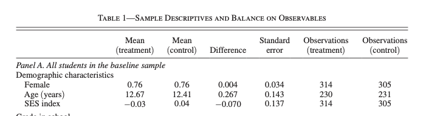
<p class="caption">(\#fig:msgtab)Balance Table from Muralidharan, Singh and Ganimian (2019)</p>
</div>

The basic syntax of ``outreg2`` that will be appropriate for our goals is:


```stata
outreg2 using table.doc, word replace ///
sum(log) eqkeep(N mean) keep(varlist)
```

Now, there was quite a bit of syntax in the previous code. For better or worse, commands that deal with formatting tend to have lots of options. This is good for flexibility but can make it frustrating to learn initially. Let's go through each part of the command step-by-step:

  - ``outreg2 using table.doc`` -- tells Stata that we should save the results of this command in a file called ``table.doc`` (it will be saved in the working directory)
  
  - ``word replace`` -- tells Stata that the format is a Word document and if it already exists in the working directory it should be replaced 
  
  - ``sum(log)`` -- tells Stata that this should be a summary stats table. ``outreg2`` is usually used for regression tables, not summary statistics table
  
  - ``eqkeep(N Mean)`` -- tells Stata to keep certain statistics in the summary stats table. In this case, the observation count and the average (can also store SD, min, and max)
  
  - ``keep(varlist)`` -- tells Stata what variables to include. Replace ``varlist`` with a list of variables you want to appear in the table
  
Let's use the syntax above to create a summary statistics table with our data:


```stata
outreg2 using tab1_basic.doc, word replace ///
sum(log) eqkeep(N mean) keep(st_age1 st_female1 ses_index) 
```

Figure \@ref(fig:tab1basic) presents the basic summary statistics table. You can also customize it more before exporting by adding the option ``title("Table 1: Summary Statistics")``. This will add a title to the table.
 
<div class="figure" style="text-align: center">
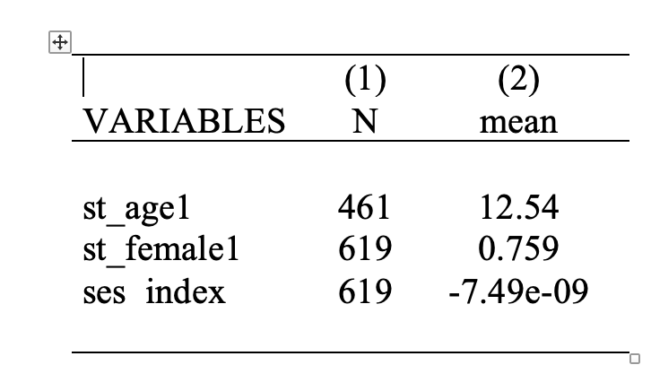
<p class="caption">(\#fig:tab1basic)Basic Summary Statistics Table</p>
</div>

Now, this isn't exactly what we wanted. We wanted a balance table, that shows the statistics of these variables by treatment status. To create this table we are going to combine ``outreg2`` with the ``bys`` command.


```stata
bys treat: outreg2 using balance_tab.doc, word replace ///
sum(log) eqkeep(N mean) keep(st_age1 st_female1 ses_index) ///
label ///
title("Table 2: Characteristics of Treatment and Control Students")
```

The code above generates Figure \@ref(fig:tab1balance):

<div class="figure" style="text-align: center">
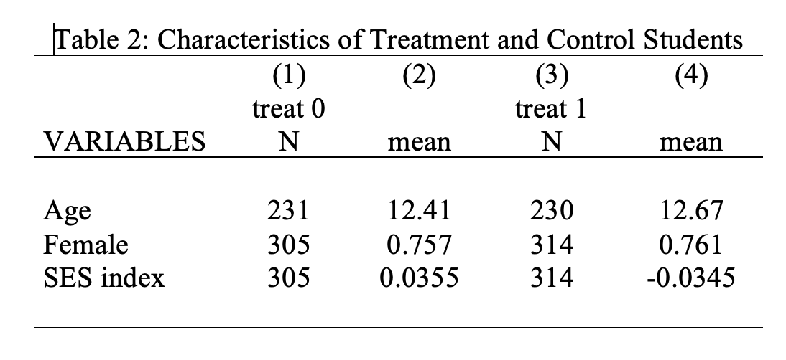
<p class="caption">(\#fig:tab1balance)Basic Balance Table</p>
</div>

One limitation of our current table is that treat 0 and treat 1 is not the most descriptive way to describe the data. However, given we now have this table in Word format, we can manually make any necessary changes. For example, Figure \@ref(fig:tab2balance) edits the labels to provide a table that is ready for publication. 

<div class="figure" style="text-align: center">
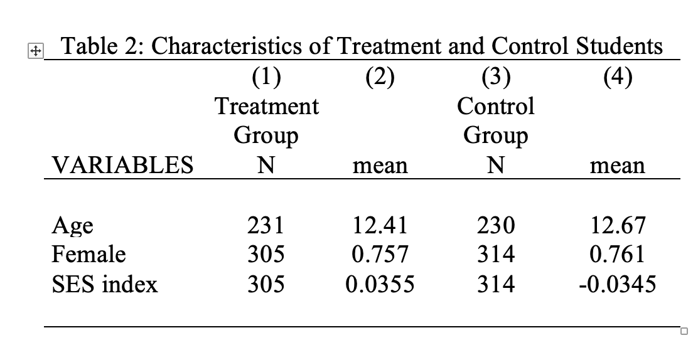
<p class="caption">(\#fig:tab2balance)Final Balance Table</p>
</div>

In this case, the average age, fraction female, and socioeconomic status index (ses) are all relatively similar between the treated students and control students. Looks like randomization was successful!

## Binary Regression

So far, the regression examples have been examples with continuous variables. Life expectancy and average income, for example, can take on any value within certain ranges. Therefore, these are examples of continuous variables. In this section, we are going to discuss the interpretation of regression estimates when either the dependent (Y-variable) and/or the independent (X-variable) is binary.

To start, let's consider a hypothetical example. Imagine we are interested in whether temperature impacts voting. We have an individual-level dataset that indicates whether an individual voted ($\text{Vote}_i=1$ if voted and zero otherwise), as well as the temperature in Fahrenheit in the location they voted. We propose modeling this via a linear regression framework:

$$
\text{Vote}_i = \alpha + \beta \text{Temperature}_i + \varepsilon_i
$$

Imagine we find $\hat{\alpha}=0.1$ and $\hat{\beta}=0.01$. How do we interpret these numbers? Before we said the interpretation of the slope coefficient is "the expected increase in $Y$ for a 1-unit change in $X$". If we use this interpretation, then we expect our variable $Vote$ to increase by 0.01 if Temperature increases by a degree. A 0.01 increase in a binary indicator implies a 1 percentage point increase in the probability the value of the variable is equal to 1. This seems a little abstract, so let's consider another way to interpret this coefficient.

One way to understand this interpretation is to return to thinking about predicted values. What is the predicted value of $Vote$ if the temperature is 50 degrees?

$$
\text{Predicted Vote} = 0.1 + 0.01*50 = 0.6
$$

Recall in earlier sections we would often take the average of binary variables. For example, in Chapter 1, we had an outcome variable that was equal to 1 if the individual passed a test and zero otherwise. We showed that the average of this variable is equal to the fraction of individuals who passed the test.

Here, what does it mean for the predicted value of vote to be equal to 0.6? It means that if the temperature is 50 degrees, we expect 60 percent of individuals to vote.

We can similarly form the predicted value of vote if it is 1 degree hotter (i.e. 51 degrees).

$$
\text{Predicted Vote} = 0.1 + 0.01*51 = 0.61
$$

Therefore, we expect 61 percent of individuals to vote if it is 51 degrees. Therefore, a 1-degree increase in temperature is associated with a 1 percentage point increase in the fraction voting. In this example, the dependent variable is binary and the independent variable is still continuous. In this next example, let's flip this, so the independent variable is continuous and the dependent variable is binary. 

Let's next imagine that we are interested in the effect of a Universal Basic Income (UBI) payment on total earnings of individuals. UBI is a policy in which every individual receives a payment every month, regardless of their current income. The answer to this question has important policy implications. It might at first seem obvious that earnings will increase if an individual receives a UBI payment. But it is also possible that individuals who receive a UBI payment will respond by working less, or in extreme cases, quit working altogether. If these responses are common, it is not clear that UBI payments will actually increase the earnings of recipients overall. 

There are now a few experiments on UBI that are either complete or in progress. In these experiments, some individuals receive UBI payments, while others do not. Imagine we have access to the data of one of these experiments and propose modeling earnings as a function of whether you are given access to the UBI payment (i.e. UBI is a binary variable that is equal to 1 if the individual receives the UBI payment and zero otherwise):

$$
\text{Total Earnings}_i = \alpha + \beta \cdot \text{UBI} + \varepsilon_i
$$
Let's interpret the regression coefficients again through forming predicted values. What is the predicted earnings for someone who does not receive UBI? 

$$ 
\text{Predicted Earnings} = \alpha + \beta \cdot 0 =\alpha
$$

What is the predicted earnings for someone who does receive UBI? 

$$ 
\text{Predicted Earnings} = \alpha + \beta \cdot 1 =\alpha + \beta
$$
So $\alpha$ is the predicted earnings for individuals who don't receive the UBI payment. In other words, this is the expected earnings for control workers. $\beta$ is the difference in earnings for participants who receive UBI, relative to those who do not. In other words, if we predict control workers will have earnings of 50,000, and UBI recipients have earnings of 60,000, then $\hat{\alpha}=50,000$ and $\hat{\beta}=10,000$.

Finally, let's change the prior example slightly so that both the dependent and independent variables are binary. Instead of studying the impact of UBI on earnings, let's study the impact on employment: 

$$
\text{Employment}_i = \alpha + \beta \cdot \text{UBI} + \varepsilon_i
$$

Now both $Y$ and $X$ are binary. Let's again interpret these coefficients through predicted values. 

What is the predicted value of employment for someone who does not receive UBI? 

$$ 
\text{Predicted Employment} = \alpha + \beta \cdot 0 =\alpha
$$
In other words, of those who do not receive UBI, we expect $\alpha$ percent to be employed. Now, what is the predicted employment for someone who does receive UBI? 

$$ 
\text{Predicted Employment} = \alpha + \beta \cdot 1 =\alpha + \beta
$$

In other words, of those who do receive UBI, $\alpha + \beta$ percent are employed. $\beta$ is the percentage point difference in employment rates between those who receive UBI vs. those who do not. For example, imagine 80 percent of control workers are employed, while 75 percent of UBI recipients are employed. In this case $\hat{\alpha}=0.80$, while $\hat{\beta}=-0.05$. In this case, we would conclude that receiving UBI decreases the probability of being employed by 5 percentage points.

There are a few lessons from this chapter that you should internalize for the rest of this book. In order to write clearly about your results, it is important to understand if your variables are continuous or binary. If the $Y$ variable is binary, you can interpret the $\beta$ coefficients as changes in the probability of having $Y=1$. For example, a 1-unit increase in temperature is associated with a $\beta$ percentage point change in the probability of voting. If the $X$ variable is binary indicator, then $\alpha$ is average of $Y$ if $X=0$, while $\alpha+\beta$ is average of $Y$ if $X=1$. 

## Mindspark Results

Now that we understand how to interpret regressions with binary variables, we are going to estimate the impact of Mindspark on test scores. To do so, we will estimate a linear regression of the following form:

$$
\text{Endline Test Score}_i = \alpha + \beta \cdot \text{Treat}_i + \varepsilon_i
$$
Endline test score ranges from 0 to 1 and represents the percent of questions that an individual got correct on the test. Treat is a binary indicator variable that is equal to 1 if the individual is in the treatment group (i.e. was given free Mindspark tuition) and zero of the individual is in the control group (i.e. not given free Mindspark tuition).

To begin, let's load in the dataset ``mindspark_data.dta``


```stata
cd "~/Dropbox/Teaching/EP5/online/04_week/data"
use mindspark_data.dta, clear 
/Users/davidarnold/Dropbox/Teaching/EP5/online/04_week/data
```

Now, let's see if treatment impacts endline math scores. The endline math scores. Remember, the variable ``per_math2`` contains the endline math test scores. Therefore, to estimate the impact of the treatment on this variable, we can type:


```stata
reg per_math2 treat
```


```
      Source |       SS           df       MS      Number of obs   =       539
-------------+----------------------------------   F(1, 537)       =     28.72
       Model |  .813404311         1  .813404311   Prob > F        =    0.0000
    Residual |    15.20668       537   .02831784   R-squared       =    0.0508
-------------+----------------------------------   Adj R-squared   =    0.0490
       Total |  16.0200843       538  .029777108   Root MSE        =    .16828

------------------------------------------------------------------------------
   per_math2 | Coefficient  Std. err.      t    P>|t|     [95% conf. interval]
-------------+----------------------------------------------------------------
       treat |   .0777008   .0144978     5.36   0.000     .0492214    .1061802
       _cons |   .4647551   .0101847    45.63   0.000     .4447484    .4847619
------------------------------------------------------------------------------
```

We found that the slope coefficient $\hat{\beta}=0.078$. Remember, our general formula for interpreting slope coefficients is a 1-unit change in ``treat`` is expected to increase ``per_math2`` by 0.078. However, when we actually report the results, we should make it clear what these units represent. We don't want a reader to have to understand that ``per_math2`` is the variable that contains the fraction correct on the math score in order to understand the interpretation. Therefore, in plain (interpretable) English, we find that students who were offered free Mindspark tuition saw a 7.8 percentage point increase in math scores relative to control students who were not offered Mindspark tuition.

::: {.rmdtip}

**Concept Check**

What is the average score for control individuals given the regression output? What is the average score for treated individuals given the regression output? To check your answer you can type ``sum per_math2 if treat==0`` and ``sum per_math2 if treat==1``

:::

So overall, Mindspark has a reasonably large impact on test scores. Test scores were quite low to begin with, so a 7.8 percentage point increase is a sizeable gain in learning. Next, let's see how effective Mindspark was for Hindi:


```stata
reg per_hindi2 treat
```


```
      Source |       SS           df       MS      Number of obs   =       539
-------------+----------------------------------   F(1, 537)       =     16.12
       Model |  .572530953         1  .572530953   Prob > F        =    0.0001
    Residual |   19.076815       537  .035524795   R-squared       =    0.0291
-------------+----------------------------------   Adj R-squared   =    0.0273
       Total |  19.6493459       538  .036522948   Root MSE        =    .18848

------------------------------------------------------------------------------
  per_hindi2 | Coefficient  Std. err.      t    P>|t|     [95% conf. interval]
-------------+----------------------------------------------------------------
       treat |   .0651886   .0162382     4.01   0.000     .0332904    .0970868
       _cons |   .5200244   .0114073    45.59   0.000     .4976159    .5424329
------------------------------------------------------------------------------
```

This regression tells us that treated students who were offered free Mindspark tuition saw a 6.5 percentage point increase in Hindi test scores relative to control students. Overall, this program seems very effective in increasing both math and Hindi scores. 

## Regression Tables

In this section, we are going to learn how to take those results in the prior section and translate them to publication-ready tables. To accomplish this, we are again going to use the ``outreg2`` command. To remind you, if you have not installed this command, you need to first type ``ssc install outreg2`` into the command window before using the command.

Our goal is to present the two regressions below in a nice, neatly formatted table:


```stata
reg per_math2 treat 
reg per_hindi2 treat
```

To present multiple regressions in a single table, we will take advantage of the ``est store`` command. ``est store`` stands for estimates store. It allows you to save the results of your regressions. To show how to use the command, let's estimate the impact of treatment on math scores:


```stata
reg per_math2 treat
      Source |       SS           df       MS      Number of obs   =       539
-------------+----------------------------------   F(1, 537)       =     28.72
       Model |  .813404311         1  .813404311   Prob > F        =    0.0000
    Residual |    15.20668       537   .02831784   R-squared       =    0.0508
-------------+----------------------------------   Adj R-squared   =    0.0490
       Total |  16.0200843       538  .029777108   Root MSE        =    .16828

------------------------------------------------------------------------------
   per_math2 | Coefficient  Std. err.      t    P>|t|     [95% conf. interval]
-------------+----------------------------------------------------------------
       treat |   .0777008   .0144978     5.36   0.000     .0492214    .1061802
       _cons |   .4647551   .0101847    45.63   0.000     .4447484    .4847619
------------------------------------------------------------------------------
```

Now if I want to save these estimates I can type


```stata
est store reg_math
```

The part of the code that reads ``reg_math``gives the estimates a name that you will use later. You can change this name depending on your application. For example, I could have replaced ``reg_math`` with ``reg_math_scores`` in the code above and the code would have executed without error. Next, let's estimate the impact of treatment on Hindi scores and store the estimates as ``reg_hindi``. To save, space, I will suppress the output of the regression:


```stata
reg per_hindi2 treat
est store reg_hindi
```

Now that we have our regression estimates stored, we can construct the regression table using the ``outreg2`` command:


```stata
outreg2 [reg_math reg_hindi] using reg_table.doc, word replace
```

Let's go through each step of the code

  - ``outreg2 [reg_math reg_hindi]`` -- tells Stata to use ``outreg2`` to create a regression table. The table will have two columns: one that displays the math regression results and one that displays the Hindi results.
  
  - ``using reg_table.doc`` -- tells Stata to create a new file named ``reg_table.doc`` in the working directory that contains the regression table.
  
  - ``, word replace`` -- tells Stata the table should be in Word format, and if a file named ``reg_table.doc`` already exists, then replace it with the new table.

Now let's see what this command generates.

<div class="figure" style="text-align: center">
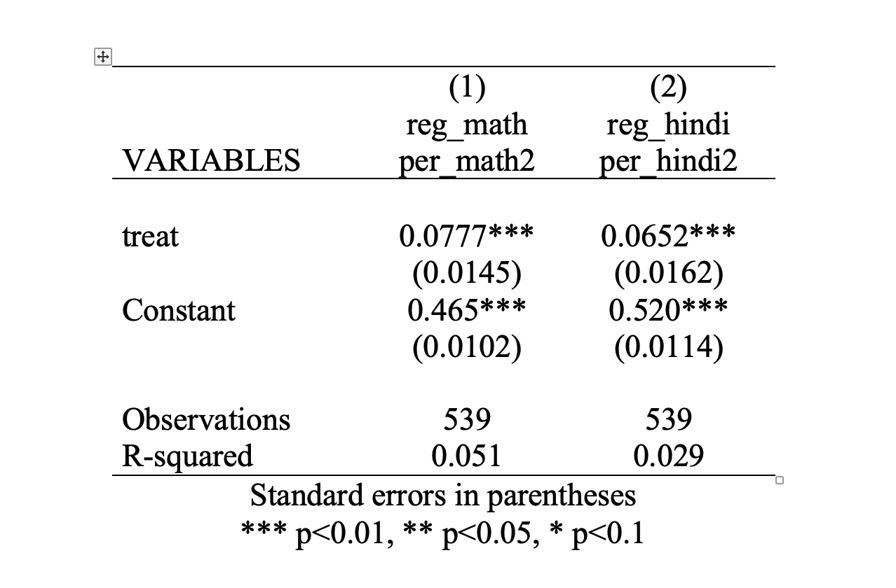
<p class="caption">(\#fig:regtabbasic)Regression Table</p>
</div>

There are certainly some aesthetic changes that are needed in this table. But before we get to these, let's discuss the actual elements of the table. Many regression tables in academic articles have a similar format as the one seen here.

First, we should clarify that the numbers in each column correspond to a given regression estimate. Column 1 estimates the impact of Mindspark on math test scores, while column 2 estimates the impact of Mindspark on Hindi test scores. Generally, the column is titled with the dependent variable. Therefore, in this case, we can see that the dependent variable in column 1 is ``per_math2`` and the dependent variable in column 2 is ``per_hindi2``. 

Then, in each row, we have independent variables. In this case, our regressions have the same independent variable: ``treat``. In addition to any independent variables, regression estimates (generally) display the constant (also known as the intercept) as well. 

The coefficient estimates are then given by the numbers that are not in parentheses. See Figure \@ref(fig:regcoefs), which highlights the coefficient estimates in the table. If you are confused about what the numbers correspond to, you should go back to your original regression output in Stata, and see how the estimates from those regressions map to this table.

<div class="figure" style="text-align: center">
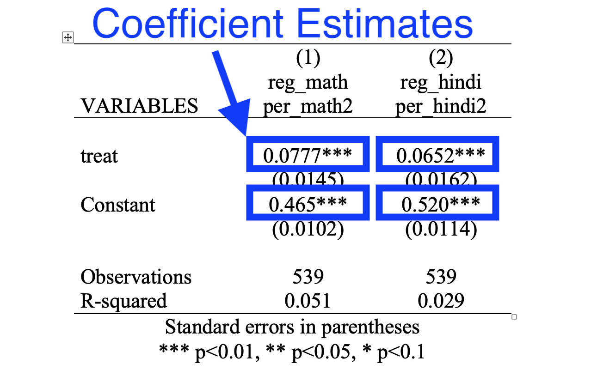
<p class="caption">(\#fig:regcoefs)Regression Table: Coefficient Estimates</p>
</div>

Now, there are a lot of elements in this table that we haven't explained yet. Standard errors (in parentheses) and p-values (indicated by the stars) are concepts we will not discuss in this course. In research, generally, it is important to not understand the magnitude of a treatment effect, but also whether it is statistically significant. We have not defined the concept of statistical significance. You will learn about this in other statistics or econometrics courses. Both standard errors and p-values (indicated by the stars) are related to the statistical significance of the results.

Finally, the R-squared is a measure of how much variation we can explain using our explanatory variables. The concept of R-squared is something you will learn in future statistics or econometrics courses as well and will not be a subject we cover in this course.

Now that we understand the format of the table, let's edit the table in order to make it more easily interpretable for a reader. First, we should add a descriptive title. You can do this by using the ``title()`` option of ``outreg2``. Second, we can delete a few superfluous items, such as "VARIABLES", "reg_math" and "reg_hindi". You can do this by directly editing the table in Word. Lastly, it is better to use full phrases that describe your variables, not the variable names we have in the code. Again you can make these edits in Word. After making these changes, we finally have a nice, publication-ready regression table:

<div class="figure" style="text-align: center">
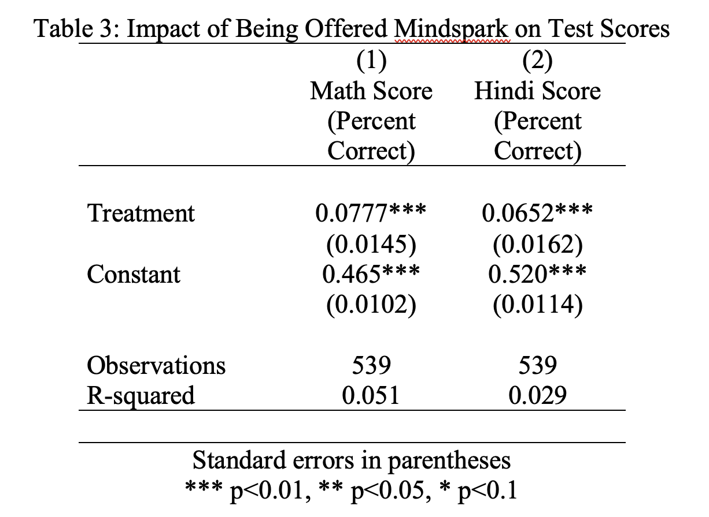
<p class="caption">(\#fig:regfinal)Final Regression Table</p>
</div>

## Conditional Regressions

So far we have found that Mindspark is effective in increasing test scores in both math and Hindi on average. But maybe it is more effective for some students relative to others. In this section, we are going to explore treatment effect heterogeneity. Often it is important to understand treatment effect heterogeneity if you are trying to understand how this treatment will work in other settings. For example, would we find different results if this were implemented in an all-girls or all-boys school? Would we find different results if this were implemented in wealthier neighborhoods? Would it be a less useful treatment in areas in which achievement was already high to begin with? We can use our existing experiment to see if the treatment effect varies by different characteristics, such as gender, socioeconomic status, and baseline achievement. 

So how do we estimate treatment effect heterogeneity? Well, if we want to estimate the treatment effect for females only, for example, then we should restrict our sample to females. Then, among this smaller sample of participants, we can estimate the treatment effect. 

The easiest way to implement this idea in Stata is through the use of conditional regressions. In this case, the word conditional implies that individuals who meet some certain condition are included in the estimation. 

For example, if we want to estimate the treatment effect in a linear regression framework, but restricted only to females, we can type:


```stata
reg per_math2 treat if st_female1==1
```


```
      Source |       SS           df       MS      Number of obs   =       414
-------------+----------------------------------   F(1, 412)       =     17.78
       Model |  .518287614         1  .518287614   Prob > F        =    0.0000
    Residual |  12.0091958       412  .029148533   R-squared       =    0.0414
-------------+----------------------------------   Adj R-squared   =    0.0390
       Total |  12.5274834       413   .03033289   Root MSE        =    .17073

------------------------------------------------------------------------------
   per_math2 | Coefficient  Std. err.      t    P>|t|     [95% conf. interval]
-------------+----------------------------------------------------------------
       treat |   .0707653    .016782     4.22   0.000     .0377763    .1037543
       _cons |   .4636151    .011838    39.16   0.000     .4403447    .4868854
------------------------------------------------------------------------------
```

The part of the code ``st_female1==1`` implies the regression ``reg per_math2 treat`` should only be estimated for females. As a result, in the regression table, you can see the Number of obs is equal to 414. These are the number of females in the experiment that have endline test scores. For comparision, let's estimate the treatment effect, but restricted only to males:


```stata
reg per_math2 treat if st_female1==0
```


```
      Source |       SS           df       MS      Number of obs   =       125
-------------+----------------------------------   F(1, 123)       =     12.67
       Model |  .323197879         1  .323197879   Prob > F        =    0.0005
    Residual |  3.13679016       123  .025502359   R-squared       =    0.0934
-------------+----------------------------------   Adj R-squared   =    0.0860
       Total |  3.45998804       124  .027903129   Root MSE        =    .15969

------------------------------------------------------------------------------
   per_math2 | Coefficient  Std. err.      t    P>|t|     [95% conf. interval]
-------------+----------------------------------------------------------------
       treat |   .1017787   .0285899     3.56   0.001     .0451867    .1583707
       _cons |   .4684034   .0198077    23.65   0.000     .4291953    .5076114
------------------------------------------------------------------------------
```

Now, in our first regression, we find $\hat{\beta}^{female}$ = 0.071. This implies treatment increases the percent correct by 7.1 percentage points for females. In our second regression, we find $\hat{\beta}^{male}$ = 0.102. Treatment increases the percent correct by 10.2 percentage points for males. Therefore, overall, the treatment effect is slightly larger for males relative to females. However, in both cases, it appears that overall, the treatment is quite effective. 

Next, let's consider if the treatment effects vary by socioeconomic status. In the data, we have a variable named ``ses_index``. An **index** is a variable that aggregates information from many different variables. For example, in our setting, SES index captures different aspects of household wealth. It is constructed from variables that capture ownership of various consumer goods and services. A higher SES index indicates higher wealth.  Our SES index is scaled so that it is on average equal to zero in our sample. Therefore, individuals with positive values of SES index are wealthier than the average student in the experiment, and individuals with negative values of SES index are poorer than the average student in the experiment. Let's test whether the treatment effect is different for students with above-average socioeconomic status vs. below-average socioeconomic status. 

Our first regression will be estimated on individuals with below-average SES index. 


```stata
reg per_math2 treat if ses_index<0
```


```
      Source |       SS           df       MS      Number of obs   =       268
-------------+----------------------------------   F(1, 266)       =     20.29
       Model |  .509060251         1  .509060251   Prob > F        =    0.0000
    Residual |  6.67313366       266  .025086969   R-squared       =    0.0709
-------------+----------------------------------   Adj R-squared   =    0.0674
       Total |  7.18219391       267  .026899603   Root MSE        =    .15839

------------------------------------------------------------------------------
   per_math2 | Coefficient  Std. err.      t    P>|t|     [95% conf. interval]
-------------+----------------------------------------------------------------
       treat |   .0872535   .0193697     4.50   0.000     .0491161    .1253909
       _cons |   .4296612   .0139997    30.69   0.000     .4020969    .4572256
------------------------------------------------------------------------------
```

Our second regression will be estimated on individuals with above-average SES index. 


```stata
reg per_math2 treat if ses_index>0
```


```
      Source |       SS           df       MS      Number of obs   =       271
-------------+----------------------------------   F(1, 269)       =     12.72
       Model |  .380236782         1  .380236782   Prob > F        =    0.0004
    Residual |  8.04393779       269  .029903114   R-squared       =    0.0451
-------------+----------------------------------   Adj R-squared   =    0.0416
       Total |  8.42417457       270  .031200647   Root MSE        =    .17293

------------------------------------------------------------------------------
   per_math2 | Coefficient  Std. err.      t    P>|t|     [95% conf. interval]
-------------+----------------------------------------------------------------
       treat |   .0751004   .0210607     3.57   0.000     .0336356    .1165653
       _cons |   .4957346   .0143607    34.52   0.000      .467461    .5240081
------------------------------------------------------------------------------
```

In regression 1, we find $\hat{\beta}^{lowSES}$ = 0.087. Treatment increases the percent correct by 8.7 percentage points for individuals with below-average SES. In regression 2, we find $\hat{\beta}^{highSES}$ = 0.075. Treatment increases the percent correct by 7.5 percentage points for individuals with above-average SES. Therefore, the treatment effect is slightly larger for low-SES, but quite similar overall.

Finally, we will explore heterogeneity by baseline achievement. Maybe students that benefit the most are those that have been "left behind". There are many ways one could explore this question. We are going to see if individuals below the median level of baseline test scores (within their grade) have different treatment effects than those above the median level of test scores.

The first thing we need to do is create a new variable that indicates whether an individual student performed above the median or below the median in the initial baseline assessment, within their grade level. We will do this in two steps: 

  - Step 1: create a variable that stores the median test score within an individual's grade.
  
  - Step 2: create an indicator variable equal to 1 if the individual's test score is above the median test score and zero otherwise.

For Step 1: we are again going to combine ``bys`` with ``egen``. We used these commands to compute the total number of stops by race and light condition in a previous chapter. To generate median test score within a grade, we can type:


```stata
bys st_grade1: egen median_test_score=median(per_math1)

```

Now let's generate a new variable that indicates whether a given student's test score is above or equal to the median test score within their grade


```stata
gen above_median = (per_math1 > median_test_score)

```

Now that we have our indicator variable, we can estimate two regressions: (1) a regression restricted to above-median performers and (2) a regression restricted to below-median performers.


```stata
reg per_math2 treat if above_median==1
```


```
      Source |       SS           df       MS      Number of obs   =       239
-------------+----------------------------------   F(1, 237)       =     19.25
       Model |   .52552737         1   .52552737   Prob > F        =    0.0000
    Residual |   6.4715909       237  .027306291   R-squared       =    0.0751
-------------+----------------------------------   Adj R-squared   =    0.0712
       Total |  6.99711827       238  .029399657   Root MSE        =    .16525

------------------------------------------------------------------------------
   per_math2 | Coefficient  Std. err.      t    P>|t|     [95% conf. interval]
-------------+----------------------------------------------------------------
       treat |   .0941481   .0214608     4.39   0.000     .0518699    .1364264
       _cons |   .5290498    .014493    36.50   0.000     .5004981    .5576014
------------------------------------------------------------------------------
```


```stata
reg per_math2 treat if above_median==0
```


```
      Source |       SS           df       MS      Number of obs   =       300
-------------+----------------------------------   F(1, 298)       =     21.99
       Model |  .480080178         1  .480080178   Prob > F        =    0.0000
    Residual |  6.50520836       298  .021829558   R-squared       =    0.0687
-------------+----------------------------------   Adj R-squared   =    0.0656
       Total |  6.98528854       299  .023362169   Root MSE        =    .14775

------------------------------------------------------------------------------
   per_math2 | Coefficient  Std. err.      t    P>|t|     [95% conf. interval]
-------------+----------------------------------------------------------------
       treat |   .0800939   .0170791     4.69   0.000      .046483    .1137049
       _cons |   .4063055   .0123553    32.89   0.000     .3819907    .4306202
------------------------------------------------------------------------------
```


We find that $\hat{\beta}^{above}$ = 0.095. Treatment increases the percent correct by 9.5 percentage points for above-median scoring students. We find $\hat{\beta}^{below}$ = 0.088. Treatment increases the percent correct by 8.8 percentage points for below-median scoring students. The treatment effect is slightly larger for above-median scoring students, but quite similar overall.

To summarize our results in this chapter, we tested for heterogeneity in treatment effects by (1) gender, (2) SES status and (3) baseline achievement. While we found some evidence of heterogeneity, impacts were large and positive for all groups. This provides evidence on the **external validity** of the treatment. If we expand this program to more students, perhaps with different baseline characteristics, we might predict that it will still be effective given its ability to raise test scores for different types of students.

## Conclusion

In this final section, we will summarize what we have learned so far and then present additional results from Muralidharan, Singh, and Ganimian (2019). The motivation for Muralidharan, Singh, and Ganimian (2019) is that in certain settings, there may be a mismatch between students' level of understanding and the curriculum they are being taught. One potential tool that can be used to alleviate this problem is technology. In Muralidharan, Singh, and Ganimian (2019), the authors test if Mindspark, a software that aims to teach-at-the-right level is successful in increasing test scores. In this chapter, we used the data from this experiment and found large test score gains.

Whenever you find some experimental result, you might want to think carefully about what is driving the result. For example, the treatment in this setting is really a combination of a few things.  

  - The Mindspark software aims to teach-at-the-right level 
  
  - This software is combined with instruction time from a teaching assistant
  
Although we did not focus on this second component, every Mindspark center includes instructional time with a teaching assistant. So maybe we don't need the "technology" component. Maybe we just need more instruction time?

Well, Berry and Mukherjee (2016)[@berry2016pricing] study the impact of private tutoring in Delhi. This is a very similar intervention, but without the software to teach-at-the-right level. Instead, teaching was focused on the current grade level of the student (not the assessed level). Berry and Mukherjee (2016) find no impact of this intervention. This suggests that the individual targeting aspect of the software was essential for the results.

The key difficulty that Mindspark software attempts to overcome is the huge heterogeneity in understanding in a classroom. As an instructor, teaching effectively when learning levels vary widely is difficult. Once Mindspark is programmed, it can do this automatically. We can look at the data and see how Mindspark updates material over time for different students.

<div class="figure" style="text-align: center">
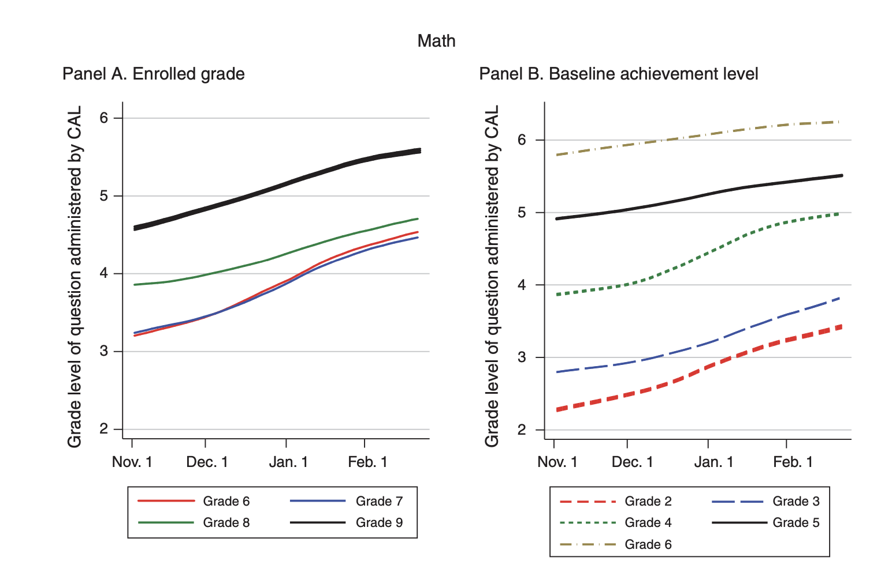
<p class="caption">(\#fig:dynamic)Dynamic Updating of Mindspark</p>
</div>

Panel A of Figure \@ref(fig:dynamic) plots the grade level of questions that are proposed by Mindspark over time, for different grade levels. As you can see, individuals (on average) are starting well below grade level. For example, the solid black line is grade 9, and the questions being posed to these students are between grades 4 and 5. But over time, the assessed level increases. About 5 months later, the difficulty of the questions has increased by almost an entire year. This figure is plotting how individuals are learning over time. 

Panel B, instead, plots the grade level of questions that are proposed by Mindspark over time for different levels of baseline achievement. The key takeaway from this graph is that regardless of baseline achievement, Mindspark is successful in improving updating over time. The rates of learning are quite similar for different levels of baseline achievement. 

So now we are relatively certain Mindspark is successful in increasing learning, but does that imply we should invest in it as a resource for students? Whenever there is a proposed policy, there is bound to be a cost-benefit analysis. Policymakers generally have a number of different potential policies they may pursue, so you want to invest in the right policy. In order to do this, you need both the cost and benefits of the proposed policy. Running an experiment is a great way to estimate the benefits of a proposed intervention. Now that we know the benefits of Mindspark from our experiment, it is time to turn to the costs. 

To do so, let's compare the cost of Mindspark to traditional government-run schools.  Government-run schools spend about 240 minutes per week on Math and Hindi. The cost per pupil is around INR 1500 (US \$22). Mindspark spends about 180 minutes per week on Math and Hindi. Cost per pupil is around INR 1000 (US \$15). Using the estimates from the paper, Mindspark led to more learning in less time than government-run schools, as well as utilizing fewer financial resources.

To conclude, using technology to teach-at-the-right-level seems like a promising intervention in places in which there is tremendous heterogeneity in baseline levels of understanding. But, there is potential for even better educational design! Maybe the best intervention would blend Mindspark with standard teaching. Giving teachers more information about the level of their students could aid instruction in the classroom. This automated aspect of the software could free up teacher time for other activities that also improve student performance.

## <u>Command Descriptions</u> {-}


::: {.rmdnote}

**<u>Commands Related to Regression</u>**

- ``reg yvar xvar`` - estimates a linear regression with ``yvar`` being the dependent variable and `xvar` being the independent variable

- ``twoway lfit yvar xvar`` - plots the linear regression line from a linea regression with ``yvar`` being the dependent variable and `xvar` being the independent variable

- ``predict newvar`` - adds a new variable named ``newvar`` to the dataset that contains for each observation, the predicted value $\hat{Y}_i = \hat{\beta}_0 + \hat{\beta} \cdot X_i$ for that observation based on the most recent linear regression estimated. This command must come after estimating a linear regression.

- ``reg yvar xvar if variable == 1`` - estimates a linear regression restricted only to observations for which the value of ``variable`` is equal to 1. This conditional statement can take on many forms. For example, if ``age`` is a variable in the dataset, then ``reg yvar xvar if age>=40`` will estimate a regression restricted only to observations for which the individual is older than or equal to 40 years of age.

**<u>Formatting Tables (Not Tested on) </u>** 

- ``outreg2 using table.doc, word replace sum(log) eqkeep(N mean) keep(varlist)`` -  creates a summary statistics table that displays the mean of each variable in ``varlist``, as well as the number of observations

- ``est store regression`` - stores the estimates of a regression in a macro named ``regression``. You can change the word ``regression`` in the code to any label you like. For example, if you are storing estimates for multiple regression, you might want to type ``est store reg1`` for the first regression and ``est store reg2`` for the second.

- ``outreg2 [reg1 reg2] using reg_table.doc, word replace`` - creates a regression table with ``reg1`` in the first column and ``reg2`` in the second. ``reg1`` and ``reg2`` are the results of two separate ``est store`` commands

::: 
## <u>Animated Concepts</u> {-}

<iframe src="https://www.youtube.com/embed/MBSsegVVqlk" width="672" height="400px" data-external="1"></iframe>


