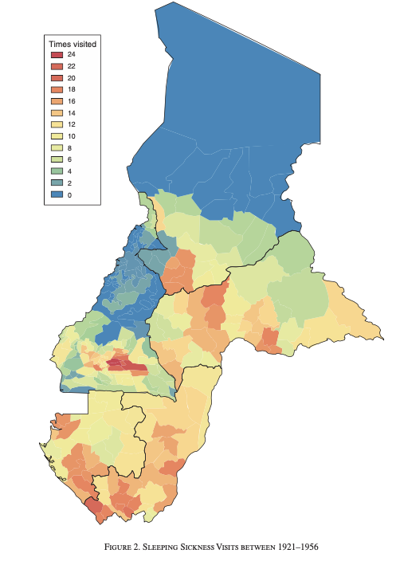
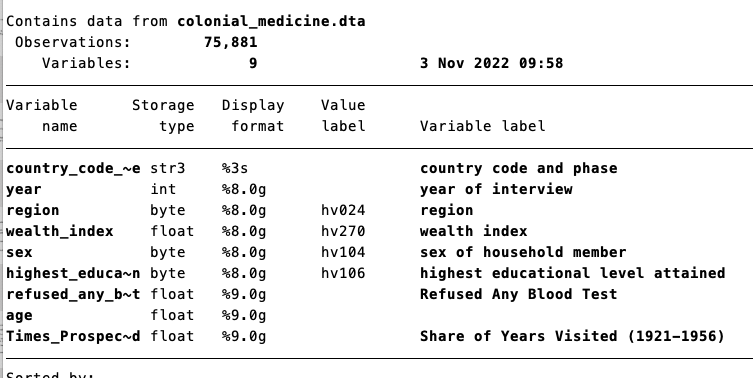
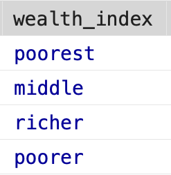
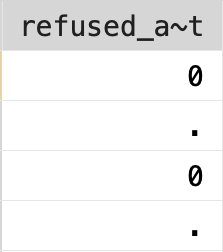
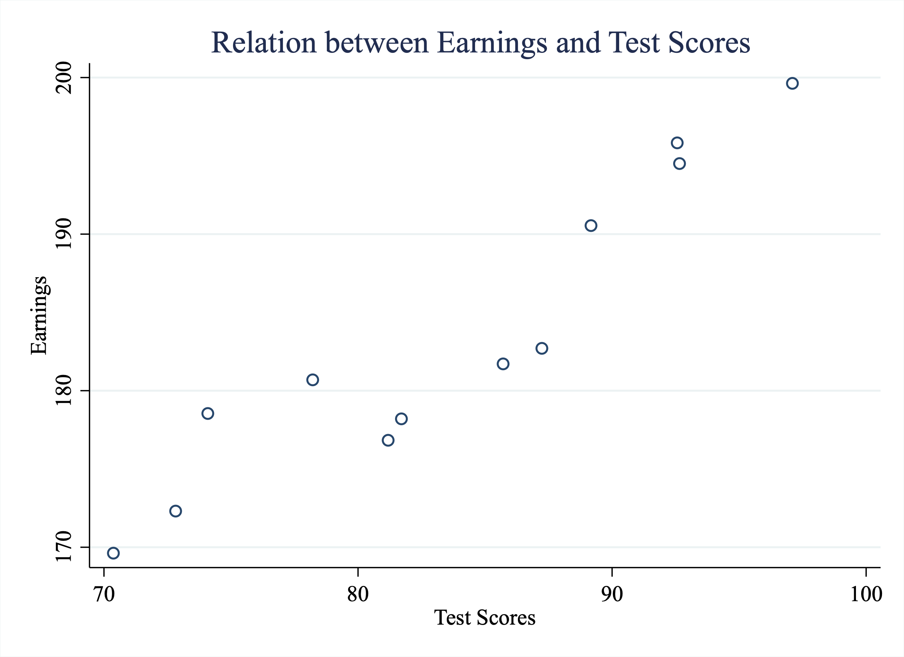
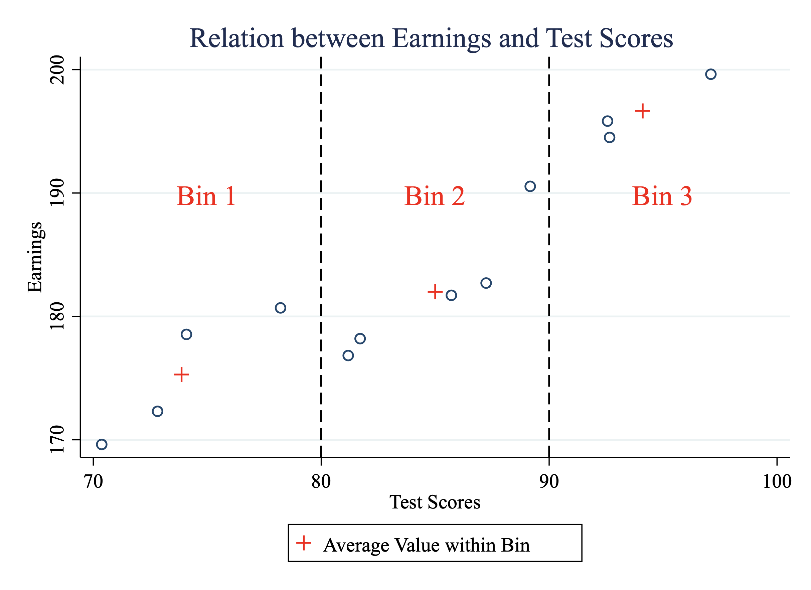
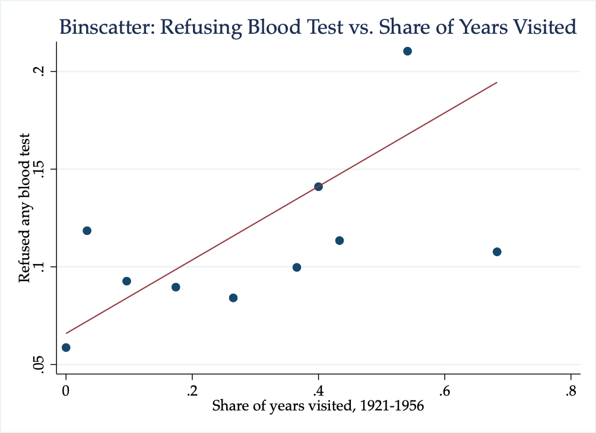
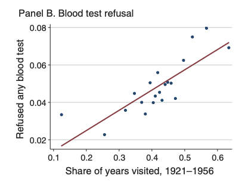

# Legacy of Colonial Medicine

## Colonial Medicine Intro


<html>
<head>
<style>
code {
  background-color: #f1f1f1;
}
</style>
</head>
<body>

Between 1921 and 1956 French colonial governments in Africa organized medical campaigns to treat and prevent sleeping sickness. Sleeping sickness is a lethal parasitic disease transmitted by bite of tsetse fly that occurs regularly in parts of sub-Saharan Africa. During the colonial era, French colonies had military organized campaigns exclusively focused on treating sleeping sickness.

However, the treatments at the time (atoxyl and Lomidine) both were questionable in their efficacy and 
had severe side effects. Historians and anthropologists have linked sleeping sickness campaigns to mistrust in modern medicine.

In this section, we will use data from Lowes and Montero (2021) to study how colonial medical campaigns undertaken generations ago impact health behaviors today. To do so, we will use measures of exposure to medical campaigns constructed by Lowes and Montero (2021) from newly digitized military records from France.

<div class="figure" style="text-align: center">

<p class="caption">(\#fig:map)Sleeping Sickness Visits Between 1921-1956</p>
</div>

Figure \@ref(fig:map) shows the variation in sleeping sickness across areas in Cameroon and French Equatorial Africa (present-day Central African Republic, Chad, Republic of Congo, and Gabon). As can be seen in the figure, there is large variation across areas. Some places (in blue), had no medical campaign visits related to sleeping sickness during this period. Other areas (red), were visited as many as 24 times in the years between 1921-1956. We will study how variation in these visit rates correlates to measures of trust in medicine today.

In Lowes and Montero (2021), the authors study two key outcomes, both which come from Demographic and Health Surveys (DHS). The first is a vaccination index that captures what fraction of possible vaccines children have received. The second studies whether individuals refuse a free, non-invasive blood test. Consent to the blood test is high in these samples, as the blood test is taken by finger prick and free to the individuals in the survey. Refusal of this blood test might then signal distrust in medicine generally. 

To begin, let's load the dataset ``colonial_medicine.dta``


```stata
cd "/Users/davidarnold/Dropbox/Teaching/EP5/online/05_week/data"
use colonial_medicine.dta, replace
/Users/davidarnold/Dropbox/Teaching/EP5/online/05_week/data
```

As usual, let's describe the data to learn more about the variables.

<div class="figure" style="text-align: center">

<p class="caption">(\#fig:meddescribe)Describing the Colonial Medicine Data Set</p>
</div>

So we have 75,881 survey participants, some demographics of the individual, as well as a key outcome variable (``refused_any_blood_test``) as well as a key explanatory variable (``Times_Prospected``). To understand our key variables, let's first summarize our outcome variable.

This data is at the individual level and includes some basic demographics (age, sex, etc.) as well as our key outcome: ``refused_any_blood_test``


```stata
sum refused_any_blood_test
```


```
    Variable |        Obs        Mean    Std. dev.       Min        Max
-------------+---------------------------------------------------------
refused_an~t |     11,993    .1110648    .3142255          0          1
```

So around 11 percent overall refuse a blood test. Our goal will be to understand if this refusal rate depends on how often an individual's area was visited during sleeping sickness campaigns in the past. The variable that captures this is ``Times_Prospected``:


```stata
sum Times_Prospected
```


```
    Variable |        Obs        Mean    Std. dev.       Min        Max
-------------+---------------------------------------------------------
Times_Pros~d |     67,036    .2941624    .1943945          0         .8
```


So a value of 0.2 indicates on average, an individuals location was visited 20 percent of the years between 1921-1956 (35 years total). In simpler terms, a value of 0.2 indicates 7 years, because 7 is 20 percent of 35.

So we now have the data to answer our initial **question**: are people who live in places in which historical medical campaigns were more prevalent more likely to refuse blood tests today? But first, let's highlight a few new aspects of the data that we will need to understand.

First, if I browse the data, you will see the variable ``wealth_index`` looks like it is a string variable, yet it is highlighted in blue, not red

<div class="figure" style="text-align: center">

<p class="caption">(\#fig:wealthlabel)Value Labels for Wealth Index</p>
</div>

If we take the average of ``wealth_index``, we do get a number out


```stata
sum wealth_index
```


```
    Variable |        Obs        Mean    Std. dev.       Min        Max
-------------+---------------------------------------------------------
wealth_index |     75,881    3.212319     1.43691          1          5
```

We will discuss this behavior in a future chapter about **value labels**.Next, If I browse the data, you will see the variable ``refused_any_blood_test`` has some missing values (the period indicates the value is missing).

<div class="figure" style="text-align: center">

<p class="caption">(\#fig:missingrefusal)Missing Values</p>
</div>

It is important to be careful about **missing** values generally, but particularly in Stata, which we will discuss in a future chapter as well. So before we get to answering our main question, we first need to handle these data issues.

## Value Labels

A value label associates a description with a particular numeric value of a variable. Sometimes it is convenient to store variables as numeric, for example, if we would like to apply some mathematical operations. However, it might be hard to remember what each value of the data represents. Value labels allow you to store the information as numeric, while still able to quickly reference what each number represents.

In order to discuss value labels, we are going to look at the American National Election Survey. The American National Election Survey (ANES) is a survey on elections in the U.S. It has a large range of questions that come in the survey. To make it easier for users of the dataset, many of the variables have value labels attached. 

 We are going to load a very small subset of the dataset which has information on just a few questions: 


```stata
cd /Users/davidarnold/Dropbox/Teaching/EP5/online/05_week/data
use anes_subset.dta, clear
```

If we browse the data, we can see some of the variables have value labels.

<div class="figure" style="text-align: center">

<p class="caption">(\#fig:br1value)Browsing the ANES</p>
</div>


For ``vote`` and ``better_or_worse`` the values look like characters, but they are highlighted in blue instead of red. What is going on? If we look closely, we can see the actual value associated with a given cell. For example, in Figure \@ref(fig:br2value), I have clicked the first cell in the table. As you can see the highlighted value is equal to 2. This is the **value** in the table.

<div class="figure" style="text-align: center">

<p class="caption">(\#fig:br2value)Browsing the ANES</p>
</div>

The **value label** is the text highlighted in blue ("2. No, didn't vote"). If we use ``tab`` we can see the difference values labels for a given variable. Let's try this for ``vote``:


```stata
tab vote 
      PRE: Did R vote for |
        President in 2012 |      Freq.     Percent        Cum.
--------------------------+-----------------------------------
              -9. Refused |          2        0.05        0.05
-8. Don't know (FTF only) |         14        0.33        0.37
            1. Yes, voted |      3,117       73.00       73.37
       2. No, didn't vote |      1,137       26.63      100.00
--------------------------+-----------------------------------
                    Total |      4,270      100.00
```

So there are 4 different value labels. If you need to references values of these variables, you need to use the actual numeric values, not the labels themselves. The labels are just there so we don't forget what the numbers mean. For example, if I wanted to see how many individuals refused the question, I can type:


```stata
count if vote==-9
```

If I try to do the same thing, but referencing the value label, I will get an error:


```stata
count if vote == "-9. Refused"
type mismatch
r(109);

end of do-file
r(109);
```

It states ``type mismatch`` because vote is a numeric variable, not a string variable. The 

## Missing Values

Continuing our exploration of the ANES dataset, we will now discuss missing values. For numeric variables, Stata stores missing values as a period. If your numeric variable does not code missing information as a period, then you should change this before continuing the analysis. To see why, let's consider the variable ``better_or_worse``, which asks the respondent on a scale of 1 to 5 how much worse off are you relative to a year ago?  


```stata
tab better_or_worse
```


```
   PRE: R how much better |
worse off than 1 year ago |      Freq.     Percent        Cum.
--------------------------+-----------------------------------
              -9. Refused |         11        0.26        0.26
-8. Don't know (FTF only) |          2        0.05        0.30
       1. Much better off |        298        6.98        7.28
   2. Somewhat better off |        904       21.17       28.45
        3. About the same |      1,981       46.39       74.85
    4. Somewhat worse off |        763       17.87       92.72
        5. Much worse off |        311        7.28      100.00
--------------------------+-----------------------------------
                    Total |      4,270      100.00
```

You can see that -8 and -9 are actually missing values, but right now they are stored as numbers. If I take the average of ``better_or_worse``, I get:


```stata
sum better_or_worse
```


```
    Variable |        Obs        Mean    Std. dev.       Min        Max
-------------+---------------------------------------------------------
better_or_~e |      4,270    2.937002    1.176809         -9          5
```

But this average incorporates those values of -9 and -8. In terms of the scale of the variable, this will lower the overall average, which could lead to some pretty misleading results. For example, imagine instead of storing the missing values as -9, they were stored as -1000. Then, even though there are a few individuals with missing data, our average value of ``better_or_worse`` might be very low, as low as 1. If we naively took this as the average, then we might conclude that on average, people report they are much better off. But this is the wrong conclusion, we need the average response among individuals that actually answered the question.

What we need to do is replace individuals that have either a value of -8 or -9 to missing. To do this we can make use of the or operator, which is given by the symbol ``|``. The code below will replace the value of ``better_or_worse`` to missing if the current value is either -8 **or** -9. 


```stata
replace better_or_worse=. if better_or_worse==-8 | better_or_worse==-9
```

Now when we take the average, the missing values are not incorporated


```stata
sum better_or_worse
```


```
    Variable |        Obs        Mean    Std. dev.       Min        Max
-------------+---------------------------------------------------------
better_or_~e |      4,257    2.972986    .9814891          1          5
```

When you compute summary statistics or run regressions, observations with missing values will be dropped automatically from this calculation. However, you need to be very careful when constructing new variables from observations with missing values. For logical statements in Stata (such as when creating indicator variables), the missing value is interpreted as infinity. The reason why it was chosen to have missing values be interpreted as infinity is a little complicated, but it can lead to some confusing errors!
  
  
To see how, Imagine we want to create an indicator that is equal to 1 if an individual thinks their life has gotten worse relative to 1 year ago. An individual that responded 4 or 5 believes their life has gotten worse relative to 1 year ago. So one potential way to code this new variable would be to type:


```stata
gen worse_off = (better_or_worse>=4)
```

Let's see what ``worse_off`` is equal to for individuals that had missing values for ``better_or_worse``. 


```stata
sum worse_off if better_or_worse==.
```


```
    Variable |        Obs        Mean    Std. dev.       Min        Max
-------------+---------------------------------------------------------
   worse_off |         13           1           0          1          1
```

It is equal to 1 for all of these individuals, but why? The reason is missing values are interpreted as infinity in logical statements. Because infinity is greater than 4, then everyone with missing values of this is coded as ``worse_off=1``.

To avoid this problem, we need to change code so that it takes into account possibility of missing values. For example, we might want to replace ``worse_off`` equal to missing if ``better_or_worse`` is equal to missing.


```stata
replace worse_off = . if better_or_worse==.
```

## Binned Scatterplots (Theory)

In this chapter we will discuss a new data visualization technique known as **binned scatterplots**. To understand this technique, let's first take a simple example. Imagine, we have the dataset below in Figure \@ref(fig:barill) which shows Earnings (vertical axis) against test scores (horizontal axis):

<div class="figure" style="text-align: center">

<p class="caption">(\#fig:barill)Relationship Between Earnings and Test Scores</p>
</div>

In this example, we have plotted all the data and can clearly see that there is a positive relationship between test scores and earnings. Individuals with higher test scores tend to also have higher earnings. But what if there were 1000 people in this dataset, or 10,000, or a million? The graph would soon get pretty crowded.Not only would a graph with a million observations be difficult to interpret, it would also likely crash your computer! 

However, instead of plotting all the data, imagine we bin the data into intervals. For example, in Figure \@ref(fig:barill2) we have binned the data into intervals by dividing the x-axis into three bins. In bin 1 there are observations with scores below 80. Bin 2 has observations with scores between 80 and 90. Bin 3 has scores above 90. 

<div class="figure" style="text-align: center">

<p class="caption">(\#fig:barill2)Binning the Data</p>
</div>

Now instead of plotting all the data, let's just plot the averages within each bin, as depicted in Figure \ref(fig:barill3)


<div class="figure" style="text-align: center">

<p class="caption">(\#fig:barill3)An Example of a Binned Scatterplot</p>
</div>

This binned scatterplot allows us to transparently observe the relationship between two variables. However, now imagine we had 1000 students instead of the original 12. Well, the binned scatter plot will still have only 3 points. Note the decision to bin the data into three intervals was merely for illustrative purposes. In general, you can decide on how many bins to create. The key here is that even if the sample size grows, we can still show the relationship between these two variables in a binned scatterplot. Even if our sample size grows to a million, the number of points in the graph is still determined by the number of bins.

## Binned Scatterplots (Stata)

In this section we will use the data from Lowes and Montero (2021) to implement a binned scatterplot to study the legacy of colonial medicine in Africa. In order to construct the binned scatterplot we will make use of the ``binscatter`` command.

As a reminder, between 1921-1956, French colonies in Africa were visited by many medical campaigns often forcing medical care with questionable efficacy and severe side effects. Some places were visited only a small fraction of years. Other places were visited often in these years. Are people who lived in places with many medical campaigns more likely to distrust medicine today? 

To begin let's load the dataset: 


```stata
cd "/Users/davidarnold/Dropbox/Teaching/EP5/online/05_week/data"
use colonial_medicine.dta, replace
/Users/davidarnold/Dropbox/Teaching/EP5/online/05_week/data
```

First, we need to drop values that either have missing information for ``refused_any_blood_test`` or ``Times_Prospected``. ``refused_any_blood_test`` is our key outcome and is equal to 1 if the individual refused the free blood test and zero otherwise. ``Times_Prospected`` is our key explanatory variables and captures what fraction of years between 1921-1956 was the individual's region visited for sleeping sickness campaigns. If either of these values are missing for an observation, then they should not be included in the analysis.


```stata
drop if refused_any_blood_test==. | Times_Prospected==. 
(65,951 observations deleted)
```

The parallel line ``|`` indicates "or". So put simply, this line says, drop any observations in which either ``refused_any_blood_test`` or ``Times_Prospected`` is missing

Next, we will use an external command named ``binscatter`` can be used to produced binned scatterplots. To install on your version of Stata, you first need to type. 


```stata
ssc install binscatter
```

Once you execute the code above once, then you will be able to use the ``binscatter`` command. The basic syntax of the ``binscatter`` command is:

The basic syntax of ``binscatter`` is:


```stata
binscatter yvar xvar, nquantiles(#)
```

In this syntax, you will replace ``yvar`` with whatever variable you want to plot on the vertical axis and ``xvar`` with whatever variable you want to plot on the horizontal axis. You will replace ``#`` with however many bins you want to create.

In our example, we want to understand the relationship between refusing to take a blood test (y-axis) and share of years visited by medical campaigns between 1921-1956 (x-axis). For illustrative purposes, let's specify ``nquantiles(10)`` which implies we will have 10 bins in our scatterplot. One nice thing about the ``binscatter`` command is that we can utilize everything that we've learned from creating graphs generally. In other words, let's make sure our graph has appropriate titles and axes labels.


```stata
binscatter refused_any_blood_test Times_Prospected, nq(10)  ///
	title("Binscatter: Refusing Blood Test vs. Share of Years Visited") ///
	xtitle("Share of years visited, 1921-1956") ///
	ytitle("Refused any blood test")
```

<div class="figure" style="text-align: center">

<p class="caption">(\#fig:binscatter1)Binscatter: Refusing Blood Test vs. Share of Years Visited</p>
</div>

As we can see from the graph, as the share of years visited increases, the fraction of individuals that refuse a blood test also increases. This provides supporting evidence for the initial hypothesis: areas that have a history of colonial medicine still distrust medicine today. The line depicted in the binned scatterplot is a regression line that shows the strength of this relationship.

It is also helpful for interpretation to retrieve the slope of this regression line. We can get this parameter by specifying ``reportreg`` as an option for our binscatter command.


```stata
binscatter refused_any_blood_test Times_Prospected, nq(10) reportreg 
```

<div class="figure" style="text-align: center">

<p class="caption">(\#fig:reglinebin)Regression Line: Refusing Blood Test vs. Share of Years Visited</p>
</div>


::: {.rmdtip}

**Concept Check**

From this regression line, we can conclude that an increase in 7 years of medical campaign visits is associated with a 3.8 percentage point increase in the rate of blood test refusal. If you understand (1) the scale of the variables and (2) the slope coefficient, you should be able to convince yourself this is true.

Hint: Remember that a 1-unit change in the X-variable is associated with a $\beta$-unit change in the Y-variable. The hardest thing about this problem is understanding the units of the X and Y variables in this example.

:::

## Conclusion 

In this final section we will summarize what we have learned so far and then present additional results from Lowes and Montero (2021). The goal of Lowes and Montero (2021) is to understand how medical campaigns in Africa between 1921-1956 impact perceptions of medicine today Colonial medical campaigns undertaken to prevent sleeping sickness often forced medical treatment. The treatments both had questionable efficacy and came with severe side effects.  Lowes and Montero (2021) utilize newly digitized French military records in order to measure the exposure of a region to medical campaigns in the past, and combine this information with health surveys to understand the impact of past campaigns on health behaviors today. 

What we have explored is how exposure to these campaigns impacted the choice to refuse a blood test. While this blood test was free to survey participants, and had overall high takeup, some individuals rejected the blood test. This could be one proxy for trust in modern medicine. We found in the prior section that areas with more exposure to medical campaigns were more likely to refuse the blood test. 

One thing you may notice if you read Lowes and Montero (2021), however, is that our results don't appear exactly the same as those in Lowes and Montero (2021). One reason is that Lowes and Montero (2021) also control for other potential factors that could be correlated with historical exposure to medical campaigns as well as health behaviors today. Maybe places with more exposure to colonial medical campaigns vary along a number of dimensions, and these other dimensions could explain the correlation we found. Turns out, you can estimate binned scatterplots that control for other factors. Doing so goes beyond this course, but in Lowes and Montero (2021) the authors control for other factors that impact health decisions, such as age, gender, urban-rural status, among others. Figure \@ref(fig:lm1) displays the binned scatterplot we constructed while also controlling for these factors.

<div class="figure" style="text-align: center">

<p class="caption">(\#fig:lm1)Binscatter: Refusing Blood Test vs. Share of Years Visited</p>
</div>

Lowes and Montero (2021) also study if colonial medical campaigns impact vaccination rates today. To do so, they construct a vaccination index, which is the share of completed vaccines (out of 9) for children under 5. Again, they find places with more years of colonial medical visits have lower vaccination rates, as shown in Figure \@ref(fig:lm2).

<div class="figure" style="text-align: center">

<p class="caption">(\#fig:lm2)Binscatter: Vaccination vs. Share of Years Visited</p>
</div>

This paper finds that negative experiences in the past transmit across generations. This finding has important implications for trust in institutions generally. It also has very real policy implications. Lowes and Montero (2021) find World Bank projects related to health are less successful in areas with high exposure to colonial medicine.


