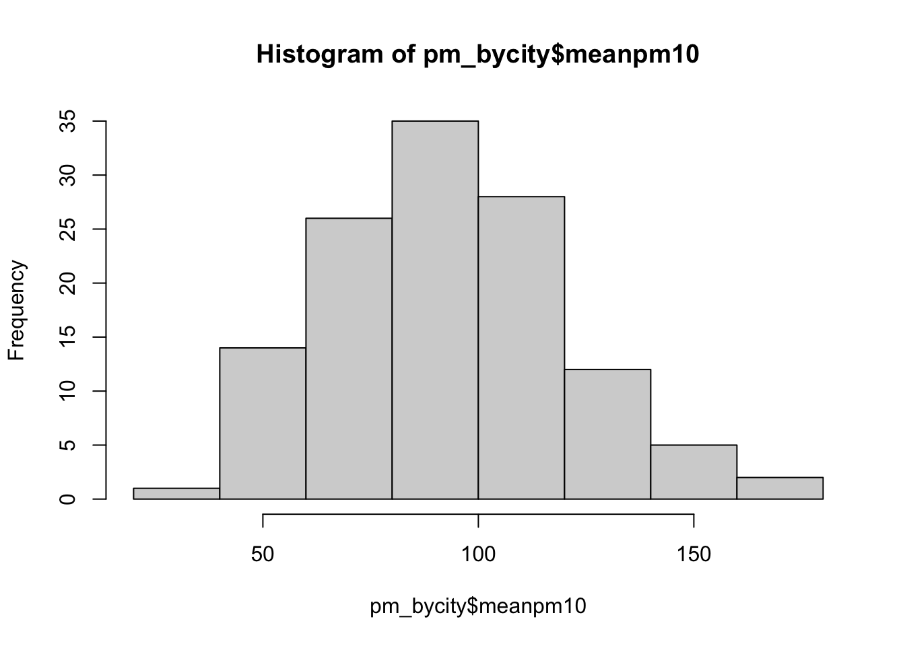
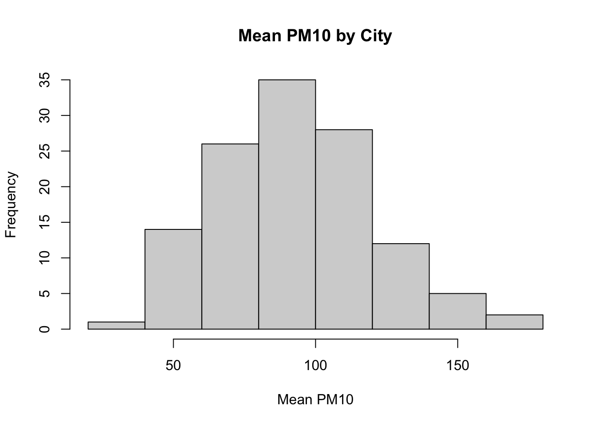
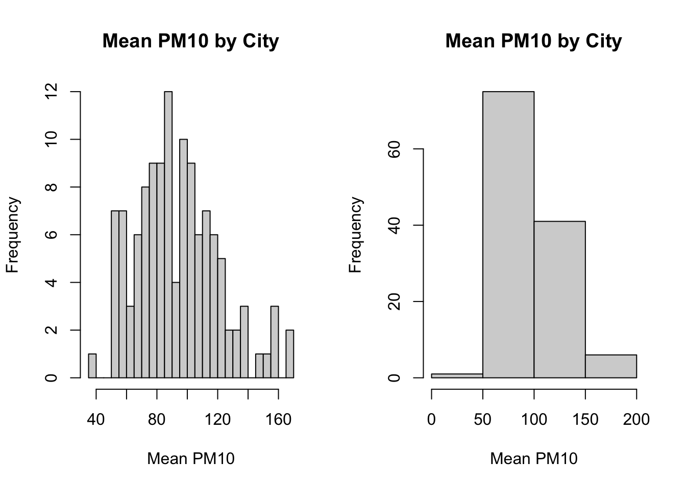

# Automated Pollution Monitoring

## Principal Agent Problem


<html>
<head>
<style>
code {
  background-color: #f1f1f1;
}
</style>
</head>
<body>

In economics and political science, there is a concept known as the **principal agent problem**. This setting arises when there is an agent that is making decisions on behalf of a principal, but the agent and the principal's incentives may not align. 

A classic example is employees at a firm. The employee is putting in some amount of effort to produce some output for the firm owner. The firm owner may want to produce as much output as possible, but the employee may balance output with the amount of effort it takes to produce that output. Therefore, their incentives do not necessarily align. 

Another classic example is elected officials and the citizenry. The officials make decisions (i.e. the agents) acting on behalf of the citizens (i.e. the principal). However, the goal of the elected officials may be to be re-elected, not necessarily make the optimal decisions for the citizens. Therefore, in this setting as well, it is possible that the incentives are not necessarily aligned between the agent and the principal. 

In this section, we will be discussing an interesting setting in which the principal agent problem is at play. In China, the central government (the principal) has recently made it a priority to reduce air pollution in China. To accomplish this, they provide high-power incentives to local governments (the agent) that achieve pollution targets. However, the local government officials are also the ones collecting the pollution data. While it may be costly to reduce air pollution, one possibility is that they can cheat and report pollution numbers lower than the actual pollution level.

Greenstone et al. (2022)[@greenstone2022can] studies this question by examining the introduction of automatic air pollution monitoring in China. This automated system was implemented in order to get accurate measures of pollution that cannot be manipulated by local officials. There are basically two potential outcomes of this analysis. First, local officials were reporting accurate numbers. In this case, we wouldn't expect automatic monitoring to change reported pollution numbers. The numbers are accurate both before and after the policy, and therefore, we expect the levels to be similar both before and after the policy. 

The second possibility is that reported levels of pollution increase after automatic monitoring. If this is the case, then it suggests local governments were misreporting before automatic monitoring so that it would appear as if they are meeting pollution targets. 
  
In order to measure pollution we will use reported PM10. This is a measure of particulates in the air that are 10 micrometers in diameter or smaller, and a common metric through which to measure air pollution. The focus of our coding this week will be on creating figures in R. We will create figures in both base R, as well as utilizing a popular graphics package, ggplot2. In the end, we will use our figures to understand whether local officials misreported pollution data in China. 

## Creating Histograms

In this section, we are going to learn how to construct histograms in base R. To begin, we first need to load the data frame. However, the data we will be using ``station_day_1116.dta`` is a Stata dataset. In the past, we have only loaded in either RData or csv files.

In order to load in a Stata data set we are going to make use of the ``haven`` package. In order to install the haven package, you need to execute ``install.packages("haven")``. Then, in your current R session you need to load the package using the ``library()`` function. Since we will again be utilizing the tidyverse in this section, we will also load the tidyverse package.


```r
library(haven)
library(tidyverse)
── Attaching packages ─────────────────── tidyverse 1.3.1 ──
✔ ggplot2 3.3.5     ✔ purrr   0.3.4
✔ tibble  3.1.7     ✔ dplyr   1.0.7
✔ tidyr   1.1.4     ✔ stringr 1.4.0
✔ readr   2.0.2     ✔ forcats 0.5.1
Warning: package 'tibble' was built under R version 4.1.2
── Conflicts ────────────────────── tidyverse_conflicts() ──
✖ dplyr::filter() masks stats::filter()
✖ dplyr::lag()    masks stats::lag()
```

The ``haven`` package comes with a function ``read_dta``, which will read in a ``.dta`` file as a tibble.


```r
pm <- read_dta("station_day_1116.dta")
```

To first get a sense of our data, let's look at a few of the key variables in this dataset. 


```r
pm %>% head(pm10_n,code_city, date, pm10, auto_date)
Error in checkHT(n, d <- dim(x)): object 'pm10_n' not found
```

The first variable, ``pm10_n`` is the station number. This is the code of the station that took the pollution reading. The next variable ``code_city`` is the code of the city in which the pollution reading was taken. This dataset is a panel dataset, which means there are many observations over time. In this case, we will have readings from the same pollution center over time. The ``date`` variable stores information on the date the reading was taken. We will discuss a bit later what the number in this variable means. ``pm10`` is our measure of pollution. Lastly, ``auto_date`` is the date of automation. After this date, instead of local governments reporting pollution statistics, pollution statistics were directly reported to the central government.

So for this section our goal is to create a histogram that shows the distribution of ``pm10`` across cities. Right now, we have a dataset that is at the station-date level. Each row corresponds to a pollution level at a particular station. We want to transform our data into a dataset that has for every city, the average level of pollution in that city. 

The way we can do this is to use ``group_by()`` and ``summarize()``, as we did in the prior chapter. If you recall, when you want to create a tibble of summary statistics by a group, we use ``group_by()`` in combination with ``summarize()``. In this example, the group variable is the ``code_city`` and the summary statistic is the average level of ``pm10``.


```r
pm_bycity <- pm %>%
  group_by(code_city) %>%
  summarize(meanpm10 = mean(pm10, na.rm=T))
```

We have included ``na.rm=T``, because looking through the ``pm10`` variable, it appears there is some missing data. Adding ``na.rm=T`` indicates we are taking the average over the non-missing values.

So now, for each unique value of ``code_city``, we have the average of the PM10 level in that city. This is the dataset that we will use in order to generate our histogram.

To generate histograms in base R, we can use the ``hist()`` function. For example, let's generate a histogram of ``pm10``:


```r
hist(pm_bycity$meanpm10)
```

<div class="figure" style="text-align: center">

<p class="caption">(\#fig:hist1)Histogram of Average Pollution Levels Across Cities Part 1</p>
</div>

First, let's review a histogram. On the horizontal axis, we have our numeric variable ``meanpm10``, which is the average level of ``pm10``. The histogram has binned this variable into discrete intervals. R automatically creates these bins when you use the ``hist()`` function. Then, in the vertical axis, the number of cities that fall within that interval is presented. So, for example, if we look at the tallest bin, which is about 80-100, we can see there are about 35 cities with average pollution in that range.

While this presents our information, there is a lot we can do in order to improve this figure. For example, the title right now is not clear. A reader may not know what ``pm_bycity$meanpm10`` means. As usual, we will want to improve these labels. 

To change the axis labels, we can use ``xlab="Horizontal Axis Name"`` and ``ylab="Vertical Axis Name"``. To add a title, we can use ``main="Title Name"``. ``main`` is perhaps not the most intuitive name for the options that generates a title, but you can think of it is "What is the main subject for this plot". So let's try to re-create our plot with better axes labels and titles.


```r
hist(pm_bycity$meanpm10, 
     xlab="Mean PM10", 
     ylab="Frequency", 
     main="Mean PM10 by City")
```


<div class="figure" style="text-align: center">

<p class="caption">(\#fig:hist2)Histogram of Average Pollution Levels Across Cities Part 2</p>
</div>

These various options will be useful for many different types of graphs in base R, not just histograms. For example, later we will generate a scatter plot. We can use these same options when generating this alternate type of graph. 

Next, let's discuss ways in which we can customize the look of our plot. For example, with histograms, one common way to customize the plot is to change the number of bins that are created. R chooses a default number of bins, but you can manually change this by using the ``breaks`` option. If you specify a higher number for ``breaks``, that means you want more bins. If you specify a lower number, that means you want fewer bins.

To illustrate this, we are going to put two plots side-by-side. Learning how to put two plots side-by-side is a generally useful technique as well. Often in academic articles, you might see multiple panels in a figure if the information between the panels is closely related. In our example, we are going to create two plots, one with many bins and another with few bins. 

The way to tell R to create multiple plots is to use the function called ``par()``. Within ``par()`` you can use an argument called ``mfrow=``. ``mfrow=`` tells R how many rows and how many columns you want in your plot. For example, in our example, we want on a single row, two separate figures. You can think of this as a row of figures, but two columns of figures. To specify this in R, you can type ``mfrow=c(1,2)``.


```r
par(mfrow=c(1,2))

#Smaller bins
hist(pm_bycity$meanpm10, xlab="Mean PM10", 
     ylab="Frequency", main="Mean PM10 by City",
     breaks=20)

#Larger bins
hist(pm_bycity$meanpm10, xlab="Mean PM10", 
     ylab="Frequency", main="Mean PM10 by City",
     breaks=4)
```


<div class="figure" style="text-align: center">

<p class="caption">(\#fig:hist3)Histogram of Average Pollution Levels Across Cities Part 3</p>
</div>

As you can see, when we specify ``breaks=20``, the histogram function generates many bins. When we specified ``breaks=4``, we retrieve only 4 bins.

So generally there is a tradeoff in the number of bins you create. In the left plot, we get more fine-grained information about the distribution of ``pm10`` across cities. On the right, the information is more aggregated, but perhaps easier to read. In many cases, the default number of bins is a good choice.

## Comparing Histograms

<iframe src="http://7brkse-david-arnold.shinyapps.io/regexamp?showcase=0" width="672" height="400px" data-external="1"></iframe>
