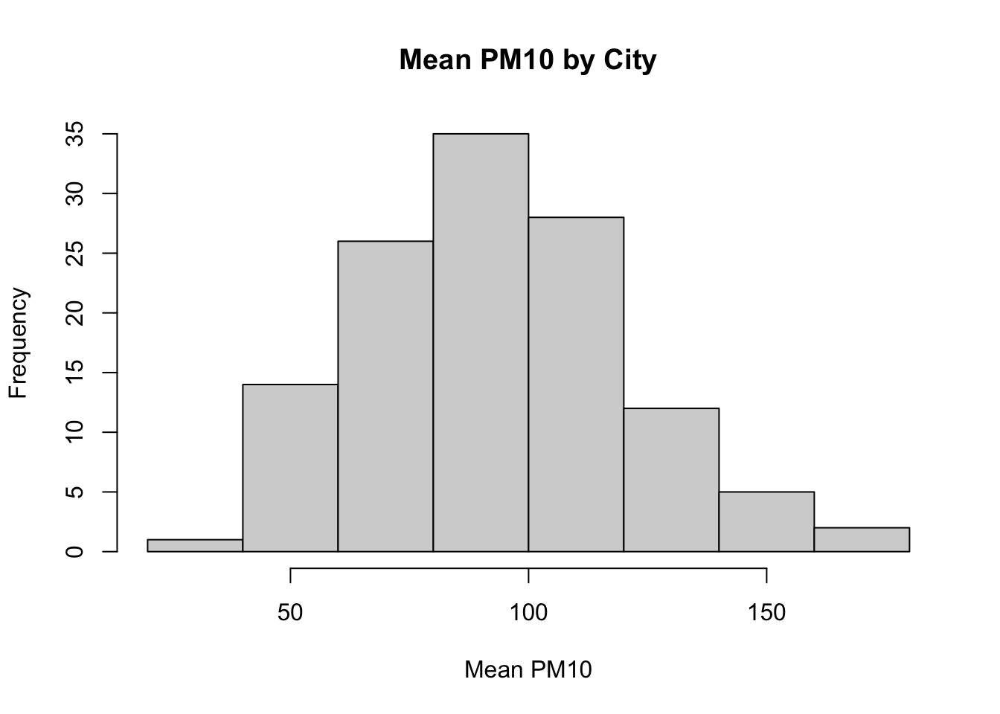
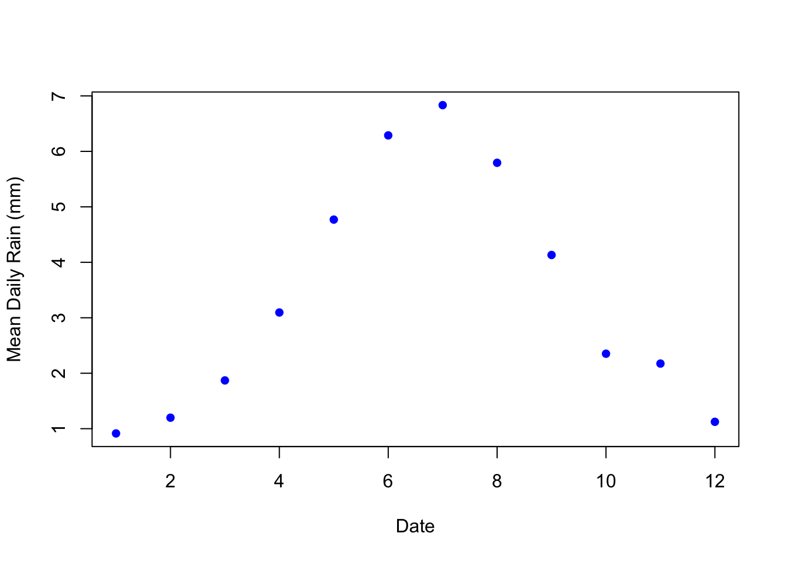
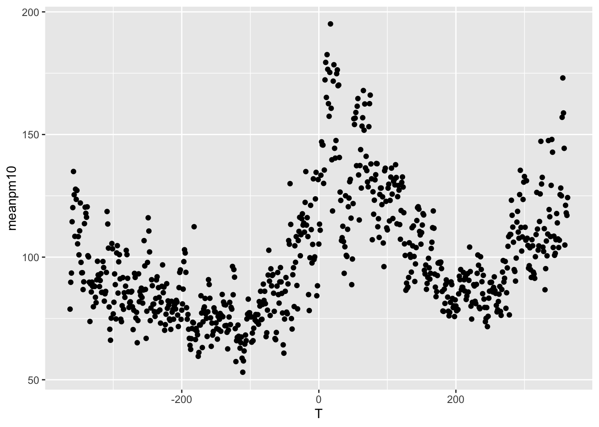
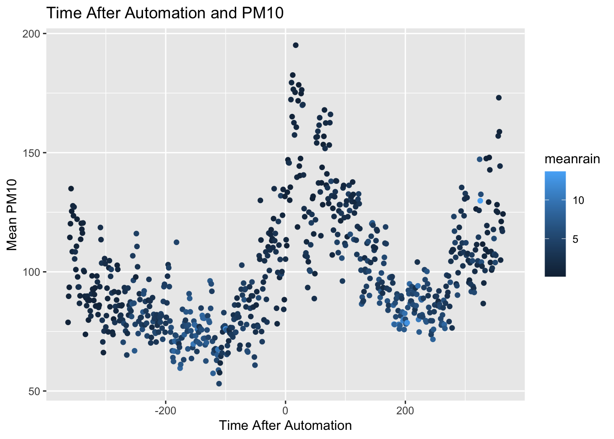
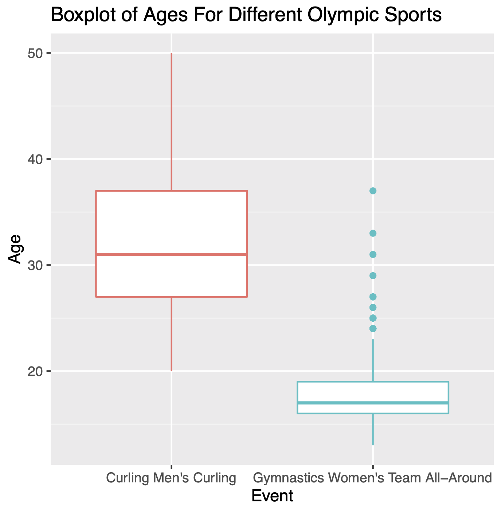
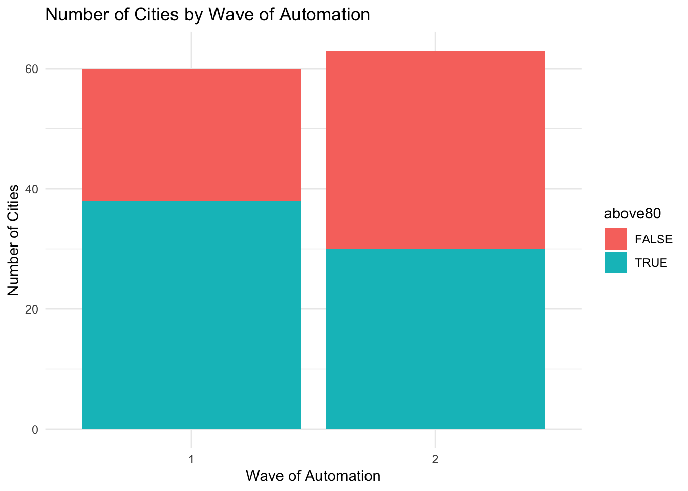

# Automated Pollution Monitoring

## Principal Agent Problem


<html>
<head>
<style>
code {
  background-color: #f1f1f1;
}
</style>
</head>
<body>

In economics and political science, there is a concept known as the **principal agent problem**. This setting arises when there is an agent that is making decisions on behalf of a principal, but the agent and the principal's incentives may not align. 

A classic example is employees at a firm. The employee is putting in some amount of effort to produce some output for the firm owner. The firm owner may want to produce as much output as possible, but the employee may balance output with the amount of effort it takes to produce that output. Therefore, their incentives do not necessarily align. 

Another classic example is elected officials and the citizenry. The officials make decisions (i.e. the agents) acting on behalf of the citizens (i.e. the principal). However, the goal of the elected officials may be to be re-elected, not necessarily make the optimal decisions for the citizens. Therefore, in this setting as well, it is possible that the incentives are not necessarily aligned between the agent and the principal. 

In this section, we will be discussing an interesting setting in which the principal agent problem is at play. In China, the central government (the principal) has recently made it a priority to reduce air pollution in China. To accomplish this, they provide high-power incentives to local governments (the agent) that achieve pollution targets. However, the local government officials are also the ones collecting the pollution data. While it may be costly to reduce air pollution, one possibility is that they can cheat and report pollution numbers lower than the actual pollution level.

Greenstone et al. (2022)[@greenstone2022can] studies this question by examining the introduction of automatic air pollution monitoring in China. This automated system was implemented in order to get accurate measures of pollution that cannot be manipulated by local officials. There are basically two potential outcomes of this analysis. First, local officials were reporting accurate numbers. In this case, we wouldn't expect automatic monitoring to change reported pollution numbers. The numbers are accurate both before and after the policy, and therefore, we expect the levels to be similar both before and after the policy. 

The second possibility is that reported levels of pollution increase after automatic monitoring. If this is the case, then it suggests local governments were misreporting before automatic monitoring so that it would appear as if they are meeting pollution targets. 
  
In order to measure pollution we will use reported PM10. This is a measure of particulates in the air that are 10 micrometers in diameter or smaller, and a common metric through which to measure air pollution. The focus of our coding this week will be on creating figures in R. We will create figures in both base R, as well as utilizing a popular graphics package, ggplot2. In the end, we will use our figures to understand whether local officials misreported pollution data in China. 

## Creating Histograms

In this section, we are going to learn how to construct histograms in base R. To begin, we first need to load the data frame. However, the data we will be using ``station_day_1116.dta`` is a Stata dataset. In the past, we have only loaded in either RData or csv files.

In order to load in a Stata data set we are going to make use of the ``haven`` package. In order to install the haven package, you need to execute ``install.packages("haven")``. Then, in your current R session you need to load the package using the ``library()`` function. Since we will again be utilizing the tidyverse in this section, we will also load the tidyverse package.


```r
library(haven)
library(tidyverse)
#> ── Attaching packages ─────────────────── tidyverse 1.3.2 ──
#> ✔ ggplot2 3.4.0      ✔ purrr   0.3.5 
#> ✔ tibble  3.1.8      ✔ dplyr   1.0.10
#> ✔ tidyr   1.2.1      ✔ stringr 1.4.1 
#> ✔ readr   2.1.3      ✔ forcats 0.5.2 
#> ── Conflicts ────────────────────── tidyverse_conflicts() ──
#> ✖ dplyr::filter() masks stats::filter()
#> ✖ dplyr::lag()    masks stats::lag()
```

The ``haven`` package comes with a function ``read_dta``, which will read in a ``.dta`` file as a tibble.


```r
pm <- read_dta("station_day_1116.dta")
```

To first get a sense of our data, let's look at a few of the key variables in this dataset. 


```r
pm %>% select(pm10_n,code_city,date,pm10,auto_date)
#> # A tibble: 1,433,568 × 5
#>    pm10_n code_city  date  pm10 auto_date
#>     <dbl>     <dbl> <dbl> <dbl>     <dbl>
#>  1     46    440300 18628  NA       19060
#>  2     46    440300 18629  NA       19060
#>  3     46    440300 18630  NA       19060
#>  4     46    440300 18631  NA       19060
#>  5     46    440300 18632  NA       19060
#>  6     46    440300 18633  NA       19060
#>  7     46    440300 18634  70.1     19060
#>  8     46    440300 18635 114.      19060
#>  9     46    440300 18636  62.5     19060
#> 10     46    440300 18637  90.8     19060
#> # … with 1,433,558 more rows
```

The first variable, ``pm10_n`` is the station number. This is the code of the station that took the pollution reading. The next variable ``code_city`` is the code of the city in which the pollution reading was taken. This dataset is a panel dataset, which means there are many observations over time. In this case, we will have readings from the same pollution center over time. The ``date`` variable stores information on the date the reading was taken. We will discuss a bit later what the number in this variable means. ``pm10`` is our measure of pollution. Lastly, ``auto_date`` is the date of automation. After this date, instead of local governments reporting pollution statistics, pollution statistics were directly reported to the central government.

So for this section our goal is to create a histogram that shows the distribution of ``pm10`` across cities. Right now, we have a dataset that is at the station-date level. Each row corresponds to a pollution level at a particular station. We want to transform our data into a dataset that has for every city, the average level of pollution in that city. 

The way we can do this is to use ``group_by()`` and ``summarize()``, as we did in the prior chapter. If you recall, when you want to create a tibble of summary statistics by a group, we use ``group_by()`` in combination with ``summarize()``. In this example, the group variable is the ``code_city`` and the summary statistic is the average level of ``pm10``.


```r
pm_bycity <- pm %>%
  group_by(code_city) %>%
  summarize(meanpm10 = mean(pm10, na.rm=T))
```

We have included ``na.rm=T``, because looking through the ``pm10`` variable, it appears there is some missing data. Adding ``na.rm=T`` indicates we are taking the average over the non-missing values.

So now, for each unique value of ``code_city``, we have the average of the PM10 level in that city. This is the dataset that we will use in order to generate our histogram.

To generate histograms in base R, we can use the ``hist()`` function. For example, let's generate a histogram of ``pm10``:


```r
hist(pm_bycity$meanpm10)
```

<div class="figure" style="text-align: center">

<p class="caption">(\#fig:hist1)Histogram of Average Pollution Levels Across Cities Part 1</p>
</div>

First, let's review a histogram. On the horizontal axis, we have our numeric variable ``meanpm10``, which is the average level of ``pm10``. The histogram has binned this variable into discrete intervals. R automatically creates these bins when you use the ``hist()`` function. Then, in the vertical axis, the number of cities that fall within that interval is presented. So, for example, if we look at the tallest bin, which is about 80-100, we can see there are about 35 cities with average pollution in that range.

While this presents our information, there is a lot we can do in order to improve this figure. For example, the title right now is not clear. A reader may not know what ``pm_bycity$meanpm10`` means. As usual, we will want to improve these labels. 

To change the axis labels, we can use ``xlab="Horizontal Axis Name"`` and ``ylab="Vertical Axis Name"``. To add a title, we can use ``main="Title Name"``. ``main`` is perhaps not the most intuitive name for the options that generates a title, but you can think of it is "What is the main subject for this plot". So let's try to re-create our plot with better axes labels and titles.


```r
hist(pm_bycity$meanpm10, 
     xlab="Mean PM10", 
     ylab="Frequency", 
     main="Mean PM10 by City")
```


<div class="figure" style="text-align: center">

<p class="caption">(\#fig:hist2)Histogram of Average Pollution Levels Across Cities Part 2</p>
</div>

These various options will be useful for many different types of graphs in base R, not just histograms. For example, later we will generate a scatter plot. We can use these same options when generating this alternate type of graph. 

Next, let's discuss ways in which we can customize the look of our plot. For example, with histograms, one common way to customize the plot is to change the number of bins that are created. R chooses a default number of bins, but you can manually change this by using the ``breaks`` option. If you specify a higher number for ``breaks``, that means you want more bins. If you specify a lower number, that means you want fewer bins.

To illustrate this, we are going to put two plots side-by-side. Learning how to put two plots side-by-side is a generally useful technique as well. Often in academic articles, you might see multiple panels in a figure if the information between the panels is closely related. In our example, we are going to create two plots, one with many bins and another with few bins. 

The way to tell R to create multiple plots is to use the function called ``par()``. Within ``par()`` you can use an argument called ``mfrow=``. ``mfrow=`` tells R how many rows and how many columns you want in your plot. For example, in our example, we want on a single row, two separate figures. You can think of this as a row of figures, but two columns of figures. To specify this in R, you can type ``mfrow=c(1,2)``.


```r
par(mfrow=c(1,2))

#Smaller bins
hist(pm_bycity$meanpm10, xlab="Mean PM10", 
     ylab="Frequency", main="Mean PM10 by City",
     breaks=20)

#Larger bins
hist(pm_bycity$meanpm10, xlab="Mean PM10", 
     ylab="Frequency", main="Mean PM10 by City",
     breaks=4)
```


<div class="figure" style="text-align: center">

<p class="caption">(\#fig:hist3)Histogram of Average Pollution Levels Across Cities Part 3</p>
</div>

As you can see, when we specify ``breaks=20``, the histogram function generates many bins. When we specified ``breaks=4``, we retrieve only 4 bins.

So generally there is a trade off in the number of bins you create. In the left plot, we get more fine-grained information about the distribution of ``pm10`` across cities. On the right, the information is more aggregated, but perhaps easier to read. In many cases, the default number of bins is a good choice.

## Comparing Histograms

In this section we will discuss how to compare two histograms. In particular, we will plot this distribution of pollution levels (PM10) both before and after the implementation of automatic monitory. 

Before we construct these histograms, we need to compute a data frame that contains average pollution levels by city, both before and after automation. We can accomplish this by first constructing a variable ``T`` that contains days until automation. Then we can filter to days before automation (``T<0``). Similarly, we can create a post-automation data frame by filtering to observations such that ``T>0``. We can accomplish all of this in one step by using the pipe operator:


```r
pm_bycitybefore <- pm %>%
  mutate(T=date-auto_date) %>%
  filter(T<0) %>%
  group_by(code_city) %>%
  summarize(meanpm10 = mean(pm10, na.rm=TRUE))
```

So let's make sure we understand each line of code. ``pm %>%`` pipes in the data frame ``pm``. ``mutate(T=date-auto_date)`` creates a new variable and its it to the data frame. The name of this new variable is ``T``. If ``T`` is negative, that means ``date`` is less than ``auto_date``. Next ``filter(T<0)`` implies we are restricting to observations before the automation date. Lastly, `` group_by(code_city) %>% summarize(meanpm10=mean(pm10, na.rm=T))`` implies we are taking averages of ``pm10`` by city. In the end, we will have a dataset where each observation is a separate city, and we have the average level of ``pm10`` in that city before automation. We can use analogous code to construct a city-level dataset that has the average level of ``pm10`` after automation.


```r
pm_bycityafter <- pm %>% 
  mutate(T=date-auto_date) %>%
  filter(T > 0) %>%
   group_by(code_city) %>%
  summarize(meanpm10 = mean(pm10, na.rm=TRUE))
```

Next, we will create two plots that lie side-by-side. In order to do this, we will again specify ``par(mfrow=c(1,2))`` before generating the plots.


```r
par(mfrow=c(1,2))

#Plot histogram for before
hist(pm_bycitybefore$meanpm10, xlab="MeanPM10", 
  ylab="Frequency",
  main="Before Automation")

#Plot histogram for after
hist(pm_bycityafter$meanpm10, xlab="MeanPM10", 
  ylab="Frequency",
  main="After Automation")
```


In these plots it is not so easy to compare the two distributions. One reason is that they are not on the same scale. As you can see, the x-axis in the After Automation plot goes up to 200, while in the Before Automation plot it goes up to 150. In order for the two to be directly comparable, we should ensure that both the x-axis and the y-axis have the same scale. We can do this using the ``xlim()`` and ``ylim()`` functions. 


```r
#Create two panes for plots
par(mfrow=c(1,2))
#Plot histogram for before
hist(pm_bycitybefore$meanpm10, xlab="MeanPM10", 
  ylab="Frequency",
  main="Before automation",
  xlim=c(0,250), ylim=c(0,50))
#Plot histogram for after
hist(pm_bycityafter$meanpm10, xlab="MeanPM10", 
  ylab="Frequency",
  main="After automation",
  xlim=c(0,250), ylim=c(0,50))
```


Now we can more clearly compare the two plots. Before automation, many of the pm10 averages seem to be clustered just below 100. After automation, the distribution is more sspread out, with many observations above 100, and even some above 200. Before automation, no city had an average level of pm10 above 200. Therefore, it appears as if the distribution of **reported** pm10 has shifted to the right after automation.

Lastly, we can also add additional information to the plot. For example, it might be helpful to quickly be able to understand how the average level of pm10 varies before and after automation. We can add these numbers to the plots by using the ``lines()`` function. The way the lines function works is that you specify $(x_1, x_2)$ and $(y_1,y_2)$. The line starts at the point $(x_1,y_1)$ and ends at $(x_2,y_2)$. Therefore, if we want to have a vertical line at the mean we can specify ``lines(c(mean,mean),c(-10,100))``. We have specified ``c(-10,100)`` because these numbers are beyond the limits of the graph. Therefore, the vertical line will appear along the entire graph output. To understand how to build lines on graphs, it is helpful to change the numbers in the code below and see how the results change.


```r
meanbefore <- mean(pm_bycitybefore$meanpm10)
meanafter <- mean(pm_bycityafter$meanpm10)
#Create two panes for plots
par(mfrow=c(1,2))
#Plot histogram for before
hist(pm_bycitybefore$meanpm10, xlab="MeanPM10",
  ylab="Frequency",
  main="Before Automation",
  xlim=c(0,250), ylim=c(0,50))
lines(c(meanbefore, meanbefore), c(-10, 100), 
  lty=2, col="red")
#Plot histogram for after
hist(pm_bycityafter$meanpm10, xlab="MeanPM10", 
  ylab="Frequency",
  main="After Automation",
  xlim=c(0,250), ylim=c(0,50))
lines(c(meanafter, meanafter), c(-10, 100), 
  lty=2, col="red")
```


## Boxplots

A box plot is a figure we have not yet seen in this course. Like a histogram, it is informative about the distribution of a variable. In particular, a box plot shows a few key statistics of interest, including the median, the 25th precentile and 75th percentile. It is often helpful when you want to show how the distribution of a variable varies across different groups. For example, maybe you are interested in variation in test scores across different classes in a school. Maybe you are interested in how the distribution of wages across different regions of the U.S. In these types of instances, box plots might be an effective way to present your information. 

In our example, we are going to construct a box plot that shows the average daily pm10 levels both before and after automation. To begin, we are again going to use ``group_by()`` and ``summarize()`` to construct a relevant dataset. 


```r
#Group by day
pm_byday <- pm %>% 
  mutate(
    T=date-auto_date) %>%
  filter(T>-364, T<364) %>%
  group_by(T) %>%
  summarize(meanpm10 = mean(pm10, na.rm=TRUE))
```

So in this example, ``T`` is again the days until automation. For this box plot, we are restricting to within a year of the automation date ``filter(T>-364, T<364)``. Because we have grouped by ``T``, our resulting dataset will have a single observation per day, with the corresponding variable being the average level of pollution on that day. To construct a box plot we can use the ``boxplot()`` function:


```r
boxplot(pm_byday$meanpm10)
```


The box plot has a few elements that we should discuss. First, the upper end of the box is the 75th percentile (also referred to as the third quartile). In this box plot, the 75th percentile is at about 112. The bottom of the box is the 25th percentile (also referred to as the 1st quartile). In this box plot, the 25th percentile is about 80. The length of the box is referred to as the interquartile range. This is the difference between the 75th percentile and the 25th percentile, so in this example the interquartile range is 112-80=32.

The dashed lines that extend from the box are referred to as whiskers. The length of the whiskers is equal to $1.5 \cdot IQR$. So in this example, the whiskers extend for about $32 \cdot 1.5 = 48$. However, the whiskers only extend this length as long as there is data in that range. For example, theoretically, the bottom whisker should extend to $80-48=32$. The reason it does not in the figure is because there is no data at this point. Instead, the whisker extends to the minimum, which is about 53 in this figure. 

As you can see, the upper whisker is longer and extends to $112+48=160$. Further, we can see there are dots beyond the whisker. This signifies that there is data beyond the values reached by the whisker. These dots give us a sense of how many outliers there are in the data. 

Just as in other figures, we can also improve the aesthetics of the box plot in various ways. For example, the box plot below adds appropriate labels, changes teh colors of the box plot, as well as changes the orientation of the box plot.


```r
boxplot(pm_byday$meanpm10, xlab="Mean PM10", 
main="Mean PM 10 by city",
  col="blue", border="darkblue", 
  pch=16, horizontal=T)
```


It is actually relatively uncommon to see a single box plot. What is often useful, however, is to display box plots across different groups. Therefore, in the next figure we will have separate box plots for before and after automation.

First, we need to add a variable that indicates whether the time is before or after automation. 


```r
pm_byday$after <- pm_byday$T>0
```

To plot separate box plots by the value of ``after``, we specify ``pm_byday$meanpm10 ~ pm_byday$after`` inside the boxplot function, rather than just ``pm_byday$meanpm10``.


```r
boxplot(pm_byday$meanpm10 ~ pm_byday$after, 
        xlab="Mean PM10", ylab="After Automation",
        main="Mean PM 10 by Day Before and After Automation", 
        col="blue", border="darkblue", 
        pch=16, horizontal=T)
```


What can we tell from this figure? Well, after automation pollution levels seem to be higher. The 25th percentile, median, and 75th percentile are all higher. Additionally, the minimum and maximum levels have also shifted dramatically. Before, the minimum pollution level was around 53, while after it is closer to 75. Before, the maximum level topped out just below 140. After we have a day with pollution levels at almost 200. It appears there is a large increase in reported pollution levels after automation, providing evidence that local governments under-reported pollution levels before automatic monitoring. 

## Scatterplots

In this section we will analyze how pollution changes day-to-day around automation. In order to do this, we will plot daily pollution levels around the time of automation. Therefore, we will continue to use the data set ``pm_byday`` which includes average pollution levels across cities every day within a year of automated pollution monitoring 

The general syntax for a scatterplot is:

```r
plot(df$xvar, df$yvar)
```

We want a plot in which the x-axis depicts the day relative to automation while y-axis depicts average pollution levels. Therefore, we will replace ``df$xvar`` with ``pm_bydat$T`` and ``df$yvar`` with ``pm_byday$meanpm10``. As in other plots we will add labels to clarify the plot.


```r
plot(pm_byday$T, pm_byday$meanpm10,
    xlab="Days Relative to Automation",
    ylab="Mean PM10", 
    main="Automation and Mean PM10",)
```


There are many further ways we can customize the plot. For example, we could change what the markers appear as. ``pch`` stands for plot character. To make the circles solid instead of hollow, we can specify ``pch=16``. 


```r
plot(pm_byday$T, pm_byday$meanpm10,
    xlab="Days Relative to Automation",
    ylab="Mean PM10", 
    main="Automation and Mean PM10",
    pch=16)
```


What would be particularly helpful is to have the reader understand when automation is occurring. Therefore, let's add a dashed line at 0 (the time automation occurs) and add additional text in order to label this line. We can again add lines through the ``lines()`` function. To add text we need to specify (1) where to place the text and (2) what text should appear. For example, to place text at ``(x=0,y=260)``, we would type ``text(0,260, "Text Here")``. Let's try this in our scatter plot and additionally show how to change the color of the text.


```r
plot(pm_byday$T, pm_byday$meanpm10, 
     xlab="Days After Automation",
     ylab="Mean PM10", main="Automation and Mean PM10",
     pch=16, ylim=c(0,300))
lines(c(0,0), c(-10,250), col="red", lty=2)
text(0,260, "Automation", col="red")
```


Finally, let's discuss how to actually save our plots. Saving plots consists of three steps:
  1. Use ``pdf()`` of ``png()`` to create the file where the plot will be created
  2. Run the code to create the plot 
  3. Type ``dev.off()`` to tell R you are done creating plots.
  
For example, let's say we want to save a PDF of our plot and we want it named ``Automation.pdf``. Our first step is to execute the code:


```r
pdf("Automation.pdf")
```

This will create a file named ``Automation.pdf`` in your current working directory. This will eventually hold our plot. Next, we need to re-run the code to create our plot:


```r
plot(pm_byday$T, pm_byday$meanpm10, 
     xlab="Days After Automation",
     ylab="Mean PM10", main="Automation and Mean PM10",
     pch=16, ylim=c(0,300))
lines(c(0,0), c(-10,250), col="red", lty=2)
text(0,260, "Automation", col="red")
```

Now that the plot has been generated, we need to execute:


```r
dev.off()
```

If you forget to execute ``dev.off()`` then the next plot you execute will also be written to ``Automation.pdf``. 

## Dates 

Dates can often be difficult to work when performing data analysis. In this section we are going to study a package called ``lubridate`` that can be very helpful when working with dates in R. 

As ``lubridate()`` is a new package, you first need to install lubridate via ``install.packages("lubridate")`` and then load into memory using the ``library()`` function:


```r
library(lubridate)
#> Loading required package: timechange
#> 
#> Attaching package: 'lubridate'
#> The following objects are masked from 'package:base':
#> 
#>     date, intersect, setdiff, union
```

``lubridate()`` comes with a variety of functions. For example, there are functions to tell you what day it is today:


```r
today()
#> [1] "2023-02-03"
```

Or even the exact time right now:


```r
now()
#> [1] "2023-02-03 15:35:42 PST"
```

But most importantly, ``lubridate`` allows R to interpret strings of text as dates. For us, that means when we make a graph R will understand that an observation for January 1, 2012 was taken before an observation that was taken on March 3rd, 2014, for example. 

Additionally, ``lubridate()`` can interpret dates that come in a variety of formats. For example, we can use the ``ymd()`` function to convert a string of text that holds the date as ``"year-month-day"`` into a date object. 


```r
ymd("2012-01-22")
#> [1] "2012-01-22"
```

There is also a month-day-year function:


```r
mdy("January 22nd, 2012")
#> [1] "2012-01-22"
```

Or a day-month-year function:


```r
dmy("22-Jan-2012")
#> [1] "2012-01-22"
```

What is also important is that we can add days and times with ``lubridate`` functions. For example, 12 days after January 22nd 2012 is:


```r
ymd("2012-01-22") + days(12)
#> [1] "2012-02-03"
```

In 15 months it will be:


```r
ymd("2012-01-22") + months(15)
#> [1] "2013-04-22"
```

In 5 years it will be:


```r
ymd("2012-01-22") + years(5)
#> [1] "2017-01-22"
```

Often the date is actually more narrow than we need for our analysis. For example, maybe we only need the year portion of the date variable. We can extract this portion using the ``year()`` function:


```r
year(ymd("2012-01-22"))
#> [1] 2012
```

There are similar functions for extracting the month(``month()``), day in the month (``mday()``), or day of the week ``wday()``.

Now that we have a sense of ``lubridate()`` let's load return to the pollution monitoring data frame ``pm``. In this data frame, let's look at the variable ``date``.


```r
head(pm$date)
#> [1] 18628 18629 18630 18631 18632 18633
```

So this doesn't look very intuitive. What does 18628. Well, this is actually an artifact of how Stata stores dates (recall we originally read the data frame into R via a Stata dataset). It stores dates as the number of days since January 1, 1960. 

In other words, ``18628`` represents that this observation was taken ``18628`` days after January 1, 1960. We can figure out what day this is exactly by using functions from lubridate:


```r
ymd("1960-01-01")+days(18628)
#> [1] "2011-01-01"
```

So 18628 days from January 1, 1960 is January 1, 2011. 

Next, we are going to study rainfall over time. Rain may actually reduce the amount of pollution in the air. When rain falls, it attracts particles in the air before hitting the ground., in turn reducing the amount of pollution in the air. Therefore, we may expect to see natural changes in pollution throughout the year due to changes in the amount of rain. To understand seasonality of rainfall in China, we are going to make plots that show how rainfall varies over time. 

First, let's get a sense of how rainfall varies by the month. Let's create a data frame that has for each month of the year, the average level of rain. The variable ``rain`` in our data frame is the Daily Rain in mm. To create this data frame we are again going to utilize ``group_by()`` and ``summarize()``.


```r
pm_bymonth <- pm %>%
  mutate(rdate = ymd("1960-01-01") + days(date),
    month = month(rdate)) %>%
    group_by(month) %>%
    summarize(meanrain = mean(rain, na.rm=TRUE))
```

The first part of the code ``rdate = ymd("1960-01-01") + days(date)`` creates a new variable that is named ``rdate`` which captures the date of the observation. The next ``month=month(rdate)`` extracts the month the observation was taken. The rest of the code then summarizes the amount of rainfall by month. In the end, we have a data frame with 12 observations, with each month associated with an average value of rain fall. Let's now plot those values over time. 


```r
plot(pm_bymonth$month, pm_bymonth$meanrain, 
     col="blue",
     pch=16, 
     xlab="Date", 
     ylab="Mean Daily Rain (mm)")
```



China experiences much more rainfall May through September (i.e. months 5 through 9). Therefore, we might expect less pollution in these months. We can also see how this varies day-to-day. Instead of aggregating by month, let's generate a data frame that shows the amount of Daily Rain across China by day. 


```r
pm_byrdate <- pm %>%
  mutate(rdate = ymd("1960-01-01") + days(date)) %>%
  group_by(rdate) %>%
  summarize(meanrain = mean(rain, na.rm=TRUE))
```

Now let's plot rainfall over time:


```r
plot(pm_byrdate$rdate, pm_byrdate$meanrain, 
     col="blue",
     pch=16, 
     xlab="Date", 
     ylab="Mean Daily Rain (mm)")
```


Why are we looking at rain again? Well, what if automatic monitoring happened to be implemented at the end of the rainy season? In this case, we might expect to see increased pollution levels after automatic monitoring due to the changing seasons. In other words, rain fall is a potential confounding factor. We need to check that the change in pollution levels around automatic pollution monitoring isn't being driven by the changing seasons. We will return to this question in a later section.

## ggplot2

ggplot2 is a very popular graphics package in R. It has two major strengths. First, you can use ggplot2 to create a variety of figures. Second, the syntax to create different types of figures is very similar. Therefore, once you learn how to generate a few figures, you will be able to quickly learn how to create many different types of figures. The "gg" in ggplot2 stands for the grammar of graphics, and that is the goal of ggplot2: to have a consistent language through which to build figures. 

The philosophy to ggplot2 is that you want to build your graph in layers. The first layer is always the data, you always need to specify what data is going to be plotted. Then you will specify the aesthetics, which for our purposes you can think of as the variables that will be on your plot. Which variable will be on the horizontal axis? Which variables will be on the vertical axis. Then, we specify the type of plot. Is this a bar graph? Is it a line plot. In ggplot2, the type of graph is determined by the geometric function that you use. The basic syntax of a ggplot2 command that has all these components is shown below:


```r
ggplot(data = <DATA>) + 
  <GEOM_FUNCTION>(mapping = aes(<MAPPINGS>))
 }
```

We will replace the section ``<DATA>`` with whatever data we are using. In this next example, let's recreate the scatterplot that shows the average daily pollution levels relative to the automation date. If you recall, we already constructed a dataframe named ``pm_byday`` which contains for every day relative to automation (within a year), the average levels of pollution, as measured by PM10. However, for an example later in the section, we will also utilize a variable that captures mean rain by day. Therefore, let's construct a day-level dataset that contains for each day relative to automation, the average levels of PM10 and rain:


```r
pm_byday <- pm %>%
  mutate(T=date-auto_date) %>%
  filter(T>-364, T<364) %>%
  group_by(T) %>%
  summarize(meanpm10 = mean(pm10, na.rm=TRUE),
    meanrain=mean(rain, na.rm=TRUE)) %>%
  mutate(after=T>0)
```

For this example, we will replace ``<DATA>`` with ``pm_byday``. 

``<GEOM_FUNCTION>`` will be determine what type of plot appears. For example, ``geom_point`` is the geometric function to create a scatterplot. In this section, we will also discuss ``geom_boxplot`` and ``geom_histogram``. 

``mapping = aes(<MAPPINGS>)`` tells R what variables will appear in the graph. In our case, we want the x-axis to show the variable ``T``. If you recall, ``T`` represents the day relative to automation. A negative number indicates automation has not yet occurred, while a positive indicates it has already occurred. On the y-axis we want to display the mean PM10 level, which is stored in the variable ``meanpm10``. Therefore, the way we will specify the aesthetics will be ``mapping=aes(x=T,y=meanpm10)``.


```r
ggplot(data = pm_byday) + 
  geom_point(mapping = aes(x = T, y = meanpm10))
```



Again, there are many ways to customize our plot. In the next code, let's specify ``color=blue`` for the markers, as well as add axes labels and an overall title.


```r
ggplot(data = pm_byday) + 
  geom_point(mapping = aes(x = T, y = meanpm10), color="blue") +
  xlab("Time After Automation") + 
  ylab("Mean PM10") + 
  ggtitle("Time After Automation and PM10")
```


Finally, we can even color the dots by a different variables. For example, for each day relative to automation, we can color the marker by how much rain there was. This way, we can see if the automation date occurred around a change in the rain season. If so, then variation in pollution may be driven by variation in rain. 


```r
ggplot(data = pm_byday) +
  geom_point(mapping = aes(x = T, y = meanpm10,color=meanrain)) +
  xlab("Time After Automation") + ylab("Mean PM10") +
  ggtitle("Time After Automation and PM10")
```



In this graph, days in which there is a lot of rain are colored light blue, while days with less rain are colored dark blue. As you can see, around automation, the dots are mostly dark blue. This indicates this was a period in which there was relatively less rain. However, there doesn't seem to be a stark change just around the time of automation. In other words, the amount of rain seems relatively stable just before and just after automation of pollution monitoring. 

Next, we are going to visualize the data in an alternative way: using a box plot. To do so we will use the ``geom_boxplot`` function.

<!---
Extra repetitive discussion of box plots
To understand box plots theoretically, we are going to look at ages of Olympians for two different sports: Women's Gymnastics and Men's Curling. This box plot appears in Figure \@ref(fig:box1) below.

<div class="figure" style="text-align: center">

<p class="caption">(\#fig:box1)Boxplot of Ages for Different Olympic Sports</p>
</div>

But what is represented on this figure? First, let's talk about the box itself. The box itself will tell you the 75th percentile, median, and 25th percentile:


<div class="figure" style="text-align: center">

<p class="caption">(\#fig:box2)Understanding the Box</p>
</div>

For example, for men's curling, the median age is 31. The difference between the 75th percentile and 25th percentile is referred to as the interquartile range (IQR). A larger IQR implies there is more spread in ages in the sport. 

Next, let's discuss the whiskers (i.e. the lines that extend from the boxes). The length of each whisker is $1.5 \times IQR$. 

<div class="figure" style="text-align: center">

<p class="caption">(\#fig:box3)Understanding the Whiskers</p>
</div>

However, sometimes there is absolutely no data at this point, so the whisker will stop early. For example, if we look at the Men's curling, the IQR is equal to 10. Therefore, if we extended down from the 25th percentile (which is equal to 27), then the whisker should reach $27-1.5 \times 10=12$. So why does it stop at 20? Well, the minimum age across all curlers is 20. the whisker will not extend past this minimum.

In some cases, however, there are observations beyond the length of the whiskers. For example, for Women's Gymnastic, we see a number of dots above the top whisker. This indicates there are individuals that have ages beyond the whisker, up to the maximum of 37.

Now that we understand theoretically what a box plot accomplishes, let's try one in our data.
--->


```r
ggplot(data=pm_byday) + 
  geom_boxplot(mapping=aes(y=meanpm10))
```


This shows us the median level of pollution, the 25th percentile and 75th percentile overall, but our real goal here is to understand how these statistics change after automation. So let's split this graph up by the variable ``after`` which is equal to 1 if automation has already occurred, and zero if it hasn't occurred yet.


```r
ggplot(data=pm_byday) + 
  geom_boxplot(mapping=aes(x=after,y=meanpm10))
```


## Bar Plots 

In this section we are going to discuss how to construct bar plots. We are going to focus on one aspect of Greenstone et al. (2022) that we haven't discussed in depth yet. In particular, we are going to study *how* automation was rolled out. 

So far, we have discussed and automation date: the date after which pollution levels are automatically reported to the central government. Different cities, however, had different automated pollution dates. They implemented the policy first for a certain set of cities, and then second for another set of cities. In this section, we are going to try to figure out what the logic of that implementation was. In particular, did they target high-polluting cities as the first place to implement automated pollution monitoring. 

The first thing we will do is again create a city-level dataset. This will be similar to the city-level datasets we have already created, but will also include a variable for the ``phase`` in which the city was included in automation. There are two possible values of ``phase``, 1 for the first automation wave and 2 for the second wave of automation.


```r
pm_bycity <- pm %>%
  mutate(T = date - auto_date) %>%
  filter(T < 0) %>%
  group_by(code_city) %>%
  summarize(meanpm10 = mean(pm10, na.rm=TRUE),
            phase = unique(phase))
```

Note in the code below we have restricted to the period of time before automation (``filter(T<0)``). The function ``unique(phase)`` takes the unique value of the phase for each city (this value does not vary within a city). Let's look at our resulting data frame:


```r
head(pm_bycity)
#> # A tibble: 6 × 3
#>   code_city meanpm10 phase
#>       <dbl>    <dbl> <dbl>
#> 1    110100    108.      1
#> 2    120100     93.3     1
#> 3    130100     92.5     1
#> 4    130200     84.8     1
#> 5    130300     66.4     1
#> 6    130400     94.7     1
```

Next, let's create a bar plot using ggplot that shows the number of cities that were in phase 1 vs. phase 2. To do so we will continue to use the same syntax that we have learned in ggplot. Before looking at the figure, let's look at the code that will generate the figure:


```r
ggplot(pm_bycity, aes(x=factor(phase))) + 
  geom_bar(stat="count")
```

Because ``phase`` is either 1 or 2, we want R to understand that ``phase`` is a categorical variable. By default, R will interpret this as a continuous variable. This is common for bar plots. We need to tell R we are showing statistics across groups (in this case the groups are the unique values of the ``phase`` variable).

We have specified ``stat="count"`` because in this example, we want to display the total number of cities for each value of ``phase``. In other words, we want to count the number of cities by phase. Now that we understand the code, let's look at the figure itself.


As we can see in this figure, about half of the cities in the sample (60) were in phase 1 of automation, while slightly more than half were in phase 2. What we need to do next is improve the appearence of the graph. The label ``as.factor(phase)`` is not particularly helpful for a reader. So let's add some custom labels and axes.


```r
ggplot(pm_bycity, aes(x=factor(phase))) + 
  geom_bar(stat="count", fill="darkblue") + 
  xlab("Wave of Automation") + 
  ylab("Number of Cities") + 
  ggtitle("Number of Cities by Wave of Automation") + 
  theme_minimal()
```


We've introduced a few new things in the code above. First, we specified ``fill="darkblue"``. This tells ggplot that instead of gray bars, we want the bars to be dark blue. Next, we have also specified ``theme_minimal()``. The nice thing about ggplot is that it also comes with a number of themes which can change the overall look of the graph. The ``theme_minimual()`` makes the plot look more minimalistic, taking out the background.

Next, we are going to study whether cities that were more polluted were more likely to be in the first wave. We will use a threshold of 80 to define whether a city is heavily polluted or not. So let's add a variable named ``above80`` to our data frame:


```r
pm_bycity$above80 <- pm_bycity$meanpm10 > 80
```

Now, we can use this variable to add another dimension to our bar plot. In particular, we can show what fraction of those in automation phase 1 had pollution levels above 80 vs. what fraction had pollution levels below 80. To do so, we will take out the code ``fill="darkblue"`` and add ``fill=above80`` inside ``aes()``.


```r
ggplot(pm_bycity, aes(x=factor(phase),fill=above80)) + 
  geom_bar(stat="count") + 
  xlab("Wave of Automation") + 
  ylab("Number of Cities") + 
  ggtitle("Number of Cities by Wave of Automation") + 
  theme_minimal()
```



So there is some slight evidence that the high-polluting cities were more likely to be in wave 1. However, it is reasonably even split. There are a number of high-polluting cities in both waves of automation. 

Next, we will explore a few more customizations. First, what we have plotted above is referred to as a stacked bar plot. We have divided cities into four groups: (phase 1 + high polluters), (phase 1 + low polluters), (phase 2 + high polluters), (phase 2 + low polluters). For each phase, the high and low polluters are stacked atop each other. We can instead specify to show the counts separately for these four groups. 

To do so we will use the option ``position = position_dodge()`` inside ``geom_bar()``.

```r
ggplot(pm_bycity, aes(x=factor(phase),fill=above80)) + 
  geom_bar(stat="count",position = position_dodge()) + 
  xlab("Wave of Automation") + 
  ylab("Number of Cities") + 
  ggtitle("Number of Cities by Wave of Automation") + 
  theme_minimal()
```


This way of displaying the data may be a little bit more easily to visualize in certain cases. The last customization we will make is to change the legend. We can change both the text of the legend, as well as its position in the graph. To change the position, we can use add ``theme(legend.position = "top")`` to our graph. To change the text of the legend, we can use the ``scale_fill_discrete()`` option. For example, imagine we want to title the legend "Mean PM10 Above 80" and we also want to flip the order so that "TRUE" appears before "FALSE". The code below accomplishes both of these goals by specifying the proper elements inside ``scale_fill_discrete()``.


```r
ggplot(pm_bycity, aes(x=factor(phase), fill=above80)) + 
  geom_bar(stat="count", position = position_dodge()) + 
  xlab("Wave of Automation") + 
  ylab("Number of Cities") + 
  ggtitle("Number of Cities by Wave of Automation") + 
  theme_minimal() + theme(legend.position = "top") + 
  scale_fill_discrete(name="Mean PM10 Above 80", 
                      limits=c("TRUE", "FALSE"))
```


## Conclusion

In this section we learned how to make a variety of plots, starting in base R, then moving onto ggplot2. In this final section, we are going to put everything we learned together. To illustrate the concepts, we are going to create side-by-side histograms, first in base R and then in ggplot2. 

So let's first review the data frame we began with. We started with a Stata dataset named ``station_day_1116.dta``. In order to load this data into R we used the ``haven`` package.


```r
library(haven)
```


```r
pm <- read_dta("station_day_1116.dta")
```

Our main goal is to study how pollution measurements change in response to automatic pollution monitoring. In China, local officials had incentives to manipulate pollution reports. Automated system was implemented in order to get accurate measures of pollution that cannot be manipulated by local officials. If we see pollution measurements increase around the time of automation, then that's good evidence of manipulation before automated pollution monitoring took place. 

To understand the distribution of pollution measurements we are going to plot the distribution of mean PM10 by day both before and after automated monitoring. To do so we are again going to convert our data frame to a day-level dataset that has average levels of pollution per day.


```r
pm_byday <- pm %>% 
  mutate(
    T=date-auto_date) %>%
  filter(T>-364, T<364) %>%
  group_by(T) %>%
  summarize(meanpm10 = mean(pm10, na.rm=TRUE),
    meanrain = mean(rain, na.rm=TRUE)) %>%
  mutate(after=T>0)
```

Recall, ``T=date-auto_date`` will capture the days relative to automation. For example a value of -10 would indicate ten days **until** automation. A value of 10 will indicate ten days **since** automation. To create side-by-side histograms using base R we will first generate two additional data frames, one for before automation and one after automation:


```r
by_day_before <- pm_byday %>%
  filter(after==FALSE) 
by_day_after<- pm_byday %>%
  filter(after==TRUE) 
```

Now, to generate side-by-side histograms in base R we need to use the ``par(mfrow=c(1,2))``, which indicates there will be one row of plots and 2 columns. 

Additionally, when we construct the figure we will make sure to (1) include proper labels, (2) make sure the limits of the axes are the same for both histograms and (3) have each graph be a different color. 


```r
par(mfrow=c(1,2))
hist(by_day_before$meanpm10, col="blue",
  xlab="Mean PM10", 
  main="Before Automation",
  xlim=c(0,200))

hist(by_day_after$meanpm10, col="red", 
  xlab="Mean PM10", 
  main="After Automation", 
  xlim=c(0,200))
```


Next, let's discuss how to make a similar plot in ggplot2. In order to do so, we actually have to load an external package ``gridExtra``. To install an external package we type ``install.packages("gridExtra")``. Then we need to load it into memory.


```r
library(gridExtra)
```

Now, the first thing we are going to do is create both the histograms. Instead of having the plot displayed immediately, we will save the plot under a name. This will allow us to combine both the plots together using ``gridExtra``. A convenient aspect of using ggplot for this problem will be that we don't actually have to create those intermediate data frame ``by_day_before`` and ``by_day_after``. We can directly use ``pm_byday``. Let's start by creating the histogram for before automation.


```r
plotbefore <- pm_byday %>%
  filter(after==FALSE) %>%
  ggplot(aes(x=meanpm10)) + 
  geom_histogram(fill="blue", alpha=.2) + 
  xlab("Mean PM10") + 
  ggtitle("Before Automation") + 
  xlim(0,200)
```

If you execute the code above, you will not see a plot appear in your Plots panel. That is because the plot has been stored under an object named ``plotbefore`` in your environment. If you type ``plotbefore`` and execute the code, then you will see the plot in the Plots window. 

One aspect of the code we have not seen before is the option ``alpha=0.2``. This parameter will change the transparency of the histogram. In other words, while the figure will be blue, it will be slightly transparent. Values closer to zero will be more transparent. Adding transparency to graphs can sometimes help, particularly when you have overlapping features. 

Next, let's create ``plotafter``. The only difference will be we will replace ``filter(after==FALSE)`` with ``filter(after==TRUE)``.


```r
plotafter <- pm_byday %>%
  filter(after==TRUE) %>%
  ggplot(aes(x=meanpm10)) + 
  geom_histogram(fill="red", alpha=.2) + 
  xlab("Mean PM10") + 
  ggtitle("After Automation") + 
  xlim(0,200)
```

Now we can combine these two into a single plot.


```r
grid.arrange(plotbefore, plotafter, ncol=2)
#> Warning: Removed 2 rows containing missing values (`geom_bar()`).
#> Removed 2 rows containing missing values (`geom_bar()`).
```


As we can see in these graphs, the distribution of pollution seems shifted to the right after automation. It appears that local officials may have been misreporting pollution levels prior to the policy. This specific finding is an important general lesson. In many situations, the one's making decisions (the officials) may not have the same incentives as those trying to implement the policy (the central government). This principal-agent problem is pervasive in many settings, but this paper has shown that their is a solution in some cases: technology. If you are interested in this topic, make sure to check out Greenstone et al. (2022) for more results!


## <u>Function Descriptions</u> {-}


::: {.rmdnote}

**<u>Packages Used</u>**

- ``tidyverse`` -- Includes a suite of packages, including ``ggplot2`` which is used for graphics in this chapter.

- ``haven`` -- Allows users to read in Stata files into R.

- ``lubridate()`` -- A package useful for handling variables that contain dates in R.

- ``gridExtra()`` -- Allows user to put ggplot2 plots side-by-side


**<u>Base R plot functions</u>**

- ``hist()`` -- Generates a histogram. 

- ``boxplot()`` -- Generates a boxplot.

- ``plot()`` -- Generates a scatterplot.

- ``par(mfrow=c(r,c))`` -- Allows user to place base R plots in a grid. ``r`` is the number of rows and ``c`` is the number of columns. For example, ``par(mfrow=c(1,2))`` will imply that there will be 1 row and 2 columns of plots.

**<u>ggplot2 Geometric functions</u>**

- ``geom_histogram()`` -- Generates a histogram. 

- ``geom_boxplot()`` -- Generates a boxplot.

- ``geom_point()`` -- Generates a scatterplot

- ``geom_bar()`` -- Generates a barplot.


::: 


