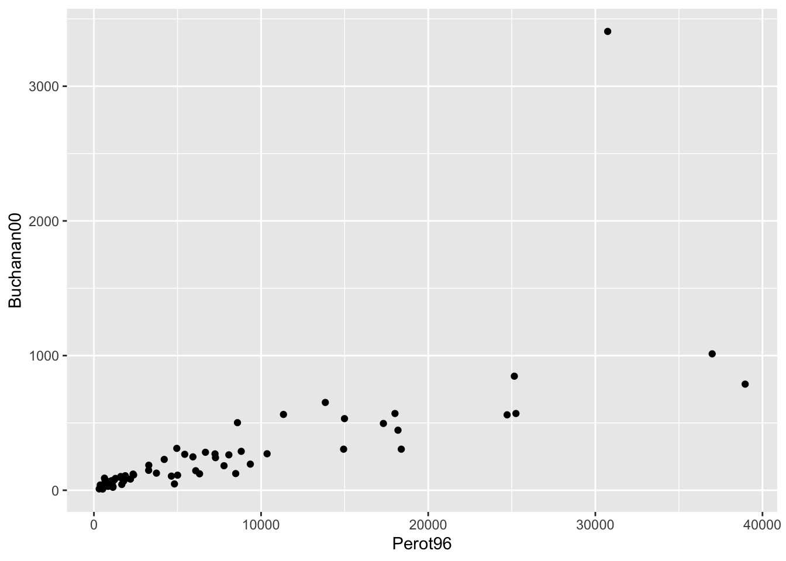
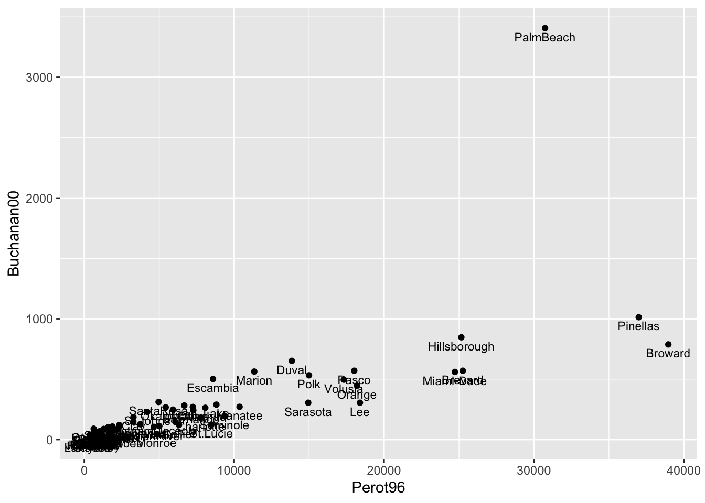
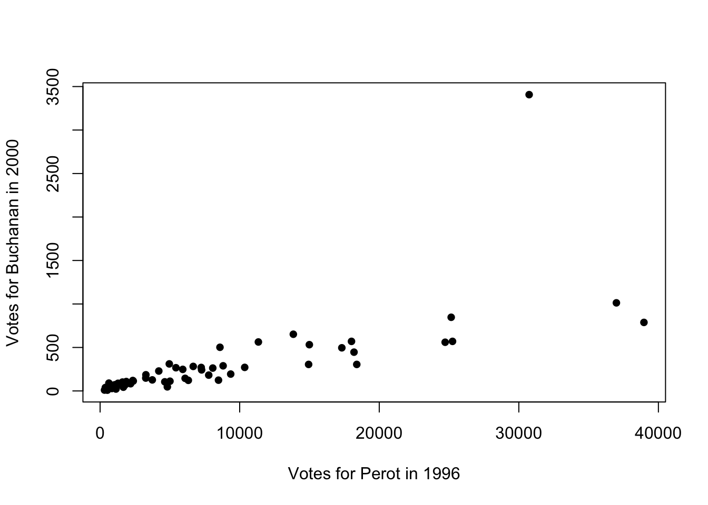
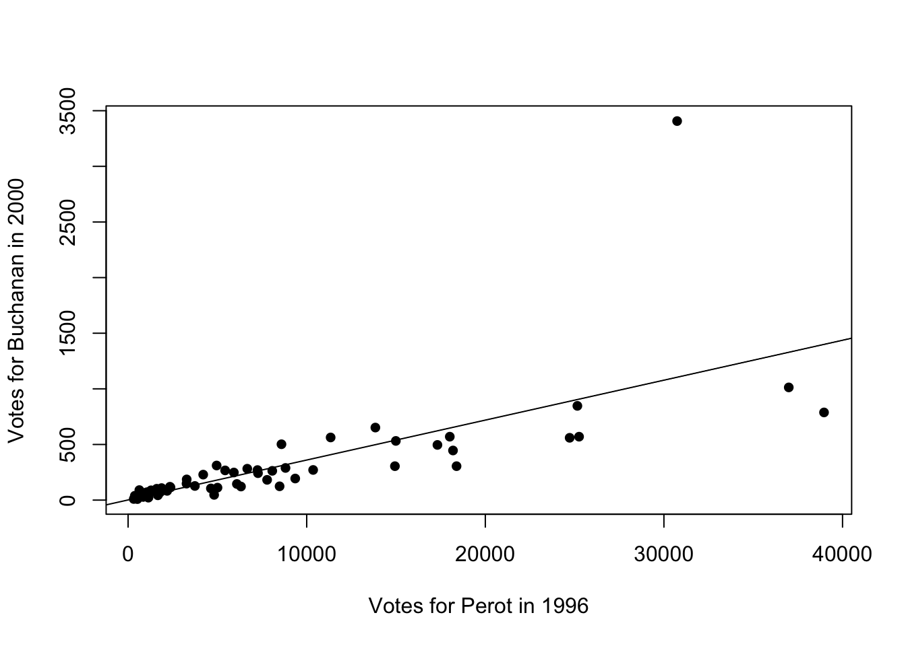
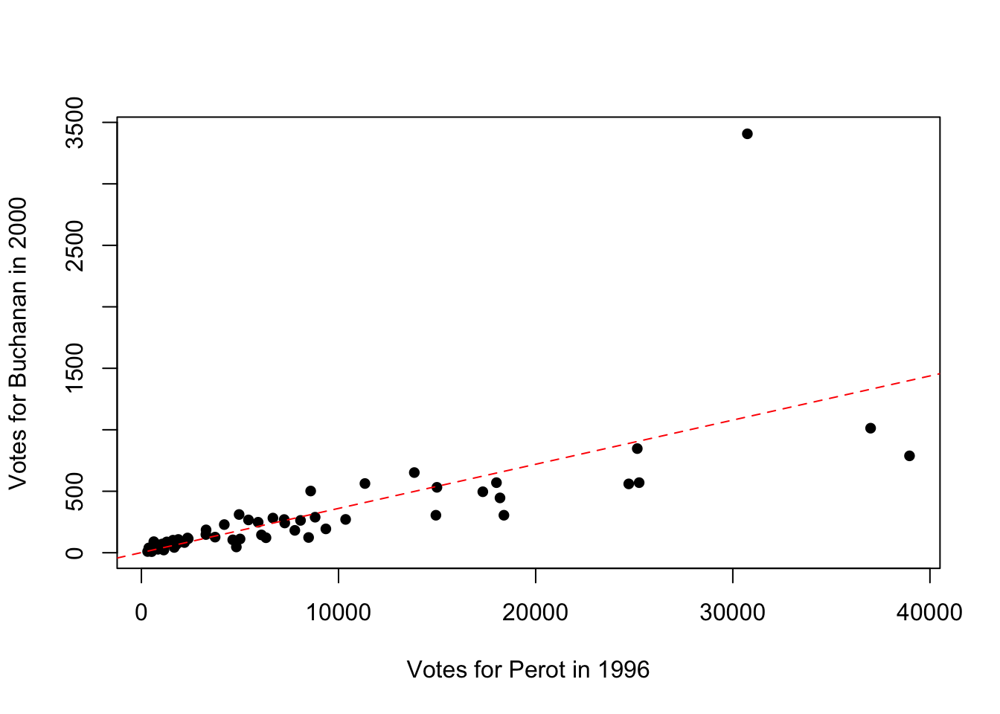
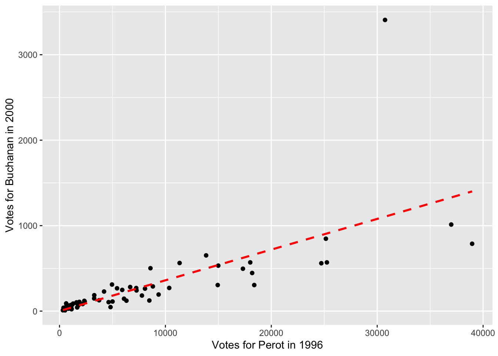

# Voting 


<html>
<head>
<style>
code {
  background-color: #f1f1f1;
}
</style>
</head>
<body>


## 2000 U.S. Presidential Election

In this chapter, we will discuss two different voting applications. The first empirical application will study the 2000 U.S. Presidential Election. This election was extremely close. In the end, George W. Bush won the election with 271 electoral votes against Al Gore's 266. 

In the state of Florida, the election was particularly close. In the end, Bush won Florida by just 537 votes, and thus secured Florida's 25 electoral votes and the election. However, in Florida, there was one county's results that became particularly controversial: Palm Beach County. Many voters in this county complained about a confusing ballot. They claimed that the layout made it so that they accidentally voted for Pat Buchanan (the Reform Party Candidate) rather than Al Gore. 

Figure \@ref(fig:butterfly) shows the Ballot that was used in Palm Beach County:

<div class="figure" style="text-align: center">

<p class="caption">(\#fig:butterfly)The Butterfly Ballot</p>
</div>

In the top left, you can see  the first listed candidates are George W. Bush and Dick Cheney (the Republican Candidates). The next candidates (on the right) are actually Pat Buchanan and Ezola Foster (the Reform Party Candidates). However, if you are filling this in quickly, you can see how someone might accidentally think the second selection corresponds to Al Gore and Joe Lieberman. 

If enough people made this mistake, this could actually have consequences for who wins the election. Remember, only 537 votes separated George W. Bush and Al Gore. To understand the scope of the problem, we are going to replicate analysis from Wand et al. (2001)[@wand2001butterfly], with much of the data and code coming from Kosuke Imai's Textbook: Quantitative Social Science: An Introduction.[@imai2018quantitative].  

Specifically, if voters are confused by the ballot, we would expect an unusually high number of votes for the Reform party candidates in Palm Beach. But how do we define "an unsually high number of votes". To operationalize this idea we will use the number of votes in a county for the Reform party in 1996 (the prior election) to predict how many votes a county will cast for the Reform party in 2000. If Palm Beach County has many more votes than predicted, then maybe the Butterfly ballot is the reason why.

To begin exploring this question, let's load up our data.


```r
florida <- read_csv("florida.csv")
#> Rows: 67 Columns: 7
#> ── Column specification ────────────────────────────────────
#> Delimiter: ","
#> chr (1): county
#> dbl (6): Clinton96, Dole96, Perot96, Bush00, Gore00, Buc...
#> 
#> ℹ Use `spec()` to retrieve the full column specification for this data.
#> ℹ Specify the column types or set `show_col_types = FALSE` to quiet this message.
head(florida)
#> # A tibble: 6 × 7
#>   county   Clinton96 Dole96 Perot96 Bush00 Gore00 Buchanan00
#>   <chr>        <dbl>  <dbl>   <dbl>  <dbl>  <dbl>      <dbl>
#> 1 Alachua      40144  25303    8072  34124  47365        263
#> 2 Baker         2273   3684     667   5610   2392         73
#> 3 Bay          17020  28290    5922  38637  18850        248
#> 4 Bradford      3356   4038     819   5414   3075         65
#> 5 Brevard      80416  87980   25249 115185  97318        570
#> 6 Broward     320736 142834   38964 177323 386561        788
```

Each row of the data is a county in Florida. In each row, we have counts for different presidential candidates in both 1996 and 2000. For example, in 1996, 40,144 votes were cast in Alachua county for Bill Clinton. 25,303 were cast for Bob Dole. 


Our eventual goal will be to use the votes cast for Ross Perot (the Reform Party Candidate) in 1996, to predict how many votes a county will cast for Pat Buchanan in 2000 (the Reform Party Candidate).

The logic behind this design is that we might think counties are relatively consistent in their voting patterns. Maybe Palm Beach County is a county that happens to heavily support the Reform Party Candidates. If this is true, we should see high number of votes for Reform Party Candidates in both 1996 and 2000.

To begin our exploration, let's visualize the relationship between voting for Ross Perot in 1996 and Pat Buchanan in 2000. To do so we will construct a scatter plot with ``Perot96`` on the horizontal axis and ``Buchanan00`` on the vertical axis.


```r
ggplot(florida, mapping=aes(x=Perot96, y=Buchanan00)) + 
  geom_point()
```


<div class="figure" style="text-align: center">

<p class="caption">(\#fig:butter1)Relationship Between Buchanan and Perot Votes</p>
</div>

We can see there is one point in the top right of this graph that seems to be a bit of an outlier. This county has much higher number of votes for Buchanan than any other county. In order to see which county this is, let's add the option ``label=county`` inside ``aes()``. This will label each marker with the county it represents. To adjust the location and size of the marker, we will also specify ``geom_text(vjust=1.5,size=3)``. 


```r
ggplot(florida, 
       mapping=aes(x=Perot96, y=Buchanan00, label=county)) + 
  geom_point() + 
  geom_text(vjust=1.5, size=3)
```

<div class="figure" style="text-align: center">

<p class="caption">(\#fig:butter2)Relationship Between Buchanan and Perot Votes</p>
</div>

We chose ``(vjust=1.5,size=3)`` to make the labels easily readable. You can play around with these parameters to see how it changes the appearance of the figure.

Now with the markers labeled we can see that Palm Beach is indeed the outlier county. But an important next question is how big of an outlier is Palm Beach? Is this enough to potentially change the outcome of the election? To answer this question concretely, we will first learn how to estimate a linear regression in R.

## Linear Regression

In this section we are going to review linear regression, and then estimate a linear regression which will help us understand whether the butterfly ballot impacted the 2000 U.S. Presidential Election. If you would like a more thorough review of linear regression, look back to Chapter 4 which includes a longer introduction to linear regression. 

To review briefly, we can write a general linear regression equation as:

$$
Y_i = \beta_0 + \beta_1 \cdot X_i + \varepsilon_i
$$

Where $Y_i$ is our dependent variable of interest, $X_i$ is our independent variable of interest, $\beta_0$ is the intercept, $\beta_1$ is the slope coefficient and $\varepsilon_i$ is the error term. 

In our data, we choose estimates of $\beta_0$ and $\beta_1$, which we denote, $\hat{\beta}_0$ and $\hat{\beta}_1$, that minimize the sum of squared errors $\sum_{i=1}^N(Y_i-\hat{Y}_i)^2$.

What do $\hat{\beta}_0$ and $\hat{\beta}_1$ tell us? Let's talk about $\hat{\beta}_1$ first. This tells us how changes in $X$ are associated with changes in $Y$. If this value is positive, then increases in $X$ are associated with increases in $Y$. If it is negative, then increases in $X$ are associated with decreases in $Y$. The interpretation of $\hat{\beta}_1$ is a 1-unit change in $X$ is associated with a $\hat{\beta}_1$-unit change in $Y$.

Once we have our estimates of the intercept and slope, we can also use them to form predictions. For example, the predicted value of $Y$ for and individual with observable $X_i=5$ is equal to: 

$$
\hat{Y}_i = \hat{\beta}_0 + \hat{\beta}_1 \cdot 5 
$$
This is a good place to re-introduce our empirical application. Our goal is to use the number of votes for Perot in 1996 to predict the number of votes for Buchanan in 2000. One way to do this is to estimate a linear regression of the following form:

$$
Buchanan00_i = \beta_0 + \beta_1 \cdot Perot96_i + \varepsilon_i
$$

Once we estimate this regression equation, we can use the estimates to predict the number of Buchanan votes in Palm Beach County and compare to the actual number of votes in Palm Beach County. For example, hypothetically, if we predict Buchanan would receive 1000 votes in Palm Beach, but actually received 2000, then there would be 1000 more votes in Palm Beach than expected.

In R, the function we use to estimate linear regressions is the ``lm()`` function. The basic syntax of the command is:


```r
lm.fit <- lm(yvar ~ xvar, data=df)
```

  - ``lm.fit`` stores the estimates of the linear regression as an object in R.
  
  - ``yvar`` should be replaced with your **dependent variable**
  
  - ``xvar`` should be replaced with your **independent variable**
  
  - ``df`` should be the dataframe that is in your environment.
  
In our empirical application, the code below estimates a linear regression with ``Buchanan00`` as the dependent variable and ``Perot96`` as the independent variable:


```r
lm.florida <- lm(Buchanan00 ~ Perot96, data=florida)
```

To view the basic estimates of the regression, we can type:


```r
lm.florida
#> 
#> Call:
#> lm(formula = Buchanan00 ~ Perot96, data = florida)
#> 
#> Coefficients:
#> (Intercept)      Perot96  
#>     1.34575      0.03592
```

So this displays our estimate of the intercept ($\hat{\beta}_0=1.346$) and slope coefficient ($\hat{\beta}_1=0.036$). The intercept tells us where the best fitted line intersects the vertical axis at $X=0$. In terms of our example, the best fitted line is equal to 1.346 at $Perot96_i=0$. Another way to interpret this is, hypothetically, if we had a county that cast zero votes for Perot in 1996, we would expect this county to cast 1.346 votes for Buchanan in 2000.

Now onto interpreting $\hat{\beta}_1$: one additional vote for Perot in 1996 is associated with 0.035 more votes for Buchanan in 2000. You might be a little confused at the moment about why the slope coefficient seems so small. In the next section, we will discuss further how to interpret this regression, and in particular, how we can visualize its results. This will help us understand what our regression results imply in terms of figuring out whether something unsual is occuring in Palm Beach county.

## Plotting Regression Lines

In the prior section, we estimated 

$$
Buchanan00_i = \beta_0 + \beta_1 \cdot Perot96_i + \varepsilon_i
$$
And found $\hat{\beta}_0=1.346$ and $\hat{\beta}_1=0.036$. These coefficients tells us the intercept and slope of the line that best fits our data. In this section we will show how to plot this best fit line in both base R and ggplot. 

To begin, let's create a scatter plot with ``Buchanan00`` on the vertical axis and ``Perot96`` on the horizontal axis. We are also going to specify ``pch=16`` in this code to change the style of the markers. ``pch`` stands for plot character in R and can be used to change the shape or appearance of the points in a scatterplot.


```r
plot(florida$Perot96, florida$Buchanan00, 
     pch=16,
     xlab="Votes for Perot in 1996", 
     ylab="Votes for Buchanan in 2000")
```

<div class="figure" style="text-align: center">

<p class="caption">(\#fig:basescatter1)Relationship Between Buchanan and Perot Votes</p>
</div>

Now our goal is to add the linear regression line to this plot. To do so, we will use the ``abline()`` function. ``abline()`` can be used to add lines to plots. If you pass the outcome of a linear regression to ``abline()``, then the fitted line from that regression will be added to the plot. In other words, if we add ``abline(lm.florida)``, then the best-fitted line from this regression will be added to the plot:


```r
plot(florida$Perot96, florida$Buchanan00, 
     pch=16,
     xlab="Votes for Perot in 1996", 
     ylab="Votes for Buchanan in 2000")
    abline(lm.florida)
```

<div class="figure" style="text-align: center">

<p class="caption">(\#fig:basescatter2)Relationship Between Buchanan and Perot Votes</p>
</div>

We can also customize the appearance of the line in a few ways. For example, ``lty=2`` will make the line dashed instead of solid. ``lty`` stands for line type and you can use a variety (see the help file for ``plot`` and search for ``lty`` to see the different options). ``col="red"`` will turn the line red. 


```r
plot(florida$Perot96, florida$Buchanan00, 
     pch=16,
     xlab="Votes for Perot in 1996", 
     ylab="Votes for Buchanan in 2000")
    abline(lm.florida, lty=2, col="red")
```

<div class="figure" style="text-align: center">

<p class="caption">(\#fig:basescatter3)Relationship Between Buchanan and Perot Votes</p>
</div>

Now let's learn how to plot the regression line in ggplot. In ggplot, the plot command can actually estimate the regression itself. In order to do so we will add to our plot the ``geom_smooth()`` function. In general ``geom_smooth`` adds fitted lines or curves to a plot. If we want a linear regression line, we can specify ``geom_smooth(method="lm")``. The option ``lm`` stands for linear model. 

Further, we will want to specify ``se=FALSE``. By default ``geom_smooth()`` adds measures of uncertainty to our regression line, which we won't cover in this book. Lastly, we will use additional options to change the type and color of the line, as we did before. The full code to generate our scatter plot with a linear regression line appears below:


```r
ggplot(florida, mapping=aes(x=Perot96, y=Buchanan00)) + 
  geom_point() + 
  xlab("Votes for Perot in 1996") + 
  ylab("Votes for Buchanan in 2000") + 
  geom_smooth(method="lm", se=FALSE, linetype="dashed",color="red")
#> `geom_smooth()` using formula = 'y ~ x'
```

<div class="figure" style="text-align: center">

<p class="caption">(\#fig:geomscatter)Relationship Between Buchanan and Perot Votes</p>
</div>

## Predicted Values and Residuals

Now that we have estimated and plotted our linear regression line, let's review how to form predicted values and residuals.

In general, the predicted value is given by:

$$
\hat{Y}_i = \hat{\beta}_0 + \hat{\beta}_1 \cdot X_i
$$

This gives us our best guess for a value of $Y_i$ given a value of $X_i$, based on the linear regression estimates. This is the best fit line we plotted in the prior section. We can use this equation to form predicted values. For example, imagine I tell you a Alachua county in 1996 cast 8,072 votes for Ross Perot. Based on this number and the linear regression, what do you expect to be the number of Pat Buchanan votes cast?

$$
\hat{Buchanan00_i}= 1.346 + 0.036 \cdot 8072 \approx 292
$$

In other words, we expect Alachua county to cast 292 votes for Pat Buchanan. Now, this is just a prediction. We are using a single variable (Ross Perot votes) to predict the number of Buchanan votes. In reality, the number of Buchanan votes likely depends on a variety of factors. Therefore, our model will have error associated with, which we refer to as the residual. 

The residual is given by the difference between the actual value and the predicted value. For example, Alachua county cast 263 votes for Buchanan. The residual is therefore given by:

$$
\hat{residual}_i = Y_i - \hat{Y}_i=263-292 = -29
$$

Now, we could do this manually for every single observation, but it will be much easier to do this automatically in R. This will allow us to construct the residual for every county in the data. We are particularly interested in the residual for Palm Beach county. This residual will tell us how many more votes were cast in Palm Beach for Buchanan relative to what we would have expected based on the county's voting patterns for Perot. 

To do so we will again estimate a linear regression with ``Buchanan00`` as the dependent variable and ``Perot96`` as the independent variable.


```r
lm.florida <- lm(Buchanan00 ~ Perot96, data=florida)
```

``lm.florida`` is known as a list object. It contains a lot of information from our linear regression. We can use the ``names()`` function to figure out what ``lm.florida`` contains:


```r
names(lm.florida)
#>  [1] "coefficients"  "residuals"     "effects"      
#>  [4] "rank"          "fitted.values" "assign"       
#>  [7] "qr"            "df.residual"   "xlevels"      
#> [10] "call"          "terms"         "model"
```

So many of the information stored here we won't use in this course.\footnote{If you are interested in understanding what the other names refer to, you can } But there are two elements that will be useful for us. You can see one of the names is ``fitted.values`` and another is ``residual``. Fitted values is another name for predicted values.

We can extract the information from ``lm.florida`` by using the dollar sign operator. For example, if we want to add a new variable to the dataset that is the fitted value for each observation, we type:


```r
florida$predBuchanan00 <- lm.florida$fitted.values
```

``predBuchanan00`` is the name of the new variable and it is equal to the fitted values from the regression estimation. We can similarly extract the residual from our ``lm.florida`` object and add to the data frame ``florida``.


```r
florida$residuals <- lm.florida$residuals
```

Now, let's look at the data to try and understand our process so far.


```
#> # A tibble: 67 × 4
#>    county    Buchanan00 predBuchanan00 residuals
#>    <chr>          <dbl>          <dbl>     <dbl>
#>  1 Alachua          263          291.     -28.3 
#>  2 Baker             73           25.3     47.7 
#>  3 Bay              248          214.      34.0 
#>  4 Bradford          65           30.8     34.2 
#>  5 Brevard          570          908.    -338.  
#>  6 Broward          788         1401.    -613.  
#>  7 Calhoun           90           24.0     66.0 
#>  8 Charlotte        182          281.     -98.9 
#>  9 Citrus           270          262.       8.49
#> 10 Clay             186          119.      66.8 
#> # … with 57 more rows
```

So for Alachua county the number of Buchanan votes in 2000 was 263. The predicted Buchanan votes was 291.251 (if you view your data frame you will be able to see more decimal places). Therefore the residual is -28.3. The reason this is slightly different than what we had above is because when we formed this manually we rounded the coefficients in the regression. When R does the computation, it is much more precise than we were, which explains why predicted values and residuals are slightly different than the manual computation. 

Now let's order the dataset by the magnitude of the residual. Observations with large residuals will be those in which are predictions is very different than our predicted value. To sort data based on the value of a variable, we can use the ``arrange()`` function.

For our purposes we want to sort based on the absolute value of the residual. Therefore, we will specify ``arrange(abs(residuals))``. The ``abs()`` function takes the absolute value of a number. However, in addition, we want the largest residuals to be at the top. By default, ``arrange`` sorts the data from lowest to highest. To change this, we can ask for the data to be presented in descending order, by specifying ``arrange(desc(abs(residuals)))``. The ``desc()`` function specifies to order the data in descending order (from largest to smallest).

Additionally, we can combine ``arrange`` with other functions using the pipe operator. In this example, we are really only interested in a few variables at the moment. So let's first select those variables, and then display the data from largest residual (in absolute value) to lowest residual. 


```r
florida %>% 
  select(county,Buchanan00,predBuchanan00,residuals) %>%
  arrange(desc(abs(residuals)))
```


```
#> # A tibble: 67 × 4
#>    county     Buchanan00 predBuchanan00 residuals
#>    <chr>           <dbl>          <dbl>     <dbl>
#>  1 PalmBeach        3407          1105.     2302.
#>  2 Broward           788          1401.     -613.
#>  3 Lee               305           662.     -357.
#>  4 Brevard           570           908.     -338.
#>  5 Miami-Dade        560           889.     -329.
#>  6 Pinellas         1013          1330.     -317.
#>  7 Sarasota          305           538.     -233.
#>  8 Orange            446           655.     -209.
#>  9 Escambia          502           310.      192.
#> 10 St.Lucie          124           306.     -182.
#> # … with 57 more rows
```

So Palm Beach county cast 3407 votes for Buchanan. Based on the linear regression, we would have expected 1105 votes for Buchanan. Therefore, there were 2302 more votes than expected.

Now recall the George Bush won Florida by 537 votes. Now, if the excess votes in Palm Beach were driven by the design of the butterfly ballots, then we are seeing this excess voting for Buchanan because individuals were confused about the design and were accidentally selecting Buchanan instead of Gore. 

If this is true, then Al Gore would have actually received approximately 2,000 more votes. This would have been enough to make him the winner in Florida, and given the closeness of the election, the winner overall. In other words, using some simple data analysis techniques, we've found convincing evidence that a poorly designed ballot in a single Florida county was enough to flip the 2000 presidential election!

## Get Out to Vote Experiments

Next, we are going to shift gears to another voting application. One notorious issue in politics is getting people to vote. In particular, it is extremely difficult to get voters to turn out to vote in primary elections, even though primary elections are incredibly important. They select the candidates who will run in the general election. Yet, year after year, voter turnout for these primary elections is pretty low.For example, in California, voter turnout in general elections between 2000-2012 was about 65.5 percent among registered voters. In contrast, voter turnout in primary elections during this period was around 40.8 percent. 

One reason for lack of voting may be due to a lack of mobilization. Maybe some simple information and encouragement to voting in primaries will incentivize individuals to vote. In Hill and Kousser (2016)[@hill2016turning], the authors test this idea by implementing a large-scale experiment in the 2014 congressional primary elections in California. 

In their study, Hill and Koussser were particularly interested in targeting those individuals who vote in general elections, but not in primaries. These are perhaps the individuals for which a treatment will be most successful. They are engaged in politics on big occasions (general elections), but not engaged in other occasions (primary elections).

To be specific, Hill and Kousser sent three types of letters to individuals in advance of the 2014 primary election
    
  - Letter 1: Basic information about the election 
  - Letter 2: Basic information plus information about California top two primaries
  - Letter 3: Basic information plus information about turnout for the respondent's party 

The letters were aimed at testing different reasons why people may or may not vote. Letter 1 tests whether basic information about when the election is occurring helps promote turnout. Letter 2 is aimed to providing information about one particularly confusing element of Congressional campaigns in California. In 2012, a law in California was passed that made it a "top-two" primary state. This means that any individual in California can vote for any candidate in a primary, regardless of party affiliation. The top two candidates with the most votes then continue to the general election in November. Under this system it is possible that the top two candidates come from the same party. Hill and Kousser wanted to test whether lack of understanding about the new system prevented some from voting. 

The last letter also included information about voter turnout among the respondents party. The authors hypothesize that seeing low voter turnout among your party may be especially effective in incentivizing an individual to vote. In other words, individuals registered as Republican were provided the Republican voter turnout in the prior election, while individuals registered as Democrats were provided the voter turnout for Democrats in the prior election.

One impressive aspect of this experiment is its scale. In total, Hill and Kousser (2016) sent around 150,000 letters to Californians before the election. This will allow us to get very precise answers to how informational interventions impact voter turnout. Additionally, given voting records are public data, we also have a very large control group in this experiment: individuals who did not receive one of the three letters.

## Regression (Binary Variables)

To study the impacts of receiving a mailer on voter turnout, we are again going to turn to linear regression. For our purposes, we will study the impact of receiving any mailer. Therefore, conceptually, you should think of individuals who received any letter as the treatment group, and individuals who did not receive a letter as the control group. To estimate the impact of receiving a mailer we will estimate a linear regression of the following form:

$$
Y_i = \beta_0 + \beta_1 \cdot X_i + \varepsilon_i
$$

Where $Y_i$ is equal to 1 if the individual voted and zero otherwise, and $X_i$ is equal to one if the individual received a mailer and zero otherwise. This is a bit different than most of examples so far, because in this example both $Y_i$ and $X_i$ are binary, meaning they take on only two values.

What is the interpretation of $\beta_1$ in this example. Our general rule is: when $X_i$ increases by 1, this is associated with a $\beta_1$-unit change in $Y_i$. Because $X_i=0$ if in the control and 1 if in the treatment, a 1-unit increase in $X_i$ is going from control to treatment. In other words, moving an individual from the control to receiving a letter is associated with a $\beta_1$ unit change in $Y_i$. But $Y_i$ is also binary. So imagine for a moment $\beta_1=0.01$. What does a $0.01$ change in $Y_i$ imply? Well, this is a $\beta_1 \cdot 100=0.01 \cdot 100 = 1$ percentage point increase in $Y_i$. 

Another way to think through this interpretation is through predicted values. Imagine now $\beta_0=0.5$ and $\beta_1=0.01$. Next, I ask what is the predicted value of $Y_i$ for an individual in the control (i.e. $X_i=0$):

$$
\hat{Y}_i = \beta_0 + \beta_1 \cdot X_i = 0.5 + 0.01 \cdot 0 = 0.50
$$

In simpler terms, we expect 50 percent of individuals in the control to vote. Recall that when you take the average of a binary variable that takes on values of zero or one, this average is equal to the fraction of individuals with a 1. Therefore, in this case, a value of 0.5 indicates half the individuals have a value of $Y_i=1$. Put even more simply, half of all individuals voted.  Next, I ask what is the predicted value of $Y_i$ for an individual in the treatment:

$$
\hat{Y}_i = \beta_0 + \beta_1 \cdot X_i = 0.5 + 0.01 \cdot 1 = 0.51
$$
Therefore, we expect 51 percent of individuals to vote in the treatment. Therefore, the impact of going to control to treatment is a 1 percentage point increase in the probability of voting. If you need a review on the difference between percent and percentage point, check out Chapter 1.8. Specifically, it would **not** be correct here to say that treatment increases voting rates by 1 percent. Now that we understand the interpretation of linear regression with binary variables, let's go implement this regression in R to assess how receiving a mailer impacted voter turnout. 

The data for this application comes from a csv file named ``turnout.csv``. Let's load this into R as a tibble. 


```r
turnout <- read_csv("turnout.csv")
#> Rows: 3872268 Columns: 5
#> ── Column specification ────────────────────────────────────
#> Delimiter: ","
#> chr (2): Party, treatment.assign
#> dbl (3): LocalityCode, yvar, mailer
#> 
#> ℹ Use `spec()` to retrieve the full column specification for this data.
#> ℹ Specify the column types or set `show_col_types = FALSE` to quiet this message.
```

This is a very large dataset. The data includes information on over 3.8 million individuals in California. Let's take a look at a small slice of the data:


```
#> # A tibble: 3,872,268 × 5
#>    LocalityCode Party  yvar treatment.assign mailer
#>           <dbl> <chr> <dbl> <chr>             <dbl>
#>  1            1 REP       0 Control               0
#>  2            1 NPP       0 Control               0
#>  3            1 DEM       1 Control               0
#>  4            1 REP       0 Control               0
#>  5            1 DEM       0 Control               0
#>  6            1 NPP       0 Control               0
#>  7            1 DEM       0 Control               0
#>  8            1 DEM       0 Control               0
#>  9            1 REP       0 Control               0
#> 10            1 NPP       0 Control               0
#> # … with 3,872,258 more rows
```

The first variable ``LocalityCode`` indicates the county the individual is voting in. ``Party`` is the registered party of the individual. ``yvar`` is our main dependent variable. This variable is equal to 1 if the individual voted in the 2014 primary election and zero if the individual did not vote. ``treatment.assign`` indicates whether this individual is in the control group (i.e. did not receive a letter) or one of the treatment arms. The last variable ``mailer`` is equal to 1 if the individual received any mailer, and zero if the individual is in the control group. 

For our application, we want to test whether receiving a mailer impacts the probability an individual votes. Therefore, we will regress the variable ``yvar`` on the variable ``mailer``. Just as before, we need to save our estimates as a new object.


```r
lm.turnout <- lm(yvar ~ mailer, data=turnout)
```

Now let's look at the results:


```r
lm.turnout
#> 
#> Call:
#> lm(formula = yvar ~ mailer, data = turnout)
#> 
#> Coefficients:
#> (Intercept)       mailer  
#>    0.093125     0.004899
```

So let's interpret this regression. To do so, let's compute what the regression predicts regarding voting for an individual in the control:

$$
\hat{Y}_i = 0.093 + 0.005 \cdot 0 = 0.093
$$

In simple terms, 9.3 percent of individuals in the control group voted in the election. For individuals in the treatment, we get:

$$
\hat{Y}_i = 0.093 + 0.005 \cdot 1 = 0.093+ 0.005 = 0.098
$$

Therefore, in the treatment group, about 9.8 percent of individuals turned out to vote. Therefore, our treatment is expected to increase voting rates by 0.5 percentage points.

## Conclusion 

In this chapter, we have introduced two voting examples. In the first application, we showed that a poorly designed ballot may have changed the 2000 U.S. Presidential election. In the second, we showed that a massive campaign that sent mailers to over 150,000 Californians increased voter turnout in primary elections. 
In both of these applications, we used regression to analyze the data. In our first application, regression gave us a way to form predictions. In particular, we needed to form a prediction for Palm Beach County regarding how many votes Pat Buchanan (the Reform Party Candidate) would receive. This was important because after the election, individuals claimed that the ballot was confusing, and led people to mistakenly vote for Pat Buchanan rather than Al Gore (check out Figure \@ref(fig:butterfly) to see if you agree).

However, we still needed a way in the data to see whether it appears that "too many" individuals voted for Pat Buchanan. To do this, we predicted county-level votes for Pat Buchanan using the number of votes cast for Ross Perot in 1996. This is likely a good predictor because Ross Perot and Pat Buchanan were both from the same party (the Reform Party).

Using the regression estimates, we predicted that Palm Beach county would cast 1105 votes for Buchanan. In actuality, Palm Beach cast 3407 votes for Buchanan. In other words, Palm Beach had over 2000 more votes for Buchanan than expected. This discrepancy is large enough to potentially swing the election. George Bush won Florida by only 537 votes. Had those 2000 votes for Buchanan been cast for Al Gore, then Al Gore would have won Florida and the election overall. 

In the second application, we used regression to estimate a treatment effect: the effect of receiving a mailer on voter turnout. It is notoriously difficult to get individuals to vote in primary elections. In Hill and Kousser (2016), the authors sent an astounding 150,000 letters to Californians, providing them with different forms of information about the election. The scope of the project allowed the authors to detect even small changes in voting behavior. In the end, they found the mailer increased voting by about 0.5 percentage points. This may seem small, but if applied to the population of California, this implies thousands of additional voters.

## <u>Function Descriptions</u> {-}


::: {.rmdnote}

**<u>Functions Used</u>**

- ``lm`` -- Estimates linear regression in R. General syntax is given by ``lm.fit <- lm(yvar ~ xvar, data=df)``. ``lm.fit`` is an object that is created and contains results of the linear regression.

  - ``lm`` stores many important results from linear regression, including ``coefficients``, ``fitted.values``, and ``residuals``. To extract an element type ``lm.fit$coefficients``.
  
- ``abline`` -- adds linear regression line to plots in Base R.

- ``geom_smooth(method="lm",se=FALSE)`` -- adds linear regression line to plots in ggplot2.
  
::: 

